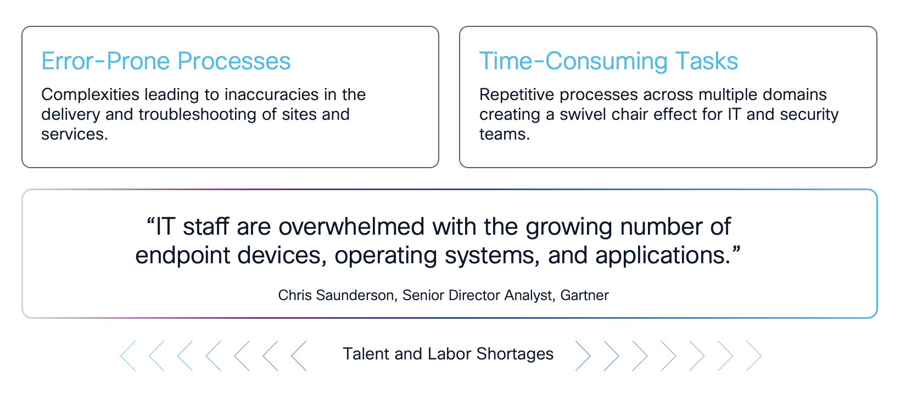
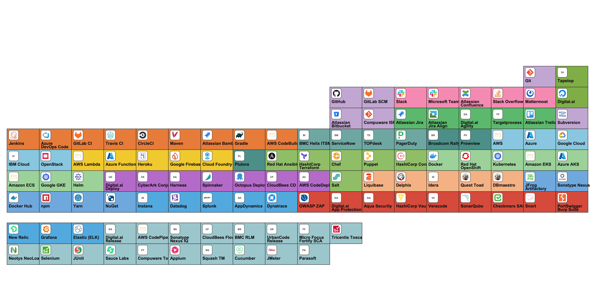
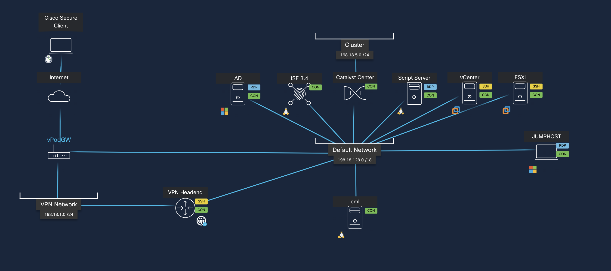
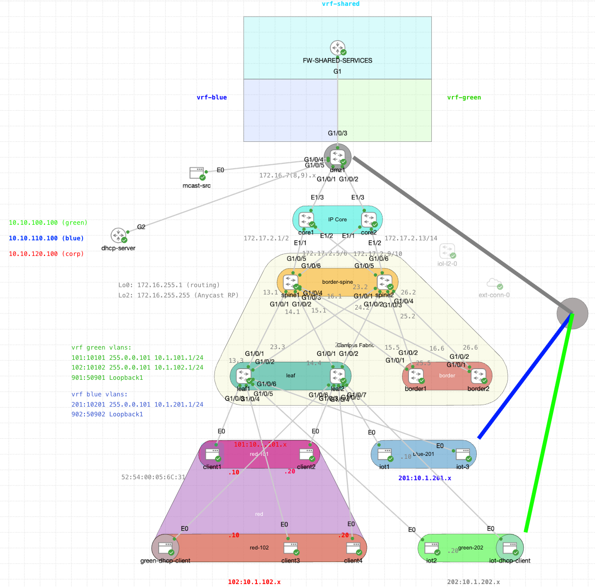

# TECOPS-2599 — Cisco Catalyst Center Network Orchestration

> **As-Built Documentation**
> **Authors:**<br>• Keith Baldwin — Solutions Engineer — Automation HyperSpecialist (kebaldwi@cisco.com)<br>• Igor Manassypov — Systems Engineer (imanassy@cisco.com)
> <br>&nbsp;&nbsp;**Copyright © 2024–2026 Cisco Systems, Inc. All rights reserved.**

## Network management is far too complex

Complexities of network environments that involve multiple devices, configurations, and policies. These environments often include legacy systems, various hardware types, and differing compliance requirements, making management incredibly challenging.

The Networking Landscape complexity is increased with islands of management planes, discontiguous implementation flows, especially where multiple controllers are involved. Double administration at times for monitoring leads to wasted time and an inability to track change across it all.


## Complexity creates challenges for network and security teams



Complexity leads to inaccuracy which leads to failures. Error-prone processes and troubleshooting cause a loss in time due to Management Plane sprawl, compounded by the growth and demand of the networks today.

* *What if it didn't have to be that way.*
* *What if a single declarative source of truth could drive the controller.*
* *What if every change could be peer-reviewed in Git, replayed at will, and run unattended.*

## Overview

This repository contains the complete network orchestration suite for project **TECOPS-2599**, presented at **Cisco Live 2026**. It delivers a fully automated, GitOps-driven lifecycle for Cisco Catalyst Center — from initial site commissioning through Day-N template deployment — across three parallel tooling paths: Cisco Workflows, Ansible, and Python.

<p align="center">
  
</p>

---

## Table of Contents

1. [Business Overview](#business-overview)
2. [Repository Structure](#repository-structure)
3. [Projects](#projects)
   - [BGP\_EVPN](#bgp_evpn)
   - [TRADITIONAL](#traditional)
4. [Support](#support)
   - [Labs](#labs)
   - [Resources](#resources)
5. [Quick Start](#quick-start)
6. [Tooling Paths](#tooling-paths)
7. [Lab Environment](#lab-environment)

---

## Business Overview

Enterprise and public-sector network teams are under sustained pressure to commission new sites faster, reduce configuration drift, satisfy audit requirements, and scale operations without growing headcount proportionally. Manual Catalyst Center GUI workflows cannot meet these demands at scale.

TECOPS-2599 addresses this by treating **GitHub as the single source of truth** for all network configuration intent — site topology, network settings, device credentials, Jinja2 templates, and composite template definitions — and automating the full provisioning lifecycle through Catalyst Center REST APIs.

The repository provides three parallel tooling paths that all produce the same outcome in Catalyst Center:

| Path | Tooling | Best For |
|------|---------|----------|
| [Cisco Workflows](Support/Resources/Cisco%20Workflows/README.md) | Cisco SecureX / XDR Workflow Manager | Platform-native, GUI-auditable operations |
| [Ansible](Support/Resources/Ansible/README.md) | Ansible + cisco.catalystcenter collection | CI/CD pipeline integration, fleet operations |
| [Python](Support/Resources/Python/README.md) | Pure Python REST | API learning, debugging, custom integrations |

Teams choose the path that matches their operational model and skill set. All three paths reference the same `settings.json` and template source in GitHub, maintaining a single source of truth regardless of tooling choice.

---

## Repository Structure

```
TECOPS-2599/
├── Projects/
│   ├── BGP_EVPN/                  # BGP EVPN fabric project
│   │   ├── Configs/               # Generated device configurations
│   │   ├── Day0Templates/         # PnP onboarding Jinja2 templates
│   │   ├── DayNTBD/               # Day-N templates under development
│   │   ├── DayNTemplates/         # Production Day-N Jinja2 templates
│   │   └── Settings/              # settings.json for this project
│   └── TRADITIONAL/               # Traditional (non-EVPN) fabric project
│       ├── Configs/               # Generated device configurations
│       ├── Day0Templates/         # PnP onboarding Jinja2 templates
│       ├── DayNTemplates/         # Production Day-N Jinja2 templates
│       └── Settings/              # settings.json and devices.json
└── Support/
    ├── Labs/                      # Guided lab exercises (7 modules each, 0–6)
    │   ├── Ansible-Lab/           # Step-by-step Ansible lab track
    │   ├── CiscoWorkflows-Lab/    # Step-by-step Cisco Workflows lab track
    │   ├── images/                # Lab diagrams (DCLOUD topology, screenshots)
    │   ├── DCLOUD.md              # DCLOUD lab environment preparation guide
    │   └── README.md              # Labs index and module map
    └── Resources/                 # Automation tooling and reference content
        ├── Ansible/               # Ansible playbook suite (10 playbooks)
        ├── Cisco Workflows/       # Cisco Workflow JSON suite (7 workflows)
        ├── Python/                # Python REST reference scripts (12 scripts)
        ├── CML/                   # Cisco Modeling Labs topology and configs
        ├── Docs/                  # Reference documentation
        └── images/                # Supporting diagrams
```

---

## Projects

The `Projects/` folder contains the network configuration intent for each fabric deployment model supported by this suite. Each project is a self-contained GitOps source of truth consumed by the automation tooling in `Support/Resources/`.

### BGP\_EVPN

**Path:** [Projects/BGP\_EVPN/](Projects/BGP_EVPN/)

The BGP EVPN project provides configuration templates and settings for a BGP EVPN campus fabric deployment on Cisco Catalyst 9000 series switches.

| Subfolder | Purpose |
|-----------|---------|
| [Configs/](Projects/BGP_EVPN/Configs/) | Generated device configurations produced after provisioning runs |
| [Day0Templates/](Projects/BGP_EVPN/Day0Templates/) | PnP onboarding Jinja2 templates for zero-touch device commissioning |
| [DayNTBD/](Projects/BGP_EVPN/DayNTBD/) | Day-N templates under active development (not yet production) |
| [DayNTemplates/](Projects/BGP_EVPN/DayNTemplates/) | Production Day-N Jinja2 templates for post-onboarding configuration |
| [Settings/](Projects/BGP_EVPN/Settings/) | `settings.json` — site hierarchy, network settings, discovery, and credential intent |

**Day0 templates** cover L2/L3 PnP onboarding for Catalyst switches with EIGRP, OSPF, and seed automation variants.

**DayN templates** implement the full BGP EVPN fabric model using a layered Jinja2 architecture:

| Template Prefix | Role |
|----------------|------|
| `DEFN-*` | Data definition templates (VRF, loopbacks, overlay, multicast, ports, NAC, roles, VNI offsets) |
| `FUNC-*` | Reusable function templates (VRF lookup, client port logic) |
| `FABRIC-*` | Top-level fabric build templates that include DEFN and FUNC layers |
| `BGP-EVPN-BUILD.yml` | Composite template YAML definition ordering all FABRIC templates |

The composite YAML definition is consumed by the `GitOps-BuildCompositeTemplate-v3` Cisco Workflow and the `create_composite_template.py` Python script to assemble the ordered composite template in Catalyst Center.

### TRADITIONAL

**Path:** [Projects/TRADITIONAL/](Projects/TRADITIONAL/)

The TRADITIONAL project provides configuration templates and settings for conventional (non-EVPN) campus fabric deployments.

| Subfolder | Purpose |
|-----------|---------|
| [Configs/](Projects/TRADITIONAL/Configs/) | Generated device configurations produced after provisioning runs |
| [Day0Templates/](Projects/TRADITIONAL/Day0Templates/) | PnP onboarding Jinja2 templates for zero-touch device commissioning |
| [DayNTemplates/](Projects/TRADITIONAL/DayNTemplates/) | Production Day-N Jinja2 templates for modular post-onboarding configuration |
| [Settings/](Projects/TRADITIONAL/Settings/) | `settings.json` and `devices.json` — site and device intent for this project |

**Day0 templates** mirror the BGP\_EVPN set, covering L2/L3 PnP onboarding with EIGRP, OSPF, and seed variants.

**DayN templates** implement a modular Day-N build model:

| Template Prefix | Role |
|----------------|------|
| `DEFN-*` | Data definition templates (VLAN, port, ACL, sensitive info) |
| `BUILD-*` | Modular configuration build templates (AAA, access, ACL, app hosting, auto-description, autoconf, IBNS, interface macros, master build, security, stacking, system, VLAN) |

The `BUILD-MasterBuild.j2` template is the top-level composite entry point that includes all relevant BUILD modules for a device class.

---

## Support

The [Support/](Support/) folder contains two parallel structures: guided [**Labs**](Support/Labs/README.md) for hands-on learning and step-by-step exercises, and [**Resources**](Support/Resources/README.md) providing the full automation tooling implementations.

**Full documentation:** [Support/README.md](Support/README.md)

### Labs

**Path:** [Support/Labs/](Support/Labs/README.md)

The Labs folder provides structured, guided exercises that walk through the full Catalyst Center automation lifecycle using both tooling approaches. Both tracks follow the same seven-module story (modules 0–6) and are aligned with the Cisco DCLOUD **Catalyst Center + ISE Lab for Automation & Orchestration** sandbox.

<p align="center">
  
</p>

> **Important:** Lab content in this repository is aligned with specific DCLOUD demonstrations that must be set up by a **Cisco Employee** or **Cisco Partner**. Contact your **Local Cisco Account Team** to schedule a DCLOUD session before starting a lab. See [Support/Labs/DCLOUD.md](Support/Labs/DCLOUD.md) for full lab preparation steps.

#### CiscoWorkflows-Lab

**Path:** [Support/Labs/CiscoWorkflows-Lab/](Support/Labs/CiscoWorkflows-Lab/README.md)

A seven-module guided lab that teaches Catalyst Center automation using the Cisco Workflows GitOps suite against the DCLOUD environment.

| # | Module | Lab Walkthrough | Workflow Reference |
|---|--------|-----------------|--------------------|
| 0 | Orientation | [Module 0](Support/Labs/CiscoWorkflows-Lab/catc-catcenter-0-orientation/01-intro.md) | — |
| 1 | Building Hierarchy | [Module 1](Support/Labs/CiscoWorkflows-Lab/catc-catcenter-1-hierarchy/01-intro.md) | [1.0 Site Hierarchy](Support/Resources/Cisco%20Workflows/1.0-Cisco-Catalyst-Center-Site-Hierarchy/README.md) |
| 2 | Settings & Credentials | [Module 2](Support/Labs/CiscoWorkflows-Lab/catc-catcenter-2-settings/01-intro.md) | [2.0 Settings & Credentials](Support/Resources/Cisco%20Workflows/2.0-Cisco-Catalyst-Center-Settings-and-Credentials/README.md) |
| 3 | Device Discovery | [Module 3](Support/Labs/CiscoWorkflows-Lab/catc-catcenter-3-discovery/01-intro.md) | [3.0 Discovery & Assign](Support/Resources/Cisco%20Workflows/3.0-Cisco-Catalyst-Center-Device-Discovery-and-Assign/README.md) |
| 4 | Templates (Import + Composite) | [Module 4](Support/Labs/CiscoWorkflows-Lab/catc-catcenter-4-templates/01-intro.md) | [4.0 Templates GitHub](Support/Resources/Cisco%20Workflows/4.0-Cisco-Catalyst-Center-Templates-Github-integration/README.md) · [5.0 Composite Template](Support/Resources/Cisco%20Workflows/5.0-Cisco-Catalyst-Center-Templates-Composite/README.md) |
| 5 | Network Profiles | [Module 5](Support/Labs/CiscoWorkflows-Lab/catc-catcenter-5-networkprofiles/01-intro.md) | [6.0 Network Profile](Support/Resources/Cisco%20Workflows/6.0-Cisco-Catalyst-Center-Network-Profile/README.md) |
| 6 | Device Provisioning | [Module 6](Support/Labs/CiscoWorkflows-Lab/catc-catcenter-6-provisioning/01-intro.md) | [7.0 Provision Composite](Support/Resources/Cisco%20Workflows/7.0-Cisco-Catalyst-Center-Provision-Composite/README.md) |

**Outcome:** Engineers can operate the full seven-workflow GitOps suite end-to-end against a live or simulated environment.

#### Ansible-Lab

**Path:** [Support/Labs/Ansible-Lab/](Support/Labs/Ansible-Lab/README.md)

A seven-module guided lab that teaches the same Catalyst Center automation use cases using the `cisco.catalystcenter` Ansible collection.

| # | Module | Lab Walkthrough | Playbook Reference |
|---|--------|-----------------|--------------------|
| 0 | Orientation | [Module 0](Support/Labs/Ansible-Lab/catc-catcenter-0-orientation/01-intro.md) | — |
| 1 | Building Hierarchy | [Module 1](Support/Labs/Ansible-Lab/catc-catcenter-1-hierarchy/01-intro.md) | [1.0 Site Hierarchy](Support/Resources/Ansible/1.0-Cisco-Catalyst-Center-Site-Hierarchy/README.md) |
| 2 | Settings & Credentials | [Module 2](Support/Labs/Ansible-Lab/catc-catcenter-2-settings/01-intro.md) | [2.0 Settings](Support/Resources/Ansible/2.0-Cisco-Catalyst-Center-Settings/README.md) · [3.0 Credentials](Support/Resources/Ansible/3.0-Cisco-Catalyst-Center-Credentials/README.md) |
| 3 | Device Discovery | [Module 3](Support/Labs/Ansible-Lab/catc-catcenter-3-discovery/01-intro.md) | [4.0 Device Discovery](Support/Resources/Ansible/4.0-Cisco-Catalyst-Center-Device-Discovery/README.md) · [5.0 Assign To Site](Support/Resources/Ansible/5.0-Cisco-Catalyst-Center-Assign-To-Site/README.md) |
| 4 | Templates (Import + Composite) | [Module 4](Support/Labs/Ansible-Lab/catc-catcenter-4-templates/01-intro.md) | [6.0 Templates GitHub](Support/Resources/Ansible/6.0-Cisco-Catalyst-Center-Templates-Github-integration/README.md) |
| 5 | Network Profiles | [Module 5](Support/Labs/Ansible-Lab/catc-catcenter-5-networkprofiles/01-intro.md) | [7.0 Network Profile](Support/Resources/Ansible/7.0-Cisco-Catalyst-Center-Network-Profile/README.md) |
| 6 | Device Provisioning | [Module 6](Support/Labs/Ansible-Lab/catc-catcenter-6-provisioning/01-intro.md) | [8.0 Provision Devices](Support/Resources/Ansible/8.0-Cisco-Catalyst-Center-Provision-Devices/README.md) · [9.0 Provision Composite](Support/Resources/Ansible/9.0-Cisco-Catalyst-Center-Provision-Composite/README.md) |

**Outcome:** Engineers can execute the full ten-playbook Ansible suite end-to-end and understand how each step interacts with the Catalyst Center API. Companion playbook [10.0 Backup My Configs](Support/Resources/Ansible/10.0-Backup-My-Configs/README.md) archives running configurations (no matching lab module).

#### DCLOUD Lab Environment

Both labs are tested against the Cisco Enterprise Networks Hardware Sandbox in DCLOUD:

- [Cisco Enterprise Networks Hardware Sandbox — West DC (SJC)](https://dcloud2-sjc.cisco.com/content/catalogue?search=Enterprise%20Networks%20Hardware%20Sandbox&screenCommand=openFilterScreen)
- [Cisco Enterprise Networks Hardware Sandbox — East DC (RTP)](https://dcloud2-rtp.cisco.com/content/catalogue?search=Enterprise%20Networks%20Hardware%20Sandbox&screenCommand=openFilterScreen)

**DCLOUD session components:**

| Component | Specification |
|-----------|--------------|
| Catalyst Center | 2.3.7.10 or later |
| Identity Services Engine (ISE) | 3.4 Patch 3 or later |
| Script Server | Ubuntu 20.04 or later |
| Windows Jump Host | Windows 10 |
| Windows Server | 2019 (DNS, DHCP, AD) |
| Virtual Router | Catalyst 8000v — IOS-XE 17.06.01a |
| Virtual Switch | Catalyst 9300v — IOS-XE 17.12.01 |

### Resources

**Path:** [Support/Resources/](Support/Resources/README.md)

The Resources folder is the complete automation implementation suite. It contains three parallel tooling paths, a shared CML lab environment, reference documentation, and supporting imagery.

**Full documentation:** [Support/Resources/README.md](Support/Resources/README.md)

| Folder | Tooling | Contents |
|--------|---------|---------|
| [Ansible/](Support/Resources/Ansible/README.md) | Ansible playbooks | 10 ordered playbooks covering the full provisioning lifecycle plus config backup |
| [Cisco Workflows/](Support/Resources/Cisco%20Workflows/README.md) | Cisco Workflow JSON | 7 GitOps workflows importable into Catalyst Center Workflow Manager |
| [Python/](Support/Resources/Python/README.md) | Python REST scripts | 12 numbered scripts mirroring the Ansible operations with raw API calls |
| [CML/](Support/Resources/CML/README.md) | CML topology and configs | EVPN campus topology files, startup configs, and normalization script |
| [Docs/](Support/Resources/Docs/) | Reference documentation | Session reference materials |
| [images/](Support/Resources/images/) | Diagrams | CML topology and DevOps periodic table |

#### Ansible Playbooks

| # | Playbook | Catalyst Center Outcome |
|---|----------|------------------------|
| 1.0 | [Site Hierarchy](Support/Resources/Ansible/1.0-Cisco-Catalyst-Center-Site-Hierarchy/README.md) | Areas, Buildings, and Floors created in correct parent-before-child order |
| 2.0 | [Settings](Support/Resources/Ansible/2.0-Cisco-Catalyst-Center-Settings/README.md) | DNS, NTP, Syslog, SNMP, AAA, and banner applied per site |
| 3.0 | [Credentials](Support/Resources/Ansible/3.0-Cisco-Catalyst-Center-Credentials/README.md) | CLI, SNMP v2c R/W, and NETCONF global credentials created and assigned |
| 4.0 | [Device Discovery](Support/Resources/Ansible/4.0-Cisco-Catalyst-Center-Device-Discovery/README.md) | Devices discovered and added to inventory |
| 5.0 | [Assign To Site](Support/Resources/Ansible/5.0-Cisco-Catalyst-Center-Assign-To-Site/README.md) | Devices placed under their designated site in the hierarchy |
| 6.0 | [Templates GitHub](Support/Resources/Ansible/6.0-Cisco-Catalyst-Center-Templates-Github-integration/README.md) | Jinja2 and composite templates synced from GitHub into the Template Hub |
| 7.0 | [Network Profile](Support/Resources/Ansible/7.0-Cisco-Catalyst-Center-Network-Profile/README.md) | Switching Network Profile created and bound to sites with Day-N templates |
| 8.0 | [Provision Devices](Support/Resources/Ansible/8.0-Cisco-Catalyst-Center-Provision-Devices/README.md) | Devices provisioned to site; idempotent skip for already-provisioned devices |
| 9.0 | [Provision Composite](Support/Resources/Ansible/9.0-Cisco-Catalyst-Center-Provision-Composite/README.md) | Composite Day-N templates deployed with async task verification |
| 10.0 | [Backup My Configs](Support/Resources/Ansible/10.0-Backup-My-Configs/README.md) | Running configurations archived from Catalyst Center–managed devices |

#### Cisco Workflows

| # | Workflow | Catalyst Center Outcome |
|---|----------|------------------------|
| 1.0 | [Build Hierarchy](Support/Resources/Cisco%20Workflows/1.0-Cisco-Catalyst-Center-Site-Hierarchy/README.md) | Areas, Buildings, and Floors created from GitHub settings |
| 2.0 | [Settings & Credentials](Support/Resources/Cisco%20Workflows/2.0-Cisco-Catalyst-Center-Settings-and-Credentials/README.md) | Network settings and credentials applied per site |
| 3.0 | [Discovery & Assign](Support/Resources/Cisco%20Workflows/3.0-Cisco-Catalyst-Center-Device-Discovery-and-Assign/README.md) | Discovery jobs executed and devices assigned to sites |
| 4.0 | [Templates GitHub](Support/Resources/Cisco%20Workflows/4.0-Cisco-Catalyst-Center-Templates-Github-integration/README.md) | Day-N Jinja2 templates synchronized from GitHub into Template Hub |
| 5.0 | [Composite Templates](Support/Resources/Cisco%20Workflows/5.0-Cisco-Catalyst-Center-Templates-Composite/README.md) | Composite template built, assembled, and committed |
| 6.0 | [Network Profile](Support/Resources/Cisco%20Workflows/6.0-Cisco-Catalyst-Center-Network-Profile/README.md) | Switching profile created and bound to sites with template IDs |
| 7.0 | [Provision Composite](Support/Resources/Cisco%20Workflows/7.0-Cisco-Catalyst-Center-Provision-Composite/README.md) | Devices provisioned via SDA and composite template deployed |

#### Python Scripts

12 numbered REST API reference scripts in [Support/Resources/Python/](Support/Resources/Python/README.md), mirroring the Ansible playbooks step-for-step (`1.0 site_hierarchy.py` through `8.0 deploy_composite.py`, plus authentication and template helpers under `6.x`). Shared HTTP, auth, and task-polling logic lives in `common/helpers.py`.

#### CML Lab Topology

<p align="center">
  
</p>

A pre-built EVPN campus fabric (spine, leaf, border, core, firewall, DHCP, DMZ) shipped under [Support/Resources/CML/](Support/Resources/CML/README.md) for safe automation practice without DCLOUD.

---

## Quick Start

### Prerequisites

- Access to a Cisco Catalyst Center instance (2.3.7.10 or later) or a DCLOUD / CML lab environment
- A GitHub account with access to this repository (for GitOps workflows)
- One of the following installed on your control machine:
  - Ansible with the `cisco.catalystcenter` and `cisco.dnac` collections (for the Ansible path)
  - Python 3.9 or later (for the Python path)
  - Access to Cisco Catalyst Center Workflow Manager (for the Cisco Workflows path)

### Choosing a Tooling Path

| If you... | Use... |
|-----------|--------|
| Already use Ansible and want CI/CD integration | [Ansible suite](Support/Resources/Ansible/README.md) |
| Prefer GUI-driven, platform-native automation | [Cisco Workflows](Support/Resources/Cisco%20Workflows/README.md) |
| Want to learn the raw API or debug issues | [Python scripts](Support/Resources/Python/README.md) |
| Are new to the project and want guided learning | [Labs](Support/Labs/README.md) → Resources |
| Need a safe lab environment to test against | [CML lab](Support/Resources/CML/README.md) |

### Selecting a Project

| If your fabric uses... | Use project... |
|------------------------|---------------|
| BGP EVPN with VXLAN underlay | [Projects/BGP\_EVPN/](Projects/BGP_EVPN/) |
| Traditional routed access (EIGRP/OSPF) | [Projects/TRADITIONAL/](Projects/TRADITIONAL/) |

Update `Settings/settings.json` in your chosen project with your site topology and connectivity parameters before running any tooling path.

---

## Tooling Paths

All three tooling paths execute the same logical sequence against Catalyst Center:

```
1. Build Site Hierarchy       (Areas → Buildings → Floors)
2. Apply Network Settings     (DNS, NTP, DHCP, SNMP, Syslog, AAA, banner)
3. Configure Credentials      (CLI, SNMP v2c R/W, NETCONF)
4. Run Device Discovery       (IP-range discovery, credential binding)
5. Assign Devices to Sites    (Site UUID assignment)
6. Synchronize Templates      (GitHub → Catalyst Center Template Hub)
7. Build Network Profile      (Switching profile with template bindings)
8. Provision Devices          (SDA provision, Day-N template deployment)
```

Each tooling path implements this sequence using its own execution model. See the Resources README for a full side-by-side comparison: [Support/Resources/README.md](Support/Resources/README.md).

---

## Lab Environment

For teams without a production Catalyst Center instance, the [CML resources](Support/Resources/CML/README.md) provide a complete virtualized EVPN campus fabric for safe automation practice.

The CML lab provides:

- Pre-built EVPN campus topology (spine, leaf, border, core, firewall, DHCP, DMZ)
- Startup configurations with pre-staged IP addressing (`198.18.128.0/18`)
- Multiple topology versions for CML 2.9.1 and earlier releases
- A topology normalization script for backward compatibility

**Import and start the lab:** See [Support/Resources/CML/README.md](Support/Resources/CML/README.md) for full import and startup instructions.

**Recommended execution sequence for lab use:**

1. Import CML topology and start all nodes
2. Run Python scripts `1.0` through `8.0` to learn the raw API surface
3. Run Ansible playbooks `1.0` through `9.0` to experience the abstraction layer
4. Import and run the seven Cisco Workflow JSON files in Workflow Manager
5. Adapt `settings.json` and project templates to your production environment
