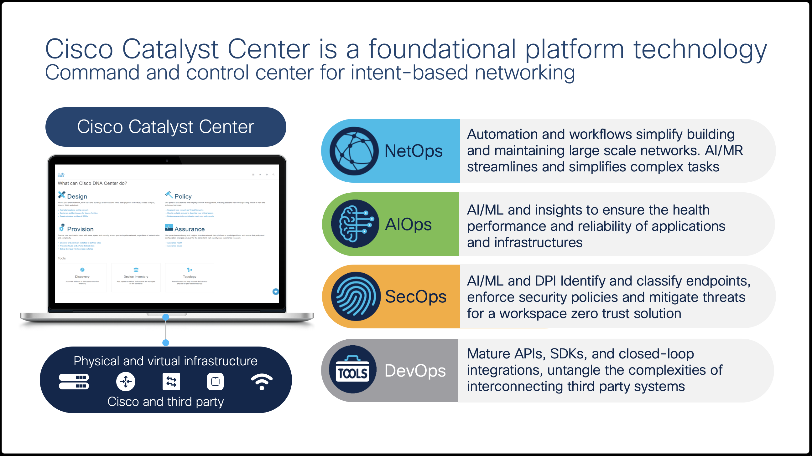

# Introduction to Catalyst Center Orchestration with Ansible

## Overview

This Lab is designed as a standalone lab to help customers automate and orchestrate their network infrastructure with **Ansible**. Within the lab we will use the Cisco-published Ansible collections to drive the **Catalyst Center Intent API** end-to-end — from an empty system to a fully provisioned fabric — using a single source of truth (`settings.json`) stored in this GitHub repository.

## Catalyst Center

Catalyst Center is an intelligent Automation and Assurance platform for the campus. Catalyst Center enables simplified Day-0 through Day-N management of switching, routing, and wireless infrastructure. It also improves operations with AI/ML-enhanced analytics to streamline troubleshooting and provide actionable insights into the health of the network and the quality of experience for users and applications. Capabilities include:

* **NetOps:** Network Plug and Play for Zero Touch Deployment, Software Image Management, Compliance, Configuration Templates and Network Profiles, Model-Driven Configuration, RMA support.
* **AIOps:** AI/ML-enhanced monitoring and troubleshooting; Predictive Insights, Network Baselines, Network Reasoner, Device/Client/Application 360, Intelligent Capture.
* **SecOps:** AI Endpoint Analytics, Group-Based Policy and Analytics, Software-Defined Access.
* **DevOps:** ITSM Integrations, APIs, SDK & **Ansible collections**.

## Network management is far too complex

Complexities of network environments that involve multiple devices, configurations, and policies make management difficult. Islands of management planes, double administration, and a lack of change tracking compound the problem.

## Complexity creates challenges for network and security teams

* *What if every change to the controller could be peer-reviewed in Git first.*
* *What if running the same change twice was guaranteed to be a no-op.*
* *What if a single declarative file described the desired state of the entire fabric.*

That is what Ansible against Catalyst Center delivers.

## Ansible — *'What is it?'*

Ansible is an open-source, agent-less automation engine. It reads YAML *playbooks* that describe desired state, connects to target systems over SSH or HTTPS, and runs idempotent *modules* that converge reality to that state. Cisco publishes two collections that wrap the Catalyst Center Intent API:

* **`cisco.catalystcenter`** — newer, type-safe collection aligned with the modern site-hierarchy resource model (areas, buildings, floors).
* **`cisco.dnac`** — long-standing collection, source of the high-level **Workflow Manager** modules (discovery, credentials, templates, network profiles) that wrap multi-step API sequences in single idempotent tasks.

For a small number of operations — `auth/token`, the v1 `network/{siteId}` settings PUT, the SDA `provisionDevices` POST, and the v2 composite template deploy — neither collection yet has a module, so the playbooks fall back to `ansible.builtin.uri` (a generic HTTP client built into Ansible itself).

## End-to-End Provisioning Workflow

The seven lab modules map one-to-one onto the playbooks under [`Support/Resources/Ansible`](../../../Resources/Ansible/README.md). The full end-to-end data flow is shown below — input sources on the left, playbook execution in the middle, and the Catalyst Center resources produced on the right.

| # | Lab Module | Playbook(s) |
|---|------------|-------------|
| 0 | Orientation | — (this module: install Ansible, vault setup) |
| 1 | Building Hierarchy | [1.0 Site Hierarchy](../../../Resources/Ansible/1.0-Cisco-Catalyst-Center-Site-Hierarchy/README.md) |
| 2 | Settings & Credentials | [2.0 Network Settings](../../../Resources/Ansible/2.0-Cisco-Catalyst-Center-Settings/README.md) · [3.0 Credentials](../../../Resources/Ansible/3.0-Cisco-Catalyst-Center-Credentials/README.md) |
| 3 | Discovery & Site Assignment | [4.0 Device Discovery](../../../Resources/Ansible/4.0-Cisco-Catalyst-Center-Device-Discovery/README.md) · [5.0 Assign To Site](../../../Resources/Ansible/5.0-Cisco-Catalyst-Center-Assign-To-Site/README.md) |
| 4 | Templates from GitHub | [6.0 Templates GitHub](../../../Resources/Ansible/6.0-Cisco-Catalyst-Center-Templates-Github-integration/README.md) |
| 5 | Network Profile | [7.0 Network Profile](../../../Resources/Ansible/7.0-Cisco-Catalyst-Center-Network-Profile/README.md) |
| 6 | Provisioning Devices | [8.0 Provision Devices](../../../Resources/Ansible/8.0-Cisco-Catalyst-Center-Provision-Devices/README.md) · [9.0 Provision Composite](../../../Resources/Ansible/9.0-Cisco-Catalyst-Center-Provision-Composite/README.md) |

## Prerequisites

To effectively run the labs, install the following tools on your workstation:

> **NOTE:** Cisco AnyConnect VPN Client — required to connect your workstation to Cisco DCLOUD. Download from the [AnyConnect Download Site](https://dcloud-rtp-anyconnect.cisco.com). For more information, refer to the [DCLOUD AnyConnect Documentation](https://dcloud-cms.cisco.com/help/android_anyconnect).

> **NOTE:** Google Chrome — recommended for working in the Catalyst Center UI. Download from the [Chrome website](https://www.google.com/chrome/downloads/).

> **NOTE:** Ansible itself runs on the **Script Server** in the DCLOUD pod (`198.18.133.28`). You do not need to install Ansible on your laptop. Any SSH client (built-in `ssh` on macOS/Linux, PuTTY or Windows Terminal on Windows) is sufficient.

### DCLOUD VPN Connection

Use AnyConnect VPN to connect to DCLOUD. When connecting, look at the session details and copy the credentials given by the **instructor** into the client to connect.

> [**Next Section**](./02-preparation.md)

> [**Return to LAB Menu**](../README.md)
