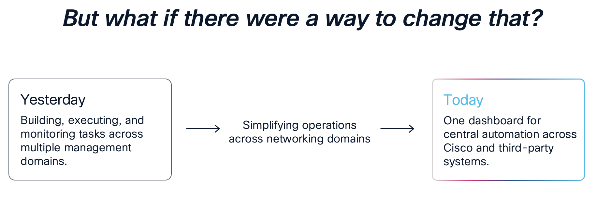

# Catalyst Center Orchestration with Cisco Workflows

## Overview

This Lab is designed as a standalone lab to help customers with varying challenges in Automating and Orchestrating their network infrastructure. Within the lab, we will use various tools and techniques to Automate various tasks and orchestrate Catalyst Center.

## Network management is far too complex

Complexities of network environments that involve multiple devices, configurations, and policies. These environments often include legacy systems, various hardware types, and differing compliance requirements, making management incredibly challenging. 

The Networking Landscape complexity is increased with islands of management planes, discontiguous implementation flows, especially where multiple controllers are involved.

Double administration at times for monitoring which leads to wasted time, and inability to track change across it all.

## Complexity creates challenges for network and security teams

Complexity leads to inaccuracy which leads to failures. Error prone processes and troubleshooting cause a loss in time due to Management Plane sprawl which is compounded by the growth and demand of the networks today.

* *What if it didn’t have to be that way.*
* *What if management planes could talk to one another, without fate sharing,
without complex integrations.*
* *What if this could somehow even be driven by events or even AI.*

## Cisco Workflows - *'What is it?'*

Meraki has added a well-established Cisco tool to the dashboard; Workflows. But let’s be very clear, it’s not just for Meraki. Customers can use this powerful automation and orchestration engine on pretty much anything. In addition to Meraki, it can be used for automating Cisco controllers like Catalyst Center, SD-WAN, ISE, ThousandEyes, ACI, Nexus Dashboard, Intersight, Webex, IOT, and anything Cisco or 3rd party that utilizes REST-API. If it has a REST API or an SSH adapter, Workflows can automate it.

If you can use Microsoft Visio, you can use Workflows.

## General Information

In this lab, we will use a complete set of Cisco Workflows which use REST API requests to automate and orchestrate network devices through Catalyst Center. This lab will focus on Catalyst Center orchestrations to build intent and templates to drive configuration.

This set of Labs is developed around a set of simple use cases to show both the power of Catalyst Center, the REST APIs, and easy methodologies for execution through Cisco Workflows.

The lab will utilize a set of Cisco Workflows publicly shared on Cisco Workflows Exchange and those workflows may be installed and customized for your own use.

> [!IMPORTANT] 
> Please note that LAB content in this Repository is aligned with specific DCLOUD Demonstrations that have to be set up by either a **Cisco Employee** or a **Cisco Partner**. If you are having trouble accessing the DCLOUD content please get in touch with your **Local Cisco Account Team**.

## Lab Modules

The Story we will use will be the following, after orientation, we will first construct our design. The design consists of a hierarchy, settings and credentials. With the hierarchy set, we still discover our pod devices and then import templates to Catalyst Center. We will then build a Network Profile, and provision devices. 

The use cases we will cover are the following which you can access via the links below:

1. [**Orientation**](./catc-catcenter-0-orientation/01-intro.md)
2. [**Building Hierarchy**](./catc-catcenter-1-hierarchy/01-intro.md)
3. [**Assign Settings and Credentials**](./catc-catcenter-2-settings/01-intro.md)
4. [**Device Discovery**](./catc-catcenter-3-discovery/01-intro.md)
5. [**Import Templates**](./catc-catcenter-4-templates/01-intro.md)
6. [**Build Network Profile**](./catc-catcenter-5-networkprofiles/01-intro.md)
7. [**Provisioning Devices**](./catc-catcenter-6-provisioning/01-intro.md)

## Preparation Notes

The following section of the README contains information for the lab.

### The DCLOUD Environment

Use this environment: [**Catalyst Center + ISE lab for Automation & Orchestration**](https://dcloud2.cisco.com/demo/catalyst-center-ise-lab-for-automation-orchestration)

The DCLOUD session includes the following equipment.

* Virtual Machines:
  * Catalyst Center 2.3.7.10 or better
  * Identity Services Engine (ISE) 3.4 Patch 3 or better (deployed)
  * Script Server - Ubuntu 20.04  or better
  * Windows 10 Jump Host 
  * Windows Server 2019 - Can be configured to provide identity, DHCP, DNS, etc.
  * vSphere 8.0 - For hosting Workflows Remote AO
  * ESXi Host - For hosting Workflows Remote AO

* Virtual Networking Devices:
  * Catalyst 8000v Router - 17.16.01a IOS-XE Code
  * Catalyst 9000v Switch - 17.15.03 IOS-XE Code 
  * Cisco Nexus 9000v Switch - 10.5.3 Code

The following diagram shows the DCLOUD topology.

### Access and Credentials:

| Platform:       | IP Address:    | Username      | Password    | 
|-----------------|----------------|---------------|-------------|
| Catalyst Center | 198.18.129.100 | admin         | C1sco12345  |
| ISE             | 198.18.133.27  | admin         | C1sco12345  |
| Windows AD      | 198.18.133.1   | admin         | C1sco12345  |
| Script Server   | 198.18.133.28  | root          | C1sco12345  |
| vSphere Server  | 198.18.134.80  | Administrator | C1sco12345! |
| CML Server      | 198.18.128.11  | Guest         | C1sco12345  |

#### Large Branch Topology

The following diagram shows one of the CML pods topology.

| Platform:  | OOB Mgmt:      | Loopback 0: | Username  | Password   |
|------------|----------------|-------------|-----------|------------|
| Spine-01   | 198.18.128.101 | 198.19.1.1  | net-admin | C1sco12345 |
| Spine-02   | 198.18.128.102 | 198.19.1.2  | net-admin | C1sco12345 |
| Border-01  | 198.18.128.103 | 198.19.1.3  | netadmin  | C1sco12345 |
| Border-02  | 198.18.128.104 | 198.19.1.4  | netadmin  | C1sco12345 |
| Leaf-01    | 198.18.128.105 | 198.19.1.5  | netadmin  | C1sco12345 |
| Leaf-02    | 198.18.128.106 | 198.19.1.6  | netadmin  | C1sco12345 |

#### Small Branch Topology

The following diagram shows one of the CML pods topology.

| Platform:       | IP Address:    | Username | Password   | 
|-----------------|----------------|----------|------------|
| Router          | 198.18.140.1   | netadmin | C1sco12345 |
| Switch 1        | 198.18.10.2    | netadmin | C1sco12345 |
| Switch 2        | 198.18.20.2    | netadmin | C1sco12345 |

### DCLOUD VPN Connection

Use AnyConnect VPN to connect to DCLOUD. When connecting, look at the session details and copy the credentials from the session booked into the client to connect.

### Tools Required

Please utilize the following tools to run the lab effectively and ensure they are installed on your workstation/laptop before attempting the lab.

1. Cisco AnyConnect VPN Client
2. Google Chrome

 Expand section for Tools Required 

#### Cisco AnyConnect VPN Client

This software is required to connect your workstation to Cisco dCloud. For an explanation of AnyConnect and how to use it with dCloud, please visit the following URL: 

- <a href="https://dcloud-cms.cisco.com/help/android_anyconnect" target="_blank">dCloud AnyConnect Documentation</a>

If you do not have the AnyConnect client, please visit. 

- <a href="https://dcloud-rtp-anyconnect.cisco.com" target="_blank">⬇︎AnyConnect Download Site⬇︎</a>

#### Google Chrome

Google Chrome is the optimal browser of choice when working in the Catalyst Center UI. 

To download Google Chrome, please visit. 

- <a href="https://www.google.com/chrome/downloads/" target="_blank">⬇︎Chrome Download⬇︎</a>

## Summary

This lab is intended for educational purposes only. Use outside of a lab environment should be done at the operator's risk. Cisco assumes no liability for incorrect usage.

This lab is intended to help drive the adoption of REST API and will be added to over time with various use cases. The Public Workspace will also mirror the changes and be kept up to date. We hope this set of labs helps explain how the REST API may be used and goes a little further in helping define and document them.

> [**Continue to Orientation Lab**](./catc-catcenter-0-orientation/01-intro.md)

> [**Return to LAB Main Menu**](../README.md)
