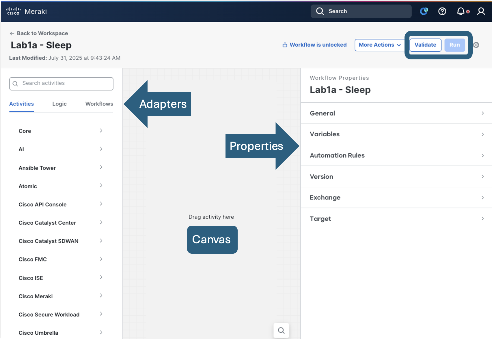

# Orientation

## Overview

Meraki has added a well-established Cisco tool to the dashboard; Workflows. But let’s be very clear, it’s not just for Meraki. Customers can use this powerful automation and orchestration engine on pretty much anything. In addition to Meraki, it can be used for automating Cisco controllers like Catalyst Center, SD-WAN, ISE, ThousandEyes, ACI, Nexus Dashboard, Intersight, Webex, IOT, and anything Cisco or 3rd party that utilizes REST-API. If it has a REST API or an SSH adapter, Workflows can automate it.

Today, we’re going to walk you through the tool. No programming experience required. If you can use Microsoft Visio, you can use Workflows. We are going to start with the absolute basics and build layer upon layer until we get into some more complex concepts in the tooling.

This Lab is designed as a set of standalone labs modules to help customers with varying challenges in Automating and Orchestrating their wired network infrastructure. Within the lab we will become oriented and accustomed to Cisco Workflows, its features and capabilities.

## General Information

Workflows has been the resultant of many years of evolution. Originally there was an acquisition from **Clickr** of a product which was used in the service provider space called **Action Orchestrator**. This tool was utilized to give a low to no code method of interacting with various systems and was incorporated in a platform called **MSX**. **MSX** was deprecated in 2022 and some of the code was used in **Secure X** which became **XDR** within the security suite. 

It was determined that a cloud orchestration platform was still needed for cross domain automation a few years ago and thus **Workflows** came into existence. Initially, in intersight, but then it was quickly realized that it needed to be within one platform covering the enterprise network. 

**Cisco Workflows** was then attached to the dashboard which is the defacto cloud automation tool for the Enterprise Network.

## Components

### Workspace 

This is the main panel displaying all the workflows, and atomics which is where 95% of the work will be done. These are the orchestrations which will be used to automate or orchestrate many automation engines from Cisco and 3rd Party.

### Adapters

This panel contains the building blocks and individual functions you can add to a workflow. They are grouped under adapters representing the different controllers with which Workflows integrates, and the individual actions called “activities” are based on API calls to the integrated products, logic components, and other workflows. Think of an activity as an API call or function. Feel free to explore some of them by expanding and examining the activities that are provided “out of the box”. 

Notice how many non-Meraki activities are supported right now, and this list isn’t even the exhaustive collection of activities Cisco has (Catalyst Center, Catalyst SD-WAN, Cisco FMC, ISE). There are also non-networking activities, such as Ansible and Terraform and Python. Scroll all the way to the bottom and note the Web Service activity that provides a generic REST API activity. If you need to automate something with a REST API – that is your catch-all for all things REST. I won’t list them all here, however, the main takeaway is that Cisco Workflows is a very powerful multi-domain automation and orchestration tool that your customers will already have.

### Properties

This panel includes the properties of the workflow itself as well as those for each activity on the workflow canvas. With a blank palette, the properties panel is where all the details and specifics of your automation are entered. Right now, with a blank canvas, the Properties space is for the overall workflow general configuration.  You can define variables for the workflow, and various other details we will get to soon.

### Canvas

This panel is where you build the structure and set the actions, order, and logic for a workflow. Drag-and-drop items from the Activities panel, including other workflows, here to add them to a workflow. You can drag and drop items on the canvas to change their location and order in the workflow. This is your space to build anything you wish.  

### Validate and Run

These are important concepts to pick up at the beginning of your Cisco Workflows journey.  Run executes your workflow, however, notice how it’s greyed out.  Cisco Workflows has a built in “gut check” that is required before a workflow is allowed to run.  For example, what if the workflow designer forgot to configure a required part of a function or the larger workflow itself – rather than attempt and fail, this screen requires the designer to validate the workflow.  When the gut check is complete the workflow is allowed to run.  

### More Actions

This drop-down menu in the upper left corner contains the following options:
*	View runs option allows the workflow designer to see the previous runs of the workflow and examine the input and output details of every activity
*	Duplicate option creates a copy and is useful when you have a working workflow that you would like to modify while also keeping the original workflow intact
*	Share option will allow you to export your workflow as a JSON file

## Summary

Lets begin our journey creating our first couple of workflows to get a general understanding of the Cisco Workflows capabilities. 

> [**Continue to Remote Target Setup**](./04-labsetup.md)

> [**Return to LAB Menu**](./README.md)