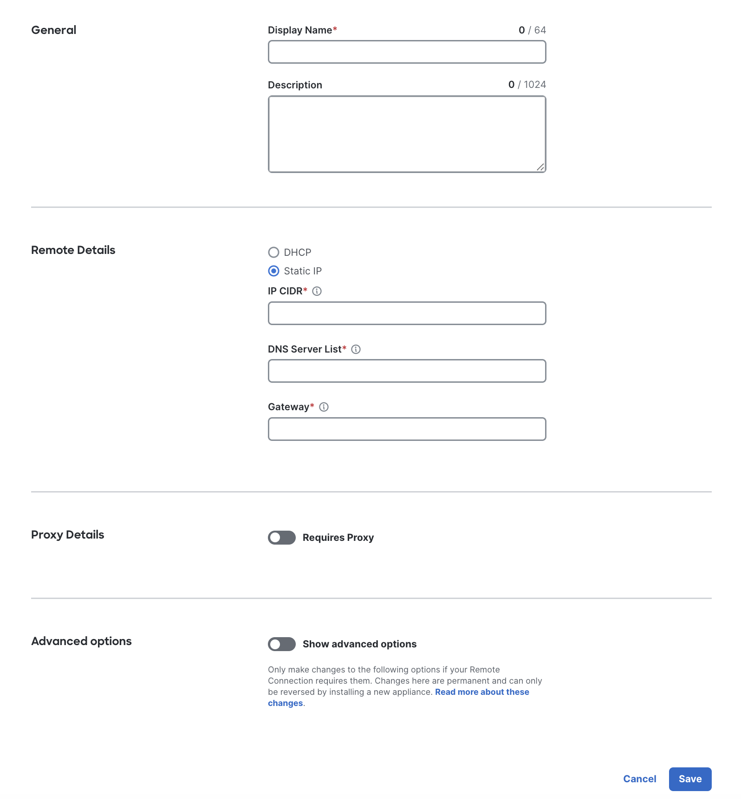
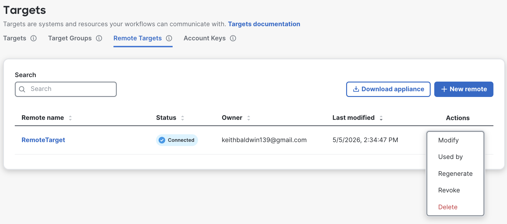
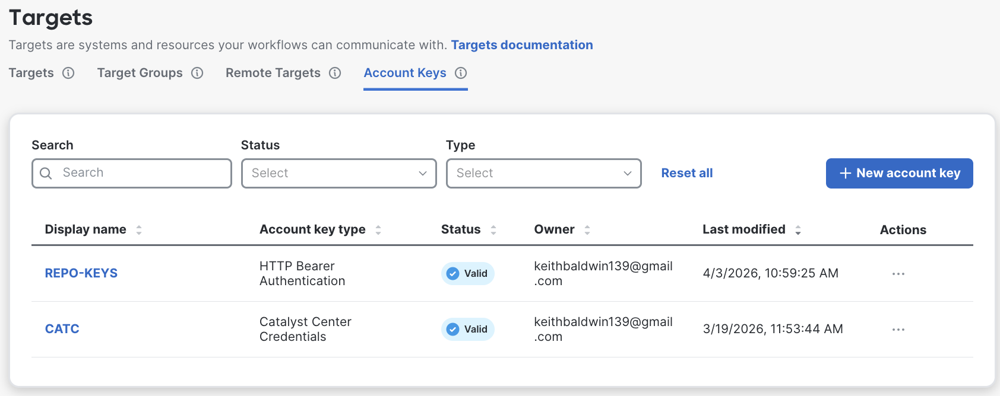
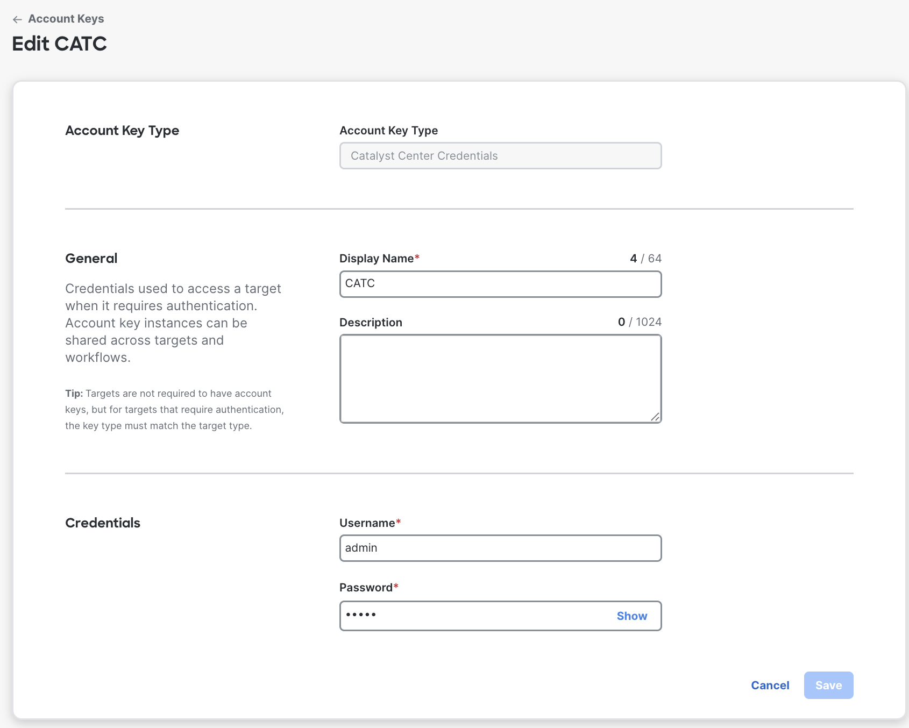
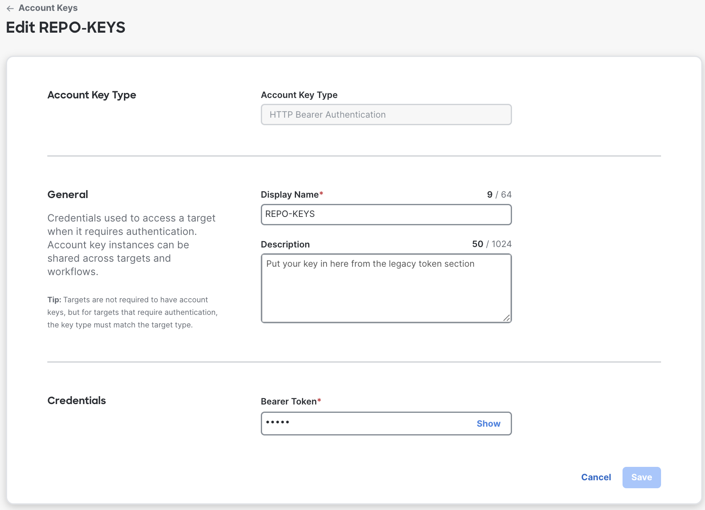
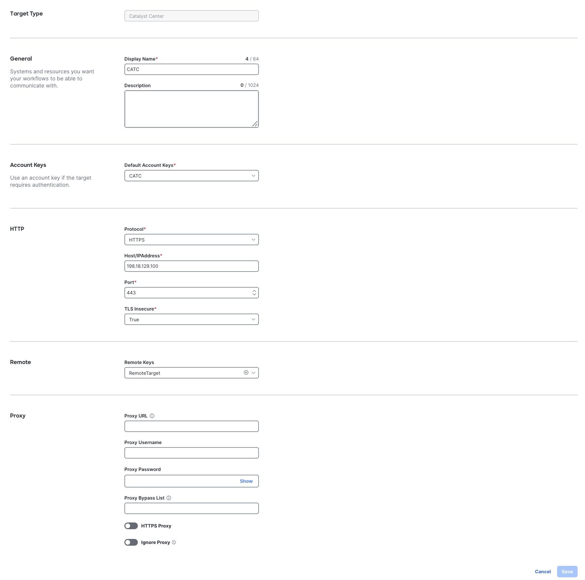
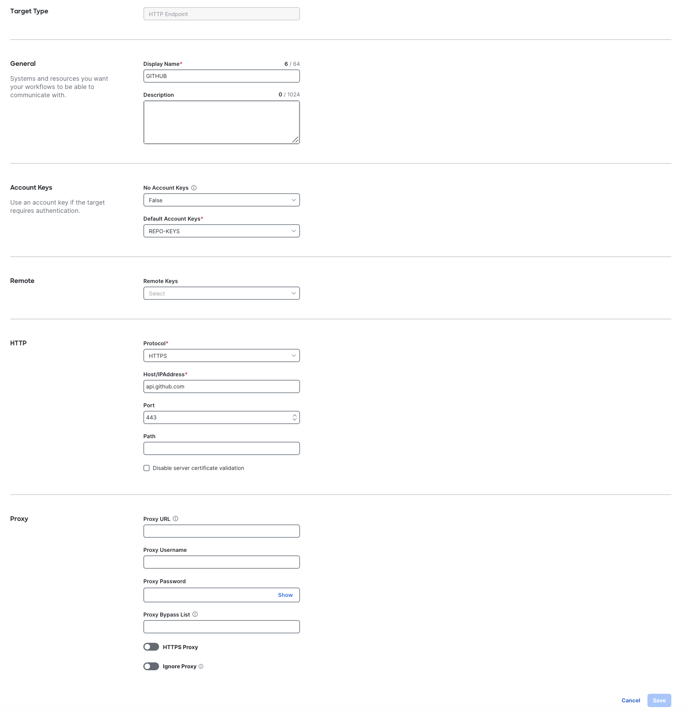

# Lab Setup - Remote Target, Account Keys, Targets, and Workflows

## Overview

Cisco Workflows is a cloud-hosted automation engine. To drive on-premises systems
that are **not** reachable directly from the internet — such as the Catalyst Center,
ISE, and CML devices in this DCLOUD lab — Workflows uses an **Automation Remote**.
The Remote is a virtual appliance you deploy inside the lab network; it brokers
all traffic between your cloud Workflows tenant and the on-premises targets.

In this module you will:

1. Deploy an **Automation Remote** virtual appliance to the lab vSphere host.
2. Create the **Account Keys** that hold the Catalyst Center and GitHub credentials.
3. Generate a **GitHub Personal Access Token** to use for the Git account key.
4. Create a **Catalyst Center Target** and a **Git Endpoint Target** that bind those
   account keys (and the Remote) together.
5. Install the seven **GitOps** workflows from **Workflows Exchange** that the
   subsequent lab modules depend on.

> [!IMPORTANT]
> Setting up the Automation Remote requires advanced knowledge of VMware vSphere.
> If you encounter issues in vCenter, contact your VMware administrator or VMware
> Support. (See the
> [Meraki Remote Setup and Deployment](https://documentation.meraki.com/Platform_Management/Workflows/Targets/Automation_Remote/Remote_Setup_and_Deployment)
> documentation for the full procedure.)

## DCLOUD Lab Values

The procedure below uses the following values, all sourced from the lab
[**Access and Credentials**](../README.md#access-and-credentials) table and the
network values supplied for this exercise. Keep this tab open — you will paste
these values in several places.

| Item                    | Value                |
|-------------------------|----------------------|
| vSphere Server          | `198.18.134.80`      |
| vSphere Username        | `Administrator`      |
| vSphere Password        | `C1sco12345!`        |
| Remote Target IP (CIDR) | `198.18.133.10/18`   |
| DNS Server              | `198.18.133.1`       |
| Default Gateway         | `198.18.128.1`       |
| Catalyst Center IP      | `198.18.129.100`     |
| Catalyst Center User    | `admin`              |
| Catalyst Center Password| `C1sco12345`         |

---

## Phase 1 — Deploy the Automation Remote

### Step 1 — Create a New Remote in the Workflows Dashboard



1. Sign in to the Meraki dashboard and choose **Automation > Targets**.
2. Click the **Remote Targets** tab, then click **New remote**.
3. Enter a meaningful **Display Name** (for example, `DCLOUD Remote`) and an
   optional **Description**.
4. In the **Remote Details** section, click the **Static IP** radio button and
   enter the following values from the lab table above:

   * **IP address (CIDR)**: `198.18.133.10/18`
   * **DNS servers**: `198.18.133.1`
   * **Default gateway**: `198.18.128.1`

5. Leave **Requires Proxy** off and do **not** enable advanced subnet overrides —
   the DCLOUD subnets do not collide with the appliance defaults.
6. Click **Save**. The new remote appears in the list with status **Not Connected**.

### Step 2 — Generate and Download the Configuration File



1. On the **Remote Targets** tab, find the remote you just created and click the
   ellipsis (**…**) in the **Actions** column.
2. Choose **Connect** from the menu.
3. In the **Connect Remote** dialog, click **Generate Package**.
4. A `remotePackage.zip` file downloads. **Unzip** it; you will need
   `remoteconfig.txt` during the OVA deployment.

### Step 3 — Download the Remote Appliance OVA

On the **Remote Targets** page, click the **Download Appliance** button to
download the latest Automation Remote OVA.


<details closed><summary> Optional: verify the OVA file hash </summary>

After the download completes, verify the file's SHA-256 against the value
published on the [Meraki Remote Setup and Deployment](https://documentation.meraki.com/Platform_Management/Workflows/Targets/Automation_Remote/Remote_Setup_and_Deployment#Configure_and_Deploy_the_Remote_Target_Virtual_Appliance)
documentation page. On macOS / Linux:

```bash
shasum -a 256 cisco-automation-remote-*.ova
```

</details>

### Step 4 — Deploy the OVA in vSphere

Open a browser to `https://198.18.134.80` and sign in to the vSphere Web Client
with `Administrator` / `C1sco12345!`.

1. In the inventory tree, **right-click** the folder where you want to deploy the
   appliance and select **Deploy OVF Template**.
2. Click the **Local file** radio button, then **Choose Files**, and select the
   OVA you downloaded in Step 3. Click **Next**.
3. Give the virtual appliance a unique name (for example, `DCLOUD-Workflows-Remote`)
   and confirm the location. Click **Next**.

   

4. Choose the compute resource (cluster or ESXi host) where the appliance will
   run, then click **Next**.

   

5. Review the deployment details and click **Next**.
6. Pick the datastore for the appliance. A minimum of **30 GB** of free space is
   recommended. Click **Next**.

   

7. For each **Source Network**, choose the **Destination Network** (lab port
   group) that has reachability to `198.18.133.0/18`. Click **Next**.

   

8. On the **Customize template** screen:

   * **Unique ID and Hostname** — enter a unique value (for example,
     `dcloud-workflows-remote`).

     

   * **SSH public key** — leave blank for this lab (out of scope).
   * **Encoded user-data** — paste the **entire contents** of `remoteconfig.txt`
     from the unzipped `remotePackage.zip` (Step 2).
   * **Default user's password** — set a console password for the `ubuntu` user.

     

   > [!NOTE]
   > To avoid a setup failure, the password **must be at least 14 characters**
   > and **must contain** at least 1 uppercase letter, 1 lowercase letter, 1
   > number, and 1 special character. It **must not** contain more than 3
   > identical characters in a row (e.g., `aaa`), more than 3 sequential
   > characters (e.g., `123`, `abc`), your username, or common dictionary words.

9. Click **Next**, review the summary, and click **Finish**.
10. When the deployment completes, click **Power On**.

### Step 5 — Verify the Remote is Connected

Return to **Automation > Targets > Remote Targets**. Within ~10 minutes the
status of your remote should change from **Not Connected** to **Connected**.

> [!NOTE]
> A newly deployed Remote can take up to 10 minutes to register with the cloud.
> If it remains **Not Connected** beyond that, verify the appliance has IP
> reachability to the internet through the lab network.

---

## Phase 2 — Create Account Keys



### About Account Keys

**Account Keys** are credentials Workflows uses to authenticate to its targets.
A single account key can be reused across many targets and workflows, and the
key **type must match** the target type (for example, *Catalyst Center
Credentials* for a *Catalyst Center* target). Up to **300 account keys** are
allowed per organization. See the
[Targets Account Keys](https://documentation.meraki.com/Platform_Management/Workflows/Targets/Targets_Account_Keys)
documentation for the full list of key types.

In this lab you will create **two** account keys:

* **DCLOUD Catalyst Center** — a *Catalyst Center Credentials* key for the
  on-prem controller.
* **GitHub PAT** — a *Git Credentials* key whose password is a GitHub Personal
  Access Token (PAT) you generate in Step 7.

### Step 6 — Create the Catalyst Center Account Key



1. Navigate to **Automation > Targets** and click the **Account Keys** tab.
2. Click **New account key**.
3. From the **Account Key Type** drop-down, choose **Catalyst Center Credentials**.
4. Fill in the form using the values from the
   [lab credentials table](../README.md#access-and-credentials):

   * **Display Name**: `DCLOUD Catalyst Center`
   * **Description**: `Catalyst Center admin login for DCLOUD`
   * **Username**: `admin`
   * **Password**: `C1sco12345`

5. Click **Save**.

### Step 7 — Generate a GitHub Personal Access Token (Classic)

The Workflows **Git Credentials** account key authenticates as a username +
password pair, where the password is a GitHub Personal Access Token. Workflows'
Git integration is documented against **classic ("legacy")** PATs, so this
walkthrough uses that flow. The full GitHub procedure is documented at
[Managing your personal access tokens](https://docs.github.com/en/authentication/keeping-your-account-and-data-secure/managing-your-personal-access-tokens).

> [!NOTE]
> GitHub recommends **fine-grained** personal access tokens for new integrations
> where possible. Use a fine-grained token if your workflows and target
> repository configuration support it; otherwise follow the classic flow below.

1. **Verify your email address** on GitHub if it has not been verified yet.
2. In the upper-right corner of any page on **github.com**, click your profile
   picture, then click **Settings**.
3. In the left sidebar, click **Developer settings**.
4. Under **Personal access tokens**, click **Tokens (classic)**.
5. Click **Generate new token**, then **Generate new token (classic)**.
6. In the **Note** field, give the token a descriptive name (for example,
   `Cisco Workflows DCLOUD`).
7. Set an **Expiration** (a fixed date is recommended).
8. Under **Select scopes**, check **`repo`** (full control of private
   repositories). If your GitOps templates repository is public, **`public_repo`**
   alone is sufficient.
9. Click **Generate token**.
10. **Copy the token immediately** using the copy icon — GitHub will only
    display it once.

    

11. If your token must access repositories owned by a SAML-SSO organization,
    click **Configure SSO** and authorize the token.

> [!IMPORTANT]
> Treat the token like a password. Store it only in the Workflows account key
> created in the next step (or in a secure password manager) — never commit it
> to a repository.

### Step 8 — Create the Git Account Key in Workflows



1. Back in the Meraki dashboard, navigate to **Automation > Targets > Account
   Keys** and click **New account key**.
2. From the **Account Key Type** drop-down, choose **Git Credentials**.
3. Fill in the form:

   * **Display Name**: `GitHub PAT`
   * **Description**: `GitHub PAT for GitOps templates repository`
   * **Username**: your GitHub username
   * **Password**: paste the **classic PAT** copied in Step 7

4. Click **Save**.

---

## Phase 3 — Create the Targets


### Step 9 — Create the Catalyst Center Target



A **Catalyst Center Target** binds the Catalyst Center URL, the account key
from Step 6, and the Remote from Phase 1 into a single addressable target that
your workflows can call. See the
[Catalyst Center Target](https://documentation.meraki.com/Platform_Management/Workflows/Targets/Target_Types/Catalyst_Center_Target)
documentation for the full reference.

1. Navigate to **Automation > Targets** and click **New Target**.
2. From the **Target Type** drop-down, choose **Catalyst Center**.
3. Fill in the form:

   * **Display Name**: `DCLOUD Catalyst Center`
   * **Description**: `On-prem Catalyst Center in DCLOUD`
   * **Host / URL**: `https://198.18.129.100`
   * **Verify TLS**: leave **disabled** (DCLOUD uses a self-signed certificate).

4. In the **Account Keys** section, click the **Default Account Keys** drop-down
   and select **`DCLOUD Catalyst Center`** (created in Step 6).
5. In the **Remotes** section, click the **Remote Keys** drop-down and select the
   **DCLOUD Remote** appliance you deployed in Phase 1.
6. Click **Save**.

### Step 10 — Create the Git Endpoint Target



A **Git Endpoint** target lets workflows interact with a Git repository for
configuration, templates, and other workflow assets. The full reference is the
[Git Endpoint Target](https://documentation.meraki.com/Platform_Management/Workflows/Targets/Target_Types/Git_Endpoint_Target)
documentation.

1. Navigate to **Automation > Targets** and click **New Target**.
2. From the **Target Type** drop-down, choose **Git Endpoint**.
3. Enter:

   * **Display Name**: `GitOps Templates Repo`
   * **Description**: `GitHub repository for GitOps workflow templates`

4. In the **Account Keys** area, click the **Default Account Keys** drop-down
   and choose **`GitHub PAT`** (created in Step 8).
5. In the **Git** section, enter:

   * **Protocol**: **HTTPS**
   * **REST API Repository Type**: **GitHub**
   * **Branch**: `main` (or the branch where your templates live)
   * **Repository URL**: `<your-repo-url>` — the GitHub repository that hosts
     your GitOps templates
   * **Code Path**: the path inside the repository where the templates reside
     (for example, `Projects/TRADITIONAL/DayNTemplates`)

6. Leave the **Proxy** section empty for DCLOUD.
7. Click **Save**.

---

## Phase 4 — Install the GitOps Workflows from Exchange

The remaining lab modules each drive one of the **GitOps** workflows published
on **Workflows Exchange**. Install all seven now so they are ready to run later.
The full install procedure is documented at
[Install a Workflow](https://documentation.meraki.com/Platform_Management/Workflows/Exchange/Install_a_Workflow).

### Step 11 — Install Each Workflow

> [!NOTE]
> You must be signed in to Workflows as an **administrator** to install
> workflows from Exchange.

For **each** of the seven workflows listed below, repeat steps 1 – 8:

1. Navigate to **Automation > Exchange** and click the **Explore** tab.
2. Search for the workflow by name and click **Learn More**.
3. Review the **Description** and any prerequisites listed on the workflow page.
4. Check the boxes next to the object types you want to configure during
   installation, then click **Install**.

   > Tip: If a workflow uses multiple objects of the same type and you uncheck
   > one, **all** objects of that type are unchecked.

5. In the install wizard, when prompted for **Account Keys**, choose:

   * **`DCLOUD Catalyst Center`** for any Catalyst Center credentials prompt.
   * **`GitHub PAT`** for any Git credentials prompt.

   Click **Next**.

6. When prompted for **Targets**, choose:

   * **`DCLOUD Catalyst Center`** for any Catalyst Center target prompt.
   * **`GitOps Templates Repo`** for any Git Endpoint target prompt.

   Click **Next**.

7. Enter the values for any **Variables** the workflow exposes, then click **Next**.
8. Review the summary and finish the wizard. If any validation warnings appear,
   click **View in Workflows**, open the workflow in the editor, fill in the
   missing properties, and click **Validate**.

Install the following seven workflows in this order:

1. `GitOps-BuildHierarchy`
2. `GitOps-BuildSettings`
3. `GitOps-DeviceDiscovery`
4. `GitOps-ImportTemplates`
5. `GitOps-BuildCompositeTemplate`
6. `GitOps-BuildNetworkProfile`
7. `GitOps-DeviceProvisioning`

Each subsequent module of this lab will execute one of these workflows in turn.

> [!NOTE]
> If an install fails or you want to re-install a clean version, **delete** the
> existing workflow (and any sub-workflows or runs it created) on the
> **Workflows** page first, then re-install.

---

## Summary

You have:

* Deployed and registered an **Automation Remote** virtual appliance in vSphere.
* Created **Catalyst Center** and **Git** **Account Keys**.
* Generated a **GitHub Personal Access Token** and stored it in the Git account key.
* Created **Catalyst Center** and **Git Endpoint** **Targets** bound to the
  Remote and account keys.
* Installed the seven **GitOps** workflows from **Exchange**.

The remainder of this lab will exercise these workflows one module at a time
to build hierarchy, push settings, discover devices, import templates, and
provision the lab devices through Catalyst Center.

> [!IMPORTANT]
> **Feedback:** If you found this set of **labs** or **content** helpful, please fill in comments on this feedback form [give feedback](https://github.com/kebaldwi/DNAC-TEMPLATES/discussions/new?category=feedback-and-ideas).</br></br>
**Content Problems and Issues:** If you found an **issue** on the **lab** or **content** please fill in an [issue](https://github.com/kebaldwi/DNAC-TEMPLATES/issues/new) include what file, along with the issue you ran into.

> [**Next Module**](../catc-catcenter-1-hierarchy/01-intro.md)

> [**Return to LAB Menu**](../README.md)
