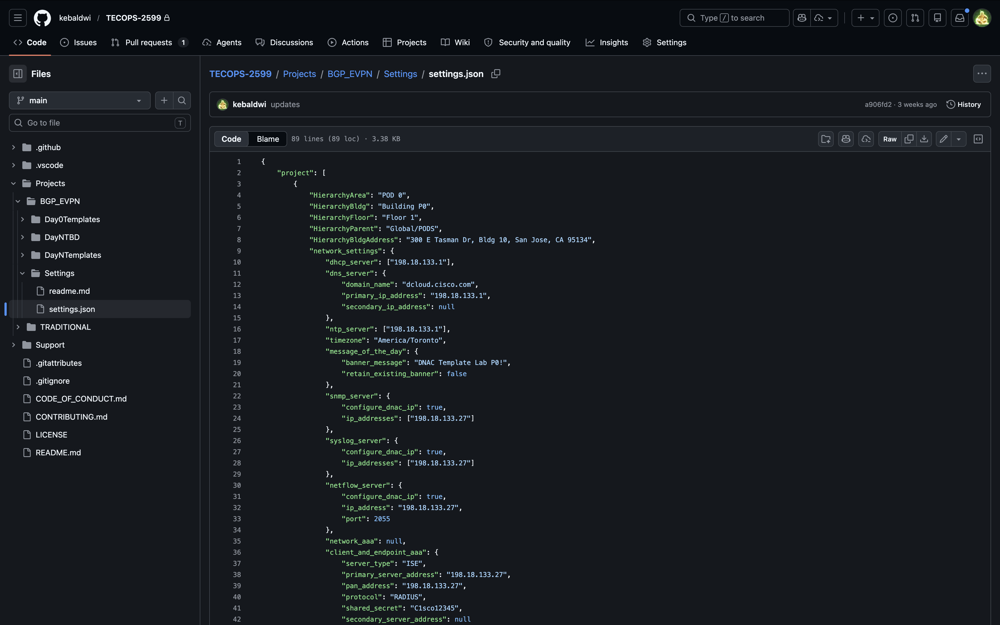
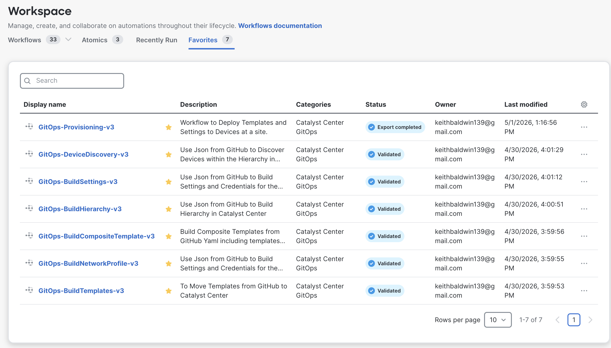
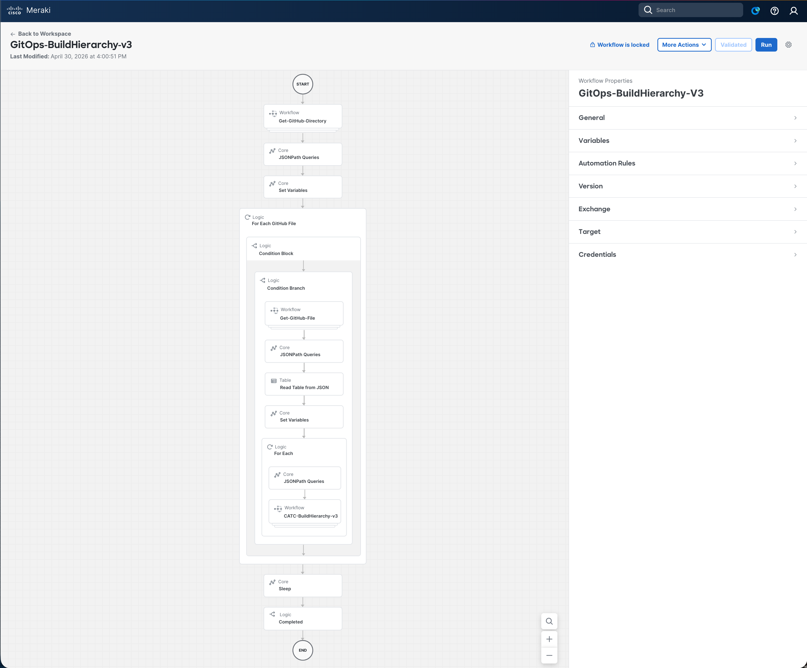
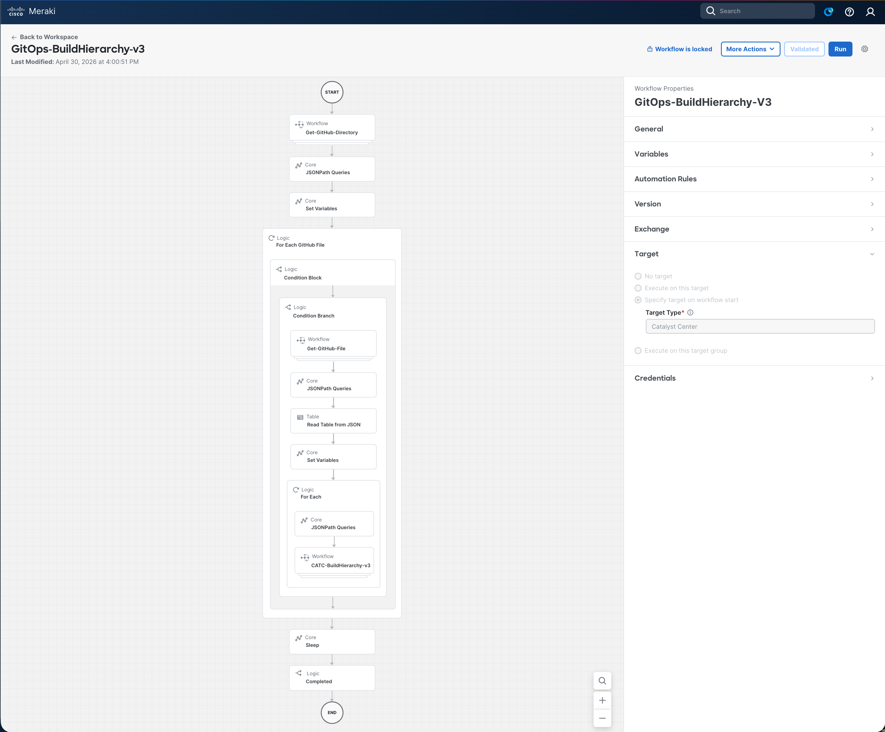
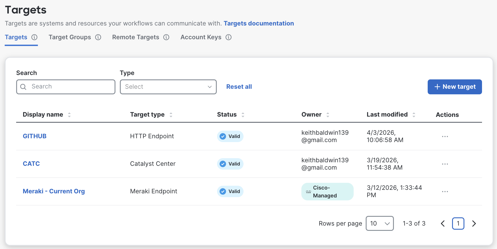
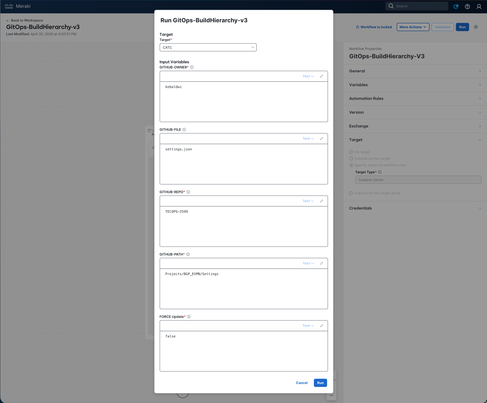
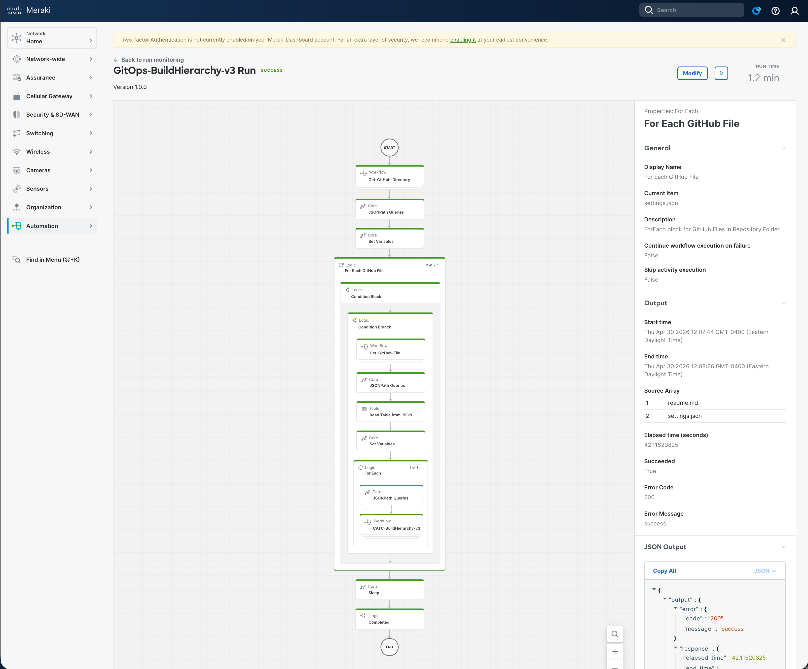

# Examine and Run Build Hierarchy Workflow

In this section we will open the **`GitOps-BuildHierarchy-v3`** workflow in the **Cisco Workflows** dashboard, walk through what it does, supply the input parameters, run it against Catalyst Center, and verify the resulting site hierarchy.

The workflow is part of the GitOps provisioning suite and **must run first** in the lab — every later module (Settings & Credentials, Discovery, Templates, Network Profiles, Provisioning) depends on the hierarchy it creates.

## Examine the Workflow

The workflow follows a simple GitOps pattern: read structured intent (`settings.json`) from GitHub, then drive the Catalyst Center Intent API to make reality match.

### High-level Steps

| # | Step | What Happens |
|---|------|--------------|
| 1 | **List GitHub directory** | `Get-GitHub-Directory-v2` → `GET api.github.com/repos/{owner}/{repo}/contents/{path}` |
| 2 | **Match target file** | JSONPath filters the listing for the file matching `GITHUB-FILE` |
| 3 | **Read `settings.json`** | `Get-GitHub-File-v2` → raw JSON pulled with `Accept: application/vnd.github.raw+json` |
| 4 | **Parse hierarchy table** | JSONPath + Read Table → one row per Parent / Area / Building / Floor / Address |
| 5 | **Build per row** | `CATC-BuildHierarchy-v3` checks each level against `GET /dna/intent/api/v1/site` and conditionally `POST`s missing Areas, Buildings, and Floors, polling each create to completion |
| 6 | **Return result** | `GET /dna/intent/api/v2/site` returns the post-build hierarchy |

The full decision and loop structure (including the embedded sub-flow that polls each `POST` to completion) is shown below:

> Full workflow reference: [Support/Resources/Cisco Workflows/1.0-Cisco-Catalyst-Center-Site-Hierarchy/README.md](../../../Resources/Cisco%20Workflows/1.0-Cisco-Catalyst-Center-Site-Hierarchy/README.md)

### Why It's Safe to Re-run

Each level (Parent → Area → Building → Floor) is checked with a `Find String` against the current hierarchy snapshot before any `POST` is issued. Existing sites are skipped, so running the workflow repeatedly with the same `settings.json` will **not** create duplicates. To force re-creation/update of existing sites, set `FORCE Update = true`.

## Open the Workflow in the Dashboard

1. From the Meraki / Cisco Workflows dashboard, navigate to **Workflows** in the sidebar.

   

2. Locate **`GitOps-BuildHierarchy-v3`** in the workflow list and click to open it.
3. Review the canvas — you should see the six high-level activities listed above. Click any activity to inspect its **Properties** (input/output mapping, JSONPath queries, target accounts).

   

4. In the **Properties** panel of the workflow itself, confirm that the configured **Targets** include both:
    - **GitHub Target** (`api.github.com`) — set up in the orientation module
    - **Catalyst Center Target** (`https://198.18.129.100`) — set up in the orientation module

      

   - That matches 

      

## Provide Input Parameters and Run

1. Click **Run** on the workflow. The input form opens.
2. Fill in (or accept the defaults for) the following parameters:

   

   | Parameter      | Value for this Lab           |
   |----------------|------------------------------|
   | `GITHUB-OWNER` | `kebaldwi`                   |
   | `GITHUB-REPO`  | `TECOPS-2599`                | 
   | `GITHUB-PATH`  | `Projects/BGP_EVPN/Settings` |
   | `GITHUB-FILE`  | `settings.json`              |
   | `FORCE Update` | `false`                      |

3. Click **Run** to start execution.

## Monitor the Execution

1. Open **More Actions → View Runs** for the workflow.
2. Click the most recent run to expand the **Execution Details** view.

   

3. Step through each activity and inspect its **Input** and **Output**:
    - **Step 1** — confirms a list of files was returned from the GitHub directory.
    - **Step 2** — confirms `settings.json` matched and the loop proceeded.
    - **Step 3** — shows the raw `settings.json` contents.
    - **Step 4** — shows the parsed table of hierarchy rows.
    - **Step 5** — shows, per row, which levels were already present and which were created (with the `executionId` returned from each `POST /dna/intent/api/v1/site` and the result of polling that task).
    - **Step 6** — final `GET /dna/intent/api/v2/site` snapshot returned as the workflow output.

A successful run reports each hierarchy record processed, with totals for created / skipped / errors at the end.

## Verify the Hierarchy in Catalyst Center

1. Open a browser and navigate to [**Catalyst Center**](https://198.18.129.100). If an SSL warning is displayed, click **Proceed to `https://198.18.129.100` (unsafe)** to continue.

   

2. Log in with:
    - **username:** `admin`
    - **password:** `C1sco12345`

   

3. When the Catalyst Center Dashboard is displayed, click the **&#8801;** icon to display the menu.

   

4. Select **Design → Network Hierarchy** from the menu to continue.

   

5. Expand the hierarchy on the left and confirm that the Area / Building / Floor entries from `settings.json` are present.

   

## Summary

You have used a Cisco Workflow — driven entirely from version-controlled JSON in GitHub — to build the foundational Catalyst Center site hierarchy. No CLI, no clicking through Design pages, and no Postman runner. The same workflow can be re-run safely whenever `settings.json` is updated, and the same GitOps pattern (List → Read → Parse → Act → Verify) will reappear in every subsequent module.

> [**Next Module**](../catc-catcenter-2-settings/01-intro.md)

> [**Return to LAB Menu**](../README.md)