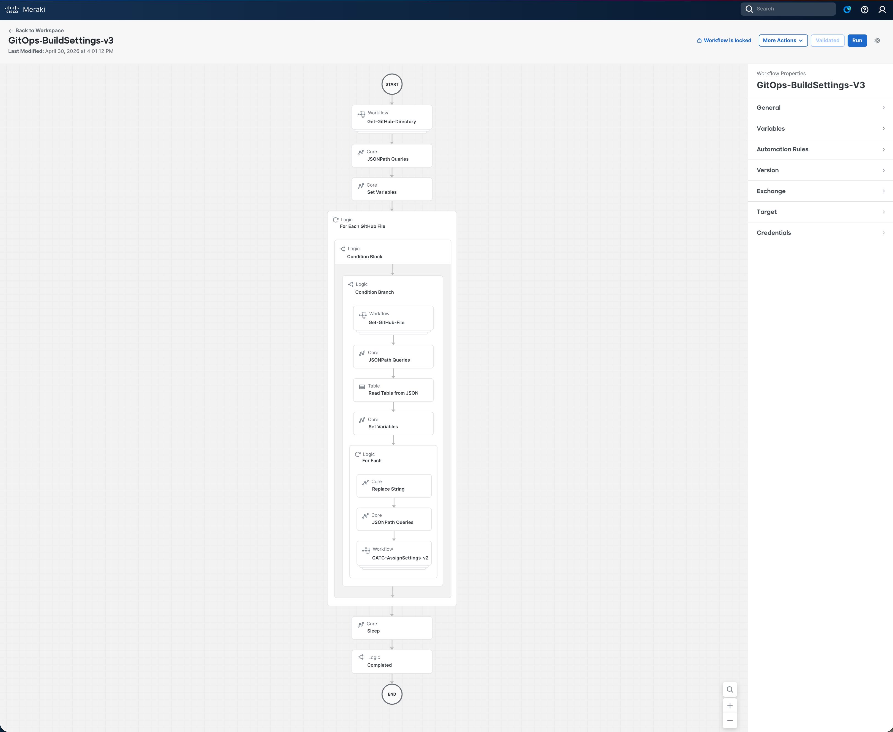
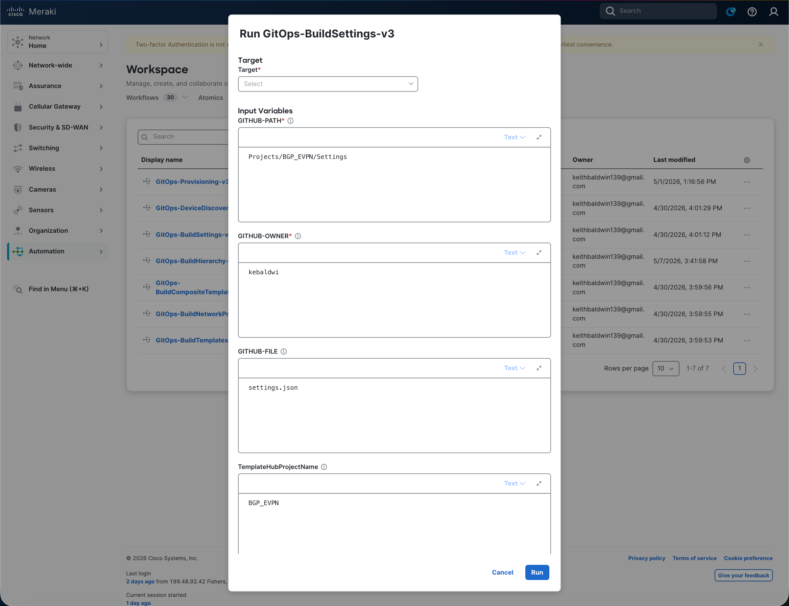
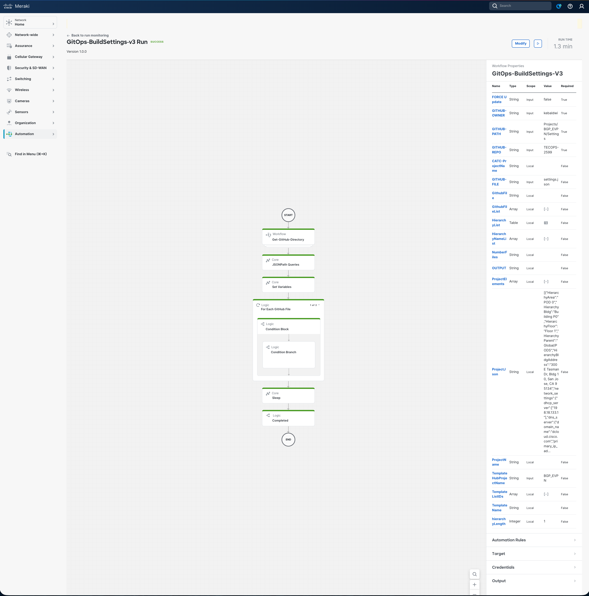

# Examine and Run Build Settings Workflow

In this section we will open the **`GitOps-BuildSettings-v3`** workflow in the **Cisco Workflows** dashboard, walk through what it does, supply the input parameters, run it against Catalyst Center, and verify that network settings and device credentials were applied to each site in the hierarchy.

This workflow is the **second** in the GitOps provisioning suite and depends on the site hierarchy created by `GitOps-BuildHierarchy-v3` in the previous module. Every later module (Discovery, Templates, Network Profiles, Provisioning) depends on the settings and credentials it applies.

## Overview Video

> 💡 Tip: Ctrl/Cmd + Click the thumbnail to open the video in a new tab.

## Examine the Workflow

The workflow follows the same GitOps pattern as the hierarchy build: read structured intent (`settings.json`) from GitHub, then drive the Catalyst Center Intent API to make reality match — but instead of creating sites, it applies **network settings** (DNS, DHCP, NTP, AAA, SNMP, Syslog, Netflow, Timezone, MOTD) and **device credentials** (CLI, SNMP v2c read/write, NETCONF) per site.

### High-level Steps

| # | Step | What Happens |
|---|------|--------------|
| 1 | **List GitHub directory** | `Get-GitHub-Directory-v2` → `GET api.github.com/repos/{owner}/{repo}/contents/{path}` |
| 2 | **Match target file** | JSONPath filters the listing for the file matching `GITHUB-FILE` |
| 3 | **Read `settings.json`** | `Get-GitHub-File-v2` → raw JSON pulled with `Accept: application/vnd.github.raw+json` |
| 4 | **Parse hierarchy table** | JSONPath + Read Table → one row per Parent / Area / Building / Floor; null values sanitised to `""` before per-row queries |
| 5 | **Apply per row** | `CATC-AssignSettings-v2` issues, in order: • `POST /dna/intent/api/v1/network/{siteId}` (network settings) • `GET /dna/intent/api/v1/global-credential` (existing creds) • `POST /dna/intent/api/v1/global-credential` (create missing creds) • `POST /dna/intent/api/v2/site/{siteId}/credential` (assign creds to site) |
| 6 | **Return result** | Resultant settings and credential assignments returned in workflow output |

The full decision and loop structure (including the sub-flow that extracts 35 fields per row and the API invocation sequence) is shown below:

> Full workflow reference: [Support/Resources/Cisco Workflows/2.0-Cisco-Catalyst-Center-Settings-and-Credentials/README.md](../../../Resources/Cisco%20Workflows/2.0-Cisco-Catalyst-Center-Settings-and-Credentials/README.md)

### Why It's Safe to Re-run

Before any credential is created, the workflow queries `GET /dna/intent/api/v1/global-credential` and skips entries that already exist by description. Network settings are applied per `siteId` and overwrite the same fields with the same values. Re-running with the same `settings.json` is therefore safe and produces no duplicates. To force overwrite of existing settings or credentials, set `FORCE Update = true`.

## Open the Workflow in the Dashboard

1. From the Cisco Workflows dashboard, navigate to **Workflows** in the sidebar.

   

2. Locate **`GitOps-BuildSettings-v3`** in the workflow list and click to open it.
3. Review the canvas — you should see the six high-level activities listed above. Click any activity to inspect its **Properties** (input/output mapping, JSONPath queries, target accounts).

   

4. In the **Properties** panel of the workflow itself, confirm that the configured **Targets** include both:
    - **GitHub Target** (`api.github.com`) — set up in the orientation module
    - **Catalyst Center Target** (`https://198.18.129.100`) — set up in the orientation module

   - That matches

      

## Provide Input Parameters and Run

1. Click **Run** on the workflow. The input form opens.
2. Fill in (or accept the defaults for) the following parameters:

   

   | Parameter                | Value for this Lab           |
   |--------------------------|------------------------------|
   | `GITHUB-OWNER`           | `kebaldwi`                   |
   | `GITHUB-REPO`            | `TECOPS-2599`                |
   | `GITHUB-PATH`            | `Projects/BGP_EVPN/Settings` |
   | `GITHUB-FILE`            | `settings.json`              |
   | `FORCE Update`           | `false`                      |
   | `TemplateHubProjectName` | `BGP_EVPN`                   |

3. Click **Run** to start execution.

## Monitor the Execution

1. Open **More Actions → View Runs** for the workflow.
2. Click the most recent run to expand the **Execution Details** view.

   

3. Step through each activity and inspect its **Input** and **Output**:
    - **Step 1** — confirms a list of files was returned from the GitHub directory.
    - **Step 2** — confirms `settings.json` matched and the loop proceeded.
    - **Step 3** — shows the raw `settings.json` contents.
    - **Step 4** — shows the parsed table of hierarchy rows and the 35 fields extracted for the current row.
    - **Step 5** — shows, per row: • the `POST /dna/intent/api/v1/network/{siteId}` request body and response • the `GET /dna/intent/api/v1/global-credential` snapshot • any `POST /dna/intent/api/v1/global-credential` creates • and the final `POST /dna/intent/api/v2/site/{siteId}/credential` assignment.
    - **Step 6** — workflow output reflects the resultant settings and credential assignments.

A successful run reports each hierarchy row processed, with totals for created / skipped / errors at the end.

## Verify Settings and Credentials in Catalyst Center

1. Open a browser and navigate to [**Catalyst Center**](https://198.18.129.100). If an SSL warning is displayed, click **Proceed to `https://198.18.129.100` (unsafe)** to continue.

   

2. Log in with:
    - **username:** `admin`
    - **password:** `C1sco12345`

   

3. When the Catalyst Center Dashboard is displayed, click the **&#8801;** icon to display the menu.

   

4. Select **Design → Network Settings** from the menu to continue.

   

5. Expand the hierarchy on the left, select your `Area` (or specific Building/Floor), and scroll through the **Network** tab to confirm DNS, DHCP, NTP, SNMP, Syslog, Netflow, Timezone, MOTD, and AAA values match `settings.json`.

   

6. Open the **Device Credentials** tab and confirm CLI, SNMP v2c read/write, and NETCONF entries match the `device_credentials` section of `settings.json` and are assigned to the selected site.

   

7. Open the **Telemetry** tab and confirm Syslog, SNMP, and Netflow collectors are configured as expected.

   

## Summary

You have used a Cisco Workflow — driven entirely from version-controlled JSON in GitHub — to apply network settings and device credentials to every site in the Catalyst Center hierarchy. No CSV files, no Postman runner, no per-site UI clicking. The same GitOps pattern (List → Read → Parse → Act → Verify) used for hierarchy now applies to settings, and will reappear in every subsequent module.

> [**Next Module**](../catc-catcenter-3-discovery/01-intro.md)

> [**Return to LAB Menu**](../README.md)