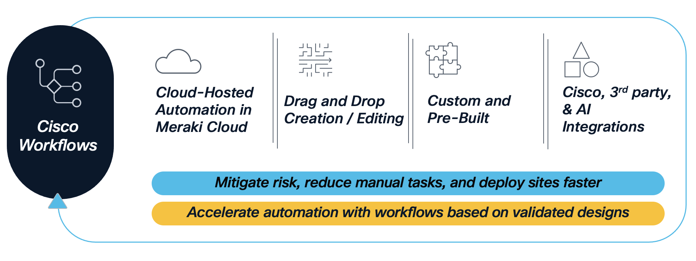

# Discovering Devices and Assigning to Sites

In this module, we will use **Cisco Workflows** to **discover** network devices and **assign** them to the correct sites in the hierarchy created and configured in the previous modules. As with hierarchy and settings, the source of truth is a `settings.json` file in this GitHub repository — the workflow reads it and drives the Catalyst Center Intent API to make reality match.

The same GitOps pattern reappears here: *GitHub as the source of truth, Cisco Workflows as the orchestration engine, Catalyst Center as the system of record.*



## Device Discovery Background

Catalyst Center includes a **Discovery Tool** that onboards network devices using one of the following methods:

1. CDP
2. LLDP
3. IP Address Range (Single, Range, or Multi Range)

The Discovery Tool authenticates against each target device using **global credentials** (CLI/SSH, SNMPv2c Read/Write, NETCONF) that are configured under **Design → Network Settings → Device Credentials**. Once a device responds, Catalyst Center synchronises its inventory entry and places the device in the **Unassigned** pool. The administrator (or, in this case, the workflow) must then **assign** the device to a specific site (Area / Building / Floor) so design intent — settings, templates, network profiles — can be applied to it.

In this lab we will discover every device defined in `settings.json` and assign each one to its target site in a single workflow run.

> **Note:** When ISE is integrated with Catalyst Center and settings are applied, the device is also registered as a Network Access Device in ISE during site assignment via **pxGrid integration**.

## Why Cisco Workflows for Discovery?

The workflow we will run in this module — `GitOps-DeviceDiscovery` — is a generic Catalyst Center workflow that calls the Catalyst Center **Intent API** (`/dna/intent/api/v2/global-credential`, `/dna/intent/api/v1/dnac-release`, `/dna/intent/api/v1/discovery`, `/dna/intent/api/v1/task/{taskId}`, `/dna/intent/api/v1/discovery/{id}/network-device`, `/dna/intent/api/v2/site`, `/dna/intent/api/v1/networkDevices/assignToSite/apply`) and the **GitHub Contents API**. It does the following on your behalf:

| Stage | What Happens |
|---|---|
| **1. List** | Lists all files in a GitHub directory (`Get-GitHub-Directory-v2`) |
| **2. Match** | Filters down to the target `settings.json` file |
| **3. Read** | Pulls the raw contents of `settings.json` (`Get-GitHub-File-v2`) |
| **4. Parse** | Converts the JSON `project[]` array into hierarchy rows (Parent / Area / Building / Floor)</br> and extracts up to 10 fields per row (site path, credential references, `device_list`) |
| **5. Discover & Assign** | For each row, `CATC-DeviceDiscovery-v3`:<br>• Resolves global credential UUIDs — `GET /dna/intent/api/v2/global-credential`<br>• Detects the installed Catalyst Center version — `GET /dna/intent/api/v1/dnac-release`<br>• Detects and deletes any duplicate discovery job by `siteNameHierarchy`<br>• Creates the discovery job — `POST /dna/intent/api/v1/discovery`<br>• Polls the task and waits for discovery to settle<br>• Retrieves discovered devices — `GET /dna/intent/api/v1/discovery/{id}/network-device`<br>• Resolves the target `siteId` — `GET /dna/intent/api/v2/site`<br>• Assigns devices — `POST /dna/intent/api/v1/networkDevices/assignToSite/apply` |
| **6. Verify** | Resultant discovery job and device-to-site assignments reflected in the workflow output |

Because the workflow detects existing discovery jobs by `siteNameHierarchy` and recreates them cleanly — and because reassigning a device to its current site is a no-op in Catalyst Center — the run is **safe to re-run**. To force overwrite of any pre-existing discovery state, set `FORCE Update = true`.

### Logical Flow

The diagram below shows the full decision and loop structure of `GitOps-DeviceDiscovery`, including the sub-flow that extracts 10 fields per row and the API invocation sequence executed by `CATC-DeviceDiscovery-v3`:


> Full workflow reference: [Support/Resources/Cisco Workflows/3.0-Cisco-Catalyst-Center-Device-Discovery-and-Assign/README.md](../../../Resources/Cisco%20Workflows/3.0-Cisco-Catalyst-Center-Device-Discovery-and-Assign/README.md)

## Source of Truth — `settings.json`

The same `settings.json` that defines the hierarchy and per-site settings also carries the **device list** and the **credential references** the discovery job should use. Each entry under `project[]` binds a discovery scope to a specific Area / Building / Floor:

```json
{
  "project": [
    {
      "HierarchyParent": "Global/PODS",
      "HierarchyArea":   "POD 0",
      "HierarchyBldg":   "Building P0",
      "HierarchyFloor":  "Floor 1",
      "HierarchyBldgAddress": "300 E Tasman Dr, Bldg 10, San Jose, CA 95134",
      "device_credentials": {
        "cli_credential":     { "username": "net-admin" },
        "snmp_v2c_read":      { "description": "RO" },
        "snmp_v2c_write":     { "description": "RW" },
        "netconf_credential": { "netconf_port": "830" }
      },
      "device_list": "198.19.1.1,198.19.1.2,198.19.1.3,198.19.1.4,198.19.1.5,198.19.1.6"
    }
  ]
}
```

The `device_credentials` block does **not** carry secrets — it carries lookup keys (CLI `username`, SNMP `description`, NETCONF `netconf_port`) that the workflow uses to resolve the corresponding global credential UUIDs already configured in Catalyst Center by the previous module. The `device_list` is a comma-separated list of management IPs, which the workflow analyses to decide whether to issue a `Single`, `Range`, or `Multi Range` discovery and whether to use the `ip-ip` or `ip–ip` separator based on the installed Catalyst Center version.

For this lab, the file lives at `Projects/BGP_EVPN/Settings/settings.json` in the `kebaldwi/TECOPS-2599` repository, and is the same file referenced by the default workflow input parameters (`GITHUB-OWNER`, `GITHUB-REPO`, `GITHUB-PATH`, `GITHUB-FILE`).

## What You Will Do in This Module

1. Open the **Cisco Workflows** dashboard and locate the `GitOps-DeviceDiscovery` workflow.
2. Review the input parameters:</br> (`GITHUB-OWNER`, `GITHUB-REPO`, `GITHUB-PATH`, `GITHUB-FILE`, `FORCE Update`, `TemplateHubProjectName`).
3. Run the workflow and observe each step from the **View Runs** panel — including credential UUID resolution, version detection, duplicate handling, task polling, the 180 s discovery settle wait, and final site assignment.
4. Verify the discovery job and device assignments in Catalyst Center under **Tools → Discovery** and **Provision → Network Devices → Inventory**.

> **Prerequisites:** **Completed** the previous modules [**Building Hierarchy**](../catc-catcenter-1-hierarchy/01-intro.md) and [**Assigning Settings and Credentials**](../catc-catcenter-2-settings/01-intro.md). The site hierarchy and global credentials referenced by each row in `settings.json` must already exist in Catalyst Center.

> [**Next Section**](./02-deploy.md)

> [**Return to LAB Menu**](../README.md)