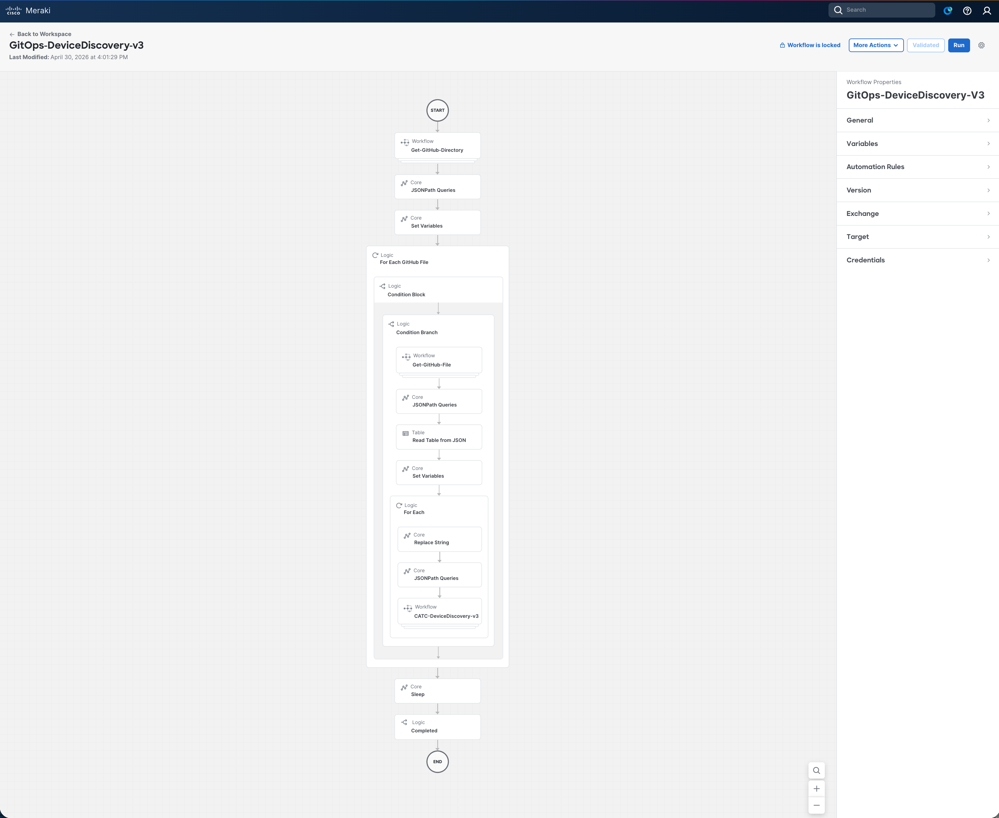
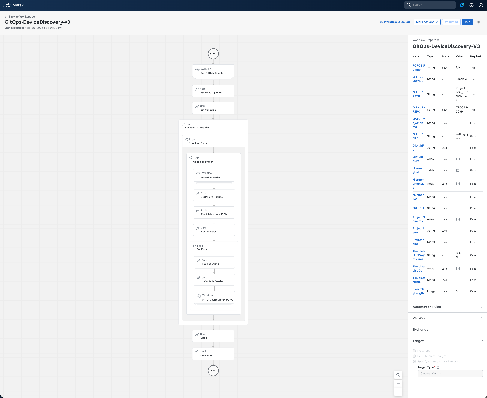
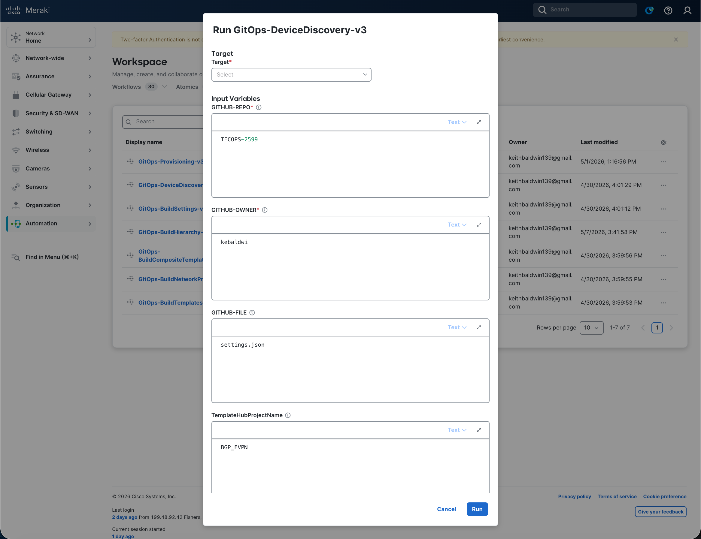
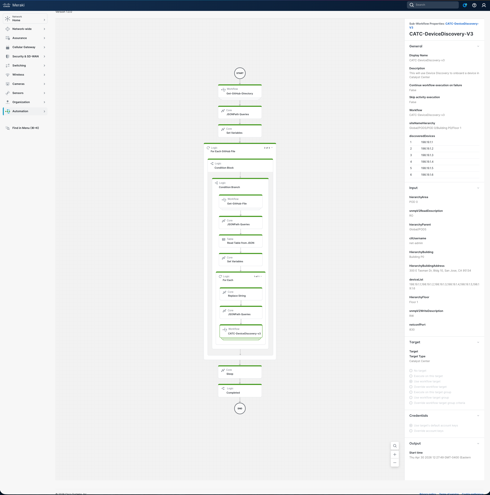

# Examine and Run Device Discovery Workflow

In this section we will open the **`GitOps-DeviceDiscovery`** workflow in the **Cisco Workflows** dashboard, walk through what it does, supply the input parameters, run it against Catalyst Center, and verify that every device listed in `settings.json` was discovered and assigned to its target site.

This workflow is the **third** in the GitOps provisioning suite and depends on the site hierarchy created by `GitOps-BuildHierarchy-v3` and the global credentials applied by `GitOps-BuildSettings-v3` in the previous modules. Every later module (Templates, Network Profiles, Provisioning) depends on the inventory it onboards.

## Overview Video

> 💡 Tip: Ctrl/Cmd + Click the thumbnail to open the video in a new tab.

## Examine the Workflow

The workflow follows the same GitOps pattern as the hierarchy and settings builds: read structured intent (`settings.json`) from GitHub, then drive the Catalyst Center Intent API to make reality match — but instead of creating sites or applying settings, it **discovers devices** by IP range and **assigns** them to the correct site in the inventory.

### High-level Steps

| # | Step | What Happens |
|---|------|--------------|
| 1 | **List GitHub directory** | `Get-GitHub-Directory-v2` → `GET api.github.com/repos/{owner}/{repo}/contents/{path}` |
| 2 | **Match target file** | JSONPath filters the listing for the file matching `GITHUB-FILE` |
| 3 | **Read `settings.json`** | `Get-GitHub-File-v2` → raw JSON pulled with `Accept: application/vnd.github.raw+json` |
| 4 | **Parse hierarchy table** | JSONPath + Read Table → one row per Parent / Area / Building / Floor; null values sanitised to `""` before per-row queries; 10 fields extracted per row (site path, CLI / SNMP / NETCONF lookup keys, `device_list`) |
| 5 | **Discover & Assign per row** | `CATC-DeviceDiscovery-v3` issues, in order: • `GET /dna/intent/api/v2/global-credential` (resolve UUIDs by username/description/port) • `GET /dna/intent/api/v1/dnac-release` (version-aware payload) • Python transform (`Single` / `Range` / `Multi Range` + `ip-ip` vs `ip–ip`) • `GET /api/v1/discovery/1/100` (duplicate detect by `siteNameHierarchy`) • `DELETE /dna/intent/api/v1/discovery/{id}` (if duplicate, then 8 s pause) • `POST /dna/intent/api/v1/discovery` (create job) • `GET /dna/intent/api/v1/task/{taskId}` (poll every 5 s), 180 s discovery settle wait • `GET /dna/intent/api/v1/discovery/{id}/network-device` (collect device UUIDs) • `GET /dna/intent/api/v2/site` (resolve `siteId`) • `POST /dna/intent/api/v1/networkDevices/assignToSite/apply` (assign devices) |
| 6 | **Return result** | Discovered devices and site assignments returned in workflow output, then a 30 s post-loop sleep allows Catalyst Center inventory to settle |

The full decision and loop structure (including the sub-flow that resolves credential UUIDs and the API invocation sequence) is shown below:

> Full workflow reference: [Support/Resources/Cisco Workflows/3.0-Cisco-Catalyst-Center-Device-Discovery-and-Assign/README.md](../../../Resources/Cisco%20Workflows/3.0-Cisco-Catalyst-Center-Device-Discovery-and-Assign/README.md)

### Why It's Safe to Re-run

Before creating a new discovery job, the workflow lists existing jobs (`GET /api/v1/discovery/1/100`) and searches for one whose name matches the target `siteNameHierarchy`. If a match is found, the existing job is deleted and a fresh one is created — this guarantees clean state on every run. Site assignment is idempotent: reassigning a device to its current site is a no-op in Catalyst Center. To force overwrite of any pre-existing discovery state, set `FORCE Update = true`.

> **Note:** Each discovery row takes approximately 3–4 minutes (180 s discovery settle plus task polling overhead). Plan accordingly if `settings.json` contains multiple rows.

## Open the Workflow in the Dashboard

1. From the Cisco Workflows dashboard, navigate to **Workflows** in the sidebar.

   

2. Locate **`GitOps-DeviceDiscovery`** in the workflow list and click to open it.
3. Review the canvas — you should see the six high-level activities listed above. Click any activity to inspect its **Properties** (input/output mapping, JSONPath queries, target accounts).

   

4. Drill into the `CATC-DeviceDiscovery-v3` sub-workflow to view the credential UUID resolution, version detection, Python transform, duplicate detection, task polling, and `assignToSite/apply` activities.

   

5. In the **Properties** panel of the workflow itself, confirm that the configured **Targets** include both:
    - **GitHub Target** (`api.github.com`) — set up in the orientation module
    - **Catalyst Center Target** (`https://198.18.129.100`) — set up in the orientation module

   - That matches

      

## Provide Input Parameters and Run

1. Click **Run** on the workflow. The input form opens.
2. Fill in (or accept the defaults for) the following parameters:

   

   | Parameter                | Value for this Lab           |
   |--------------------------|------------------------------|
   | `GITHUB-OWNER`           | `kebaldwi`                   |
   | `GITHUB-REPO`            | `TECOPS-2599`                |
   | `GITHUB-PATH`            | `Projects/BGP_EVPN/Settings` |
   | `GITHUB-FILE`            | `settings.json`              |
   | `FORCE Update`           | `false`                      |
   | `TemplateHubProjectName` | `BGP_EVPN`                   |

3. Click **Run** to start execution.

## Monitor the Execution

1. Open **More Actions → View Runs** for the workflow.
2. Click the most recent run to expand the **Execution Details** view.

   

3. Step through each activity and inspect its **Input** and **Output**:
    - **Step 1** — confirms a list of files was returned from the GitHub directory.
    - **Step 2** — confirms `settings.json` matched and the loop proceeded.
    - **Step 3** — shows the raw `settings.json` contents.
    - **Step 4** — shows the parsed table of hierarchy rows and the 10 fields extracted for the current row  (site path, `cli_username`, `snmp_v2c_read_description`, `snmp_v2c_write_description`, `netconf_port`, `deviceDiscoveryList`).
    - **Step 5** — shows, per row: • `GET /dna/intent/api/v2/global-credential` snapshot and the four resolved UUIDs (CLI, SNMPv2c R/W, NETCONF) • the detected Catalyst Center version • the Python-built `discoveryType` / `ipAddressList` • any duplicate-job `DELETE` • the `POST /dna/intent/api/v1/discovery` request and `taskId` • the polled task progress and resolved `discoveryId` • the 180 s discovery settle wait • the `GET /dna/intent/api/v1/discovery/{id}/network-device` device list • the resolved `siteId` • and the final `POST /dna/intent/api/v1/networkDevices/assignToSite/apply` assignment.
    - **Step 6** — workflow output reflects the discovered devices and site assignments; a 30 s post-loop sleep allows Catalyst Center inventory to settle.

A successful run reports each hierarchy row processed, with totals for discovered / assigned / errors at the end.

## Verify Discovery and Inventory in Catalyst Center

1. Open a browser and navigate to [**Catalyst Center**](https://198.18.129.100). If an SSL warning is displayed, click **Proceed to `https://198.18.129.100` (unsafe)** to continue.

   

2. Log in with:
    - **username:** `admin`
    - **password:** `C1sco12345`

   

3. When the Catalyst Center Dashboard is displayed, click the **&#8801;** icon to display the menu.

   

4. Select **Tools → Discovery** from the menu.

   

5. In the Discovery dashboard, locate the discovery job named after the  target `siteNameHierarchy` (e.g., `Global/PODS/POD 0/Building P0/Floor 1`).

   

6. Within that screen, you can select the named discovery job and look at its details.

   

7. From the menu, select **Provision → Network Devices → Inventory**. Expand the hierarchy on the left, navigate to the same Area / Building / Floor used in `settings.json`, and confirm:
    - Every device IP from `device_list` appears under the assigned site (not the **Unassigned** group).
    - Each device shows a **Reachability** of `Reachable` and a **Manageability** of `Managed`.
    - The site path shown for each device matches `Parent/Area/Building/Floor` exactly.

      

## Summary

You have used a Cisco Workflow — driven entirely from version-controlled JSON in GitHub — to discover every device listed in `settings.json` and assign each one to the correct site in Catalyst Center. No CSV files, no Postman runner, no per-site UI clicking. The same GitOps pattern (List → Read → Parse → Act → Verify) used for hierarchy and settings now applies to discovery, and will reappear in every subsequent module.

> [**Next Module**](../catc-catcenter-4-templates/01-intro.md)

> [**Return to LAB Menu**](../README.md)