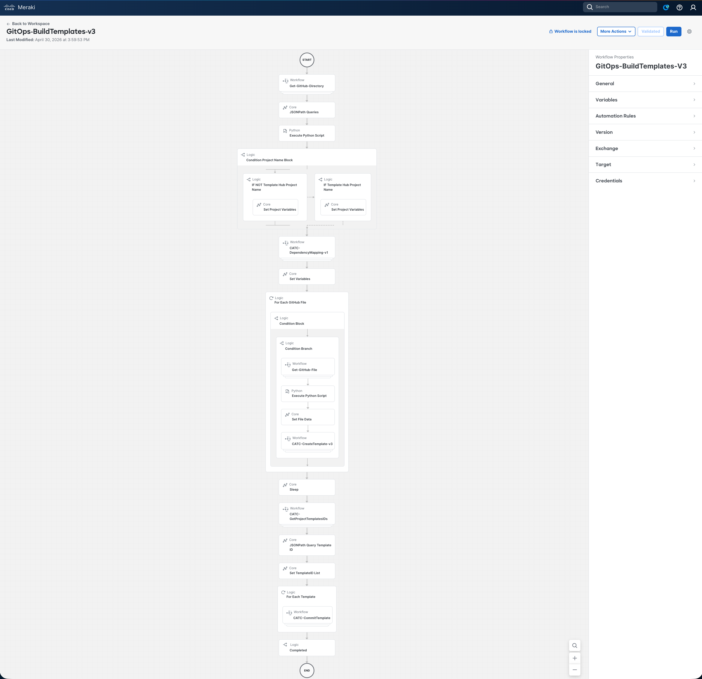
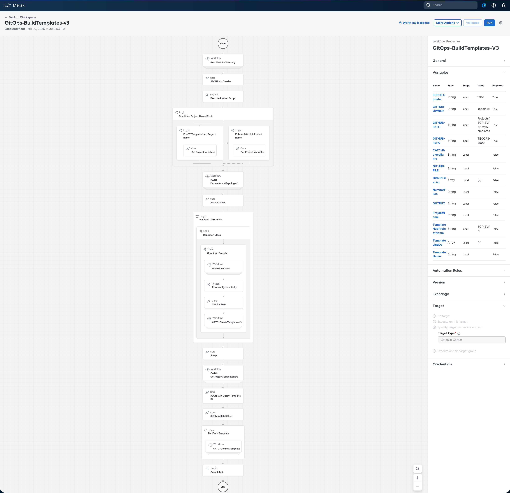
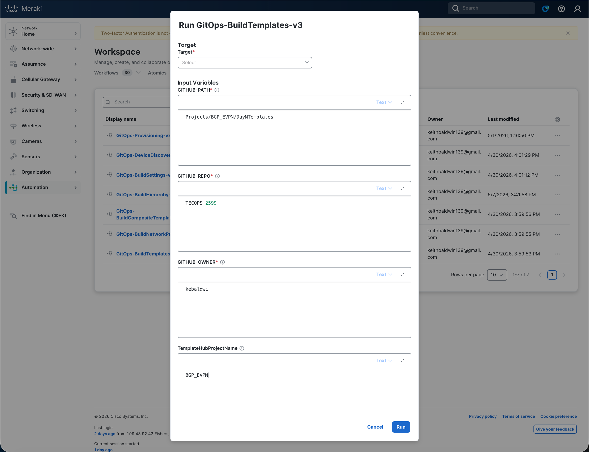
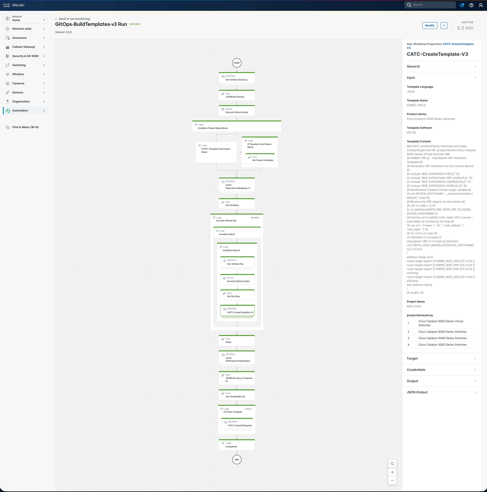
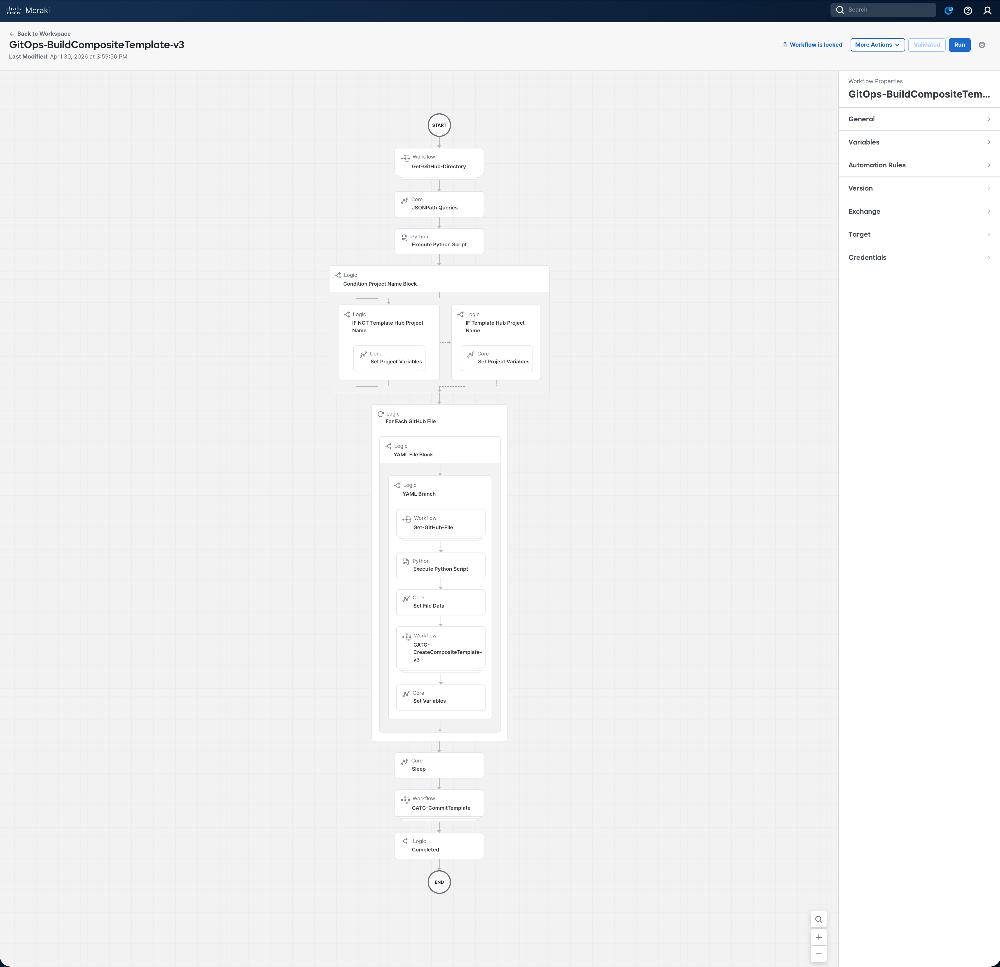
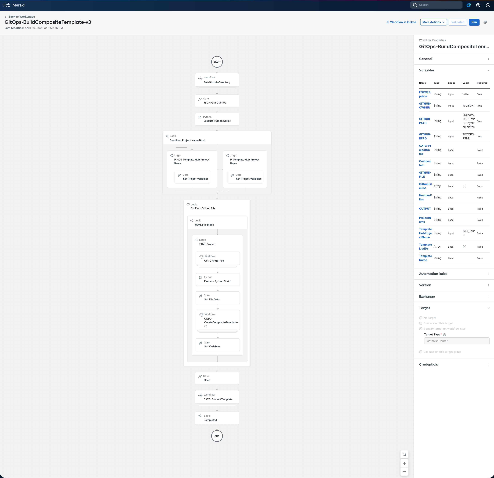
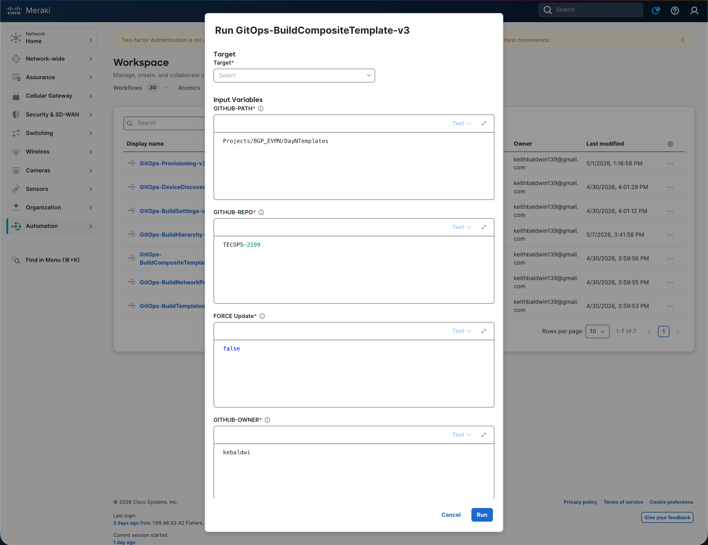
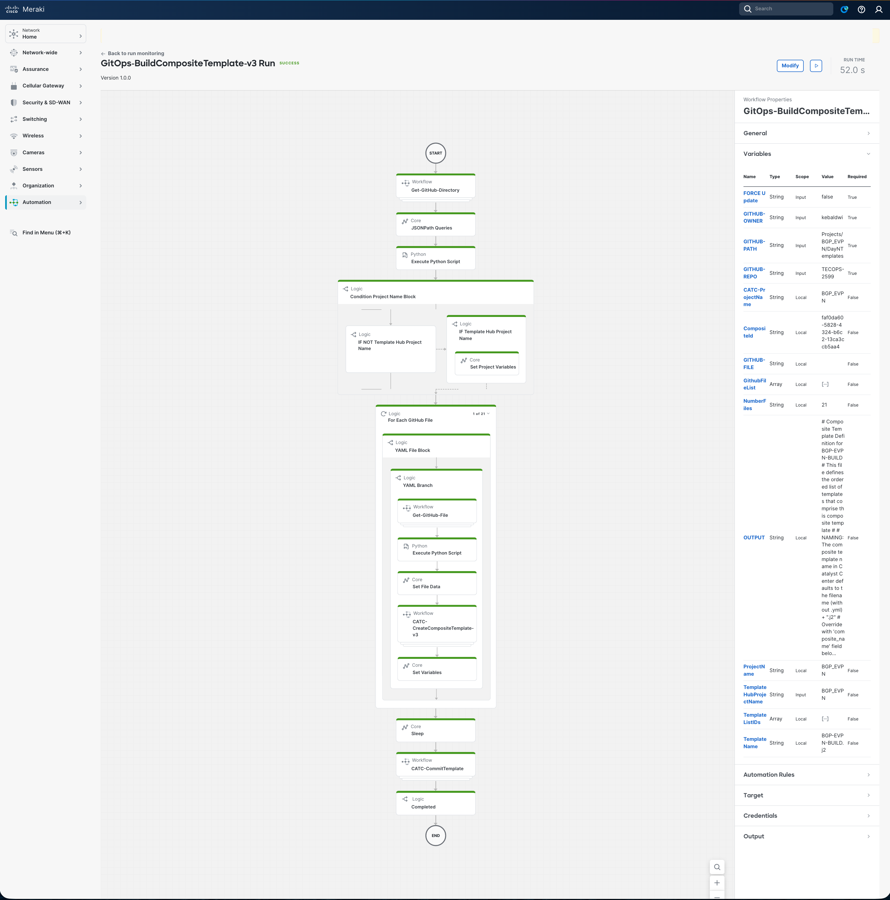
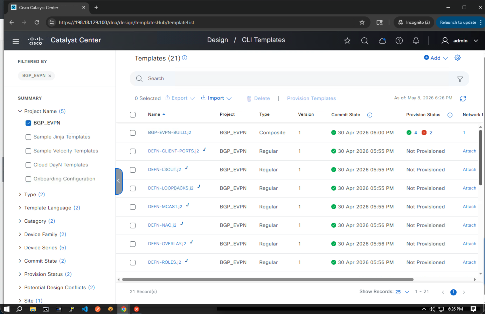

# Examine and Run the Templates Workflows

In this section we will open the **`GitOps-ImportTemplates`** workflow in the **Cisco Workflows** dashboard, walk through what it does, supply the input parameters, and run it against Catalyst Center to import every Jinja2 template under `Projects/BGP_EVPN/DayNTemplates` into the Template Hub project `BGP_EVPN`. We will then run **`GitOps-BuildCompositeTemplate`** against the same path to assemble those templates into a published composite template, and verify the result in Catalyst Center.

These workflows are the **fourth** and **fifth** in the GitOps provisioning suite. The import workflow depends only on the site hierarchy created by `GitOps-BuildHierarchy-v3`; the composite workflow depends on the import workflow having published every member template it references.

## Overview Video

> 💡 Tip: Ctrl/Cmd + Click the thumbnail to open the video in a new tab.

## Examine the Import Templates Workflow

The workflow follows the same GitOps pattern as the previous modules: read structured intent from GitHub, then drive the Catalyst Center Intent API to make reality match — but instead of creating sites, applying settings, or discovering devices, it **imports raw Jinja2/Velocity template files** directly into the Template Hub and **publishes** them.

### High-level Steps

| # | Step | What Happens |
|---|------|--------------|
| 1 | **List GitHub directory** | `Get-GitHub-Directory-v2` → `GET api.github.com/repos/{owner}/{repo}/contents/{path}` |
| 2 | **Project Name** | JSONPath extracts `NumberFiles` and `GithubFileList`; Python script derives `CATC-ProjectName` from the last segment of `GITHUB-PATH`; condition selects `TemplateHubProjectName` when supplied (`BGP_EVPN`) |
| 3 | **Dependency mapping** | `CATC-DependencyMapping-v1` retrieves every `.j2`/`.vm` file, parses `` / `#parse` references, builds a directed graph, and produces a topologically sorted `GithubFileList` so dependencies import first |
| 4 | **Filter & Read** | `For Each` over the reordered list; condition admits only `.j2` / `.vm` / `.json`; `Get-GitHub-File-v2` retrieves raw content with `Accept: application/vnd.github.raw+json` |
| 5 | **Substitute & Import** | Python replaces `{{ TEMPLATE_PROJECT_NAME }}` with the resolved `ProjectName`; `CATC-CreateTemplate-v3` calls: • `GET /dna/intent/api/v1/template-programmer/project?name={CATC-ProjectName}` (find or create project) • `GET /dna/intent/api/v1/template-programmer/project/{id}/template` (existence check) • `POST /dna/intent/api/v1/template-programmer/project/{id}/template` (create or skip when present and `FORCE Update = false`) |
| 6 | **Commit All** | After a 30 s settle, `CATC-GetProjectTemplatesIDs` collects every template ID; a `For Each` calls `CATC-CommitTemplate-v2` → `POST /dna/intent/api/v1/template-programmer/template/version` to publish every template (DRAFT → PUBLISHED) |

The full decision and loop structure (including the dependency mapping subgraph and the per-file processing sub-flow) is shown below:

> Full workflow reference: [Support/Resources/Cisco Workflows/4.0-Cisco-Catalyst-Center-Templates-Github-integration/README.md](../../../Resources/Cisco%20Workflows/4.0-Cisco-Catalyst-Center-Templates-Github-integration/README.md)

### Why It's Safe to Re-run

Before creating a template, `CATC-CreateTemplate-v3` calls `GET /dna/intent/api/v1/template-programmer/project/{id}/template` and skips templates that already exist when `FORCE Update = false`. Setting `FORCE Update = true` overwrites the existing template body with the current GitHub content and creates a new published version on commit. Either way, dependency-aware ordering and per-file idempotency mean re-running the workflow is non-destructive.

## Open the Import Templates Workflow in the Dashboard

1. From the Cisco Workflows dashboard, navigate to **Workflows** in the sidebar.

   

2. Locate **`GitOps-ImportTemplates`** in the workflow list and click to open it.
3. Review the canvas — you should see the six high-level activities listed above. Click any activity to inspect its **Properties** (input/output mapping, JSONPath queries, Python script, target accounts).

   

4. Drill into the per-file processing sub-flow to see the `Get-GitHub-File-v2`, placeholder substitution, `CATC-CreateTemplate-v3`, and the post-loop commit activities.

   

5. In the **Properties** panel of the workflow itself, confirm that the configured **Targets** include both:
    - **GitHub Target** (`api.github.com`) — set up in the orientation module
    - **Catalyst Center Target** (`https://198.18.129.100`) — set up in the orientation module

   - That matches

      

## Provide Input Parameters and Run

1. Click **Run** on the workflow. The input form opens.
2. Fill in (or accept the defaults for) the following parameters:

   

   | Parameter                | Value for this Lab                  |
   |--------------------------|-------------------------------------|
   | `GITHUB-OWNER`           | `kebaldwi`                          |
   | `GITHUB-REPO`            | `TECOPS-2599`                       |
   | `GITHUB-PATH`            | `Projects/BGP_EVPN/DayNTemplates`   |
   | `TemplateHubProjectName` | `BGP_EVPN`                          |
   | `FORCE Update`           | `false`                             |

3. Click **Run** to start execution.

## Monitor the Execution

1. Open **More Actions → View Runs** for the workflow.
2. Click the most recent run to expand the **Execution Details** view.

   

3. Step through each activity and inspect its **Input** and **Output**:
    - **Step 1** — confirms the GitHub directory listing was returned and the file count matches the `.j2` / `.yml` files in the repo path.
    - **Step 2** — shows `CATC-ProjectName` derived from `GITHUB-PATH` and the condition selecting the supplied `TemplateHubProjectName` (`BGP_EVPN`).
    - **Step 3** — `CATC-DependencyMapping-v1` output: the reordered `GithubFileList` with `DEFN-*` and other dependency templates ahead of the templates that include them.
    - **Step 4** — for each file, the extension filter decision (`.j2` / `.vm` / `.json` accepted; `.yml` / `.md` skipped) and the raw file content retrieved from GitHub.
    - **Step 5** — for each accepted file: the Python placeholder substitution (`{{ TEMPLATE_PROJECT_NAME }}` → `BGP_EVPN`), the `GET project` and `GET templates` results, and either the `POST` create or a `skip` when the template already exists with `FORCE Update = false`.
    - **Step 6** — the 30 s settle, the `CATC-GetProjectTemplatesIDs` JSONPath result (`TemplateListIDs`), and the per-template `POST template/version` commits taking each template from DRAFT to PUBLISHED.

A successful run reports each template imported and committed, with totals for created / skipped / committed at the end.

---

## Examine the Build Composite Template Workflow

With the regular templates published, we now build the **composite template** that bundles them into a single ordered configuration unit. The composite is what Network Profiles (module 5) and Provisioning (module 7) ultimately reference.

### High-level Steps

| # | Step | What Happens |
|---|------|--------------|
| 1 | **List GitHub directory** | `Get-GitHub-Directory-v2` → `GET api.github.com/repos/{owner}/{repo}/contents/{path}` |
| 2 | **Project Name** | Same Python-derived `CATC-ProjectName` + `TemplateHubProjectName` selection logic as the import workflow |
| 3 | **Filter `.yml`** | The `For Each` loop only processes files ending in `.yml`; `.j2` / `.vm` / `.md` files are silently skipped |
| 4 | **Read & Name** | `Get-GitHub-File-v2` retrieves the raw YAML composite definition; Python derives `TemplateName` by replacing `.yml` with `.j2` |
| 5 | **Resolve & Create** | `CATC-CreateCompositeTemplate-v3`: • `GET /dna/intent/api/v1/template-programmer/project?name={ProjectName}` (find or create project) • `GET /dna/intent/api/v1/template-programmer/project/{id}/template` (existence check) • Parse YAML `sequence`; for each member `GET /dna/intent/api/v1/template-programmer/template?name={memberTemplateName}` to resolve its UUID • `POST /dna/intent/api/v1/template-programmer/project/{id}/template` with `composite: true` and an ordered `containingTemplates` array (skipped when present and `FORCE Update = false`) • Returns `CompositeId` |
| 6 | **Commit Composite** | After a 30 s settle, `CATC-CommitTemplate-v2` → `POST /dna/intent/api/v1/template-programmer/template/version` publishes only the composite template just created |

The full decision and loop structure (including the YAML filter, member-ID resolution, and the per-composite create / commit sequence) is shown below:

> Full workflow reference: [Support/Resources/Cisco Workflows/5.0-Cisco-Catalyst-Center-Templates-Composite/README.md](../../../Resources/Cisco%20Workflows/5.0-Cisco-Catalyst-Center-Templates-Composite/README.md)

### Why It's Safe to Re-run

Before creating a composite, `CATC-CreateCompositeTemplate-v3` checks the project for an existing composite with the same name. When `FORCE Update = false`, the existing composite is skipped. When `FORCE Update = true`, member UUIDs are re-resolved against the current Template Hub state and the composite is rebuilt and re-committed (creating a new published version). This is the recommended way to refresh a composite after a member template has changed.

> **Important:** All member templates referenced in the YAML `sequence` must already exist **and be published** in the Template Hub before this workflow runs. The import workflow above performs both steps for every `.j2` file in the directory.

## Open the Build Composite Template Workflow in the Dashboard

1. From the Cisco Workflows dashboard, navigate to **Workflows** in the sidebar.
2. Locate **`GitOps-BuildCompositeTemplate`** in the workflow list and click to open it.
3. Review the canvas — you should see the six high-level activities listed above. Click any activity to inspect its **Properties**.

   

4. Drill into the `CATC-CreateCompositeTemplate-v3` sub-workflow to view the project lookup, existence check, YAML parse, per-member UUID resolution, and the composite `POST` activities.

   

## Provide Input Parameters and Run

1. Click **Run** on the workflow. The input form opens.
2. Fill in (or accept the defaults for) the following parameters:

   

   | Parameter                | Value for this Lab                  |
   |--------------------------|-------------------------------------|
   | `GITHUB-OWNER`           | `kebaldwi`                          |
   | `GITHUB-REPO`            | `TECOPS-2599`                       |
   | `GITHUB-PATH`            | `Projects/BGP_EVPN/DayNTemplates`   |
   | `TemplateHubProjectName` | `BGP_EVPN`                          |
   | `FORCE Update`           | `false`                             |

3. Click **Run** to start execution.

## Monitor the Composite Execution

1. Open **More Actions → View Runs** for the workflow.
2. Click the most recent run to expand the **Execution Details** view.

   

3. Step through each activity and inspect its **Input** and **Output**:
    - **Step 1** — confirms the GitHub directory listing was returned (mixed `.j2` and `.yml` files).
    - **Step 2** — shows the resolved `ProjectName` / `CATC-ProjectName` (`BGP_EVPN`).
    - **Step 3** — for each file, the `.yml` filter decision (`BGP-EVPN-BUILD.yml` accepted; all `.j2` files skipped).
    - **Step 4** — the raw YAML body returned from GitHub and the derived `TemplateName` (`BGP-EVPN-BUILD.j2`).
    - **Step 5** — the project lookup result, the existence check for the composite, the parsed YAML `sequence`, the `GET .../template?name=...` UUID resolution for every member, and the final `POST .../template` create with the ordered `containingTemplates` array. The returned `CompositeId` is stored in `CompositeId`.
    - **Step 6** — the 30 s settle and the `POST .../template/version` commit publishing the composite (DRAFT → PUBLISHED).

A successful run reports the composite template created and published.

## Verify Templates and Composite in Catalyst Center

1. Open a browser and navigate to [**Catalyst Center**](https://198.18.129.100). If an SSL warning is displayed, click **Proceed to `https://198.18.129.100` (unsafe)** to continue.

   

2. Log in with:
    - **username:** `admin`
    - **password:** `C1sco12345`

   

3. When the Catalyst Center Dashboard is displayed, click the **&#8801;** icon to display the menu.

   

4. Select **Tools → Template Hub** from the menu. 

   

5. Locate the **`BGP_EVPN`** project on the left and expand it to confirm:
    - Every `.j2` file from `Projects/BGP_EVPN/DayNTemplates` is listed as a regular template.
    - Each template shows status **Published** (committed). Templates still showing **Draft** indicate the commit step did not run for that template — re-run `GitOps-ImportTemplates` to publish them.
    - The `BGP-EVPN-BUILD.j2` composite template is present, with `Composite` indicated in its type, and shows status **Published**.

      

6. Click the composite template `BGP-EVPN-BUILD.j2` and review its **Containing Templates** tab. Confirm:
    - Each member template from the `sequence` in `BGP-EVPN-BUILD.yml` is present (`DEFN-CLIENT-PORTS.j2`, `DEFN-VRF.j2`, `FABRIC-EVPN.j2`, `FABRIC-NVE.j2`, `BGP-EVPN-BUILD.j2`).
    - Members are listed in the same order as the YAML `sequence`.
    - The device-type targeting includes the Catalyst 9000-series families.

## Summary

You have used two Cisco Workflows — driven entirely from version-controlled `.j2` and `.yml` files in GitHub — to import every Jinja2 template under `Projects/BGP_EVPN/DayNTemplates` into the Catalyst Center Template Hub project `BGP_EVPN`, publish them in dependency-safe order, and then assemble and publish the `BGP-EVPN-BUILD` composite template that bundles them into a single deployable unit. No copy-paste, no per-template UI clicking, no manual member-ID lookups. The same GitOps pattern (List → Read → Process → Act → Commit → Verify) used for hierarchy, settings, and discovery now applies to templates, and the composite produced here is the unit that Network Profiles and Provisioning will consume in the next modules.

> [**Next Module**](../catc-catcenter-5-networkprofiles/01-intro.md)

> [**Return to LAB Menu**](../README.md)