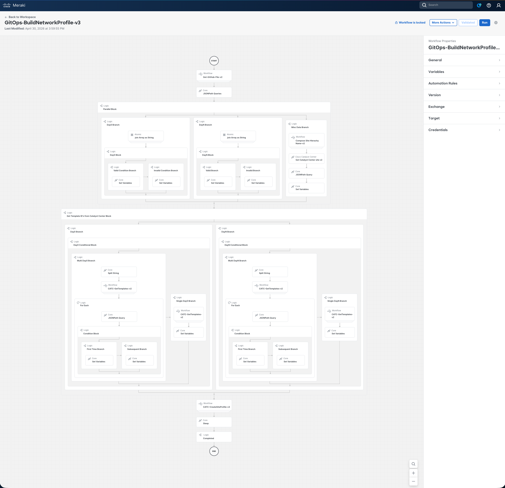
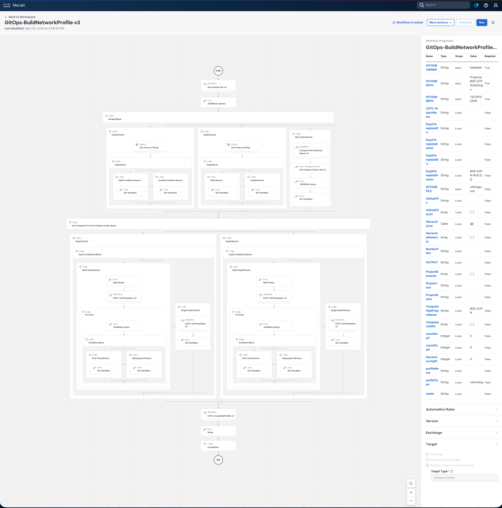
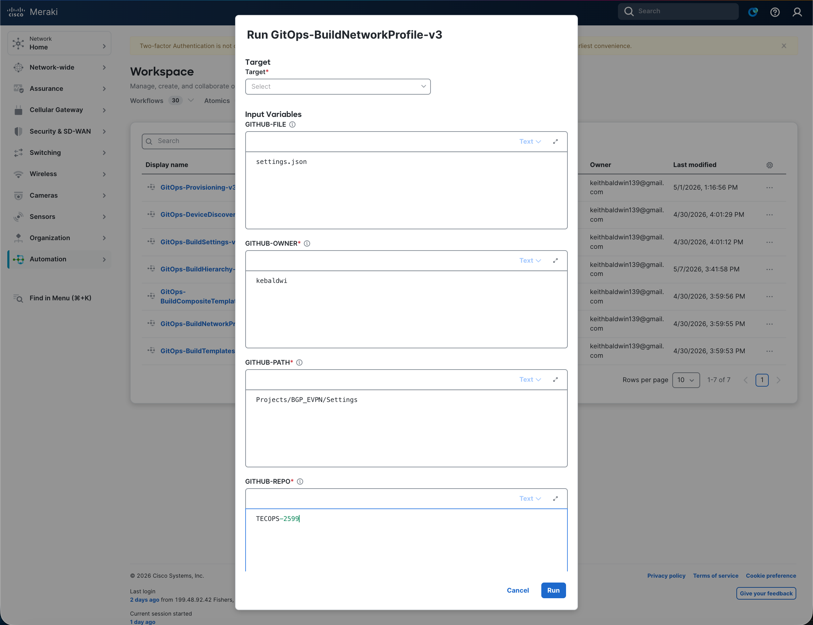
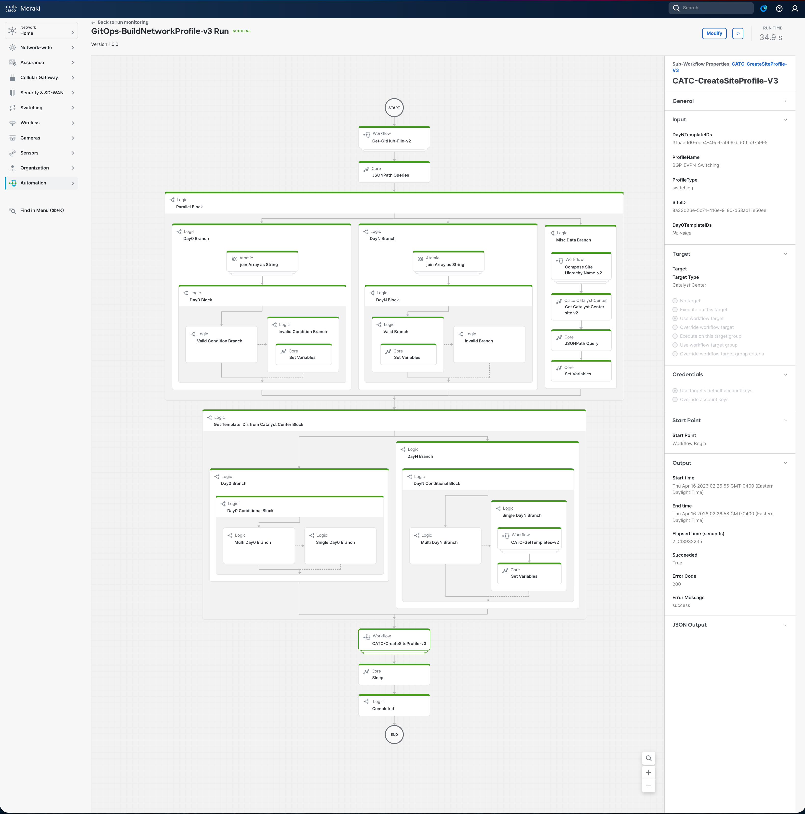

# Examine and Run the Network Profile Workflow

In this section we will open the **`GitOps-BuildNetworkProfile`** workflow in the **Cisco Workflows** dashboard, walk through what it does, supply the input parameters, run it against Catalyst Center, and verify that the switching network profile was created with the correct template assignment and bound to the target site.

This workflow is the **sixth** in the GitOps provisioning suite and depends on the site hierarchy created by `GitOps-BuildHierarchy-v3`, the network settings applied by `GitOps-BuildSettings-v3`, and the templates published by `GitOps-ImportTemplates` (and optionally the composite assembled by `GitOps-BuildCompositeTemplate`) in the previous modules. The provisioning module that follows depends on the profile this workflow assigns.

## Overview Video

> 💡 Tip: Ctrl/Cmd + Click the thumbnail to open the video in a new tab.

## Examine the Workflow

The workflow follows the same GitOps pattern as the previous modules: read structured intent (`settings.json`) from GitHub, then drive the Catalyst Center Intent API to make reality match — but instead of building hierarchy, applying settings, discovering devices, or importing templates, it **creates a switching profile** and **binds** it to a site.

### High-level Steps

| # | Step | What Happens |
|---|------|--------------|
| 1 | **Read `settings.json`** | `Get-GitHub-File-v2` → `GET api.github.com/repos/{owner}/{repo}/contents/{path}/{file}` with `Accept: application/vnd.github.raw+json` (no directory scan loop — the file is retrieved directly) |
| 2 | **Parse profile fields** | A single JSONPath query extracts 9 values: `HierarchyParent/Area/Bldg/Floor`, `ProfileName`, `DayNTemplates`, `Day0Templates`, `numberDayNTemplates`, `numberDay0Templates` |
| 3 | **Prepare (parallel)** | Three branches run simultaneously: • Join `Day0Templates` array → `Day0TemplateNames` (empty when null) • Join `DayNTemplates` array → `DayNTemplateNames` • Compose `siteNameHierarchy`, `GET /dna/intent/api/v2/site?groupNameHierarchy=…`, extract `siteId` |
| 4 | **Resolve template UUIDs (parallel)** | Two branches run simultaneously: • `CATC-GetTemplates-v2` resolves each Day0 name → `Day0TemplateIDs` (empty string when no Day0 template configured) • `CATC-GetTemplates-v2` resolves each DayN name → `DayNTemplateIDs` (handles single or comma-separated multi-template input) |
| 5 | **Create & assign profile** | `CATC-CreateSiteProfile-v3`: • `GET /dna/intent/api/v1/network-profile?name={ProfileName}&type=switching` (existence check) • `POST /dna/intent/api/v1/network-profile` (create switching profile with `templates.dayN.id` and, when present, `templates.day0.id`) • `GET /dna/intent/api/v1/network-profile/{profileId}/site` (verify current assignment) • `POST /dna/intent/api/v1/network-profile/{profileId}/site` with `{ "siteId": "<siteId>" }` (skipped when already assigned) |
| 6 | **Settle** | Top-level `Sleep 30 s` allows Catalyst Center to propagate the profile/site binding before downstream provisioning workflows begin |

The full decision and parallel-branch structure (including the per-template ID-resolution sub-flow and the four-step `CATC-CreateSiteProfile-v3` sequence) is shown below:

> Full workflow reference: [Support/Resources/Cisco Workflows/6.0-Cisco-Catalyst-Center-Network-Profile/README.md](../../../Resources/Cisco%20Workflows/6.0-Cisco-Catalyst-Center-Network-Profile/README.md)

### Why It's Safe to Re-run

Before creating the profile, `CATC-CreateSiteProfile-v3` calls `GET /dna/intent/api/v1/network-profile?name={ProfileName}&type=switching` and reuses the existing `profileId` if one is found. Before assigning the profile to the site, it calls `GET /dna/intent/api/v1/network-profile/{profileId}/site` and skips the `POST` if the binding is already present. Re-running the workflow with the same `settings.json` therefore produces no duplicate profiles and no duplicate site bindings.

> **Important:** Every template name listed under `network_profile.DayNTemplateNames` (and `Day0TemplateNames`, when non-null) must already exist **and be published** in the Template Hub. The previous module's `GitOps-ImportTemplates` workflow performs both steps for every `.j2` file in the source directory.

## Open the Workflow in the Dashboard

1. From the Cisco Workflows dashboard, navigate to **Workflows** in the sidebar.

   

2. Locate **`GitOps-BuildNetworkProfile`** in the workflow list and click to open it.
3. Review the canvas — you should see the six high-level activities listed above. Click any activity to inspect its **Properties** (input/output mapping, JSONPath queries, parallel branch composition, target accounts).

   

4. Drill into the `CATC-CreateSiteProfile-v3` sub-workflow to view the existence check, profile create `POST`, current-assignment check, and site-assignment `POST` activities.

   

5. In the **Properties** panel of the workflow itself, confirm that the configured **Targets** include both:
    - **GitHub Target** (`api.github.com`) — set up in the orientation module
    - **Catalyst Center Target** (`https://198.18.129.100`) — set up in the orientation module

   - That matches

      

## Provide Input Parameters and Run

1. Click **Run** on the workflow. The input form opens.
2. Fill in (or accept the defaults for) the following parameters:

   

   | Parameter                | Value for this Lab           |
   |--------------------------|------------------------------|
   | `GITHUB-OWNER`           | `kebaldwi`                   |
   | `GITHUB-REPO`            | `TECOPS-2599`                |
   | `GITHUB-PATH`            | `Projects/BGP_EVPN/Settings` |
   | `GITHUB-FILE`            | `settings.json`              |
   | `TemplateHubProjectName` | `BGP_EVPN`                   |

3. Click **Run** to start execution.

## Monitor the Execution

1. Open **More Actions → View Runs** for the workflow.
2. Click the most recent run to expand the **Execution Details** view.

   

3. Step through each activity and inspect its **Input** and **Output**:
    - **Step 1** — confirms `settings.json` was retrieved directly from the GitHub path.
    - **Step 2** — shows the JSONPath extraction:  `HierarchyParent`, `HierarchyArea`, `HierarchyBldg`, `HierarchyFloor`, `ProfileName`, `DayNTemplates`, `Day0Templates`, and the two count values.
    - **Step 3** — three parallel branches: • Day0 template name join (empty string when null in `settings.json`) • DayN template name join (`BGP-EVPN-BUILD.j2` for the lab example) • Composed `siteNameHierarchy` (`Global/PODS/POD x/Building Px/Floor 1`), `GET /dna/intent/api/v2/site` result, and the resolved `siteId`.
    - **Step 4** — two parallel branches: • `Day0TemplateIDs` empty when no Day0 template configured • `DayNTemplateIDs` resolved from `BGP-EVPN-BUILD.j2` to its Template Hub UUID.
    - **Step 5** — `CATC-CreateSiteProfile-v3` sequence: • `GET /dna/intent/api/v1/network-profile` existence check • `POST /dna/intent/api/v1/network-profile` create with the `templates.dayN.id` payload (and `templates.day0.id` when present) • `GET /dna/intent/api/v1/network-profile/{profileId}/site` current-assignment check • `POST /dna/intent/api/v1/network-profile/{profileId}/site` with `{ "siteId": "<siteId>" }`.
    - **Step 6** — the 30 s settle while Catalyst Center propagates the profile/site binding.

A successful run reports the profile name, the resolved `profileId`, the resolved `siteId`, and the assignment result.

## Verify the Network Profile in Catalyst Center

1. Open a browser and navigate to [**Catalyst Center**](https://198.18.129.100). If an SSL warning is displayed, click **Proceed to `https://198.18.129.100` (unsafe)** to continue.

   

2. Log in with:
    - **username:** `admin`
    - **password:** `C1sco12345`

   

3. When the Catalyst Center Dashboard is displayed, click the **&#8801;** icon to display the menu.

   

4. Select **Design → Network Profiles** from the menu. 

   

5. Locate the profile **`BGP-EVPN-Switching`** in the list and confirm:
    - **Type:** `Switching`.
    - **Sites Assigned:** at least one — the target site path from `settings.json` (e.g., `Global/PODS/POD 0/Building P0/Floor 1`).

   

6. Click the profile name to open its detail view. On the **Templates** tab, confirm:
    - The DayN template (`BGP-EVPN-BUILD.j2`) is attached.
    - When `Day0TemplateNames` was non-null in `settings.json`, the Day0 template is also attached; otherwise the Day0 slot is empty.
    - The **Sites** tab lists the same `siteNameHierarchy` resolved by Step 3 of the workflow.

   

## Summary

You have used a Cisco Workflow — driven entirely from version-controlled JSON in GitHub — to create a switching network profile in Catalyst Center, attach the published composite template as its DayN payload, and bind the profile to the correct site in the hierarchy. No per-profile UI clicking, no manual template-UUID lookups, no separate site-assignment screen. The same GitOps pattern (Read → Parse → Resolve → Act → Verify) used for hierarchy, settings, discovery, and templates now applies to network profiles, and the profile/site binding produced here is what makes the templates available for Day-N provisioning in the next module.

> [**Next Module**](../catc-catcenter-6-provisioning/01-intro.md)

> [**Return to LAB Menu**](../README.md)