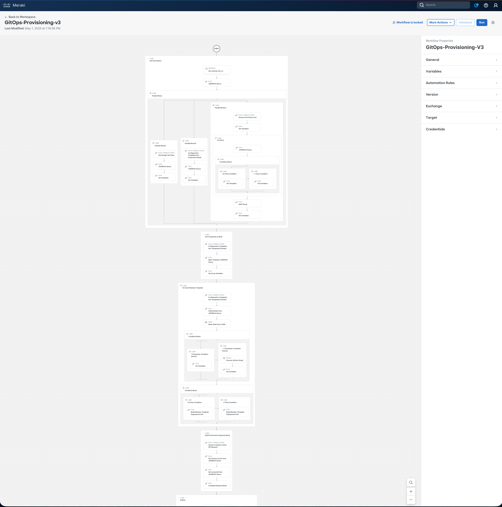
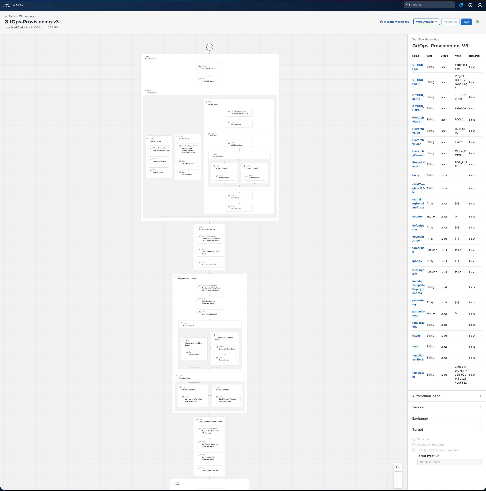
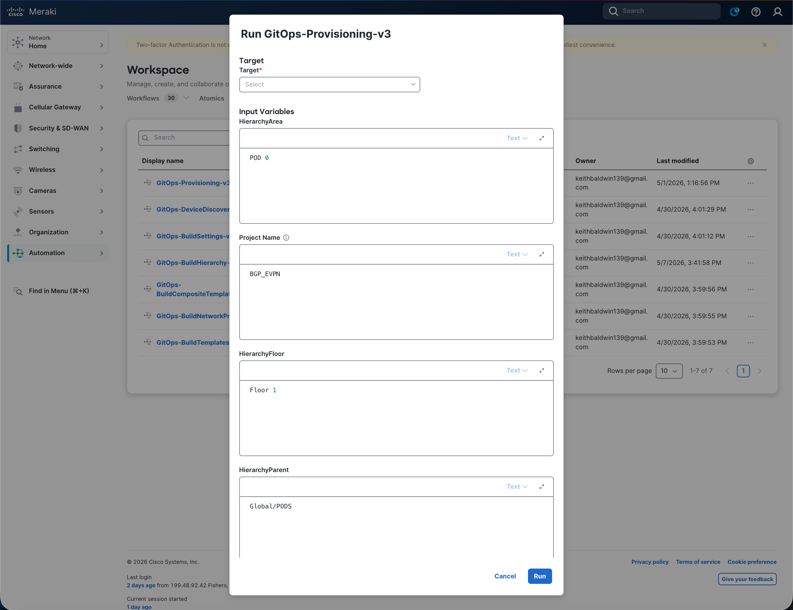
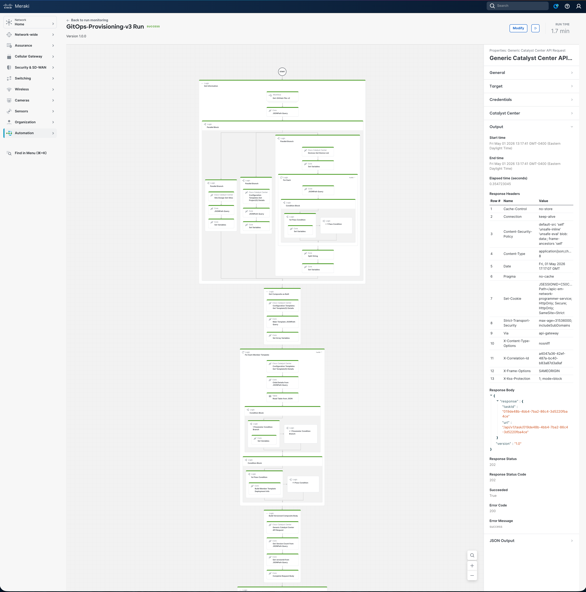

# Examine and Run the Device Provisioning Workflow

In this section we will open the **`GitOps-DeviceProvisioning`** workflow in the **Cisco Workflows** dashboard, walk through what it does, supply the input parameters, run it against Catalyst Center, and verify that every device in the `templateTarget` list was provisioned to the target site and that the composite template was deployed successfully.

This workflow is the **seventh and final** workflow in the GitOps provisioning suite and depends on every preceding module: the site hierarchy, network settings, device discovery, imported templates, the published composite template, and the assigned switching network profile.

## Overview Video

> 💡 Tip: Ctrl/Cmd + Click the thumbnail to open the video in a new tab.

## Examine the Workflow

The workflow follows the same GitOps pattern as the previous modules: read structured intent (`settings.json`) from GitHub, then drive the Catalyst Center Intent API to make reality match — but instead of building hierarchy, applying settings, discovering devices, importing templates, or creating profiles, it **provisions devices to their site** and **deploys the composite template** to each one.

### High-level Steps

| # | Step | What Happens |
|---|------|--------------|
| 1 | **Read `settings.json`** | `Get-GitHub-File-v2` → `GET api.github.com/repos/{owner}/{repo}/contents/{path}/{file}` with `Accept: application/vnd.github.raw+json` (no directory scan loop — the file is retrieved directly) |
| 2 | **Parse fields** | A JSONPath query extracts the hierarchy fields, the composite `templateName` (`BGP-EVPN-BUILD.j2`), and the `templateTarget` device IP array |
| 3 | **Resolve (parallel)** | Three branches run simultaneously: • `GET /dna/intent/api/v1/sites?nameHierarchy=…` → `siteId` • `GET /dna/intent/api/v2/template-programmer/project?name={Project Name}` → `compositeTemplateId` • `GET /dna/intent/api/v1/network-device` + per-IP JSONPath → ordered `deviceIdArray` |
| 4 | **Composite structure** | `GET /dna/intent/api/v2/template-programmer/template?id={compositeTemplateId}` → extract `containingTemplateIds` (member UUIDs in deployment order) |
| 5 | **Member loop** | For each member: `GET .../template?id={memberId}` → extract `templateParams` → build `{ paramName: defaultValue }` (Set Variables for ≤1 param, Python transform for >1) → accumulate `memberTemplateDeploymentInfo` with `**REPLACE_DEVICE_ID**` / `**REPLACE_DEVICE_HOSTNAME**` placeholders |
| 6 | **Versioned body** | `GET /dna/intent/api/v1/templates/{compositeTemplateId}/versions` → resolve latest `versionId`; assemble full deployment body with `isComposite=true`, `forcePushTemplate=true`, top-level `targetInfo` placeholder, and the per-member array |
| 7 | **Per-device loop** | For each device UUID: • Resolve hostname; substitute `**REPLACE_DEVICE_*` placeholders • `GET /dna/intent/api/v1/sda/provisionDevices` → if not provisioned: `POST` with `{ siteId, networkDeviceId }`; if already provisioned: `PUT` with `{ id, siteId, networkDeviceId }`; poll task • `POST /dna/intent/api/v2/template-programmer/template/deploy` with the device-specific body; poll task |

The full decision and loop structure (including the three-branch parallel resolution, the per-member parameter extraction, the composite body assembly, the per-device provision/deploy loop, and the first-time vs. re-provision branch) is shown below:

> Full workflow reference: [Support/Resources/Cisco Workflows/7.0-Cisco-Catalyst-Center-Provision-Composite/README.md](../../../Resources/Cisco%20Workflows/7.0-Cisco-Catalyst-Center-Provision-Composite/README.md)

### Why It's Safe to Re-run

For each device, `CATC` is queried (`GET /dna/intent/api/v1/sda/provisionDevices`) before provisioning. If the device is already provisioned to the site, the workflow takes the `PUT` re-provision path; otherwise it takes the `POST` first-time path. Either path is followed by task polling so the next step only begins when provisioning is complete. Template deployment always carries `forcePushTemplate: true`, which restores devices to the GitOps-defined state on every run (drift correction). Re-running with the same `settings.json` therefore produces no duplicate provisioning records and converges every device onto the latest committed composite version.

> **Important:** Every device IP listed under `network_profile.DayNTemplateNames[*].TemplateTarget` must already be in Catalyst Center inventory (assigned to the target site) and must be reachable over SSH/SNMP at deployment time. The composite template named in `DayNTemplateNames[*].TemplateName` must already be **published** in the Template Hub (committed in module 4) and the switching profile assigned to the site (module 5).

## Open the Workflow in the Dashboard

1. From the Cisco Workflows dashboard, navigate to **Workflows** in the sidebar.

   

2. Locate **`GitOps-DeviceProvisioning`** in the workflow list and click to open it.
3. Review the canvas — you should see the seven high-level activities listed above. Click any activity to inspect its **Properties** (input/output mapping, JSONPath queries, parallel branch composition, target accounts).

   

4. Drill into the per-device sub-flow to view the hostname resolution, placeholder substitution, SDA provisioning state check, the `POST` / `PUT` branch, and the composite `template/deploy` activities — each followed by `Wait For Catalyst Center Task`.

   

5. In the **Properties** panel of the workflow itself, confirm that the configured **Targets** include both:
    - **GitHub Target** (`api.github.com`) — set up in the orientation module
    - **Catalyst Center Target** (`https://198.18.129.100`) — set up in the orientation module

   - That matches

      

## Provide Input Parameters and Run

1. Click **Run** on the workflow. The input form opens.
2. Fill in (or accept the defaults for) the following parameters:

   

   | Parameter           | Value for this Lab            |
   |---------------------|-------------------------------|
   | `HierarchyParent`   | `Global/PODS`                 |
   | `HierarchyArea`     | `POD 0`                       |
   | `HierarchyBldg`     | `Building P0`                 |
   | `HierarchyFloor`    | `Floor 1`                     |
   | `Project Name`      | `BGP_EVPN`                    |
   | `GITHUB_USER`       | `kebaldwi`                    |
   | `GITHUB_REPO`       | `TECOPS-2599`                 |
   | `GITHUB_PATH`       | `Projects/BGP_EVPN/Settings`  |
   | `GITHUB_FILE`       | `settings.json`               |

3. Click **Run** to start execution.

> **Note:** Each device's provision + deploy cycle is sequential and includes task polling at both phases. For the six-device lab `templateTarget`, expect the run to take several minutes to complete.

## Monitor the Execution

1. Open **More Actions → View Runs** for the workflow.
2. Click the most recent run to expand the **Execution Details** view.

   

3. Step through each activity and inspect its **Input** and **Output**:
    - **Step 1** — confirms `settings.json` was retrieved directly from the GitHub path.
    - **Step 2** — shows the JSONPath extraction:  `HierarchyParent`, `HierarchyArea`, `HierarchyBldg`, `HierarchyFloor`, `templateName` (`BGP-EVPN-BUILD.j2`), and the `templateTarget` array.
    - **Step 3** — three parallel branches: • `GET /dna/intent/api/v1/sites` resolving `siteId` • `GET /dna/intent/api/v2/template-programmer/project` resolving `compositeTemplateId` • `GET /dna/intent/api/v1/network-device` + per-IP JSONPath assembling `deviceIdArray`.
    - **Step 4** — `GET /dna/intent/api/v2/template-programmer/template?id={compositeTemplateId}` and the extracted `containingTemplateIds` (member UUIDs in deployment order).
    - **Step 5** — for each member: the `GET .../template?id={memberId}` response, the `templateParams` table, the chosen Set-Variables-vs-Python branch, and the accumulated `memberTemplateDeploymentInfo` entry.
    - **Step 6** — `GET /dna/intent/api/v1/templates/{id}/versions` result, the resolved latest `versionId`, and the assembled `requestBody` showing `isComposite=true`, `forcePushTemplate=true`, the placeholder `targetInfo`, and the full member array.
    - **Step 7** — for each device: hostname resolution, the placeholder substitutions, the `GET sda/provisionDevices` decision (`POST` or `PUT`), the polled provisioning task, the `POST template/deploy` request, and the polled deployment task.

A successful run reports each device provisioned and the composite template deployed, with a per-device summary at the end.

## Verify Provisioning and Deployment in Catalyst Center

1. Open a browser and navigate to [**Catalyst Center**](https://198.18.129.100). If an SSL warning is displayed, click **Proceed to `https://198.18.129.100` (unsafe)** to continue.

   

2. Log in with:
    - **username:** `admin`
    - **password:** `C1sco12345`

   

3. When the Catalyst Center Dashboard is displayed, click the **&#8801;** icon to display the menu.

   

4. Select **Provision → Network Devices → Inventory** from the menu. 

   

5. Expand the hierarchy on the left to your target site (`Global/PODS/POD x/Building Px/Floor 1`) and confirm:
    - Every device IP from `templateTarget` appears under the assigned site (not **Unassigned**).
    - Each device shows **Provision Status** of `Success` and **Reachability** of `Reachable`.

   

6. Click a device hostname to open its detail view. Review the **Provisioning** tab and confirm the assigned site, the network profile (`BGP-EVPN-Switching`), and the deployed template version.

   

7. From the device detail view, open **Actions → Show Running Configuration** (or use **Tools → Command Runner** with `show running-config`) to confirm the lines from the composite template — VRFs, NVE / EVPN, BGP / loopback configuration — are present on the device.

   

## Summary

You have used a Cisco Workflow — driven entirely from version-controlled JSON in GitHub — to provision every device in `templateTarget` to its assigned site and deploy the latest committed version of the `BGP-EVPN-BUILD.j2` composite template to each device. No per-device UI clicking, no manual UUID lookups, no separate provisioning vs. deployment screens. The same GitOps pattern (Read → Parse → Resolve → Build → Act → Verify) used throughout the suite now applies to the final activation step — and because the workflow detects per-device provisioning state and uses `forcePushTemplate: true`, you can re-run it any time to converge devices onto the latest GitHub-defined intent.

This completes the Cisco Workflows lab. Hierarchy, settings, discovery, templates, network profile, and provisioning are now all driven from a single source of truth: `settings.json` and the templates next to it in the GitHub repository.

> [**Return to LAB Menu**](../README.md)