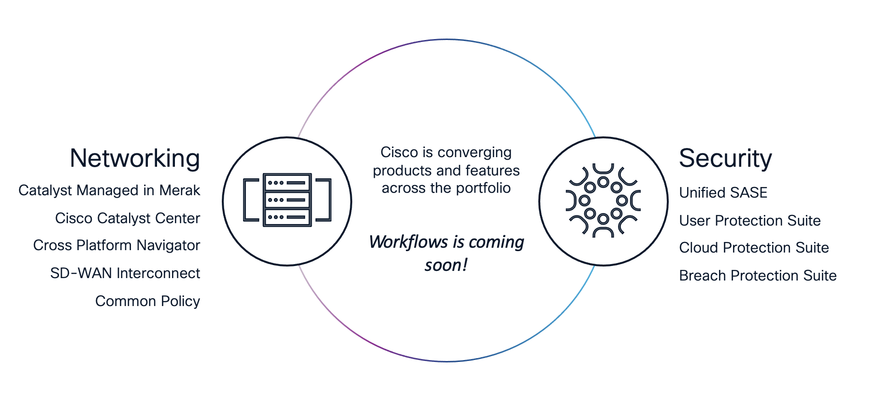

# TECOPS-2599 Labs

## Overview

This section of the repository contains hands-on labs that walk you through automating and orchestrating **Cisco Catalyst Center** end-to-end from a single source of truth in GitHub. Each lab follows the same GitOps pattern: structured intent (`settings.json` and Jinja2 templates) is read from a Git repository, parsed, and applied to Catalyst Center via the Intent API — first to build the design, then to discover, then to deploy templates, build network profiles, and finally to provision devices.

The goal is to give engineers a practical, repeatable path from an empty Catalyst Center to a fully provisioned fabric — all driven from version-controlled JSON.

## Lab Tracks

Two parallel tracks deliver the same seven-module story using different orchestration tooling. Pick the track that matches the toolchain you intend to use in production.

| Track | Tooling | Status | Entry Point |
|-------|---------|--------|-------------|
| **Ansible** | Catalyst Center Ansible Collection | In Development | [Ansible-Lab](./Ansible-Lab/README.md) |
| **Cisco Workflows** | Cisco Workflows | Current | [CiscoWorkflows-Lab](./CiscoWorkflows-Lab/README.md) |

> [!IMPORTANT]
> Lab content in this repository is aligned with a specific **Cisco DCLOUD** demonstration that has to be scheduled by either a **Cisco Employee** or a **Cisco Partner**. If you have trouble accessing the DCLOUD content, please contact your **Local Cisco Account Team**.

## Module Map

Both tracks follow the same seven-module story. The Cisco Workflows track is fully written; the Ansible track is being rewritten to match. Each module links to the lab walkthrough and to the underlying workflow / playbook reference under [Support/Resources](../Resources).

### Cisco Workflows Track

Reference index: [Support/Resources/Cisco Workflows/README.md](../Resources/Cisco%20Workflows/README.md)

| # | Module | Lab Walkthrough | Workflow Reference |
|---|--------|-----------------|--------------------|
| 0 | Orientation | [01-intro.md](./CiscoWorkflows-Lab/catc-catcenter-0-orientation/01-intro.md) | — |
| 1 | Building Hierarchy | [01-intro.md](./CiscoWorkflows-Lab/catc-catcenter-1-hierarchy/01-intro.md) | [1.0 Site Hierarchy](../Resources/Cisco%20Workflows/1.0-Cisco-Catalyst-Center-Site-Hierarchy/README.md) |
| 2 | Settings & Credentials | [01-intro.md](./CiscoWorkflows-Lab/catc-catcenter-2-settings/01-intro.md) | [2.0 Settings & Credentials](../Resources/Cisco%20Workflows/2.0-Cisco-Catalyst-Center-Settings-and-Credentials/README.md) |
| 3 | Device Discovery | [01-intro.md](./CiscoWorkflows-Lab/catc-catcenter-3-discovery/01-intro.md) | [3.0 Discovery & Assign](../Resources/Cisco%20Workflows/3.0-Cisco-Catalyst-Center-Device-Discovery-and-Assign/README.md) |
| 4 | Templates (Import + Composite) | [01-intro.md](./CiscoWorkflows-Lab/catc-catcenter-4-templates/01-intro.md) | [4.0 Templates GitHub](../Resources/Cisco%20Workflows/4.0-Cisco-Catalyst-Center-Templates-Github-integration/README.md) · [5.0 Composite Template](../Resources/Cisco%20Workflows/5.0-Cisco-Catalyst-Center-Templates-Composite/README.md) |
| 5 | Network Profiles | [01-intro.md](./CiscoWorkflows-Lab/catc-catcenter-5-networkprofiles/01-intro.md) | [6.0 Network Profile](../Resources/Cisco%20Workflows/6.0-Cisco-Catalyst-Center-Network-Profile/README.md) |
| 6 | Device Provisioning | [01-intro.md](./CiscoWorkflows-Lab/catc-catcenter-6-provisioning/01-intro.md) | [7.0 Provision Composite](../Resources/Cisco%20Workflows/7.0-Cisco-Catalyst-Center-Provision-Composite/README.md) |

### Ansible Track

Reference index: [Support/Resources/Ansible/README.md](../Resources/Ansible/README.md)

| # | Module | Lab Walkthrough | Playbook Reference |
|---|--------|-----------------|--------------------|
| 0 | Orientation | [01-intro.md](./Ansible-Lab/catc-catcenter-0-orientation/01-intro.md) | — |
| 1 | Building Hierarchy | [01-intro.md](./Ansible-Lab/catc-catcenter-1-hierarchy/01-intro.md) | [1.0 Site Hierarchy](../Resources/Ansible/1.0-Cisco-Catalyst-Center-Site-Hierarchy/README.md) |
| 2 | Settings & Credentials | [01-intro.md](./Ansible-Lab/catc-catcenter-2-settings/01-intro.md) | [2.0 Settings](../Resources/Ansible/2.0-Cisco-Catalyst-Center-Settings/README.md) · [3.0 Credentials](../Resources/Ansible/3.0-Cisco-Catalyst-Center-Credentials/README.md) |
| 3 | Device Discovery | [01-intro.md](./Ansible-Lab/catc-catcenter-3-discovery/01-intro.md) | [4.0 Device Discovery](../Resources/Ansible/4.0-Cisco-Catalyst-Center-Device-Discovery/README.md) · [5.0 Assign To Site](../Resources/Ansible/5.0-Cisco-Catalyst-Center-Assign-To-Site/README.md) |
| 4 | Templates (Import + Composite) | [01-intro.md](./Ansible-Lab/catc-catcenter-4-templates/01-intro.md) | [6.0 Templates GitHub](../Resources/Ansible/6.0-Cisco-Catalyst-Center-Templates-Github-integration/README.md) |
| 5 | Network Profiles | [01-intro.md](./Ansible-Lab/catc-catcenter-5-networkprofiles/01-intro.md) | [7.0 Network Profile](../Resources/Ansible/7.0-Cisco-Catalyst-Center-Network-Profile/README.md) |
| 6 | Device Provisioning | [01-intro.md](./Ansible-Lab/catc-catcenter-6-provisioning/01-intro.md) | [8.0 Provision Devices](../Resources/Ansible/8.0-Cisco-Catalyst-Center-Provision-Devices/README.md) · [9.0 Provision Composite](../Resources/Ansible/9.0-Cisco-Catalyst-Center-Provision-Composite/README.md) |

> Additional Ansible reference: [10.0 Backup My Configs](../Resources/Ansible/10.0-Backup-My-Configs/README.md) — companion playbook for archiving running configurations (no matching lab module).

## DCLOUD as a Lab

The labs run on top of the Cisco DCLOUD demo **Catalyst Center + ISE Lab for Automation & Orchestration**, which provides a fully built-out Catalyst Center, ISE, vSphere/ESXi, Windows AD, a script server, and CML-based virtual devices (Catalyst 8000v routers, Catalyst 9000v switches, Nexus 9000v switches).

DCLOUD allows access via web-based VPN-less browser client or via the Cisco AnyConnect VPN client. Sessions are hosted out of the Cisco San Jose and RTP facilities — choose the US East or US West region when scheduling. Adhere to DCLOUD best practices when using the environment.

> [!TIP]
> Before starting any module, walk through the [**DCLOUD Lab Preparation**](./DCLOUD.md) guide. It is the single source of truth for the topology, IP plan, credentials, VPN setup, and required client tools (AnyConnect, Postman, Google Chrome). Do not duplicate those values into the lab modules — link to DCLOUD.md instead.

## Disclaimer

These labs are intended for educational purposes only. Use of any material outside of a lab environment is at the operator's risk; Cisco assumes no liability for incorrect usage. Be careful when adapting lab steps to a production environment — actions such as setting DHCP option 43 server-wide or publishing a Catalyst Center sub-domain in production DNS will have effects beyond the lab pod.

> [!IMPORTANT]
> **Feedback:** If you found these labs helpful, please share comments via the [feedback form](https://github.com/kebaldwi/TECOPS-2599/discussions/new?category=feedback-and-ideas).  
> **Content Problems and Issues:** If you found a problem in a lab or in the content, please open an [issue](https://github.com/kebaldwi/TECOPS-2599/issues/new) and include the file path along with the issue you ran into.

> [**Return to Main Menu**](../../README.md)
