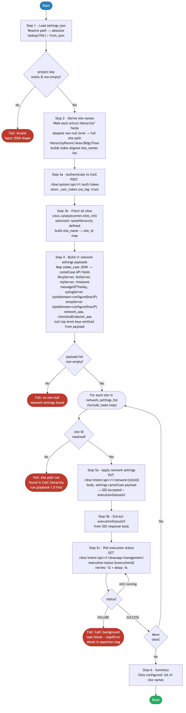

# 2.0 — Cisco Catalyst Center: Network Settings & Device Credentials Automation

> **Playbook:** `network_settings.yml`  
> **Included tasks:** `tasks/apply_network_settings.yml`  
> **Modules:** `cisco.catalystcenter.sites_info` (site ID resolution), `ansible.builtin.uri` (network settings — NCND01243 bypass), `cisco.catalystcenter.device_credential_workflow_manager` (credentials)  
> **Minimum Catalyst Center version:** 2.3.7.6  
> **Minimum Ansible version:** 2.15  
> **Authors:** Igor Manassypov — Systems Engineer (imanassy@cisco.com)  
> **Copyright © 2024–2026 Cisco Systems, Inc. All rights reserved.**

---

## Table of Contents

1. [Overview](#overview)
   - [Logical Flow](#logical-flow)
2. [Prerequisites](#prerequisites)
3. [Directory Structure](#directory-structure)
4. [Installation](#installation)
5. [Configuration](#configuration)
   - [Inventory](#inventory)
   - [Vault (Credentials)](#vault-credentials)
6. [Input Data Structure — `settings.json`](#input-data-structure--settingsjson)
   - [Top-Level Schema](#top-level-schema)
   - [The `network_settings` Block](#the-network_settings-block)
   - [The `device_credentials` Block](#the-device_credentials-block)
   - [The `assign_credentials` Block](#the-assign_credentials-block)
   - [Full Example](#full-example)
7. [Design Decision — Why Not `network_settings_workflow_manager`?](#design-decision--why-not-network_settings_workflow_manager)
8. [Playbook Walkthrough — Step by Step](#playbook-walkthrough--step-by-step)
   - [Step 1: Load and Validate Input Data](#step-1-load-and-validate-input-data)
   - [Step 2: Derive Site Names](#step-2-derive-site-names)
   - [Step 3: Authenticate and Resolve Site IDs](#step-3-authenticate-and-resolve-site-ids)
   - [Step 4: Build v2 Network Settings Payload](#step-4-build-v2-network-settings-payload)
   - [Step 5: Build Global Credential Payload](#step-5-build-global-credential-payload)
   - [Step 6: Build Credential Assignment Payload](#step-6-build-credential-assignment-payload)
   - [Step 7: Apply Network Settings via REST v2](#step-7-apply-network-settings-via-rest-v2)
   - [Step 8: Create/Update Global Device Credentials](#step-8-createupdate-global-device-credentials)
   - [Step 9: Assign Credentials to Sites](#step-9-assign-credentials-to-sites)
   - [Step 10: Summary](#step-10-summary)
9. [Data Transformation Reference](#data-transformation-reference)
10. [Running the Playbook](#running-the-playbook)
11. [Debug Mode](#debug-mode)
12. [Expected Output](#expected-output)
13. [Troubleshooting](#troubleshooting)

---

## Overview

This playbook applies **network infrastructure settings** (DNS, DHCP, NTP, SNMP, Syslog, AAA, banner) to individual sites in Cisco Catalyst Center, and simultaneously manages **global device credentials** (CLI, SNMPv2c, NETCONF) that allow Catalyst Center to communicate with discovered network devices.

Both operations are fully idempotent. If a setting already matches the desired state in CatC, the module will not re-push it.

### What it does

| Action | Mechanism |
|--------|-----------|
| Resolves all site paths → UUID map | `cisco.catalystcenter.sites_info` (Phase A — same pattern as playbook 1.0) |
| Applies DNS, DHCP, NTP, SNMP, Syslog, Banner, NetFlow, AAA per site | `ansible.builtin.uri` → `PUT /dna/intent/api/v1/network/{siteId}` (NCND01243 bypass) |
| Creates/updates global CLI, SNMPv2c R/O, SNMPv2c R/W, NETCONF credentials | `cisco.catalystcenter.device_credential_workflow_manager` |
| Assigns global credentials to designated sites | `cisco.catalystcenter.device_credential_workflow_manager` |

### Logical Flow

The diagram below shows every decision point and state transition from startup to completion:



> Source: [`DIAGRAMS/logical-flow.mmd`](DIAGRAMS/logical-flow.mmd) — re-render with `mmdc -i DIAGRAMS/logical-flow.mmd -o DIAGRAMS/logical-flow.png --scale 3`

### Playbook ordering dependency

This playbook must run **after** [1.0 — Site Hierarchy](../1.0-Cisco-Catalyst-Center-Site-Hierarchy/README.md). The site paths referenced in `settings.json` must already exist in CatC before network settings can be applied to them.

---

## Design Decision — Why Not `network_settings_workflow_manager`?

The `cisco.catalystcenter.network_settings_workflow_manager` Ansible module (and its legacy `cisco.dnac` counterpart) is the standard High Level Task (HLT) module for pushing network settings. It was intentionally **not** used for the network-settings step in this playbook due to a hard server-side constraint in Catalyst Center.

### Root Cause — CatC Error NCND01243

Catalyst Center enforces the following validation across all API paths including the module's internal endpoint:

> **NCND01243:** "If the network and endpoint AAA servers are using the same ISE PAN IP with RADIUS protocol, the sharedSecret for the sets cannot be different (aaa.network.server and aaa.endpoint.server)"

CatC maintains legacy `aaa.network.server.*` placeholder entries at the Global site level that cannot be cleared — they are permanent schema artefacts returned by `GET /dna/intent/api/v1/network` as empty strings. When **only** `client_and_endpoint_aaa` is submitted (with a `sharedSecret`) and `network_aaa` is absent, CatC compares the incoming endpoint `sharedSecret` against the empty placeholder in `aaa.network.server.1` and causes validation to fail.

### Why the module cannot work around it

The module source (`update_aaa_settings_for_site`) correctly sends only `aaaClient` when `network_aaa` is `None`:

```python
elif client_and_endpoint_aaa is not None:
    param = {"id": site_id, "aaaClient": client_and_endpoint_aaa}
```

This call resolves internally to `PUT /dna/intent/api/v1/sites/{id}/aaaSettings`, which triggers the same cross-check against the legacy v1 entries. The error is **not** a module bug — it is a CatC server-side invariant applied to that specific endpoint. The same behaviour applies to both `cisco.dnac` and `cisco.catalystcenter` versions of the workflow manager.

### Why `PUT /dna/intent/api/v1/network/{siteId}` solves it

The `PUT /dna/intent/api/v1/network/{siteId}` endpoint accepts a composite settings payload that covers DNS, NTP, SNMP, Syslog, AAA and all other network settings in a single call. Crucially, its server-side validation path does **not** perform the same cross-check between `clientAndEndpoint_aaa` and the legacy `aaa.network.server.*` placeholder entries. Sending only `clientAndEndpoint_aaa` (with `network_aaa` absent from the payload) succeeds without error.

### Summary

| Approach | AAA behaviour | NCND01243? |
|----------|---------------|------------|
| `cisco.catalystcenter.network_settings_workflow_manager` (or legacy `cisco.dnac`) with only `client_and_endpoint_aaa` | Sends `aaaClient` via `PUT /v1/sites/{id}/aaaSettings`; CatC cross-checks against empty legacy `aaaNetwork` placeholder | **Yes — fails** |
| `PUT /dna/intent/api/v1/network/{siteId}` with only `clientAndEndpoint_aaa` | Composite settings endpoint; validation path does not trigger the cross-check | **No — succeeds ✅** |

> **Verified (2026-03-17):** Playbook ran successfully with `network_aaa: null` in `settings.json` using `PUT /dna/intent/api/v1/network/{siteId}`. Result: `ok=17 changed=2 failed=0`. Only `client_and_endpoint_aaa` was present in the payload; no NCND01243 error was raised.
>
> **Operational note:** `network_aaa` can be set to `null` in `settings.json` when using `PUT /dna/intent/api/v1/network/{siteId}`. Only `client_and_endpoint_aaa` needs to be populated.

---

## Prerequisites

| Requirement | Version / Notes |
|-------------|----------------|
| Ansible | >= 2.15 |
| Python | >= 3.9 |
| `catalystcentersdk` | >= 2.3.7.9 |
| `cisco.catalystcenter` collection | 2.1.3 |
| `ansible.utils` collection | >= 2.11.0 (required by action plugins) |
| Cisco Catalyst Center | >= 2.3.7.6 |
| Site hierarchy | Must exist (run 1.0 first) |

---

## Directory Structure

```
2.0-Cisco-Catalyst-Center-Settings/
├── ansible.cfg                 # Ansible defaults (inventory path)
├── inventory.yml               # CatC connection (catc_*) + input file path
├── network_settings.yml        # Main playbook
├── tasks/
│   └── apply_network_settings.yml  # Per-site validate + PUT (NCND01243 bypass)
├── vault.yml                   # Ansible Vault encrypted credentials (git-ignored)
├── vault.yml.example           # Plain-text credential template
├── .vault_pass                 # Vault password file (git-ignored, chmod 600)
├── requirements.txt            # Python pip dependencies
├── requirements.yml            # Ansible Galaxy collection dependencies
└── DIAGRAMS/
    ├── logical-flow.mmd        # Mermaid source — re-render with mmdc
    └── logical-flow.png        # Rendered flowchart (referenced by README)
```

The playbook reads from the shared `settings.json` in the project tree:

```
Projects/
└── BGP_EVPN/
    └── Settings/
        └── settings.json       # Network settings + credentials input data
```

---

## Installation

```bash
pip install -r requirements.txt
ansible-galaxy collection install -r requirements.yml
echo 'your_vault_password' > .vault_pass && chmod 600 .vault_pass
```

---

## Configuration

### Inventory

**File:** `inventory.yml`

```yaml
all:
  hosts:
    catalyst_center:
      ansible_host: localhost
      ansible_connection: local
      ansible_python_interpreter: "{{ ansible_playbook_python }}"

      catc_host:    198.18.129.100
      catc_port:    443
      catc_version: "2.3.7.9"
      catc_verify:  false
      catc_debug:   false

      settings_json_path: "../../../../Projects/BGP_EVPN/Settings/settings.json"
```

| Variable | Purpose |
|----------|---------|
| `catc_host` | CatC hostname or IP |
| `catc_port` | API port (default 443) |
| `catc_version` | SDK version string — must be ≤ appliance version |
| `catc_verify` | SSL certificate verification (`false` for self-signed certs) |
| `catc_debug` | Enable verbose `catalystcentersdk` tracing |
| `settings_json_path` | Path to the `settings.json` input file (relative or absolute) |

> **Note:** `cisco.catalystcenter` does not support `dnac_log` / `dnac_log_level`. Set `catc_debug: true` for SDK-level tracing.

### Vault (Credentials)

```bash
cp vault.yml.example vault.yml
ansible-vault encrypt vault.yml --vault-password-file .vault_pass
```

`vault.yml.example`:

```yaml
catc_username: "admin"
catc_password: "your_catc_password_here"
```

---

## Input Data Structure — `settings.json`

### Top-Level Schema

```json
{
  "project": [
    {
      "HierarchyArea":   "<area name>",
      "HierarchyBldg":   "<building name or null>",
      "HierarchyFloor":  "<floor name or null>",
      "HierarchyParent": "<parent path>",
      "network_settings":  { ... },
      "device_credentials": { ... },
      "assign_credentials": { ... }
    }
  ]
}
```

The playbook derives the target **site path** from the four `Hierarchy*` fields and applies the three `*_settings`/`*_credentials` blocks to that site.

### Hierarchy Field → Site Path Resolution

The deepest non-null `Hierarchy*` field determines the target site path:

| Condition | Resulting site path |
|-----------|---------------------|
| `HierarchyFloor` is set | `HierarchyParent/HierarchyArea/HierarchyBldg/HierarchyFloor` |
| `HierarchyBldg` is set | `HierarchyParent/HierarchyArea/HierarchyBldg` |
| `HierarchyArea` is set | `HierarchyParent/HierarchyArea` |
| None set | `HierarchyParent` |

**Example:**

```json
{
  "HierarchyParent": "Global/PODS",
  "HierarchyArea":   "POD 0",
  "HierarchyBldg":   "Building P0",
  "HierarchyFloor":  null
}
```

Resolves to: `Global/PODS/POD 0/Building P0`

### The `network_settings` Block

All fields use **snake_case names** matching `settings.json`. They are mapped to camelCase before submission to `PUT /dna/intent/api/v1/network/{siteId}` (see [Step 4](#step-4-build-v1-network-settings-payload) for the full field mapping). Any top-level key whose value is `null` is omitted from the payload.

```json
"network_settings": {
  "dhcp_server":   ["198.18.133.1"],
  "dns_server": {
    "domain_name":          "dcloud.cisco.com",
    "primary_ip_address":   "198.18.133.1",
    "secondary_ip_address": null
  },
  "ntp_server": ["198.18.133.1"],
  "timezone": "America/Toronto",
  "message_of_the_day": {
    "banner_message":       "DNAC Template Lab P0!",
    "retain_existing_banner": false
  },
  "snmp_server": {
    "configure_dnac_ip": true
  },
  "syslog_server": {
    "configure_dnac_ip": true
  },
  "network_aaa": {
    "server_type":              "ISE",
    "primary_server_address":   "198.18.133.27",
    "pan_address":              "198.18.133.27",
    "protocol":                 "RADIUS",
    "secondary_server_address": null
  },
  "client_and_endpoint_aaa": {
    "server_type":              "ISE",
    "primary_server_address":   "198.18.133.27",
    "pan_address":              "198.18.133.27",
    "protocol":                 "RADIUS",
    "shared_secret":            "C1sco12345",
    "secondary_server_address": null
  }
}
```

| Sub-key | Purpose |
|---------|---------|
| `dhcp_server` | List of DHCP server IPs applied at the site |
| `dns_server` | Domain name + primary/secondary DNS |
| `ntp_server` | List of NTP server IPs |
| `timezone` | IANA timezone string for the site |
| `message_of_the_day` | Login banner + retain-existing flag |
| `snmp_server` | SNMP trap/inform configuration (auto-configure CatC IP) |
| `syslog_server` | Syslog destination (auto-configure CatC IP) |
| `network_aaa` | AAA for network device authentication |
| `client_and_endpoint_aaa` | AAA for endpoint/802.1X |

### The `device_credentials` Block

Defines the **global credentials** created in CatC and available to all discovery and provisioning operations. This structure maps directly to the `global_credential_details` schema of `device_credential_workflow_manager`.

```json
"device_credentials": {
  "cli_credential": [
    {
      "description":     "CLI-net-admin",
      "username":        "net-admin",
      "password":        "cisco",
      "enable_password": "cisco"
    }
  ],
  "snmp_v2c_read": [
    { "description": "RO", "read_community": "RO" }
  ],
  "snmp_v2c_write": [
    { "description": "RW", "write_community": "RO" }
  ],
  "netconf_credential": [
    { "description": "NETCONF-netadmin", "netconf_port": "830" }
  ]
}
```

### The `assign_credentials` Block

Associates the global credentials created above with a specific site. Maps directly to the `assign_credentials_to_site` schema.

```json
"assign_credentials": {
  "site_name": ["Global/PODS/POD 0/Building P0"],
  "cli_credential": {
    "description": "CLI-net-admin",
    "username":    "net-admin"
  },
  "snmp_v2c_read":  { "description": "RO" },
  "snmp_v2c_write": { "description": "RW" }
}
```

### Full Example

```json
{
  "project": [
    {
      "HierarchyArea":   "POD 0",
      "HierarchyBldg":   "Building P0",
      "HierarchyFloor":  null,
      "HierarchyParent": "Global/PODS",
      "network_settings": {
        "dhcp_server": ["198.18.133.1"],
        "dns_server": {
          "domain_name":        "dcloud.cisco.com",
          "primary_ip_address": "198.18.133.1"
        },
        "ntp_server":  ["198.18.133.1"],
        "timezone":    "America/Toronto",
        "message_of_the_day": {
          "banner_message":        "BGP EVPN Lab!",
          "retain_existing_banner": false
        },
        "snmp_server":   { "configure_dnac_ip": true },
        "syslog_server": { "configure_dnac_ip": true },
        "network_aaa": {
          "server_type":             "ISE",
          "primary_server_address":  "198.18.133.27",
          "pan_address":             "198.18.133.27",
          "protocol":                "RADIUS"
        },
        "client_and_endpoint_aaa": {
          "server_type":             "ISE",
          "primary_server_address":  "198.18.133.27",
          "pan_address":             "198.18.133.27",
          "protocol":                "RADIUS",
          "shared_secret":           "C1sco12345"
        }
      },
      "device_credentials": {
        "cli_credential":    [{ "description": "CLI-net-admin", "username": "net-admin", "password": "cisco", "enable_password": "cisco" }],
        "snmp_v2c_read":     [{ "description": "RO", "read_community": "RO" }],
        "snmp_v2c_write":    [{ "description": "RW", "write_community": "RO" }],
        "netconf_credential":[{ "description": "NETCONF-netadmin", "netconf_port": "830" }]
      },
      "assign_credentials": {
        "site_name": ["Global/PODS/POD 0/Building P0"],
        "cli_credential":  { "description": "CLI-net-admin", "username": "net-admin" },
        "snmp_v2c_read":   { "description": "RO" },
        "snmp_v2c_write":  { "description": "RW" }
      }
    }
  ]
}
```

---

## Playbook Walkthrough — Step by Step

### Step 1: Load and Validate Input Data

The path is resolved to absolute, then `lookup('file', _resolved_json_path) | from_json` reads and parses the JSON in one step. An `assert` task validates the shape before any processing begins.

### Step 2: Derive Site Names

**Purpose:** Build a `site_names` list that maps each `project` entry to its target CatC site path. This list is index-aligned with `settings_data.project` so `site_names[i]` is always the path for `project[i]`.

```jinja2

  
    
  
    
  
    
  
    
  
  

```

**Transformation example:**

```
Input entry:
  HierarchyParent: "Global/PODS"
  HierarchyArea:   "POD 0"
  HierarchyBldg:   "Building P0"
  HierarchyFloor:  null

Output site_names[0]: "Global/PODS/POD 0/Building P0"
```

### Step 3: Authenticate and Resolve Site IDs

**Step 3a — Auth token (for raw URI PUT only):**
`POST /dna/system/api/v1/auth/token` using the vault credentials (Basic Auth). The token is stored in `_catc_token` with `no_log: true`. It is used exclusively by the raw URI in `tasks/apply_network_settings.yml`. All `cisco.catalystcenter` module calls authenticate via the `module_defaults` block instead.

**Step 3b — Site ID map via `cisco.catalystcenter.sites_info` (Phase A):**
`cisco.catalystcenter.sites_info` is called without a name filter to return all sites — identical to the Phase A pattern used by playbook 1.0. The response key is `catalystcenter_response.response[]`. A Jinja2 `dict()` + `zip()` expression builds the map:

```jinja2
{{ dict(
     _all_sites_info.catalystcenter_response.response | default([])
     | map(attribute='siteNameHierarchy')
     | zip(_all_sites_info.catalystcenter_response.response | default([])
     | map(attribute='id'))
   ) }}
```

This replaces the legacy `GET /dna/intent/api/v1/site?limit=500` raw URI call with a properly paginating collection module call.

**Example output:**

```json
{
  "Global": "a4208f2a-...",
  "Global/PODS": "13b224f0-...",
  "Global/PODS/POD 0/Building P0": "2acb84d4-..."
}
```

### Step 4: Build v1 Network Settings Payload

**Purpose:** Walk each `network_settings` block and produce a **camelCase** payload matching the `PUT /dna/intent/api/v1/network/{siteId}` schema. Each field is only added to the payload when it is non-null in the JSON, so absent/null keys are never transmitted. `network_aaa` can be set to `null` and will be excluded, allowing `clientAndEndpoint_aaa` to be configured standalone (see [Design Decision](#design-decision--why-not-network_settings_workflow_manager)).

**Field mapping (settings.json → v1 API):**

| `settings.json` key | v1 API camelCase key |
|---------------------|---------------------|
| `dhcp_server` | `dhcpServer` |
| `dns_server.domain_name` | `dnsServer.domainName` |
| `dns_server.primary_ip_address` | `dnsServer.primaryIpAddress` |
| `dns_server.secondary_ip_address` | `dnsServer.secondaryIpAddress` |
| `ntp_server` | `ntpServer` |
| `timezone` | `timezone` |
| `message_of_the_day.banner_message` | `messageOfTheday.bannerMessage` |
| `message_of_the_day.retain_existing_banner` | `messageOfTheday.retainExistingBanner` |
| `snmp_server.configure_dnac_ip` | `snmpServer.configureDnacIP` |
| `syslog_server.configure_dnac_ip` | `syslogServer.configureDnacIP` |
| `network_aaa.server_type` | `network_aaa.servers` |
| `network_aaa.primary_server_address` | `network_aaa.ipAddress` |
| `network_aaa.pan_address` | `network_aaa.network` |
| `network_aaa.protocol` | `network_aaa.protocol` |
| `network_aaa.shared_secret` | `network_aaa.sharedSecret` |
| `client_and_endpoint_aaa.server_type` | `clientAndEndpoint_aaa.servers` |
| `client_and_endpoint_aaa.primary_server_address` | `clientAndEndpoint_aaa.ipAddress` |
| `client_and_endpoint_aaa.pan_address` | `clientAndEndpoint_aaa.network` |
| `client_and_endpoint_aaa.protocol` | `clientAndEndpoint_aaa.protocol` |
| `client_and_endpoint_aaa.shared_secret` | `clientAndEndpoint_aaa.sharedSecret` |

The site UUID resolved in Step 3 is embedded as `site_id` alongside the payload for use in the REST URL.

### Step 5: Build Global Credential Payload

**Purpose:** Extract entries that have a non-null `device_credentials` block and wrap each in the `global_credential_details` envelope expected by the module.

```jinja2

  

```

**Output example:**

```yaml
credential_list:
  - global_credential_details:
      cli_credential:
        - description: CLI-net-admin
          username: net-admin
          password: cisco
          enable_password: cisco
      snmp_v2c_read:
        - description: RO
          read_community: RO
      snmp_v2c_write:
        - description: RW
          write_community: RO
      netconf_credential:
        - description: NETCONF-netadmin
          netconf_port: "830"
```

### Step 6: Build Credential Assignment Payload

**Purpose:** Extract entries that have a non-null `assign_credentials` block and wrap each in the `assign_credentials_to_site` envelope.

```yaml
credential_assign_list:
  - assign_credentials_to_site:
      site_name:
        - "Global/PODS/POD 0/Building P0"
      cli_credential:
        description: CLI-net-admin
        username: net-admin
      snmp_v2c_read:
        description: RO
      snmp_v2c_write:
        description: RW
```

### Step 7: Apply Network Settings via include_tasks

`include_tasks: tasks/apply_network_settings.yml` is used with a loop over `network_settings_list` instead of a plain `loop:` on an inline task file. This mirrors the 1.0 pattern in `tasks/create_or_update_site.yml` — `set_fact` inside `include_tasks` takes effect between iterations, unlike `set_fact` inside a plain `loop:`.

Each call to `apply_network_settings.yml`:
1. Asserts the site UUID is non-empty (fast-fail if site path not found in Phase A)
2. Issues `PUT /dna/intent/api/v1/network/{siteId}` via `ansible.builtin.uri` with the `_catc_token` from Step 3a

```yaml
- name: "Apply network settings  | {{ site_config.site_name }}"
  include_tasks: tasks/apply_network_settings.yml
  loop: "{{ network_settings_list }}"
  loop_control:
    loop_var: site_config
    label: "{{ site_config.site_name }}"
```

Using `ansible.builtin.uri` gives complete control over the request body — only keys that are non-null in `settings.json` appear in the payload. This is what allows `network_aaa: null`: the key is simply absent from the PUT body, and the composite endpoint does not cross-check it against the legacy `aaa.network.server.*` placeholders (see [Design Decision](#design-decision--why-not-network_settings_workflow_manager)).

### Step 8: Create/Update Global Device Credentials

```yaml
- name: Create/update global device credentials
  cisco.catalystcenter.device_credential_workflow_manager:
    state: merged
    config:
      - "{{ item }}"
  loop: "{{ credential_list }}"
  when: credential_list | length > 0
```

This step is automatically skipped when no entries in the JSON have a `device_credentials` block. Authentication is injected by `module_defaults`.

### Step 9: Assign Credentials to Sites

```yaml
- name: Assign credentials per site
  cisco.catalystcenter.device_credential_workflow_manager:
    state: merged
    config:
      - "{{ item }}"
  loop: "{{ credential_assign_list }}"
  when: credential_assign_list | length > 0
```

The `device_credential_workflow_manager` module handles both credential creation (Step 8) and assignment (Step 9) — they are distinguished by the presence of `global_credential_details` vs. `assign_credentials_to_site` in the `config` payload.

### Step 10: Summary

```yaml
- name: Settings synchronization complete
  debug:
    msg:
      - "Network settings applied successfully"
      - "Sites configured: {{ network_settings_list | map(attribute='site_name') | list | join(', ') }}"
      - "Global credential sets created: {{ credential_list | length }}"
      - "Site credential assignments: {{ credential_assign_list | length }}"
```

---

## Data Transformation Reference

```
settings.json
└── project[]
    ├── HierarchyParent/Area/Bldg/Floor fields
    │         │
    │         ▼ Step 2 — deepest non-null path resolution
    │   site_names[i] = "Global/PODS/POD 0/Building P0"
    │
    ├── network_settings (null/absent fields omitted per-key)
    │         │
    │         ▼ Step 3 — auth token + GET /dna/intent/api/v1/site → site UUID map
    │         ▼ Step 4 — snake_case→camelCase mapping, site_id injected
    │   network_settings_list[i] = {site_name, site_id, settings: {camelCase...}}
    │
    ├── device_credentials
    │         │
    │         ▼ Step 5 — wrap in global_credential_details
    │   credential_list[i] = {global_credential_details: {...}}
    │
    └── assign_credentials
              │
              ▼ Step 6 — wrap in assign_credentials_to_site
        credential_assign_list[i] = {assign_credentials_to_site: {...}}

              │
              ▼ Steps 7-9 — API calls
    ansible.builtin.uri (tasks/apply_network_settings.yml) → PUT /dna/intent/api/v1/network/{siteId}
    cisco.catalystcenter.device_credential_workflow_manager → POST /dna/intent/api/v1/global-credential
    cisco.catalystcenter.device_credential_workflow_manager → POST /dna/intent/api/v1/credential-to-site/{siteId}
```

---

## Running the Playbook

### Apply settings from the default path

```bash
ansible-playbook network_settings.yml --vault-password-file .vault_pass
```

### Override the input file at runtime

```bash
ansible-playbook network_settings.yml \
  --vault-password-file .vault_pass \
  -e settings_json_path=/absolute/path/to/settings.json
```

### Enable debug output

Set `catc_debug: true` in `inventory.yml`, or override at runtime:

```bash
ansible-playbook network_settings.yml --vault-password-file .vault_pass -e catc_debug=true
```

---

## Debug Mode

Set `catc_debug: true` in `inventory.yml` (or pass `-e catc_debug=true` at runtime) to enable debug tasks after each build step. This also enables verbose `catalystcentersdk` tracing in the collection modules.

| Debug Task | Shows |
|-----------|-------|
| `DEBUG \| Resolved JSON path` | The absolute path resolved from `settings_json_path` |
| `DEBUG \| settings_data (raw JSON)` | Full parsed JSON input |
| `DEBUG \| Site names derived from settings.json` | The `site_names` list |
| `DEBUG \| _all_sites_info (raw)` | Full `sites_info` module response |
| `DEBUG \| Site name-to-ID map` | The `_site_id_map` dict (siteNameHierarchy → UUID) |
| `DEBUG \| v1 network settings payload list` | The full `network_settings_list` with camelCase keys and `site_id` |
| `DEBUG \| Global credential payload list` | The full `credential_list` |
| `DEBUG \| Credential assignment payload list` | The full `credential_assign_list` |
| `DEBUG \| site_config` (per-site) | Site name, UUID, and camelCase settings payload |
| `DEBUG \| Apply result` (per-site) | Raw `uri` response from the PUT call |
| `DEBUG \| Credential create results` | Raw module return from Step 8 |
| `DEBUG \| Credential assignment results` | Raw module return from Step 9 |

---

## Expected Output

```
TASK [Validate that project key exists in input data] **************************
ok: [catalyst_center] => { "msg": "Input data loaded — 1 entries found." }

TASK [Validate network settings list is non-empty] *****************************
ok: [catalyst_center] => { "msg": "1 site(s) have settings to apply." }

TASK [Authenticate with Catalyst Center] ***************************************
ok: [catalyst_center]

TASK [Phase A — Fetch all sites from Catalyst Center] **************************
ok: [catalyst_center]

TASK [apply_network_settings.yml : Validate site ID resolved | Global/PODS/POD 0/Building P0] ***
ok: [catalyst_center]

TASK [apply_network_settings.yml : Apply network settings  | Global/PODS/POD 0/Building P0] ***
ok: [catalyst_center]

TASK [Create/update global device credentials] *********************************
changed: [catalyst_center]

TASK [Assign credentials per site] *********************************************
changed: [catalyst_center]

TASK [Settings synchronization complete] ***************************************
ok: [catalyst_center] => {
    "msg": [
        "Network settings applied successfully",
        "Sites configured: Global/PODS/POD 0/Building P0",
        "Global credential sets created: 1",
        "Site credential assignments: 1"
    ]
}

PLAY RECAP *********************************************************************
catalyst_center : ok=17  changed=2  unreachable=0  failed=0  skipped=0
```

`skipped=0` — debug tasks are now guarded by `catc_debug | default(false) | bool` (inventory variable), so there are no env-var-based conditionals to skip.

---

## Troubleshooting

| Symptom | Likely Cause | Resolution |
|---------|-------------|------------|
| `Site not found` | Site path does not exist in CatC | Run playbook 1.0 first to create the hierarchy |
| `null value for required field` | A settings sub-key has `null` where CatC expects a value | Remove the key entirely from the JSON (null filtering only removes top-level keys) |
| `Credential already exists` | Same description, different password | Module is idempotent — it will update to the new password |
| `Credential assignment failed` | Credential description not found globally | Ensure Step 7 (credential creation) succeeded before Step 8 runs |
| `AAA shared_secret missing` | `client_and_endpoint_aaa` block has no `shared_secret` | Add `shared_secret` to the `client_and_endpoint_aaa` block |
| `NCND01243: sharedSecret cannot be different` | Using `network_settings_workflow_manager` which routes through `PUT /v1/sites/{id}/aaaSettings` — that endpoint cross-checks `clientAndEndpoint_aaa.sharedSecret` against the legacy `aaa.network.server.*` placeholder at Global | Switch to `PUT /dna/intent/api/v1/network/{siteId}` (this playbook already does this) and set `network_aaa: null` in `settings.json` |
| `Timezone invalid` | Non-standard timezone string | Use an IANA string, e.g. `America/Toronto`, `UTC`, `America/Los_Angeles` |
| `catc_version mismatch` | SDK version exceeds appliance version | Set `catc_version: "2.3.7.9"` in `inventory.yml` |
| TLS errors | Self-signed certificate | Set `catc_verify: false` for lab environments |
