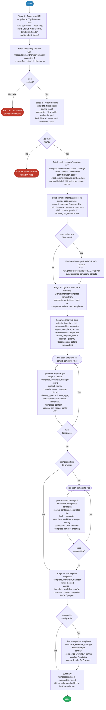

# 6.0 — Cisco Catalyst Center: Template GitHub Sync

> **Playbook:** `ansible-git-catc.yml`  
> **Task files:** `process-template.yml`, `process-composite.yml`  
> **Module (CatC):** `cisco.dnac.template_workflow_manager`  
> **Module (GitHub):** `ansible.builtin.uri`  
> **Minimum Catalyst Center version:** 2.3.7.6  
> **Minimum Ansible version:** 2.15  
> **Authors:** Igor Manassypov — Systems Engineer (imanassy@cisco.com)  
> **Copyright © 2024–2026 Cisco Systems, Inc. All rights reserved.**

---

## Table of Contents

1. [Overview](#overview)
2. [Prerequisites](#prerequisites)
3. [Directory Structure](#directory-structure)
4. [Installation](#installation)
5. [Configuration](#configuration)
   - [Inventory Variables](#inventory-variables)
   - [Vault — Encrypted Credentials](#vault--encrypted-credentials)
6. [Repository Layout — What the Playbook Reads](#repository-layout--what-the-playbook-reads)
   - [Template Naming Conventions](#template-naming-conventions)
   - [Composite Definition Files (.yml)](#composite-definition-files-yml)
   - [Cross-Template Includes](#cross-template-includes)
7. [How It Works](#how-it-works)
   - [Logical Flow Diagram](#logical-flow-diagram)
   - [Stage 1 — Pre-flight Checks & Fetch Repository Tree](#stage-1--pre-flight-checks--fetch-repository-tree)
   - [Stage 2 — Fetch File Contents & Commit Metadata](#stage-2--fetch-file-contents--commit-metadata)
   - [Stage 3 — Dynamic Template Ordering](#stage-3--dynamic-template-ordering)
   - [Stage 4 — Build Workflow Configurations](#stage-4--build-workflow-configurations)
   - [Stage 5 — Sync to Catalyst Center](#stage-5--sync-to-catalyst-center)
8. [Task File Reference](#task-file-reference)
   - [process-template.yml](#process-templateyml)
   - [process-composite.yml](#process-compositeyml)
9. [API Payload Reference](#api-payload-reference)
10. [Running the Playbook](#running-the-playbook)
11. [Debug Mode](#debug-mode)
12. [Expected Output](#expected-output)
13. [Playbook Ordering Dependency](#playbook-ordering-dependency)
14. [Troubleshooting](#troubleshooting)

---

## Overview

This playbook implements a **general-purpose GitOps workflow** for Cisco Catalyst Center template management. It can synchronize **any collection of Jinja2 templates** stored in a GitHub repository — simple flat collections, modular libraries, or fully nested composite templates — directly to a Catalyst Center Template Project without requiring a local clone.

Point the playbook at any GitHub repository subfolder containing `.j2` files and it will fetch the content, enrich each template with Git commit metadata, determine the correct processing order, and sync everything to CatC. No code changes are needed to switch between different template collections.

> **About the BGP EVPN example used throughout this document:**  
> The working example in this playbook is the [CatalystCenter-BGP-EVPN-VXLAN](https://github.com/imanassypov/CatalystCenter-BGP-EVPN-VXLAN) template collection. It is used here because it exercises the full range of playbook capabilities — particularly **composite (nested) templates** where one top-level template wraps an ordered set of member templates, and **cross-template Jinja2 includes** where configuration templates pull in shared data-definition and macro-library files at render time. A simpler flat template collection (just `.j2` files, no `.yml` composite definitions) works identically with zero additional configuration.

### What It Does

| Capability | Description |
|---|---|
| **No local clone** | All content fetched at runtime via the GitHub REST API and raw content URLs |
| **Idempotent sync** | `state: merged` — creates templates that don't exist yet; updates those that have changed |
| **Automatic ordering** | Template processing order derived from composite definitions — no hard-coded lists to maintain |
| **Composite templates** | Builds ordered multi-template composites with full `containingTemplates` resolution |
| **Git metadata in CatC** | Commit timestamp, message, and author written to the template description field in CatC |
| **Optional diff headers** | Git patch embedded as Jinja2 comments (`{## ... ##}`) at the top of each template |
| **Private repo support** | Optional `git_token` for authenticated API calls (also raises rate limits from 60 to 5,000/hr) |

---

## API Endpoints and Modules Summary

### Modules Summary

| Platform | Module | Purpose in this playbook | Module Docs |
|---|---|---|---|
| Cisco Catalyst Center | cisco.dnac.template_workflow_manager | Create or update template and composite template objects in CatC | cisco.dnac 6.46.0: [template_workflow_manager](https://galaxy.ansible.com/ui/repo/published/cisco/dnac/content/module/template_workflow_manager/) |
| GitHub API | ansible.builtin.uri | Repository verification, branch checks, tree listing, file/commit/diff fetch | ansible-core: [uri](https://docs.ansible.com/ansible/latest/collections/ansible/builtin/uri_module.html) |

### Endpoint Summary by Phase

| Phase | HTTP | Endpoint | Why it is used | API Docs |
|---|---|---|---|---|
| Repository access check | GET | https://api.github.com/repos/{owner}/{repo} | Validate repository exists and token access is valid | GitHub REST: [Repositories API](https://docs.github.com/en/rest/repos/repos) |
| Branch validation | GET | https://api.github.com/repos/{owner}/{repo}/branches/{branch} | Confirm requested branch is available | GitHub REST: [Branches API](https://docs.github.com/en/rest/branches/branches) |
| Tree discovery | GET | https://api.github.com/repos/{owner}/{repo}/git/trees/{branch}?recursive=1 | Enumerate candidate template and composite files | GitHub REST: [Git trees API](https://docs.github.com/en/rest/git/trees) |
| Raw template/composite content | GET | https://raw.githubusercontent.com/{owner}/{repo}/{branch}/{path} | Pull source template text used for CatC sync | GitHub docs: [Raw file URLs](https://docs.github.com/en/repositories/working-with-files/using-files/viewing-and-understanding-files#viewing-or-copying-the-raw-file-content) |
| Commit metadata and diff | GET | https://api.github.com/repos/{owner}/{repo}/commits?... | Build template summary metadata and optional diff header | GitHub REST: [Commits API](https://docs.github.com/en/rest/commits/commits) |
| CatC template sync | module-managed | Template-programmer endpoints used by template_workflow_manager | Apply merged template/composite state in target CatC project | CatC 2.3.7.9: [API Reference](https://developer.cisco.com/docs/catalyst-center/2-3-7-9/cisco-catalyst-center-2-3-7-9-api-overview) |

### Notes

- GitHub calls are direct uri tasks; Catalyst Center writes are module-managed.
- The section above lists the primary endpoint families used by the workflow stages.

## Prerequisites

| Requirement | Version | Where to Get It |
|---|---|---|
| Python | ≥ 3.9 | [python.org](https://www.python.org) |
| Ansible | ≥ 2.15 | `pip install ansible` |
| `cisco.dnac` Ansible collection | 6.46.0 (tested) | `ansible-galaxy collection install -r requirements.yml` |
| `community.general` collection | ≥ 8.0 | Same `requirements.yml` |
| `dnacentersdk` Python SDK | ≥ 2.8.6 | `pip install -r requirements.txt` |
| Cisco Catalyst Center | ≥ 2.3.7.6 | — |
| GitHub repository | public or private | — |

---

## Directory Structure

```
6.0-Cisco-Catalyst-Center-Templates-Github-integration/
├── ansible.cfg              # Sets inventory = inventory.yml (no -i flag needed)
├── ansible-git-catc.yml     # Main playbook — 5-stage GitOps sync
├── process-template.yml     # Included task: builds one regular template config
├── process-composite.yml    # Included task: builds one composite template config
├── inventory.yml            # CatC connection + Git repo parameters
├── vault.yml                # Encrypted credentials (gitignored, never commit plain)
├── vault.yml.example        # Vault template — safe to commit
├── requirements.txt         # Python package dependencies
├── requirements.yml         # Ansible Galaxy collection dependencies
└── DIAGRAMS/
    ├── logical-flow.mmd     # Mermaid flowchart source
    └── logical-flow.png     # Rendered diagram (embedded below)
```

---

## Installation

```bash
# 1. Activate your Python virtual environment
cd 6.0-Cisco-Catalyst-Center-Templates-Github-integration/
source ../.venv/bin/activate      # adjust path as needed

# 2. Install Python dependencies
pip install -r requirements.txt

# 3. Install Ansible Galaxy collections
ansible-galaxy collection install -r requirements.yml

# 4. Fix directory permissions (one-time — Ansible ignores ansible.cfg in world-writable dirs)
chmod o-w .

# 5. Set up vault credentials (see Configuration section below)
cp vault.yml.example vault.yml
# Edit vault.yml, then encrypt it:
ansible-vault encrypt vault.yml
echo 'your_vault_password_here' > .vault_pass
chmod 600 .vault_pass
```

---

## Configuration

### Inventory Variables

All parameters live in `inventory.yml`. Nothing is hard-coded in the playbook.

#### Catalyst Center Connection

These variables authenticate to the CatC REST API via the `cisco.dnac` collection:

| Variable | Example | Description |
|---|---|---|
| `dnac_host` | `198.18.129.100` | CatC management IP or hostname |
| `dnac_port` | `443` | HTTPS port (default: 443) |
| `dnac_version` | `2.3.7.9` | CatC version — controls which SDK API paths are used. Set to the highest version that the SDK knows, even if your appliance is newer. |
| `dnac_verify` | `false` | Set `true` for production (requires a trusted cert). `false` disables TLS verification for lab. |
| `dnac_debug` | `true` | Enables SDK debug output to `dnac.log` |
| `dnac_log_level` | `INFO` | Log verbosity: `DEBUG`, `INFO`, `WARNING`, `ERROR` |
| `dnac_log` | `true` | Writes SDK log to `dnac.log` in the playbook directory |

#### GitHub Repository

| Variable | Example | Description |
|---|---|---|
| `git_repo` | `https://github.com/org/repo.git` | Full GitHub repository URL |
| `git_branch` | `main` | Branch to read templates from |
| `git_repo_subfolder` | `BGP EVPN` | Subfolder within the repo to scan for `.j2` and `.yml` files. Leave blank to scan the entire repository root. |
| `git_api_base_url` | `https://api.github.com` | Override for GitHub Enterprise instances |

> **Note on `git_token`:** This variable is intentionally absent from `inventory.yml` and defined only in `vault.yml`. See the [Vault section](#vault--encrypted-credentials) below.

#### Catalyst Center Project

| Variable | Example | Description |
|---|---|---|
| `projectName` | `Building P0` | CatC project where templates are created or updated. If not set, the playbook derives it from the subfolder name (`dirname` of the first template path). |

#### Template Defaults

These values are applied to every template created in CatC:

| Variable | Default | Description |
|---|---|---|
| `template_extension` | `j2` | File extension to treat as templates. Change to `j2` only — do not use `jinja`. |
| `include_diff_header` | `false` | When `true`, embeds the last git diff patch as `{## ... ##}` Jinja comments at the top of each template for traceability |
| `default_software_type` | `IOS` | Maps to `softwareType` in the CatC template API |
| `default_software_variant` | `XE` | Maps to `softwareVariant` — `XE`, `XR`, or `NX` |
| `default_template_version` | `1.0` | Version label written to CatC. Does not auto-increment. |
| `catc_template_summary_maxchar` | `1024` | Maximum length (characters) of the template description field in CatC. Git commit messages are truncated to this length. |
| `default_device_types` | *(list — see below)* | List of device families and series that can use these templates. Must match what CatC knows about your devices. |

**`default_device_types` structure:**

```yaml
default_device_types:
  - product_family: "Switches and Hubs"
    product_series: "Cisco Catalyst 9500 Series Switches"
  - product_family: "Switches and Hubs"
    product_series: "Cisco Catalyst 9000 Series Virtual Switches"
  - product_family: "Switches and Hubs"
    product_series: "Cisco Catalyst 9300 Series Switches"
  - product_family: "Switches and Hubs"
    product_series: "Cisco Catalyst 9400 Series Switches"
```

> Both `product_family` and `product_series` must be provided for every entry — partial objects cause a CatC API validation error.

---

### Vault — Encrypted Credentials

Credentials are stored in `vault.yml` and **never committed in plain text**. The vault is automatically loaded by the playbook via `vars_files: [vault.yml]`.

#### vault.yml contents

```yaml
dnac_username: "admin"
dnac_password: "your_catc_password"
# git_token: "ghp_yourGitHubPersonalAccessToken"
```

> **`git_token` — important for reliability**
>
> Without a token, GitHub limits unauthenticated API requests to **60/hour per IP**. With a token, the limit is **5,000/hour**. Even for public repos, always set the token to avoid rate-limit failures during runs with many templates.
>
> For **private repos** the token is required — unauthenticated access returns 404.
>
> Generate one at [github.com/settings/tokens](https://github.com/settings/tokens):
> - Public repos → `public_repo` (read) scope
> - Private repos → `repo` scope

#### Vault operations

```bash
# Create and encrypt (first time)
cp vault.yml.example vault.yml
# edit vault.yml with your values
ansible-vault encrypt vault.yml --vault-password-file .vault_pass

# Edit an existing encrypted vault (stays encrypted on disk)
EDITOR=nano ansible-vault edit vault.yml --vault-password-file .vault_pass

# View without editing
ansible-vault view vault.yml --vault-password-file .vault_pass
```

---

## Repository Layout — What the Playbook Reads

The playbook scans one git repository subfolder for two file types:

| File type | Pattern | Purpose |
|---|---|---|
| Template files | `*.j2` | Jinja2 templates pushed as individual templates to CatC |
| Composite definitions | `*.yml` | YAML files that define composite template membership and order |

### Template Naming Conventions

The BGP EVPN template set uses a three-tier naming structure that directly maps to the processing order:

| Prefix | Role | CatC template type | Included in composite `.yml`? |
|---|---|---|---|
| `DEFN-*.j2` | **Data definitions** — sets Jinja2 variables (VRF names, loopback IPs, VNI ranges, etc.) | Regular | ❌ No — included via `` inside FABRIC templates at *render* time |
| `FUNC-*.j2` | **Macro libraries** — reusable Jinja2 macros and functions | Regular | ❌ No — same as DEFN |
| `FABRIC-*.j2` | **Top-level config templates** — render actual IOS-XE configuration pushed to devices | Regular | ✅ Yes — listed as members in the composite `.yml` |

**Current template set (BGP EVPN project — 20 templates + 1 composite):**

```
# Data definitions (DEFN-*) — 9 templates
DEFN-CLIENT-PORTS.j2    Port assignment variables for client-facing interfaces
DEFN-L3OUT.j2           L3 handoff / external routing variables
DEFN-LOOPBACKS.j2       Loopback IP address variables
DEFN-MCAST.j2           Multicast underlay variables (RP, groups)
DEFN-NAC.j2             ISE / NAC policy variables
DEFN-OVERLAY.j2         VXLAN overlay VNI and VLAN mapping variables
DEFN-ROLES.j2           Device role assignments (Spine / Leaf / Border)
DEFN-VNIOFFSETS.j2      Per-VRF VNI offset variables
DEFN-VRF.j2             VRF name and route-target variables

# Macro libraries (FUNC-*) — 2 templates
FUNC-CLIENT-PORTS.j2    Macros for client port configuration rendering
FUNC-VRF-LOOKUP.j2      Macros for VRF lookup and RT/RD construction

# Configuration templates (FABRIC-*) — 9 templates
FABRIC-CLIENT-PORTS.j2  Access/trunk port configuration for client-facing interfaces
FABRIC-EVPN.j2          BGP EVPN address-family configuration
FABRIC-L3OUT.j2         L3 external handoff configuration
FABRIC-LOOPBACKS.j2     Loopback interface configuration
FABRIC-MCAST.j2         PIM sparse-mode and RP configuration
FABRIC-NAC.j2           ISE / 802.1X policy configuration
FABRIC-NVE.j2           NVE (network virtualization endpoint) configuration
FABRIC-OVERLAY.j2       VLAN and VNI-to-VRF mapping configuration
FABRIC-VRF.j2           VRF definition and BGP peering configuration

# Composite template (*.yml → *.j2) — 1 template
BGP-EVPN-BUILD.j2       Ordered wrapper: applies all 9 FABRIC-* templates in sequence
```

### Composite Definition Files (.yml)

A `.yml` file placed anywhere inside `git_repo_subfolder` defines one composite template in CatC. It contains nothing more than an ordered list of member template names:

```yaml
# BGP-EVPN-BUILD.yml
# ─────────────────────────────────────────────────────
# Defines the ordered list of templates in this composite.
# The list order controls the sequence in which templates
# are rendered and pushed to the device.
#
# IMPORTANT:
#   - Only list FABRIC-* top-level templates here.
#   - DEFN-* and FUNC-* are included inside the FABRIC
#     templates via Jinja  — do NOT add them.
# ─────────────────────────────────────────────────────

# Optional: override the composite name in CatC.
# Defaults to filename with .yml → .j2 (BGP-EVPN-BUILD.j2)
# composite_name: "CUSTOM-NAME.j2"

templates:
  - name: "FABRIC-VRF.j2"          # 1. VRF definitions first (BGP peering depends on VRFs)
  - name: "FABRIC-LOOPBACKS.j2"    # 2. Loopback interfaces (VTEP source for NVE)
  - name: "FABRIC-L3OUT.j2"        # 3. L3 external handoffs
  - name: "FABRIC-NVE.j2"          # 4. VXLAN NVE interface (VTEP)
  - name: "FABRIC-MCAST.j2"        # 5. Underlay multicast (RP, PIM)
  - name: "FABRIC-EVPN.j2"         # 6. BGP EVPN address-family
  - name: "FABRIC-OVERLAY.j2"      # 7. VLAN to VNI mapping
  - name: "FABRIC-CLIENT-PORTS.j2" # 8. Client-facing port configuration
  - name: "FABRIC-NAC.j2"          # 9. 802.1X / ISE policy
```

This file produces the composite template `BGP-EVPN-BUILD.j2` in Catalyst Center.

### Cross-Template Includes

The FABRIC-* templates reference DEFN-* and FUNC-* templates using a project-name path prefix. The playbook substitutes the actual project name at build time:

```jinja2
{# At the top of FABRIC-VRF.j2 #}


```

`{{ TEMPLATE_PROJECT_NAME }}` is replaced by the value of `projectName` from `inventory.yml` (e.g., `Building P0`) before the template is uploaded to CatC. This is why DEFN-* and FUNC-* templates must exist in CatC *before* the FABRIC-* templates that include them can be rendered correctly.

---

## How It Works

The playbook runs in five sequential stages. All five happen within a single Ansible play targeting the `catalyst_center` inventory host.

### Logical Flow Diagram



> Source: [`DIAGRAMS/logical-flow.mmd`](DIAGRAMS/logical-flow.mmd)  
> Re-render: `mmdc -i DIAGRAMS/logical-flow.mmd -o DIAGRAMS/logical-flow.png --scale 3 && /usr/bin/sips -Z 4000 DIAGRAMS/logical-flow.png`

---

### Stage 1 — Pre-flight Checks & Fetch Repository Tree

Before fetching any templates, the playbook validates that the repository and branch are accessible. This avoids wasting time on authentication failures or typos in `inventory.yml`.

**URL parsing:**

```
git_repo: "https://github.com/imanassypov/CatalystCenter-BGP-EVPN-VXLAN.git"
                │
                ▼  regex_replace (strip https://github.com/ and .git)
git_repo_slug = "imanassypov/CatalystCenter-BGP-EVPN-VXLAN"
```

**Pre-flight API calls:**

```
GET https://api.github.com/repos/{git_repo_slug}
    ← 200 OK: repo accessible
    ← 404: fail — "Repository not found: verify git_repo in inventory"

GET https://api.github.com/repos/{git_repo_slug}/branches/{git_branch}
    ← 200 OK: branch exists
    ← 404: fail — "Branch not found: verify git_branch in inventory"
```

**Fetch recursive file tree:**

```
GET https://api.github.com/repos/{git_repo_slug}/git/trees/{git_branch}?recursive=1
    Headers:
      Accept: application/vnd.github+json
      X-GitHub-Api-Version: 2022-11-28
      Authorization: Bearer {git_token}   ← only if git_token defined

    ← {
        "tree": [
          {"type": "blob", "path": "BGP EVPN/DEFN-VRF.j2",          "sha": "..."},
          {"type": "blob", "path": "BGP EVPN/FABRIC-VRF.j2",         "sha": "..."},
          {"type": "blob", "path": "BGP EVPN/BGP-EVPN-BUILD.yml",    "sha": "..."},
          ...
        ]
      }
```

**File filtering (applied to `tree[]`):**

```
git_repo_subfolder = "BGP EVPN"
git_tree_prefix    = "BGP EVPN/"

All tree entries where:
  type == "blob"
  AND path starts with "BGP EVPN/"
  AND path ends with ".j2"   → api_template_files[]   (20 files)

All tree entries where:
  type == "blob"
  AND path starts with "BGP EVPN/"
  AND path ends with ".yml"  → api_composite_files[]  (1 file)
```

---

### Stage 2 — Fetch File Contents & Commit Metadata

For each file identified in Stage 1, the playbook fetches the content and — for templates — the latest commit metadata.

**For each `.j2` template:**

```
# 1. Fetch raw template content
GET https://raw.githubusercontent.com/{slug}/{branch}/{path}
    ← raw Jinja2 text (e.g., the full FABRIC-VRF.j2 configuration template)

# 2. Fetch last commit metadata
GET https://api.github.com/repos/{slug}/commits
    ?path={path}&per_page=1&sha={branch}
    ← [
        {
          "sha": "abc123...",
          "commit": {
            "author": {
              "name": "Igor Manassypov",
              "date": "2026-03-15T14:22:10Z"
            },
            "message": "Add FABRIC-CLIENT-PORTS template"
          }
        }
      ]

# 3. (Optional — when include_diff_header: true)
GET https://api.github.com/repos/{slug}/commits/{sha}
    ← {
        "files": [
          {
            "filename": "BGP EVPN/FABRIC-CLIENT-PORTS.j2",
            "patch": "@@ -0,0 +1,42 @@\n+{# Client port configuration ... #}"
          }
        ]
      }
```

**For each `.yml` composite definition:**

```
GET https://raw.githubusercontent.com/{slug}/{branch}/{path}
    ← raw YAML text content of BGP-EVPN-BUILD.yml
```

**Result — enriched objects assembled:**

```yaml
# enriched_template_files[] — one entry per .j2 file
- name: "FABRIC-VRF.j2"
  path: "BGP EVPN/FABRIC-VRF.j2"
  content: "\n..."
  commit_message: "2026-03-15T14:22:10Z | Add FABRIC-CLIENT-PORTS template [Igor Manassypov]"
  diff_content: "@@ -10,5 +10,6 @@..."   # empty string if include_diff_header: false

# enriched_composite_files[] — one entry per .yml file
- name: "BGP-EVPN-BUILD.yml"
  path: "BGP EVPN/BGP-EVPN-BUILD.yml"
  content: "templates:\n  - name: \"FABRIC-VRF.j2\"\n  ..."
```

> **`catc_template_summary_maxchar`** — the `commit_message` field is truncated to this length (default 1024 characters) before being written to the template description in CatC. The format is `<date> | <message> [<author>]`.

---

### Stage 3 — Dynamic Template Ordering

This is the key intelligence of the playbook. Rather than maintaining a static list of template names in a specific order, the playbook **derives the processing order automatically** from the composite definition files.

**Why order matters:**

| Order | Why required |
|---|---|
| DEFN-* and FUNC-* processed first | FABRIC-* templates use `` — the referenced template must exist in CatC before CatC can validate the FABRIC template |
| FABRIC-* processed second | The composite template's `containingTemplates` references FABRIC-* templates by name — they must exist in CatC before the composite can be created |
| Composite processed last | Has a hard dependency on all its member FABRIC-* templates already existing in CatC |

**How the ordering is determined:**

```
Step 1: Parse each enriched_composite_files[].content as YAML
        → extract the list of template names under "templates:"

        composite_referenced_templates = [
          "FABRIC-VRF.j2",
          "FABRIC-LOOPBACKS.j2",
          "FABRIC-L3OUT.j2",
          "FABRIC-NVE.j2",
          "FABRIC-MCAST.j2",
          "FABRIC-EVPN.j2",
          "FABRIC-OVERLAY.j2",
          "FABRIC-CLIENT-PORTS.j2",
          "FABRIC-NAC.j2"
        ]

Step 2: For each template in enriched_template_files[]:

  template.name IN composite_referenced_templates?
  ├── YES → priority_template_list[]   (FABRIC-* templates)
  └── NO  → regular_template_list[]   (DEFN-* and FUNC-* templates)

Step 3: sorted_template_files = regular_template_list + priority_template_list

        Processing order:
          1. DEFN-CLIENT-PORTS.j2       ← regular (not in composite)
          2. DEFN-L3OUT.j2              ← regular
          3. DEFN-LOOPBACKS.j2          ← regular
          4. DEFN-MCAST.j2              ← regular
          5. DEFN-NAC.j2                ← regular
          6. DEFN-OVERLAY.j2            ← regular
          7. DEFN-ROLES.j2              ← regular
          8. DEFN-VNIOFFSETS.j2         ← regular
          9. DEFN-VRF.j2                ← regular
         10. FUNC-CLIENT-PORTS.j2       ← regular
         11. FUNC-VRF-LOOKUP.j2         ← regular
         12. FABRIC-CLIENT-PORTS.j2     ← priority (in composite)
         13. FABRIC-EVPN.j2             ← priority
         14. FABRIC-L3OUT.j2            ← priority
         15. FABRIC-LOOPBACKS.j2        ← priority
         16. FABRIC-MCAST.j2            ← priority
         17. FABRIC-NAC.j2              ← priority
         18. FABRIC-NVE.j2              ← priority
         19. FABRIC-OVERLAY.j2          ← priority
         20. FABRIC-VRF.j2              ← priority

Step 4: Composites are processed separately (after all 20 regular templates)
          21. BGP-EVPN-BUILD.j2         ← composite
```

Adding or removing templates from the repository automatically adjusts the ordering — no playbook changes required.

---

### Stage 4 — Build Workflow Configurations

The playbook loops over the sorted template list and composite list, calling an included task file for each item. Each task file appends one configuration entry to a running list:

```
sorted_template_files[] (20 entries)
  └── include_tasks: process-template.yml  (runs 20 times)
        └── appends one entry to template_workflow_configs[]

enriched_composite_files[] (1 entry)
  └── include_tasks: process-composite.yml (runs 1 time)
        └── appends one entry to composite_workflow_configs[]
```

See the [Task File Reference](#task-file-reference) section for exact payload structures.

---

### Stage 5 — Sync to Catalyst Center

Two sequential calls to `cisco.dnac.template_workflow_manager` with `state: merged`:

```
Call 1 — Regular templates (all 20)
─────────────────────────────────────
cisco.dnac.template_workflow_manager:
  state: merged
  config: "{{ template_workflow_configs }}"   ← list of 20 entries

  For each template in the list:
    Does it exist in CatC project?
    ├── No  → CREATE template (POST to /template-programmer/project/{id}/template)
    └── Yes → UPDATE template (PUT with new content + new version)

Call 2 — Composite template (1 entry, after Call 1 completes)
──────────────────────────────────────────────────────────────
cisco.dnac.template_workflow_manager:
  state: merged
  config: "{{ composite_workflow_configs }}"  ← list of 1 entry

  Does it exist in CatC project?
  ├── No  → CREATE composite (all member templates from Call 1 now guaranteed to exist)
  └── Yes → UPDATE composite (member list re-synced)
```

Both calls are **idempotent**: if a template already exists in CatC with identical content, the module performs no action on it (Ansible shows `ok` instead of `changed`).

---

## Task File Reference

### process-template.yml

Called once per template in the `sorted_template_files` loop. Receives the `template_file` loop variable.

**Input — `template_file` object:**

```yaml
name: "FABRIC-VRF.j2"
path: "BGP EVPN/FABRIC-VRF.j2"
content: "\n..."
commit_message: "2026-03-15T14:22:10Z | Add FABRIC-CLIENT-PORTS template [Igor Manassypov]"
diff_content: ""   # empty when include_diff_header: false
```

**Processing steps:**

```
Step 1 — Resolve project name placeholder
  Replace every occurrence of {{ TEMPLATE_PROJECT_NAME }} in template content
  with the value of projectName from inventory (e.g., "Building P0")

  Before: 
  After:  

Step 2 — Wrap diff (if include_diff_header: true)
  Each line of diff_content is wrapped in a Jinja2 comment:
  "@@ -10,5 +10,6 @@" → "{## @@ -10,5 +10,6 @@ ##}"
  The full wrapped diff becomes diff_content_raw.

Step 3 — Assemble final template content
  template_content = diff_content_raw + template_content_raw
  (diff header at top, Jinja2 configuration content below)

Step 4 — Build the config entry
  Append to template_workflow_configs[]:
```

**Output — one entry appended to `template_workflow_configs[]`:**

```yaml
configuration_templates:
  template_name: "FABRIC-VRF.j2"
  project_name: "Building P0"
  language: "JINJA"
  template_content: |
    
    
    ...
  template_description: "2026-03-15T14:22:10Z | Add FABRIC-CLIENT-PORTS template [Igor Manassypov]"
  device_types:
    - product_family: "Switches and Hubs"
      product_series: "Cisco Catalyst 9500 Series Switches"
    - product_family: "Switches and Hubs"
      product_series: "Cisco Catalyst 9300 Series Switches"
  software_type: "IOS"
  software_variant: "XE"
  software_version: null
  template_params: []
  failure_policy: "ABORT_TARGET_ON_ERROR"
  version: "1.0"
  tags: []
```

---

### process-composite.yml

Called once per composite definition file. Receives the `composite_file` loop variable.

**Input — `composite_file` object:**

```yaml
name: "BGP-EVPN-BUILD.yml"
path: "BGP EVPN/BGP-EVPN-BUILD.yml"
content: |
  templates:
    - name: "FABRIC-VRF.j2"
    - name: "FABRIC-LOOPBACKS.j2"
    ...
```

**Processing steps:**

```
Step 1 — Parse YAML content
  composite_def = content | from_yaml
  → {
      templates: [
        {name: "FABRIC-VRF.j2"},
        {name: "FABRIC-LOOPBACKS.j2"},
        ...
      ]
    }

Step 2 — Resolve composite name
  composite_name = composite_def.composite_name
                ?? filename with .yml replaced by .j2
                = "BGP-EVPN-BUILD.j2"

Step 3 — Build containing_templates_list[]
  For each template name in composite_def.templates, create an entry:
  {
    name:             "FABRIC-VRF.j2"
    composite:        false
    project_name:     "Building P0"
    language:         "JINJA"
    description:      "description"
    device_types:     [...]
    software_type:    "IOS"
    software_variant: "XE"
    templateParams:   []
    tags:             []
  }

Step 4 — Build the composite config entry
  Append to composite_workflow_configs[]

Step 5 — Reset containing_templates_list = []
  (required — prevents member list from accumulating across composites)
```

**Output — one entry appended to `composite_workflow_configs[]`:**

```yaml
configuration_templates:
  template_name: "BGP-EVPN-BUILD.j2"
  project_name: "Building P0"
  composite: true
  language: "JINJA"
  template_content: ""           # always empty — rendered content comes from members
  template_description: "Composite template synced from Git repository"
  device_types:
    - product_family: "Switches and Hubs"
      product_series: "Cisco Catalyst 9500 Series Switches"
    - product_family: "Switches and Hubs"
      product_series: "Cisco Catalyst 9300 Series Switches"
  software_type: "IOS"
  software_variant: "XE"
  software_version: null
  template_params: []
  failure_policy: "ABORT_TARGET_ON_ERROR"
  version: "1.0"
  containing_templates:
    - name: "FABRIC-VRF.j2"
      composite: false
      project_name: "Building P0"
      language: "JINJA"
      description: "description"
      device_types: [...]
      software_type: "IOS"
      software_variant: "XE"
      templateParams: []
      tags: []
    - name: "FABRIC-LOOPBACKS.j2"
      # ... same structure ...
    # ... 7 more FABRIC-* entries ...
  tags: []
```

---

## API Payload Reference

### GitHub API — Repository Tree

```http
GET https://api.github.com/repos/{owner}/{repo}/git/trees/{branch}?recursive=1
Accept: application/vnd.github+json
X-GitHub-Api-Version: 2022-11-28
Authorization: Bearer ghp_...   (if git_token defined)
```

Response (abbreviated):
```json
{
  "sha": "abc123...",
  "tree": [
    {"path": "BGP EVPN/DEFN-VRF.j2",         "type": "blob", "sha": "..."},
    {"path": "BGP EVPN/FABRIC-VRF.j2",        "type": "blob", "sha": "..."},
    {"path": "BGP EVPN/BGP-EVPN-BUILD.yml",   "type": "blob", "sha": "..."}
  ],
  "truncated": false
}
```

> If `truncated: true`, the repository has more than 100,000 files. This playbook does not handle recursive tree pagination — use `git_repo_subfolder` to scope the scan to a subdirectory.

### GitHub API — Last Commit per File

```http
GET https://api.github.com/repos/{owner}/{repo}/commits
    ?path=BGP%20EVPN/FABRIC-VRF.j2&per_page=1&sha=main
```

Response (abbreviated):
```json
[
  {
    "sha": "def456...",
    "commit": {
      "author": {
        "name": "Igor Manassypov",
        "date": "2026-03-15T14:22:10Z"
      },
      "message": "feat: add client-ports template"
    }
  }
]
```

### CatC — template_workflow_manager (state: merged)

The `cisco.dnac.template_workflow_manager` module translates each `configuration_templates` entry into the appropriate CatC Template Programmer API calls. The `state: merged` behaviour:

- Template does **not** exist in project → `POST /dna/intent/api/v1/template-programmer/project/{projectId}/template`
- Template **exists** and content has changed → `PUT /dna/intent/api/v1/template-programmer/template/{templateId}` + `POST .../template/version` (commit)
- Template exists and content is identical → no-op (`ok` in Ansible output)

---

## Running the Playbook

All commands assume you are in the playbook directory with the virtual environment activated.

```bash
# Standard run — reads inventory.yml automatically via ansible.cfg
ansible-playbook ansible-git-catc.yml --vault-password-file .vault_pass

# Interactive vault prompt (if .vault_pass not set up)
ansible-playbook ansible-git-catc.yml --ask-vault-pass

# Override specific inventory variables at runtime
ansible-playbook ansible-git-catc.yml \
  --vault-password-file .vault_pass \
  -e "projectName=MyTestProject" \
  -e "git_branch=feature-xyz"

# Debug mode — prints enriched template list, workflow configs, and CatC sync results
DEBUG=true ansible-playbook ansible-git-catc.yml --vault-password-file .vault_pass

# Syntax check (no connection required)
ansible-playbook ansible-git-catc.yml --syntax-check --vault-password-file .vault_pass

# Dry run — shows what would change without actually connecting to CatC
ansible-playbook ansible-git-catc.yml --check --vault-password-file .vault_pass
```

---

## Debug Mode

Set `DEBUG=true` as an environment variable before the playbook command to enable verbose output.

```bash
DEBUG=true ansible-playbook ansible-git-catc.yml --vault-password-file .vault_pass
```

| Debug task | Variable / content shown |
|---|---|
| Execution timestamp | `start_timestamp.date + time` |
| GitHub repo slug | `git_repo_slug` — confirms URL parsing |
| Project name | `projectName` — confirms derived or overridden value |
| Templates in composites | `composite_referenced_templates[]` — names extracted from `.yml` definitions |
| Sorted template list | `sorted_template_files[].name` — final processing order |
| Template workflow configs | `template_workflow_configs[]` — full list of config objects before sync |
| Composite workflow configs | `composite_workflow_configs[]` — full composite config objects |
| Template sync result | `template_sync_result` — full response from first `template_workflow_manager` call |
| Composite sync result | `composite_sync_result` — full response from second `template_workflow_manager` call |

---

## Expected Output

A successful run with 20 regular templates and 1 composite (all already up to date):

```
PLAY [Template Synchronization from Git using Template Workflow Manager] ******

TASK [Set execution timestamp] ************************************************
ok: [catalyst_center]

TASK [Parse GitHub repository slug from git_repo URL] ************************
ok: [catalyst_center]

TASK [Verify GitHub repository is accessible] ********************************
ok: [catalyst_center]

TASK [Verify Git branch exists in repository] ********************************
ok: [catalyst_center]

TASK [Fetch repository file tree from GitHub API] ****************************
ok: [catalyst_center]

TASK [Build template and composite file lists from repository tree] **********
ok: [catalyst_center]

TASK [Fetch template file contents from GitHub] ******************************
ok: [catalyst_center] => (item=DEFN-CLIENT-PORTS.j2)
ok: [catalyst_center] => (item=DEFN-VRF.j2)
...
ok: [catalyst_center] => (item=FABRIC-VRF.j2)

TASK [Fetch last commit info for each template file] *************************
ok: [catalyst_center] => (item=DEFN-CLIENT-PORTS.j2)
...

TASK [Build enriched template file objects] **********************************
ok: [catalyst_center] => (item=DEFN-CLIENT-PORTS.j2)
...

TASK [Synchronize all templates using template_workflow_manager] *************
ok: [catalyst_center]    ← "ok" means templates already exist with matching content

TASK [Synchronize composite templates using template_workflow_manager] ********
ok: [catalyst_center]

TASK [Display synchronization summary] ***************************************
ok: [catalyst_center] =>
  msg:
    - "Template synchronization completed successfully"
    - "Project: Building P0"
    - "Regular templates synced: 20"
    - "Composite templates synced: 1"
    - "Timestamp: 2026-03-26 13:21:01"

PLAY RECAP ****************************
catalyst_center : ok=108  changed=0  unreachable=0  failed=0  skipped=5  rescued=0  ignored=0
```

> **`ok` vs `changed`:**  
> - `ok` — CatC already has the template with matching content; no changes made.  
> - `changed` — Template was created or updated.  
> - The high `ok` count (~108) is normal — each template goes through ~5 Ansible tasks internally inside `template_workflow_manager`.

---

## Playbook Ordering Dependency

This playbook is **Step 6** in the full lab automation chain. Templates must exist in CatC before a network profile (Step 7) can bind them to a site, and network profiles must exist before devices can be provisioned (Step 8).

```
1.0 Site Hierarchy
2.0 Settings
3.0 Credentials
4.0 Device Discovery
5.0 Assign to Site
6.0 Templates (this playbook) ←── syncs Jinja2 templates from GitHub to CatC
7.0 Network Profile            ←── binds templates to site hierarchy
8.0 Provision Composite        ←── deploys composite template to managed devices
```

> Running playbooks out of order will result in errors. For example, running 8.0 before 6.0 will fail because the composite `BGP-EVPN-BUILD.j2` does not yet exist in CatC.

---

## Data Transformation Reference

```
git_repo (GitHub URL)
    │
    ▼ Stage 1 — GET /repos/{slug}/git/trees/{branch}?recursive=1
raw tree[] (all files in repo)
    filter: path starts with git_repo_subfolder/
    ├─ filter: ends with .j2  → api_template_files[]
    └─ filter: ends with .yml → api_composite_files[]
    │
    ▼ Stage 2 — per file: GET raw content + GET last commit metadata
enriched_template_files[]  = [{ name, path, content, commit_message, diff_content }]
enriched_composite_files[] = [{ name, path, content (YAML parsed) }]
    │
    ▼ Stage 3 — composite .yml parsed → composite_referenced_templates[]
    template NOT in composite_referenced → regular_template_list[]   ← DEFN-*, FUNC-*
    template     in composite_referenced → priority_template_list[]  ← FABRIC-*
sorted_template_files = regular_template_list + priority_template_list
    │                ← un-referenced templates first, composite members last
    ▼ Stage 4 — include_tasks: process-template.yml / process-composite.yml
template_workflow_configs[]  ← one entry per .j2 file
composite_workflow_configs[] ← one entry per .yml composite file
    │
    ▼ Stage 5 — cisco.dnac.template_workflow_manager (state: merged)
    call 1: templates  → POST /dna/intent/api/v1/template-programmer/project/{id}/template
    call 2: composites → POST /dna/intent/api/v1/template-programmer/project/{id}/template
                         (composite: true, containing_templates: [...])
```

**Before — GitHub tree API response (truncated):**

```json
{
  "tree": [
    { "path": "BGP_EVPN/DayNTemplates/DEFN-LOOPBACKS.j2",  "type": "blob" },
    { "path": "BGP_EVPN/DayNTemplates/FABRIC-NVE.j2",      "type": "blob" },
    { "path": "BGP_EVPN/DayNTemplates/BGP-EVPN-BUILD.yml",  "type": "blob" },
    { "path": "BGP_EVPN/DayNTemplates/README.md",           "type": "blob" }
  ]
}
```

> Only entries under `git_repo_subfolder/` matching `.j2` or `.yml` are kept. All other file types (`.md`, `.png`, `.json`, etc.) are silently ignored.

**After — filtered file lists:**

```json
{
  "api_template_files":  ["BGP_EVPN/DayNTemplates/DEFN-LOOPBACKS.j2", "BGP_EVPN/DayNTemplates/FABRIC-NVE.j2"],
  "api_composite_files": ["BGP_EVPN/DayNTemplates/BGP-EVPN-BUILD.yml"]
}
```

**After — template ordering decision (Stage 3):**

```
BGP-EVPN-BUILD.yml defines containing_templates: [FABRIC-NVE.j2, ...]

regular_template_list  → [DEFN-LOOPBACKS.j2]   ← not referenced by any composite
priority_template_list → [FABRIC-NVE.j2]        ← referenced in BGP-EVPN-BUILD.yml

sorted_template_files  = [DEFN-LOOPBACKS.j2, FABRIC-NVE.j2]
```

**After — `template_workflow_configs[0]`** (submitted in Stage 5 call 1):

```json
{
  "configuration_templates": {
    "template_name":        "DEFN-LOOPBACKS.j2",
    "project_name":         "Building P0",
    "language":             "JINJA",
    "template_content":     "...",
    "template_description": "Template synced from Git Building P0 | add loopback definitions",
    "device_types":         [{ "product_family": "Switches and Hubs", "product_series": "Cisco Catalyst 9000 Series" }],
    "software_type":        "IOS",
    "software_variant":     "XE",
    "composite":            false,
    "failure_policy":       "ABORT_TARGET_ON_ERROR",
    "version":              "1.0"
  }
}
```

**After — `composite_workflow_configs[0]`** (submitted in Stage 5 call 2):

```json
{
  "configuration_templates": {
    "template_name":        "BGP-EVPN-BUILD.j2",
    "project_name":         "Building P0",
    "language":             "JINJA",
    "composite":            true,
    "template_content":     "",
    "containing_templates": [
      { "name": "DEFN-LOOPBACKS.j2", "composite": false, "project_name": "Building P0" },
      { "name": "FABRIC-NVE.j2",     "composite": false, "project_name": "Building P0" }
    ]
  }
}
```

Templates are synced in two separate `template_workflow_manager` calls: all individual templates first, then all composite templates. This guarantees every member template exists in Catalyst Center before the composite that references it is created or updated.

---

## Troubleshooting

| Symptom | Likely Cause | Resolution |
|---|---|---|
| `No inventory was parsed` | `ansible.cfg` is being ignored | Run `chmod o-w .` — Ansible ignores `ansible.cfg` in world-writable directories |
| `Repository not found` (404 from GitHub) | `git_repo` URL incorrect, or repo is private without a token | Verify the URL in `inventory.yml`; set `git_token` in `vault.yml` for private repos |
| `Branch not found` (404 from GitHub) | `git_branch` does not exist in the repository | Verify the branch name in `inventory.yml` |
| `HTTP Error 403: rate limit exceeded` | No `git_token` set; GitHub limits unauthenticated calls to 60/hr per IP | Set `git_token` in `vault.yml` — authenticated calls allow 5,000/hr |
| `NCTP10073: syntax error in template` | CatC Jinja2 parser limitation — some Python Jinja2 syntax is not supported (e.g., `not X in Y` vs `X not in Y`) | Rewrite the affected line in the source template; `not in` may need to be written as `not X in Y` |
| Composite created but device config is wrong | Member templates applied in wrong order | Check the `templates:` list order in your `.yml` composite definition — the order maps directly to the device config rendering sequence |
| Template update not reflected in CatC | Template content appears identical to CatC | `template_workflow_manager` compares content — ensure the file actually changed in Git before running the sync |
| `VAULT_CiPHER_SUITE unavailable` | Python `cryptography` package not installed | Run `pip install -r requirements.txt` |
| Missing templates after partial run | Playbook was interrupted mid-run (process killed, connection lost) | Re-run the playbook — `state: merged` is idempotent; completed templates are skipped, missing ones are created |
| Wrong templates synced (wrong project or subfolder) | `projectName` or `git_repo_subfolder` misconfigured | Verify both in `inventory.yml`; use `DEBUG=true` to check `projectName` and the sorted template list |
