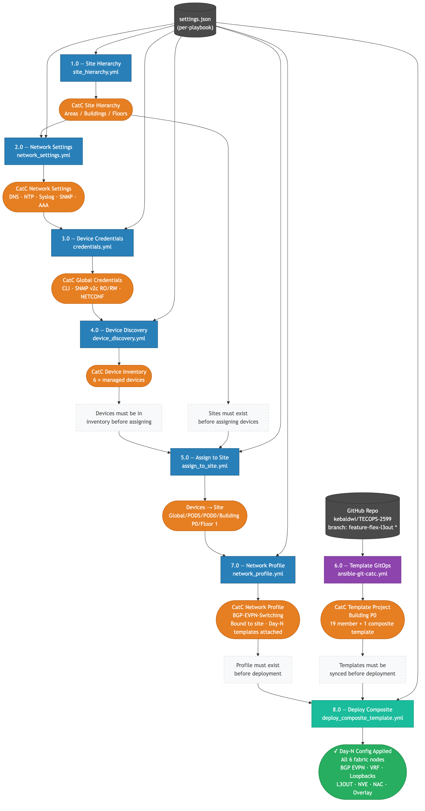

# Cisco Catalyst Center — Ansible Automation Suite

> **As-Built Documentation**
> **Authors:** Igor Manassypov — Systems Engineer (imanassy@cisco.com)
> **Copyright © 2024–2026 Cisco Systems, Inc. All rights reserved.**

This document describes the end-to-end Ansible automation suite for provisioning a Cisco Catalyst Center (formerly DNA Center) managed network fabric. The suite consists of nine sequentially-ordered provisioning playbooks plus one standalone backup utility (10.0) that collectively automate the full device onboarding lifecycle — from initial site hierarchy creation through Day-N template deployment.

---

## Getting Started

> **Platform:** Ubuntu 22.04 or 24.04 (required — the setup script uses `apt` and the `deadsnakes` PPA)
> **Privileges:** A regular user account with `sudo` access

### 1. Clone the Repository

```bash
git clone https://github.com/kebaldwi/TECOPS-2599.git
cd TECOPS-2599/Support/Resources/Ansible
```

### 2. Run the Setup Script

`install-ansible.sh` bootstraps the complete Ansible environment in a single step:

```bash
chmod +x install-ansible.sh
./install-ansible.sh
```

What the script does:

| Step | Action |
|------|--------|
| 0 | Restores system `python3` → `python3.8` for `apt` compatibility (Ubuntu 20.04 only) |
| 1 | Updates `apt` package lists |
| 2 | Installs Python 3.9 from the `deadsnakes` PPA |
| 3 | Creates an isolated virtual environment at `~/tecops-venv` and appends activation to `~/.bashrc` |
| 4 | Installs `ansible>=8.0` (ansible-core 2.15) into the venv |
| 5 | Installs Python SDKs: `catalystcentersdk`, `dnacentersdk`, `github-clone` |
| 6 | Installs Ansible Galaxy collections: `cisco.catalystcenter`, `cisco.dnac`, `ansible.utils`, `community.general`, `cisco.ios`, `cisco.nxos` |
| 7 | Checks for `~/.vault_pass` and enforces `600` permissions |
| 8 | Prints a verification summary of all installed components |

After the script completes, activate the venv in your current shell:

```bash
source ~/tecops-venv/bin/activate
```

> New shell sessions activate the venv automatically via `~/.bashrc`.

### 3. Create the Vault Password File

All playbooks use Ansible Vault to protect credentials at rest. Choose any password — this is the master key used to encrypt and decrypt every `vault.yml` in the suite.

```bash
echo 'YourVaultPassword' > ~/.vault_pass && chmod 600 ~/.vault_pass
```

### 4. Configure Credentials for Each Playbook

Each playbook directory contains a `vault.yml.example` that documents all required variables. Copy it to `vault.yml`, fill in your values, and encrypt:

```bash
cd 1.0-Cisco-Catalyst-Center-Site-Hierarchy
cp vault.yml.example vault.yml
# Edit vault.yml with your Catalyst Center credentials
ansible-vault encrypt vault.yml --vault-password-file ~/.vault_pass
```

Required variables by playbook:

| Playbook | Required Vault Variables |
|----------|--------------------------|
| 1.0 Site Hierarchy | `catc_username`, `catc_password` |
| 2.0 Network Settings | `catc_username`, `catc_password` |
| 3.0 Device Credentials | `catc_username`, `catc_password` |
| 4.0 Device Discovery | `dnac_username`, `dnac_password` |
| 5.0 Assign to Site | `dnac_username`, `dnac_password` |
| 6.0 Template GitOps | `dnac_username`, `dnac_password` (+ optional `git_token` for private repos) |
| 7.0 Network Profile | `dnac_username`, `dnac_password` |
| 8.0 Provision Devices | `dnac_username`, `dnac_password` |
| 9.0 Composite Deployment | `dnac_username`, `dnac_password` |
| 10.0 Backup My Configs | `vault_device_username`, `vault_device_password`, `vault_device_enable_password` |

### 5. Run the Playbooks in Order

From each playbook directory:

```bash
ansible-playbook -i inventory.yml <playbook>.yml --vault-password-file ~/.vault_pass
```

See [Ordering and Dependencies](#ordering-and-dependencies) for the required execution sequence.

---

## Table of Contents

1. [Suite Overview](#suite-overview)
2. [Provisioning Workflow](#provisioning-workflow)
3. [Playbook Reference](#playbook-reference)
   - [1.0 — Site Hierarchy](#10--site-hierarchy)
   - [2.0 — Network Settings](#20--network-settings)
   - [3.0 — Device Credentials](#30--device-credentials)
   - [4.0 — Device Discovery](#40--device-discovery)
   - [5.0 — Assign to Site](#50--assign-to-site)
   - [6.0 — Template GitOps](#60--template-gitops)
   - [7.0 — Network Profile](#70--network-profile)
   - [8.0 — Provision Devices](#80--provision-devices)
   - [9.0 — Composite Template Deployment](#90--composite-template-deployment)
   - [10.0 — Backup My Configs](#100--backup-my-configs)
4. [Ansible Module Reference](#ansible-module-reference)
5. [Input Data Sources](#input-data-sources)
6. [Compatibility Matrix](#compatibility-matrix)
7. [Ordering and Dependencies](#ordering-and-dependencies)

---

## Suite Overview

| # | Playbook | File | Outcome in Catalyst Center |
|---|----------|------|---------------------------|
| 1.0 | [Site Hierarchy](1.0-Cisco-Catalyst-Center-Site-Hierarchy/) | `site_hierarchy.yml` | Areas, Buildings, and Floors created and fully named |
| 2.0 | [Network Settings](2.0-Cisco-Catalyst-Center-Settings/) | `network_settings.yml` | DNS, NTP, Syslog, SNMP, AAA, and banner applied per-site |
| 3.0 | [Device Credentials](3.0-Cisco-Catalyst-Center-Credentials/) | `credentials.yml` | CLI, SNMP v2c R/W, and NETCONF global credentials created and assigned to sites |
| 4.0 | [Device Discovery](4.0-Cisco-Catalyst-Center-Device-Discovery/) | `device_discovery.yml` | Devices discovered and added to the CatC Device Inventory |
| 5.0 | [Assign to Site](5.0-Cisco-Catalyst-Center-Assign-To-Site/) | `assign_to_site.yml` | Devices placed under their designated site in the hierarchy |
| 6.0 | [Template GitOps](6.0-Cisco-Catalyst-Center-Templates-Github-integration/) | `ansible-git-catc.yml` | Jinja2 and composite templates synced from GitHub into a CatC template project |
| 7.0 | [Network Profile](7.0-Cisco-Catalyst-Center-Network-Profile/) | `network_profile.yml` | Switching Network Profile created and assigned to sites with Day-N templates bound |
| 8.0 | [Provision Devices](8.0-Cisco-Catalyst-Center-Provision-Devices/) | `provision_devices.yml` | Devices provisioned to their site via SDA provisionDevices API; site-level settings pushed; idempotent skip for already-provisioned devices |
| 9.0 | [Composite Deployment](9.0-Cisco-Catalyst-Center-Provision-Composite/) | `deploy_composite_template.yml` | Composite Day-N templates deployed to managed devices; verification via async task poll |
| 10.0 | [Backup My Configs](10.0-Backup-My-Configs/) | `10.0-Backup-My-Configs.yml` | Running configurations backed up from all IOS-XE and NX-OS devices via SSH; timestamped archives with configurable retention |

---

## Provisioning Workflow

The following diagram shows the complete end-to-end data flow across all ten playbooks — input sources, playbook execution order, intermediate Catalyst Center resources produced, and hard dependencies between stages.



> **Source:** [DIAGRAMS/provisioning-workflow.mmd](DIAGRAMS/provisioning-workflow.mmd)

**Colour coding:**

| Colour | Meaning |
|--------|---------|
| Blue | Infrastructure playbook — reads `settings.json` or `devices.json` |
| Purple | GitHub-sourced playbook — fetches templates from a git repository (6.0) |
| Teal | Deployment playbooks — push configuration onto managed devices (8.0, 9.0) |
| Dark grey | Input data source (`settings.json`, `devices.json`, GitHub repo) |
| Orange | Catalyst Center resource produced by a playbook |
| Green | Final deployed state — devices with Day-N configuration applied |
| White | Ordering constraint annotation |

---

## Playbook Reference

### 1.0 — Site Hierarchy

**Playbook:** [`site_hierarchy.yml`](1.0-Cisco-Catalyst-Center-Site-Hierarchy/site_hierarchy.yml)
**Full README:** [1.0-Cisco-Catalyst-Center-Site-Hierarchy/README.md](1.0-Cisco-Catalyst-Center-Site-Hierarchy/README.md)
**Minimum CatC:** 2.3.7.6 | **Collection:** `cisco.catalystcenter 2.1.3`

#### Function

Automates the creation, update, and deletion of the Site Hierarchy in Catalyst Center. The hierarchy is the fundamental grouping structure — Areas, Buildings, and Floors — that all subsequent playbooks depend upon for site-scoped operations.

The playbook reads `settings.json`, derives all intermediate path segments from each entry's `HierarchyParent/Area/Bldg/Floor` fields, de-duplicates and depth-sorts the resulting path list, then processes each site via typed collection modules in shallow-to-deep order. New site UUIDs are captured immediately after creation and fed forward to parent resolution for the next iteration.

#### Outcome in Catalyst Center

- Site Hierarchy tree populated with all Areas, Buildings, and Floors defined in `settings.json`
- Each site assigned correct metadata: building address + GPS coordinates, floor dimensions, RF model, and units of measure
- All sites immediately addressable by UUID in subsequent playbooks
- Deletion reverses the order (deepest first) to respect parent-child constraints

| Action | Module / Mechanism |
|--------|-------------------|
| Fetch all existing sites | `cisco.catalystcenter.sites_info` → `site_id_map` |
| Create area | `cisco.catalystcenter.areas` (state: present, no `id:`) |
| Create building | `cisco.catalystcenter.buildings` (state: present, no `id:`) |
| Create floor | `cisco.catalystcenter.floors` (state: present; `unitsOfMeasure` required) |
| Update existing site | Typed module with `id:` resolved from `site_id_map` |
| Delete site | Typed module (state: absent, deepest-first order) |

---

### 2.0 — Network Settings

**Playbook:** [`network_settings.yml`](2.0-Cisco-Catalyst-Center-Settings/network_settings.yml)
**Full README:** [2.0-Cisco-Catalyst-Center-Settings/README.md](2.0-Cisco-Catalyst-Center-Settings/README.md)
**Minimum CatC:** 2.3.7.6 | **Collection:** `cisco.catalystcenter 2.1.3`

#### Function

Applies site-scoped network infrastructure settings to each site defined in `settings.json`. Settings include DNS (domain name, primary and secondary server IPs), DHCP server, NTP server list, timezone, message-of-the-day banner, SNMP server, Syslog server, and AAA (client-and-endpoint only, bypassing the RADIUS shared-secret cross-check constraint of the workflow manager module).

The playbook uses a raw `ansible.builtin.uri` call to `PUT /dna/intent/api/v1/network/{siteId}` rather than the `network_settings_workflow_manager` collection module, avoiding the `NCND01243: sharedSecret cannot be different` error that arises when `network_aaa` and `clientAndEndpoint_aaa` share overlapping server entries. After each PUT, the async `executionStatusUrl` is polled until CatC reports `SUCCESS` or `FAILURE`.

#### Outcome in Catalyst Center

- DNS, DHCP, NTP, timezone, banner, SNMP, and Syslog settings visible under **Design → Network Settings → Network** for each targeted site
- AAA (ISE/RADIUS) bound to the site via `clientAndEndpoint_aaa` without triggering the Rhino script type-check error on `retainExistingBanner`
- Settings applied exactly as defined without inheritance side-effects from parent sites

| Action | Module / Mechanism |
|--------|-------------------|
| Resolve site path → UUID | `cisco.catalystcenter.sites_info` (Phase A) |
| Authenticate | `ansible.builtin.uri` → `POST /dna/system/api/v1/auth/token` |
| Apply settings | `ansible.builtin.uri` → `PUT /dna/intent/api/v1/network/{siteId}` |
| Poll execution result | `ansible.builtin.uri` → `GET /dna/intent/api/v1/dnacaap/management/execution-status/{executionId}` |

---

### 3.0 — Device Credentials

**Playbook:** [`credentials.yml`](3.0-Cisco-Catalyst-Center-Credentials/credentials.yml)
**Full README:** [3.0-Cisco-Catalyst-Center-Credentials/README.md](3.0-Cisco-Catalyst-Center-Credentials/README.md)
**Minimum CatC:** 2.3.7.6 | **Collection:** `cisco.dnac ≥ 6.7.0`

#### Function

Creates, updates, deletes, and site-assigns global device credentials — CLI (SSH/Telnet), SNMP v2c Read, SNMP v2c Write, and NETCONF. CLI and SNMP credentials are handled by the `device_credential_workflow_manager` collection module in a single idempotent call that handles both creation and assignment. NETCONF credentials are managed separately via raw module calls because the workflow manager does not support the NETCONF credential subtype; a re-query pattern resolves the newly assigned UUID after each `POST` (working around the empty-body HTTP 201 SDK quirk).

#### Outcome in Catalyst Center

- CLI, SNMP v2c R/W, and NETCONF global credentials visible under **Design → Credentials**
- Credentials assigned to designated sites ready for use by the Device Discovery playbook
- Deletion removes all matching credentials by description, leaving unmanaged credentials untouched

| Action | Module / Mechanism |
|--------|-------------------|
| Create / update CLI + SNMP v2c | `cisco.dnac.device_credential_workflow_manager` (state: merged) |
| Assign credentials to sites | `cisco.dnac.device_credential_workflow_manager` (`assign_credentials_to_site`) |
| Delete CLI + SNMP v2c | `cisco.dnac.device_credential_workflow_manager` (state: deleted) |
| Query existing NETCONF credentials | `cisco.dnac.global_credential_info` (credentialSubType: NETCONF) |
| Create NETCONF credential | `cisco.dnac.netconf_credential` (state: present, payload list; `ignore_errors: true`) |
| Update NETCONF credential | `cisco.dnac.netconf_credential` (state: present, `id:` + scalar fields) |
| Delete NETCONF credential | `cisco.dnac.global_credential_delete` (globalCredentialId) |

---

### 4.0 — Device Discovery

**Playbook:** [`device_discovery.yml`](4.0-Cisco-Catalyst-Center-Device-Discovery/device_discovery.yml)
**Full README:** [4.0-Cisco-Catalyst-Center-Device-Discovery/README.md](4.0-Cisco-Catalyst-Center-Device-Discovery/README.md)
**Minimum CatC:** 2.3.7.6 | **Collection:** `cisco.dnac 6.46.0`

#### Function

Submits device discovery jobs to Catalyst Center using management IP addresses from `devices.json`. Each `DeviceList` field is a comma-separated string of IPs; the playbook splits and trims the list and builds one `MULTI RANGE` discovery job per non-null site entry. Discovery jobs reference credentials by description (not by secret value), using the global credentials created in playbook 3.0. The `discovery_workflow_manager` module submits the job and polls until the discovery reaches a terminal state.

#### Outcome in Catalyst Center

- Each listed device reachable via the provided management IPs appears in **Provision → Inventory**
- Devices are in `Managed` state with SSH/SNMP/NETCONF reachability confirmed
- Discovery jobs visible under **Tools → Discovery**

| Action | Module / Mechanism |
|--------|-------------------|
| Submit discovery job and poll for completion | `cisco.dnac.discovery_workflow_manager` (state: merged) |

---

### 5.0 — Assign to Site

**Playbook:** [`assign_to_site.yml`](5.0-Cisco-Catalyst-Center-Assign-To-Site/assign_to_site.yml)
**Full README:** [5.0-Cisco-Catalyst-Center-Assign-To-Site/README.md](5.0-Cisco-Catalyst-Center-Assign-To-Site/README.md)
**Minimum CatC:** 2.3.7.6 | **Collection:** `cisco.dnac 6.46.0`

#### Function

Assigns discovered devices to their designated sites in the Catalyst Center hierarchy. The playbook reads the same `devices.json` file used by playbook 4.0, groups device IPs by site path, resolves each site path to a UUID via a `site_info` lookup, and calls `assign_device_to_site` once per unique site with the complete IP list for that site.

#### Outcome in Catalyst Center

- Devices appear under their correct site in **Provision → Inventory** (site column populated)
- Devices are eligible for site-scoped provisioning, template deployment, and network profile binding
- Site assignment is a prerequisite for device provisioning (playbook 8.0) and composite template deployment (playbook 9.0)

| Action | Module / Mechanism |
|--------|-------------------|
| Resolve site name → UUID | `cisco.dnac.site_info` |
| Assign device IP list to site | `cisco.dnac.assign_device_to_site` |

---

### 6.0 — Template GitOps

**Playbook:** [`ansible-git-catc.yml`](6.0-Cisco-Catalyst-Center-Templates-Github-integration/ansible-git-catc.yml)
**Full README:** [6.0-Cisco-Catalyst-Center-Templates-Github-integration/README.md](6.0-Cisco-Catalyst-Center-Templates-Github-integration/README.md)
**Minimum CatC:** 2.3.7.6 | **Collection:** `cisco.dnac 6.46.0`

#### Function

Implements a GitOps synchronisation workflow between a GitHub repository and a Catalyst Center template project. All content is fetched at runtime via the GitHub REST API — no local repository clone is required. The playbook discovers all `.j2` (Jinja2) and `.yml` (composite definition) files under a configured subfolder in the repository, enriches them with last-commit metadata, determines a processing order that guarantees individual templates exist before the composites that reference them, and syncs all templates and composites to Catalyst Center in two ordered `template_workflow_manager` calls.

#### Outcome in Catalyst Center

- All Jinja2 templates under `git_repo_subfolder/` created or updated in the target CatC template project
- Composite templates created with correct `containingTemplates` member lists
- Template description fields populated with git commit timestamp, author, and message for full audit traceability
- Subsequent runs are idempotent — only changed templates are updated

| Action | Module / Mechanism |
|--------|-------------------|
| Fetch repository file tree | `ansible.builtin.uri` → `GET /repos/{slug}/git/trees/{branch}?recursive=1` |
| Fetch raw template content | `ansible.builtin.uri` → `GET raw.githubusercontent.com/{slug}/{branch}/{path}` |
| Fetch last commit metadata | `ansible.builtin.uri` → `GET /repos/{slug}/commits?path={path}&per_page=1` |
| Sync individual Jinja2 templates | `cisco.dnac.template_workflow_manager` (state: merged) |
| Sync composite templates | `cisco.dnac.template_workflow_manager` (state: merged, composite: true) |

---

### 7.0 — Network Profile

**Playbook:** [`network_profile.yml`](7.0-Cisco-Catalyst-Center-Network-Profile/network_profile.yml)
**Full README:** [7.0-Cisco-Catalyst-Center-Network-Profile/README.md](7.0-Cisco-Catalyst-Center-Network-Profile/README.md)
**Minimum CatC:** 2.3.7.9 | **Collection:** `cisco.dnac 6.46.0`

#### Function

Creates Switching Network Profiles in Catalyst Center and assigns them to one or more sites with Day-N and/or onboarding templates bound. Network profiles are the mechanism by which Catalyst Center knows which templates to use when provisioning a device at a given site. The `network_profile_switching_workflow_manager` module handles template name resolution, site UUID resolution, profile creation, and site assignment in a single idempotent `state: merged` call.

#### Outcome in Catalyst Center

- Named Switching Network Profile visible under **Design → Network Profiles**
- Profile bound to the specified sites with the configured Day-N template(s) listed
- Profile ready to be selected during device provisioning (playbook 8.0) and referenced by the composite deployment playbook (9.0)

| Action | Module / Mechanism |
|--------|-------------------|
| Create, update, and site-assign Switching Network Profile | `cisco.dnac.network_profile_switching_workflow_manager` (state: merged) |

---

### 8.0 — Provision Devices

**Playbook:** [`provision_devices.yml`](8.0-Cisco-Catalyst-Center-Provision-Devices/provision_devices.yml)
**Full README:** [8.0-Cisco-Catalyst-Center-Provision-Devices/README.md](8.0-Cisco-Catalyst-Center-Provision-Devices/README.md)
**Minimum CatC:** 2.3.7.6 | **Collection:** `cisco.dnac 6.46.0`

#### Function

Provisions managed network devices to their designated sites in Catalyst Center using the SDA `provisionDevices` REST API (`POST /dna/intent/api/v1/sda/provisionDevices`). Provisioning is the step that pushes site-level network settings (DNS, NTP, SNMP, syslog, netflow, AAA) configured in playbook 2.0 onto the physical devices, and creates the CatC-internal provisioning record that links each `networkDeviceId` to its `siteId`. This record is required by the composite template deployment pipeline (playbook 9.0).

The playbook reads `settings.json`, groups devices by site path, authenticates once to get a JWT, then for each site: resolves the site UUID, resolves device UUIDs per management IP, checks which devices are already provisioned at the site (idempotency), and submits a batched `POST` for the remaining devices. The async task returned by CatC is polled to completion per site, and a structured per-site summary is printed.

#### Outcome in Catalyst Center

- Devices appear in **Provision → Inventory** with a provisioning status of `Success`
- Site-level network settings (DNS, NTP, SNMP, AAA, syslog) applied to device running configuration
- SDA provisioning record created — required for composite template deployment
- Already-provisioned devices are skipped (idempotent); use `force_reprovision=true` to re-trigger

| Action | Module / Mechanism |
|--------|-------------------|
| Authenticate | `ansible.builtin.uri` → `POST /dna/system/api/v1/auth/token` |
| Resolve site UUID | `ansible.builtin.uri` → `GET /dna/intent/api/v1/site?name={path}` |
| Resolve device UUID | `ansible.builtin.uri` → `GET /dna/intent/api/v1/network-device?managementIpAddress={ip}` |
| Check provisioned state | `ansible.builtin.uri` → `GET /dna/intent/api/v1/sda/provisionDevices?siteId={uuid}&limit=500` |
| Provision devices (batch) | `ansible.builtin.uri` → `POST /dna/intent/api/v1/sda/provisionDevices` |
| Poll async task | `ansible.builtin.uri` → `GET /dna/intent/api/v1/task/{taskId}` (until `endTime` set) |

---

### 9.0 — Composite Template Deployment

**Playbook:** [`deploy_composite_template.yml`](9.0-Cisco-Catalyst-Center-Provision-Composite/deploy_composite_template.yml)
**Full README:** [9.0-Cisco-Catalyst-Center-Provision-Composite/README.md](9.0-Cisco-Catalyst-Center-Provision-Composite/README.md)
**Minimum CatC:** 2.3.7.6 | **Collection:** `cisco.dnac 6.46.0`

#### Function

Deploys composite Day-N templates to managed devices. A composite template bundles multiple member Jinja2 templates (VRF definitions, loopbacks, overlay, NVE, multicast, etc.) into a single atomic deployment unit. The playbook resolves all required UUIDs from Catalyst Center at runtime — template root UUID, latest committed version UUID, member template UUIDs, and device UUIDs from management IPs — constructs the full `memberTemplateDeploymentInfo` payload, and calls the v2 deploy API once per device. Each deploy call is tracked to completion by polling the async task endpoint.

#### Outcome in Catalyst Center

- Composite Day-N templates pushed to each targeted device
- Device running configuration updated with all member template outputs (VRF, NVE, overlay, multicast, loopbacks, etc.)
- Deployment task status and per-device results visible under **Provision → Templates → Template Deployment**
- Any member-level or task-level failure surfaces with device IP, task ID, and error detail

| Action | Module / Mechanism |
|--------|-------------------|
| Authenticate | `ansible.builtin.uri` → `POST /dna/system/api/v1/auth/token` |
| Resolve template version UUIDs + member list | `ansible.builtin.uri` → `GET /dna/intent/api/v1/template-programmer/template?projectNames={name}` |
| Fetch composite member template list | `ansible.builtin.uri` → `GET /dna/intent/api/v1/template-programmer/template/{templateId}` |
| Resolve device UUID from management IP | `ansible.builtin.uri` → `GET /dna/intent/api/v1/network-device?managementIpAddress={ip}` |
| Deploy composite template (per device) | `cisco.dnac.configuration_template_deploy_v2` |
| Poll async deploy task | `ansible.builtin.uri` → `GET /dna/intent/api/v1/task/{taskId}` (until `endTime` set) |

---

### 10.0 — Backup My Configs

**Playbook:** [`10.0-Backup-My-Configs.yml`](10.0-Backup-My-Configs/10.0-Backup-My-Configs.yml)
**Full README:** [10.0-Backup-My-Configs/README.md](10.0-Backup-My-Configs/README.md)
**Collections:** `cisco.ios ≥ 4.0.0`, `cisco.nxos ≥ 5.0.0`

#### Function

Captures the running configuration of all managed network devices (IOS-XE and NX-OS) via SSH and writes each device's output to a timestamped file on the Ansible controller. A shared timestamp is generated once per run so every file in a single execution shares the same folder name. A configurable retention policy (`backup_retention_count`) automatically removes the oldest backup sets, keeping the `config-backups/` directory bounded in size.

This playbook is **independent of the CatC provisioning workflow** — it can be run at any point and does not interact with Catalyst Center.

#### Outcome

- Running configurations saved to `config-backups/<YYYYMMDD-HHMMSS>/` on the Ansible controller
- Separate sub-directories or file naming per device type (IOS-XE, NX-OS)
- Oldest backup sets pruned automatically per `backup_retention_count` (default: 3)

| Action | Module / Mechanism |
|--------|-------------------|
| Generate shared timestamp | `ansible.builtin.set_fact` + `lookup('pipe', 'date')` on `localhost` |
| Collect IOS-XE running-config | `cisco.ios.ios_command` (delegated output saved to file) |
| Collect NX-OS running-config | `cisco.nxos.nxos_command` (delegated output saved to file) |
| Prune old backup sets | `ansible.builtin.find` + `ansible.builtin.file` (state: absent) |

---

## Ansible Module Reference

The following table lists every Ansible module used across the suite, the collection it belongs to, where it is used, and the Ansible Galaxy documentation link.

| Module | Collection | Used In | Galaxy Docs |
|--------|-----------|---------|-------------|
| `areas` | `cisco.catalystcenter` | 1.0 Site Hierarchy | [docs](https://galaxy.ansible.com/ui/repo/published/cisco/catalystcenter/content/module/areas/) |
| `buildings` | `cisco.catalystcenter` | 1.0 Site Hierarchy | [docs](https://galaxy.ansible.com/ui/repo/published/cisco/catalystcenter/content/module/buildings/) |
| `floors` | `cisco.catalystcenter` | 1.0 Site Hierarchy | [docs](https://galaxy.ansible.com/ui/repo/published/cisco/catalystcenter/content/module/floors/) |
| `sites_info` | `cisco.catalystcenter` | 1.0 Site Hierarchy, 2.0 Settings | [docs](https://galaxy.ansible.com/ui/repo/published/cisco/catalystcenter/content/module/sites_info/) |
| `device_credential_workflow_manager` | `cisco.dnac` | 3.0 Credentials | [docs](https://galaxy.ansible.com/ui/repo/published/cisco/dnac/content/module/device_credential_workflow_manager/) |
| `global_credential_info` | `cisco.dnac` | 3.0 Credentials | [docs](https://galaxy.ansible.com/ui/repo/published/cisco/dnac/content/module/global_credential_info/) |
| `netconf_credential` | `cisco.dnac` | 3.0 Credentials | [docs](https://galaxy.ansible.com/ui/repo/published/cisco/dnac/content/module/netconf_credential/) |
| `global_credential_delete` | `cisco.dnac` | 3.0 Credentials | [docs](https://galaxy.ansible.com/ui/repo/published/cisco/dnac/content/module/global_credential_delete/) |
| `discovery_workflow_manager` | `cisco.dnac` | 4.0 Device Discovery | [docs](https://galaxy.ansible.com/ui/repo/published/cisco/dnac/content/module/discovery_workflow_manager/) |
| `site_info` | `cisco.dnac` | 5.0 Assign to Site | [docs](https://galaxy.ansible.com/ui/repo/published/cisco/dnac/content/module/site_info/) |
| `assign_device_to_site` | `cisco.dnac` | 5.0 Assign to Site | [docs](https://galaxy.ansible.com/ui/repo/published/cisco/dnac/content/module/assign_device_to_site/) |
| `template_workflow_manager` | `cisco.dnac` | 6.0 Template GitOps | [docs](https://galaxy.ansible.com/ui/repo/published/cisco/dnac/content/module/template_workflow_manager/) |
| `network_profile_switching_workflow_manager` | `cisco.dnac` | 7.0 Network Profile | [docs](https://galaxy.ansible.com/ui/repo/published/cisco/dnac/content/module/network_profile_switching_workflow_manager/) |
| `configuration_template_deploy_v2` | `cisco.dnac` | 9.0 Composite Deployment | [docs](https://galaxy.ansible.com/ui/repo/published/cisco/dnac/content/module/configuration_template_deploy_v2/) |
| `ios_command` | `cisco.ios` | 10.0 Backup My Configs | [docs](https://galaxy.ansible.com/ui/repo/published/cisco/ios/content/module/ios_command/) |
| `nxos_command` | `cisco.nxos` | 10.0 Backup My Configs | [docs](https://galaxy.ansible.com/ui/repo/published/cisco/nxos/content/module/nxos_command/) |
| `ansible.builtin.uri` | Ansible Core | 2.0, 6.0, 8.0, 9.0 | [docs](https://docs.ansible.com/ansible/latest/collections/ansible/builtin/uri_module.html) |

### Collection Installation

```bash
# cisco.catalystcenter (used by playbooks 1.0 and 2.0)
ansible-galaxy collection install cisco.catalystcenter:==2.1.3

# cisco.dnac (used by playbooks 3.0–9.0)
ansible-galaxy collection install cisco.dnac:==6.46.0
```

Or install all dependencies at once from any playbook directory using the shared `requirements.yml`:

```bash
ansible-galaxy collection install -r requirements.yml
```

> **Note:** `cisco.catalystcenter` and `cisco.dnac` are maintained as separate collections on Ansible Galaxy. Playbooks 1.0 and 2.0 use `cisco.catalystcenter` (newer API structure, `catalyst_response` key, `nameHierarchy` attribute). Playbooks 3.0–8.0 use `cisco.dnac` (legacy key names but broader module coverage). Do not substitute one for the other — the response schemas differ.

---

## Input Data Sources

All playbooks are data-driven from two JSON files located in the target project's `Settings/` directory:

### `settings.json`

Used by: **1.0, 2.0, 3.0, 7.0**

Defines the site hierarchy shape and all site-scoped configuration: network settings (DNS, NTP, SNMP, etc.), device credentials, credential-to-site assignments, and network profile bindings. One `project[]` entry per site.

```
Projects/
└── BGP_EVPN/
    └── Settings/
        └── settings.json
```

### `devices.json`

Used by: **4.0, 5.0, 9.0**

Defines the device inventory: management IP lists per site, and Day-N template deployment targets. One `project[]` entry per site or grouping, with `DeviceList` (comma-separated IPs) and `DayNTemplateNames[]` (template + target config).

```
Projects/
└── BGP_EVPN/
    └── Settings/
        └── devices.json
```

### GitHub Repository

Used by: **6.0**

Jinja2 template files (`.j2`) and composite definitions (`.yml`) stored in a subfolder of the configured GitHub repository. Fetched at runtime via the GitHub REST API — no local clone required.

| Parameter | Value |
|-----------|-------|
| `git_repo` | `https://github.com/imanassypov/CatalystCenter-BGP-EVPN-VXLAN.git` |
| `git_branch` | `main` (configurable via `inventory.yml`) |
| `git_repo_subfolder` | `BGP EVPN` |

---

## Compatibility Matrix

All playbooks in this suite are verified against the following versions:

| Cisco Catalyst Center | `cisco.dnac` Collection | `cisco.catalystcenter` Collection | Ansible |
|-----------------------|-------------------------|------------------------------------|---------|
| 2.3.7.6 | 6.46.0 | 2.1.3 | ≥ 2.15 |
| 2.3.7.9 | 6.46.0 | 2.1.3 | ≥ 2.15 |

> Playbook 7.0 requires CatC **2.3.7.9** minimum — the `network_profile_switching_workflow_manager` module is not supported on 2.3.7.6.

---

## Ordering and Dependencies

The playbooks must be executed in the order shown. Each playbook depends on resources produced by the previous stage.

```
1.0 Site Hierarchy
      │  Creates the site tree — all other playbooks require sites to exist
      ▼
2.0 Network Settings          3.0 Device Credentials
      │  (can run in either order — both depend only on 1.0)
      └──────────────┬─────────────────────┘
                     ▼
             4.0 Device Discovery
                   │  Requires global credentials from 3.0
                   ▼
             5.0 Assign to Site
                   │  Requires discovered devices from 4.0
                   ▼
             8.0 Provision Devices
                   │  Pushes site settings; creates SDA provisioning record required by 9.0
                   │
      ┌────────────┘
      │
      │   6.0 Template GitOps  ←  (independent; can run any time after repo is configured)
      │         │
      │         ▼
      │   7.0 Network Profile
      │         │  Requires sites (1.0) and templates (6.0)
      │         │
      └─────────┴────────────▶  9.0 Composite Deployment
                                     Requires: provisioned devices (8.0)
                                               templates in CatC (6.0)
                                               profile bound to sites (7.0)

10.0 Backup My Configs  ←  (independent; can run at any point against SSH-reachable devices)
```

**Deletion runs in reverse order** — 9.0 → 8.0 → 7.0 → 6.0 → 5.0 → 4.0 → 3.0 → 2.0 → 1.0 — to respect parent-child and dependency constraints.
