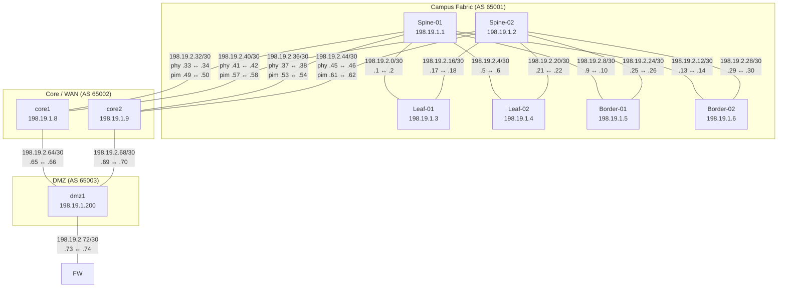

# CML Lab – IP Addressing Schema
## TECOPS-2599 | Cisco Live 2026

> **dCloud Allocated Block:** `198.18.0.0/15`

---

## Table of Contents

- [Address Block Allocation](#address-block-allocation)
- [Management Network](#management-network)
- [Loopback Addresses](#loopback-addresses)
- [Fabric Point-to-Point Links](#fabric-point-to-point-links)
- [Tenant Networks (VXLAN EVPN)](#tenant-networks-vxlan-evpn)
- [Per-Device Summary](#per-device-summary)
- [Routing Protocol Reference](#routing-protocol-reference)
- [Special Addresses](#special-addresses)

---

## Address Block Allocation

| Subnet             | Purpose                  | Notes                          |
|--------------------|--------------------------|--------------------------------|
| `198.18.128.0/18`  | Out-of-Band Management   | VRF `Mgmt-vrf` / `management` |
| `198.19.2.0/24`    | Fabric P2P Links         | /30 subnets (`.0` – `.75` used, `.76`–`.255` reserved) |
| `198.19.1.0/24`    | Loopback Addresses       | /32 host routes                |
| `198.18.134.0/24`  | Tenant: **red**          | VXLAN EVPN VRF `red`           |
| `198.18.137.0/24`  | Tenant: **red** (reserved)   | Additional subnet 1        |
| `198.18.138.0/24`  | Tenant: **red** (reserved)   | Additional subnet 2        |
| `198.18.135.0/24`  | Tenant: **green**        | VXLAN EVPN VRF `green`         |
| `198.18.139.0/24`  | Tenant: **green** (reserved) | Additional subnet 1        |
| `198.18.140.0/24`  | Tenant: **green** (reserved) | Additional subnet 2        |
| `198.18.136.0/24`  | Tenant: **blue**         | VXLAN EVPN VRF `blue`          |
| `198.18.141.0/24`  | Tenant: **blue** (reserved)  | Additional subnet 1        |
| `198.18.142.0/24`  | Tenant: **blue** (reserved)  | Additional subnet 2        |
| `198.18.143.0/24` – `198.19.255.0/24` | _Available_ | Unallocated within dCloud block |
| `198.18.0.0/15`    | **Total dCloud Block**   | `198.18.0.0 – 198.19.255.255`   |

> **Fabric P2P links** use `/30` subnets from `198.19.2.0/24`, keeping all lab addresses within the dCloud-allocated block.

---

## Management Network

**Subnet:** `198.18.128.0/18`  
**Default Gateway:** `198.18.128.1`  
**VRF (IOS-XE):** `Mgmt-vrf`  
**VRF (NX-OS):** `management`  
**Interface (IOS-XE):** `GigabitEthernet0/0`  
**Interface (NX-OS):** `mgmt0`

| Hostname   | Platform    | Mgmt Interface   | IP Address          |
|------------|-------------|------------------|---------------------|
| Spine-01   | IOS-XE      | GigabitEthernet0/0 | `198.18.128.101/18` |
| Spine-02   | IOS-XE      | GigabitEthernet0/0 | `198.18.128.102/18` |
| Leaf-01    | IOS-XE      | GigabitEthernet0/0 | `198.18.128.103/18` |
| Leaf-02    | IOS-XE      | GigabitEthernet0/0 | `198.18.128.104/18` |
| Border-01  | IOS-XE      | GigabitEthernet0/0 | `198.18.128.105/18` |
| Border-02  | IOS-XE      | GigabitEthernet0/0 | `198.18.128.106/18` |
| dmz1       | IOS-XE      | GigabitEthernet0/0 | `198.18.128.107/18` |
| core1      | NX-OS       | mgmt0              | `198.18.128.108/18` |
| core2      | NX-OS       | mgmt0              | `198.18.128.109/18` |

---

## Loopback Addresses

**Subnet:** `198.19.1.0/24` (host /32 assignments)  
**Interface:** `Loopback0` (IOS-XE) / `loopback0` (NX-OS)  
**Purpose:** OSPF Router-ID, BGP Router-ID, BGP update-source

> **Address assignment convention:** Last octet preserved from original internal scheme for easy cross-referencing.

| Hostname   | Platform | Loopback0 Address    | OSPF RID          | BGP RID           |
|------------|----------|----------------------|-------------------|-------------------|
| Spine-01   | IOS-XE   | `198.19.1.1/32`    | `198.19.1.1`    | `198.19.1.1`    |
| Spine-02   | IOS-XE   | `198.19.1.2/32`    | `198.19.1.2`    | `198.19.1.2`    |
| Leaf-01    | IOS-XE   | `198.19.1.3/32`    | `198.19.1.3`    | `198.19.1.3`    |
| Leaf-02    | IOS-XE   | `198.19.1.4/32`    | `198.19.1.4`    | `198.19.1.4`    |
| Border-01  | IOS-XE   | `198.19.1.5/32`    | `198.19.1.5`    | `198.19.1.5`    |
| Border-02  | IOS-XE   | `198.19.1.6/32`    | `198.19.1.6`    | `198.19.1.6`    |
| core1      | NX-OS    | `198.19.1.8/32`    | `198.19.1.8`    | `198.19.1.8`    |
| core2      | NX-OS    | `198.19.1.9/32`    | `198.19.1.9`    | `198.19.1.9`    |
| dmz1       | IOS-XE   | `198.19.1.200/32`  | `198.19.1.200`  | `198.19.1.200`  |

### Anycast RP (PIM)

| Interface            | Address              | Description                         |
|----------------------|----------------------|-------------------------------------|
| core1 `loopback1`    | `198.19.1.254/32`  | PIM Anycast RP (shared with core2)  |
| core2 `loopback1`    | `198.19.1.254/32`  | PIM Anycast RP (shared with core1)  |

---

## Fabric Point-to-Point Links

> All P2P links use `/30` subnets from `198.19.2.0/24`.

### Spine-01 (IOS-XE) — `198.19.1.1`

| Interface        | Peer        | Peer Interface   | Spine-01 IP          | Peer IP              | Subnet                |
|------------------|-------------|------------------|----------------------|----------------------|-----------------------|
| Gi1/0/1          | Leaf-01     | Gi1/0/1          | `198.19.2.1`       | `198.19.2.2`       | `198.19.2.0/30`     |
| Gi1/0/2          | Leaf-02     | Gi1/0/1          | `198.19.2.5`       | `198.19.2.6`       | `198.19.2.4/30`     |
| Gi1/0/3          | Border-01   | Gi1/0/1          | `198.19.2.9`       | `198.19.2.10`      | `198.19.2.8/30`     |
| Gi1/0/4          | Border-02   | Gi1/0/1          | `198.19.2.13`      | `198.19.2.14`      | `198.19.2.12/30`    |
| Gi1/0/5          | core1       | Eth1/1           | `198.19.2.33`      | `198.19.2.34`      | `198.19.2.32/30`    |
| Gi1/0/6          | core2       | Eth1/1           | `198.19.2.37`      | `198.19.2.38`      | `198.19.2.36/30`    |

### Spine-02 (IOS-XE) — `198.19.1.2`

| Interface        | Peer        | Peer Interface   | Spine-02 IP          | Peer IP              | Subnet                |
|------------------|-------------|------------------|----------------------|----------------------|-----------------------|
| Gi1/0/1          | Leaf-01     | Gi1/0/2          | `198.19.2.17`      | `198.19.2.18`      | `198.19.2.16/30`    |
| Gi1/0/2          | Leaf-02     | Gi1/0/2          | `198.19.2.21`      | `198.19.2.22`      | `198.19.2.20/30`    |
| Gi1/0/3          | Border-01   | Gi1/0/2          | `198.19.2.25`      | `198.19.2.26`      | `198.19.2.24/30`    |
| Gi1/0/4          | Border-02   | Gi1/0/2          | `198.19.2.29`      | `198.19.2.30`      | `198.19.2.28/30`    |
| Gi1/0/5          | core1       | Eth1/2           | `198.19.2.41`      | `198.19.2.42`      | `198.19.2.40/30`    |
| Gi1/0/6          | core2       | Eth1/2           | `198.19.2.45`      | `198.19.2.46`      | `198.19.2.44/30`    |

### core1 / core2 (NX-OS) — DMZ Links

| Interface        | Peer        | Peer Interface   | Core IP              | Peer IP              | Subnet                |
|------------------|-------------|------------------|----------------------|----------------------|-----------------------|
| core1 Eth1/3     | dmz1        | Gi1/0/1          | `198.19.2.65`      | `198.19.2.66`      | `198.19.2.64/30`    |
| core2 Eth1/3     | dmz1        | Gi1/0/2          | `198.19.2.69`      | `198.19.2.70`      | `198.19.2.68/30`    |
| dmz1 Gi1/0/3     | FW          | Gi1              | `198.19.2.73`      | `198.19.2.74`      | `198.19.2.72/30`    |

### core1 / core2 — PIM Sub-interfaces (dot1q tag 2, same physical cables as Spine links)

| Interface        | IP Address           | Subnet               |
|------------------|----------------------|----------------------|
| core1 Eth1/1.2   | `198.19.2.49/30`   | `198.19.2.48/30`   |
| core2 Eth1/1.2   | `198.19.2.53/30`   | `198.19.2.52/30`   |
| core1 Eth1/2.2   | `198.19.2.57/30`   | `198.19.2.56/30`   |
| core2 Eth1/2.2   | `198.19.2.61/30`   | `198.19.2.60/30`   |

---

## Tenant Networks (VXLAN EVPN)

Three Layer-3 VRF tenants are deployed over the VXLAN EVPN fabric. Each tenant is allocated a primary `/24` subnet plus two reserved `/24` subnets from the dCloud block.

| Tenant | VRF Name | Subnet            | VLAN  | VNI   | Route Targets       |
|--------|----------|-------------------|-------|-------|---------------------|
| Red    | `red`    | `198.18.134.0/24` | 134   | 50134 | `65001:134`         |
| Red    | `red`    | `198.18.137.0/24` | —     | —     | Reserved            |
| Red    | `red`    | `198.18.138.0/24` | —     | —     | Reserved            |
| Green  | `green`  | `198.18.135.0/24` | 135   | 50135 | `65001:135`         |
| Green  | `green`  | `198.18.139.0/24` | —     | —     | Reserved            |
| Green  | `green`  | `198.18.140.0/24` | —     | —     | Reserved            |
| Blue   | `blue`   | `198.18.136.0/24` | 136   | 50136 | `65001:136`         |
| Blue   | `blue`   | `198.18.141.0/24` | —     | —     | Reserved            |
| Blue   | `blue`   | `198.18.142.0/24` | —     | —     | Reserved            |

> VNI numbering convention: `50000 + VLAN ID`. Route targets follow `<BGP-ASN>:<VLAN-ID>`.

---

## Per-Device Summary

### Spine-01

| Address Type  | Interface          | Address                  |
|---------------|--------------------|--------------------------|
| Management    | GigabitEthernet0/0 | `198.18.128.101/18`      |
| Loopback0     | Loopback0          | `198.19.1.1/32`        |
| To Leaf-01    | Gi1/0/1            | `198.19.2.1/30`        |
| To Leaf-02    | Gi1/0/2            | `198.19.2.5/30`        |
| To Border-01  | Gi1/0/3            | `198.19.2.9/30`        |
| To Border-02  | Gi1/0/4            | `198.19.2.13/30`       |
| To core1      | Gi1/0/5            | `198.19.2.33/30`       |
| To core2      | Gi1/0/6            | `198.19.2.37/30`       |

### Spine-02

| Address Type  | Interface          | Address                  |
|---------------|--------------------|--------------------------|
| Management    | GigabitEthernet0/0 | `198.18.128.102/18`      |
| Loopback0     | Loopback0          | `198.19.1.2/32`        |
| To Leaf-01    | Gi1/0/1            | `198.19.2.17/30`       |
| To Leaf-02    | Gi1/0/2            | `198.19.2.21/30`       |
| To Border-01  | Gi1/0/3            | `198.19.2.25/30`       |
| To Border-02  | Gi1/0/4            | `198.19.2.29/30`       |
| To core1      | Gi1/0/5            | `198.19.2.41/30`       |
| To core2      | Gi1/0/6            | `198.19.2.45/30`       |

### Leaf-01

| Address Type  | Interface          | Address                  |
|---------------|--------------------|--------------------------|
| Management    | GigabitEthernet0/0 | `198.18.128.103/18`      |
| Loopback0     | Loopback0          | `198.19.1.3/32`        |
| To Spine-01   | Gi1/0/1            | `198.19.2.2/30`        |
| To Spine-02   | Gi1/0/2            | `198.19.2.18/30`       |

### Leaf-02

| Address Type  | Interface          | Address                  |
|---------------|--------------------|--------------------------|
| Management    | GigabitEthernet0/0 | `198.18.128.104/18`      |
| Loopback0     | Loopback0          | `198.19.1.4/32`        |
| To Spine-01   | Gi1/0/1            | `198.19.2.6/30`        |
| To Spine-02   | Gi1/0/2            | `198.19.2.22/30`       |

### Border-01

| Address Type  | Interface          | Address                  |
|---------------|--------------------|--------------------------|
| Management    | GigabitEthernet0/0 | `198.18.128.105/18`      |
| Loopback0     | Loopback0          | `198.19.1.5/32`        |
| To Spine-01   | Gi1/0/1            | `198.19.2.10/30`       |
| To Spine-02   | Gi1/0/2            | `198.19.2.26/30`       |

### Border-02

| Address Type  | Interface          | Address                  |
|---------------|--------------------|--------------------------|
| Management    | GigabitEthernet0/0 | `198.18.128.106/18`      |
| Loopback0     | Loopback0          | `198.19.1.6/32`        |
| To Spine-01   | Gi1/0/1            | `198.19.2.14/30`       |
| To Spine-02   | Gi1/0/2            | `198.19.2.30/30`       |

### dmz1

| Address Type  | Interface          | Address                  |
|---------------|--------------------|--------------------------|
| Management    | GigabitEthernet0/0 | `198.18.128.107/18`      |
| Loopback0     | Loopback0          | `198.19.1.200/32`      |
| To core1      | Gi1/0/1            | `198.19.2.66/30`       |
| To core2      | Gi1/0/2            | `198.19.2.70/30`       |
| To FW         | Gi1/0/3            | `198.19.2.73/30`       |

### core1 (NX-OS)

| Address Type     | Interface    | Address                  |
|------------------|--------------|---------------------------|
| Management       | mgmt0        | `198.18.128.108/18`       |
| Loopback0        | loopback0    | `198.19.1.8/32`         |
| Anycast RP       | loopback1    | `198.19.1.254/32`       |
| To Spine-01      | Eth1/1       | `198.19.2.34/30`        |
| To Spine-02      | Eth1/2       | `198.19.2.42/30`        |
| To dmz1          | Eth1/3       | `198.19.2.65/30`        |
| PIM (Spine-01)   | Eth1/1.2     | `198.19.2.49/30`        |
| PIM (Spine-02)   | Eth1/2.2     | `198.19.2.57/30`        |

### core2 (NX-OS)

| Address Type     | Interface    | Address                  |
|------------------|--------------|---------------------------|
| Management       | mgmt0        | `198.18.128.109/18`       |
| Loopback0        | loopback0    | `198.19.1.9/32`         |
| Anycast RP       | loopback1    | `198.19.1.254/32`       |
| To Spine-01      | Eth1/1       | `198.19.2.38/30`        |
| To Spine-02      | Eth1/2       | `198.19.2.46/30`        |
| To dmz1          | Eth1/3       | `198.19.2.69/30`        |
| PIM (Spine-01)   | Eth1/1.2     | `198.19.2.53/30`        |
| PIM (Spine-02)   | Eth1/2.2     | `198.19.2.61/30`        |

---

## Routing Protocol Reference

### BGP Autonomous Systems

| AS Number | Devices                              | Role                  |
|-----------|--------------------------------------|-----------------------|
| `65001`   | Spine-01, Spine-02, Leaf-01, Leaf-02, Border-01, Border-02 | Campus Fabric (IOS-XE) |
| `65002`   | core1, core2                         | Core / WAN (NX-OS)    |
| `65003`   | dmz1                                 | DMZ                   |

### BGP Peering Summary

| Session              | Local Device | Local IP (update-src)  | Peer IP                | Remote AS |
|----------------------|--------------|------------------------|------------------------|-----------|
| Spine-01 ↔ core1     | Spine-01     | `198.19.2.33`        | `198.19.2.34`        | 65002     |
| Spine-01 ↔ core2     | Spine-01     | `198.19.2.37`        | `198.19.2.38`        | 65002     |
| Spine-02 ↔ core1     | Spine-02     | `198.19.2.41`        | `198.19.2.42`        | 65002     |
| Spine-02 ↔ core2     | Spine-02     | `198.19.2.45`        | `198.19.2.46`        | 65002     |
| core1 ↔ dmz1         | core1        | `loopback0`            | `198.19.1.200`       | 65003     |
| core2 ↔ dmz1         | core2        | `loopback0`            | `198.19.1.200`       | 65003     |
| dmz1 ↔ core1         | dmz1         | `Loopback0`            | `198.19.1.8`         | 65002     |
| dmz1 ↔ core2         | dmz1         | `Loopback0`            | `198.19.1.9`         | 65002     |

### OSPF

| Area    | Devices                                     | Purpose                     |
|---------|---------------------------------------------|-----------------------------|
| `0.0.0.0` (Area 0) | Spine-01, Spine-02, Leaf-01, Leaf-02, Border-01, Border-02, core1, core2, dmz1 | Single-area backbone |

### PIM / Multicast

| Parameter            | Value                       |
|----------------------|-----------------------------|
| RP Address           | `198.19.1.254` (Anycast)  |
| Anycast RP Members   | `198.19.1.8` (core1), `198.19.1.9` (core2) |
| Multicast Group      | `224.0.0.0/4`               |
| SSM Range            | `232.0.0.0/8`               |

---

## Special Addresses

| Address               | Description                                    |
|-----------------------|------------------------------------------------|
| `198.18.128.1`        | Management network default gateway             |
| `198.19.1.254/32`   | PIM Anycast RP (shared loopback on core1/core2)|
| `198.19.1.0/24`     | BGP network statement + `Null0` summary (spines)|
| `198.19.1.200/32`   | dmz1 Loopback0 — BGP update-source for AS65003 sessions |
| `10.10.120.0/24`      | DHCP Server subnet (redistributed into OSPF via spine route-map) |

---

## Underlay Topology Diagram

All fabric point-to-point links use `/30` subnets from `198.19.2.0/24`, within the dCloud-allocated block.

### P2P Subnet Allocation Table

| Subnet | Link | Local IP | Peer IP | Local Interface | Peer Interface |
|--------|------|----------|---------|-----------------|----------------|
| `198.19.2.0/30`  | Spine-01 ↔ Leaf-01   | `198.19.2.1`  | `198.19.2.2`  | Gi1/0/1 | Gi1/0/1 |
| `198.19.2.4/30`  | Spine-01 ↔ Leaf-02   | `198.19.2.5`  | `198.19.2.6`  | Gi1/0/2 | Gi1/0/1 |
| `198.19.2.8/30`  | Spine-01 ↔ Border-01 | `198.19.2.9`  | `198.19.2.10` | Gi1/0/3 | Gi1/0/1 |
| `198.19.2.12/30` | Spine-01 ↔ Border-02 | `198.19.2.13` | `198.19.2.14` | Gi1/0/4 | Gi1/0/1 |
| `198.19.2.16/30` | Spine-02 ↔ Leaf-01   | `198.19.2.17` | `198.19.2.18` | Gi1/0/1 | Gi1/0/2 |
| `198.19.2.20/30` | Spine-02 ↔ Leaf-02   | `198.19.2.21` | `198.19.2.22` | Gi1/0/2 | Gi1/0/2 |
| `198.19.2.24/30` | Spine-02 ↔ Border-01 | `198.19.2.25` | `198.19.2.26` | Gi1/0/3 | Gi1/0/2 |
| `198.19.2.28/30` | Spine-02 ↔ Border-02 | `198.19.2.29` | `198.19.2.30` | Gi1/0/4 | Gi1/0/2 |
| `198.19.2.32/30` | Spine-01 ↔ core1 (phy) | `198.19.2.33` | `198.19.2.34` | Gi1/0/5 | Eth1/1 |
| `198.19.2.36/30` | Spine-01 ↔ core2 (phy) | `198.19.2.37` | `198.19.2.38` | Gi1/0/6 | Eth1/1 |
| `198.19.2.40/30` | Spine-02 ↔ core1 (phy) | `198.19.2.41` | `198.19.2.42` | Gi1/0/5 | Eth1/2 |
| `198.19.2.44/30` | Spine-02 ↔ core2 (phy) | `198.19.2.45` | `198.19.2.46` | Gi1/0/6 | Eth1/2 |
| `198.19.2.48/30` | core1 ↔ Spine-01 (PIM) | `198.19.2.49` | `198.19.2.50` | Eth1/1.2 | — |
| `198.19.2.52/30` | core2 ↔ Spine-01 (PIM) | `198.19.2.53` | `198.19.2.54` | Eth1/1.2 | — |
| `198.19.2.56/30` | core1 ↔ Spine-02 (PIM) | `198.19.2.57` | `198.19.2.58` | Eth1/2.2 | — |
| `198.19.2.60/30` | core2 ↔ Spine-02 (PIM) | `198.19.2.61` | `198.19.2.62` | Eth1/2.2 | — |
| `198.19.2.64/30` | core1 ↔ dmz1 | `198.19.2.65` | `198.19.2.66` | Eth1/3 | Gi1/0/1 |
| `198.19.2.68/30` | core2 ↔ dmz1 | `198.19.2.69` | `198.19.2.70` | Eth1/3 | Gi1/0/2 |
| `198.19.2.72/30` | dmz1 ↔ FW    | `198.19.2.73` | `198.19.2.74` | Gi1/0/3 | Gi1 |

> Subnets `198.19.2.76/30` through `198.19.2.252/30` remain available for future expansion.

---

*Last updated: 2026-03-09*  
*Cisco Live 2026 — TECOPS-2599*
