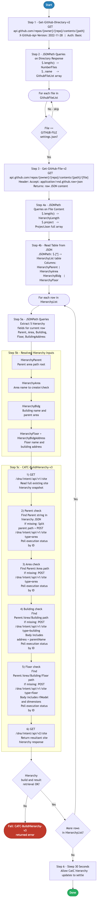

# 1.0 — Cisco Catalyst Center: Site Hierarchy Build

> **Workflow:** `GitOps-BuildHierarchy-v3.json`
> **Type:** Cisco Catalyst Center Generic Workflow (Intent API)
> **Subworkflows:** `Get-GitHub-Directory-v2`, `Get-GitHub-File-v2`, `CATC-BuildHierarchy-v3`
> **API Endpoints:**
> &nbsp;&nbsp;`GET  api.github.com/repos/{owner}/{repo}/contents/{path}` — retrieve directory file list from GitHub
> &nbsp;&nbsp;`GET  api.github.com/repos/{owner}/{repo}/contents/{path}/{file}` — retrieve raw settings.json hierarchy data from GitHub
> &nbsp;&nbsp;`GET  /dna/intent/api/v1/site` — retrieve current Catalyst Center site hierarchy snapshot
> &nbsp;&nbsp;`POST /dna/intent/api/v1/site` — create Area, Building, and Floor site objects
> &nbsp;&nbsp;`GET  /dna/intent/api/v2/site` — retrieve resultant site hierarchy after create operations
> &nbsp;&nbsp;`Catalyst Center - Poll Execution Status by ID` (atomic workflow) — wait for each create operation to complete
> **Minimum Catalyst Center version:** 2.3.7.9
> **Authors:** Keith Baldwin — Solutions Engineer - Automation HyperSpecialist (kebaldwi@cisco.com)
> **Copyright © 2024–2026 Cisco Systems, Inc. All rights reserved.**

---

## Table of Contents

1. [Overview](#overview)
   - [What it does](#what-it-does)
   - [What makes this workflow different](#what-makes-this-workflow-different)
   - [Logical Flow](#logical-flow)
2. [Prerequisites](#prerequisites)
3. [Directory Structure](#directory-structure)
4. [Workflow Input Parameters](#workflow-input-parameters)
5. [Input Data Structure — `settings.json`](#input-data-structure--settingsjson)
6. [How It Works](#how-it-works)
   - [Step 1 — Retrieve GitHub Directory Listing](#step-1--retrieve-github-directory-listing)
   - [Step 2 — Extract File List and Match Target File](#step-2--extract-file-list-and-match-target-file)
   - [Step 3 — Read Selected Settings File](#step-3--read-selected-settings-file)
   - [Step 4 — Parse Hierarchy Records from JSON](#step-4--parse-hierarchy-records-from-json)
   - [Step 5 — Build Hierarchy in Catalyst Center](#step-5--build-hierarchy-in-catalyst-center)
7. [Site Hierarchy Creation Payload Reference](#site-hierarchy-creation-payload-reference)
8. [Running the Workflow](#running-the-workflow)
9. [Expected Output](#expected-output)
10. [Workflow Ordering Dependency](#workflow-ordering-dependency)
11. [Troubleshooting](#troubleshooting)

---

## Overview

This Cisco Catalyst Center workflow builds the **organizational site hierarchy** (Areas, Buildings, and Floors) from structured data stored in a GitHub repository. Site hierarchy is the foundational organizational layer in Catalyst Center — all subsequent network management, policy assignment, and device discovery workflows depend on it being correctly defined.

The workflow reads `settings.json` files from GitHub, parses hierarchy definitions, and creates or updates corresponding site objects in Catalyst Center in a parent-to-child relationship. This enables a GitOps model where the source of truth for network organizational structure is version-controlled in GitHub.

### What it does

| Action | Mechanism |
|--------|-----------|
| List files in GitHub directory | `Get-GitHub-Directory-v2` — `GET api.github.com/repos/{owner}/{repo}/contents/{path}` |
| Filter to target settings file | `Condition Block` — `source_array[@] == GITHUB-FILE`; non-matching files skipped silently |
| Retrieve raw settings.json | `Get-GitHub-File-v2` — `GET .../{file}` with `Accept: application/vnd.github.raw+json` |
| Parse hierarchy table | `JSONPath Query` (`$.length()`, `$.project`) + `Read Table from JSON` (`$.[*]`) |
| Extract 5 hierarchy fields per row | `JSONPath Query` — compound filter on `HierarchyParent/Area/Bldg/Floor`; extracts `HierarchyParent`, `HierarchyArea`, `HierarchyBldg`, `HierarchyFloor`, `HierarchyBldgAddress` |
| Read current CatC hierarchy | `CATC-BuildHierarchy-v3` → `GET /dna/intent/api/v1/site` |
| Create Parent/Area/Building/Floor if missing | `CATC-BuildHierarchy-v3` → conditional `POST /dna/intent/api/v1/site` per level |
| Wait for create completion | `CATC-BuildHierarchy-v3` → `Catalyst Center - Poll Execution Status by ID` after each create |
| Return resultant hierarchy view | `CATC-BuildHierarchy-v3` → `GET /dna/intent/api/v2/site` |

### What makes this workflow different

Unlike manual point-and-click site creation in the Catalyst Center UI, this workflow:

1. **Codifies the hierarchy in GitHub** — site structure becomes auditable and version-controlled.
2. **Supports bulk operations** — multiple hierarchy branches can be defined in a single `settings.json` entry (Parent/Area/Building/Floor combinations).
3. **Idempotent** — re-running the workflow with the same settings.json does not duplicate sites. CatC site API returns existing siteId if a site with the same parent-name combination already exists.
4. **Loops over multiple settings files** — the workflow scans the GitHub directory, allowing different projects or regions to maintain separate hierarchy definitions in separate JSON files.
5. **Integrates with GitOps pipeline** — hierarchy changes are committed to GitHub first, then propagated to CatC via workflow execution.

### Logical Flow

The diagram below shows every decision point and loop from startup to completion.
It also includes two embedded sub-flowcharts for Step 5b (resolved hierarchy inputs) and Step 5c (CATC-BuildHierarchy-v3 API/check/create/poll sequence):



> Source: [`DIAGRAMS/logical-flow.mmd`](DIAGRAMS/logical-flow.mmd) — re-render with:
> ```bash
> npx -y @mermaid-js/mermaid-cli -i DIAGRAMS/logical-flow.mmd -o DIAGRAMS/logical-flow.png -w 885 -b white
> ```

---

## Prerequisites

| Requirement | Notes |
|-------------|-------|
| Cisco Catalyst Center | >= 2.3.7.9 |
| GitHub repository | Must contain `settings.json` files in the specified path |
| GitHub API access | CatC must be able to reach `api.github.com` (or configured GitHub Enterprise host) |
| Catalyst Center API access | CatC Intent API v1 (site endpoints) must be accessible and authenticated |
| Sufficient privileges in CatC | User/service account running workflow must have permission to create and modify site hierarchy |

---

## Directory Structure

```
1.0 Cisco Catalyst Center: Site Hierarchy Build/
├── GitOps-BuildHierarchy-v3.json      # Catalyst Center workflow definition (import via CatC UI)
├── DIAGRAMS/
│   ├── logical-flow.mmd               # Mermaid diagram source — re-render with npx mermaid-cli
│   └── logical-flow.png               # Rendered flowchart (referenced by this README)
└── README.md                          # This document
```

Hierarchy source data is stored in GitHub:

```
Projects/
└── BGP_EVPN/
    └── Settings/
        ├── settings.json              # Site hierarchy definitions (one or more per file)
        └── (other .json files)        # Workflow scans all files; matches GITHUB-FILE
```

---

## Workflow Input Parameters

These parameters are entered when the workflow is launched from the Catalyst Center UI or triggered via the Workflow API.

| Parameter | Type | Default | Description |
|-----------|------|---------|-------------|
| `GITHUB-OWNER` | string | `kebaldwi` | GitHub account or organization that owns the repository |
| `GITHUB-REPO` | string | `TECOPS-2599` | Repository name containing `settings.json` and hierarchy definitions |
| `GITHUB-PATH` | string | `Projects/BGP_EVPN/Settings` | Path within the repository to the folder containing hierarchy files |
| `GITHUB-FILE` | string | `settings.json` | Filename to retrieve from the GitHub path (the workflow scans the directory for this file) |
| `FORCE Update` | string (`true`/`false`) | `false` | If `true`, update existing sites even if already present. If `false`, skip sites that already exist in CatC |

---

## Input Data Structure — `settings.json`

The workflow reads `settings.json` files from GitHub to populate site hierarchy definitions.

### Top-Level Schema

```json
[
  {
    "HierarchyParent": "<root parent path>",
    "HierarchyArea": "<area name>",
    "HierarchyBldg": "<building name>",
    "HierarchyFloor": "<floor name>",
    "HierarchyBldgAddress": "<building address (optional)>"
  },
  ...
]
```

Each top-level object represents one site hierarchy path (Area → Building → Floor nested structure). Arrays are supported — the workflow iterates over each entry.

### Field Definitions

| Field | Type | Required | Description |
|-------|------|----------|-------------|
| `HierarchyParent` | string | Yes | Root parent path — typically `Global` or `Global/PODS` — becomes the parent of the Area. Must exist in CatC or be created first. |
| `HierarchyArea` | string | Yes | Area name — second-level site. Created under `HierarchyParent`. |
| `HierarchyBldg` | string | Yes | Building name — third-level site. Created under `HierarchyArea`. |
| `HierarchyFloor` | string | Yes | Floor name — fourth-level site (leaf). Created under `HierarchyBldg`. |
| `HierarchyBldgAddress` | string | No | Physical address of the building, used for GPS/mapping data in CatC (Latitude/Longitude optional). |

### Full Example

```json
[
  {
    "HierarchyParent": "Global",
    "HierarchyArea": "NA",
    "HierarchyBldg": "HQ San Jose",
    "HierarchyFloor": "Floor 1",
    "HierarchyBldgAddress": "123 Main St"
  },
  {
    "HierarchyParent": "Global",
    "HierarchyArea": "EMEA",
    "HierarchyBldg": "Dublin Office",
    "HierarchyFloor": "Floor 2",
    "HierarchyBldgAddress": "999 Temple Bar Dublin"
  }
]
```

This example defines two separate site hierarchies:
- `Global / NA / HQ San Jose / Floor 1`
- `Global / EMEA / Dublin Office / Floor 2`

---

## How It Works

### Step 1 — Retrieve GitHub Directory Listing

The `Get-GitHub-Directory-v2` subworkflow calls the GitHub Contents API:

```
GET https://api.github.com/repos/{GITHUB_USER}/{GITHUB_REPO}/contents/{GITHUB_PATH}
```

This returns metadata for all files in the directory (not recursive). The response structure includes `name`, `type`, `size` for each entry.

---

### Step 2 — Extract File List and Match Target File

A JSONPath query extracts file names from the directory listing:

```
$..[?(@.type == 'file')].name
```

The workflow then stores this list in a local variable and loops over each file name. For each iteration, it compares the current file against the `GITHUB-FILE` input parameter.

**Condition:** `if (file_name == GITHUB-FILE) then proceed to Step 3, else continue loop`

This allows the workflow to:
- Ignore non-JSON files and directories in the path
- Scan multiple files but only process the target settings file
- Support multiple settings files (for future expansion)

---

### Step 3 — Read Selected Settings File

When the target file is found (e.g., `settings.json`), the `Get-GitHub-File-v2` subworkflow retrieves its full content:

```
GET https://api.github.com/repos/{GITHUB_USER}/{GITHUB_REPO}/contents/{GITHUB_PATH}/{GITHUB_FILE}

Headers:
  Accept: application/vnd.github.raw+json
  X-GitHub-Api-Version: 2022-11-28
```

Using the `raw+json` Accept header returns the file content as raw JSON, which the workflow parses directly.

---

### Step 4 — Parse Hierarchy Records from JSON

Two activities extract structure from the parsed JSON:

#### Activity 4a — JSONPath Query

```
JSONPath: $.length()  → hierarchyLength
JSONPath: $.project   → ProjectJSON (full array)
```

This determines the count of hierarchy records and stores the entire parsed JSON.

#### Activity 4b — Read Table from JSON

```
JSONPath: $.[*]
Table columns: [HierarchyParent, HierarchyArea, HierarchyBldg, HierarchyFloor, HierarchyBldgAddress]
```

Converts the JSON array into a tabular format with one row per hierarchy record. This table becomes the source for the loop in Step 5.

---

### Step 5 — Build Hierarchy in Catalyst Center

For each row in `HierarchyList`:

#### Activity 5a — JSONPath Query (row match and hierarchy extraction)

The workflow runs one JSONPath query activity with a compound row filter:

```jsonpath
$..[?(@.HierarchyParent == '{row.HierarchyParent}'
  && @.HierarchyArea  == '{row.HierarchyArea}'
  && @.HierarchyBldg  == '{row.HierarchyBldg}'
  && @.HierarchyFloor == '{row.HierarchyFloor}')]
```

This extracts exactly 5 hierarchy inputs for the current row:
- `HierarchyParent`
- `HierarchyArea`
- `HierarchyBldg`
- `HierarchyFloor`
- `HierarchyBldgAddress`

#### Activity 5b — Resolved hierarchy inputs (sub-flow)

The extracted fields are normalized into a single path context used by `CATC-BuildHierarchy-v3`:
- Parent root path (`HierarchyParent`)
- Area name (`HierarchyArea`)
- Building name and address (`HierarchyBldg`, `HierarchyBldgAddress`)
- Floor name (`HierarchyFloor`)

#### Activity 5c — CATC-BuildHierarchy-v3 Subworkflow (6-step API/check/create/poll sequence)

The subworkflow executes the following ordered logic per hierarchy row:

**1) Read current hierarchy snapshot**
```
GET /dna/intent/api/v1/site
```

**2) Parent check and conditional create**
- `Find String` for `Parent`
- If missing: split parent path and create parent area
```
POST /dna/intent/api/v1/site   (type=area)
```
- Poll status by returned execution ID

**3) Area check and conditional create**
- `Find String` for `Parent/Area`
- If missing:
```
POST /dna/intent/api/v1/site   (type=area, parentName=Parent)
```
- Poll status by execution ID

**4) Building check and conditional create**
- `Find String` for `Parent/Area/Building`
- If missing:
```
POST /dna/intent/api/v1/site   (type=building)
```
- Payload includes `address`, `name`, and full `parentName`
- Poll status by execution ID

**5) Floor check and conditional create**
- `Find String` for `Parent/Area/Building/Floor`
- If missing:
```
POST /dna/intent/api/v1/site   (type=floor)
```
- Payload includes floor geometry (`height`, `length`, `width`) and `rfModel`
- Poll status by execution ID

**6) Get resultant hierarchy**
```
GET /dna/intent/api/v2/site
```

This final call returns the post-build hierarchy view used for workflow output variables (`Hierarchy`, `ResultHierarchy`).

**Error handling:**
- The top-level call to `CATC-BuildHierarchy-v3` is configured with `continue_on_failure: false`, so any hard failure in the subworkflow stops the row.
- Individual check/create activities inside the subworkflow use conditional branches (`has_match == false`) to keep operations idempotent and avoid duplicate site creation.

---

## Site Hierarchy Creation Payload Reference

Submitted to `POST /dna/intent/api/v1/site` by the `CATC-BuildHierarchy-v3` subworkflow for each level (Area, Building, Floor).

```json
{
  "site": {
    "area": {
      "name": "NA",
      "parentName": "Global"
    }
  }
}
```

For Building under Area:

```json
{
  "site": {
    "building": {
      "name": "HQ San Jose",
      "address": "123 Main St",
      "latitude": null,
      "longitude": null,
      "parentName": "Global/NA"
    }
  }
}
```

For Floor under Building:

```json
{
  "site": {
    "floor": {
      "height": "10",
      "length": "100",
      "name": "Floor 1",
      "parentName": "Global/NA/HQ San Jose",
      "rfModel": "Cubes And Walled Offices",
      "width": "100"
    }
  }
}
```

**Key field notes:**

| Field | Notes |
|-------|-------|
| `name` | Site name at this level (Area, Building, or Floor). Must be unique within the parent. |
| `parentName` | Full hierarchical path to the parent site. For Area, parent is typically `Global`. For Building/Floor, use the full path (e.g., `Global/NA/HQ San Jose`). |
| `address` | (Building level only) Physical address. Used for site location reference (optional). |
| `latitude`, `longitude` | (Building level) GPS coordinates. Optional — can be left null or added via CatC UI later. |
| `height`, `length`, `width` | (Floor level) Floor dimensions included in the create payload for RF planning context. |
| `rfModel` | (Floor level) RF propagation model set to `Cubes And Walled Offices` in this workflow payload. |

**Response on success (creation):**

```json
{
  "executionId": "<task_id>",
  "executionStatusUrl": "/dna/intent/api/v1/task/{taskId}",
  "message": "Execution successfully started for POST request for endpoint: /dna/intent/api/v1/site"
}
```

The `executionId` is polled until `endTime` is set and `isError = false`, indicating site creation is complete.

---

## Running the Workflow

### Import the Workflow

1. In Catalyst Center, navigate to **Platform → Workflow Manager**.
2. Click **Import** and upload `GitOps-BuildHierarchy-v3.json`.
3. The workflow appears as **GitOps-BuildHierarchy-v3** in the workflow list.

### Execute the Workflow

1. Click **Run** on the imported workflow.
2. Fill in the input parameters:
   - **GITHUB-OWNER:** `kebaldwi`
   - **GITHUB-REPO:** `TECOPS-2599`
   - **GITHUB-PATH:** `Projects/BGP_EVPN/Settings`
   - **GITHUB-FILE:** `settings.json`
   - **FORCE Update:** `false` (set to `true` if updating existing hierarchy)
3. Click **Execute**.
4. Monitor progress in **Workflow Executions** → **Execution Details**.

### Trigger via API

```bash
POST /dna/intent/api/v1/workflow-manager/workflows/{workflowId}/run
{
  "inputParameters": {
    "GITHUB-OWNER": "kebaldwi",
    "GITHUB-REPO": "TECOPS-2599",
    "GITHUB-PATH": "Projects/BGP_EVPN/Settings",
    "GITHUB-FILE": "settings.json",
    "FORCE Update": "false"
  }
}
```

---

## Expected Output

A successful run produces the following sequence in the workflow execution log:

```
Step 1       GitHub directory retrieved: /kebaldwi/TECOPS-2599/Projects/BGP_EVPN/Settings
Step 2       File list extracted: [settings.json, other.json, ...]
             Found target file: settings.json
Step 3       Settings file retrieved from GitHub (raw JSON response)
Step 4       Parsed settings.json — 2 hierarchy records found
             Record 1: Parent=Global, Area=NA, Building=HQ San Jose, Floor=Floor 1
             Record 2: Parent=Global, Area=EMEA, Building=Dublin Office, Floor=Floor 2
Step 5 [1/2] Processing hierarchy: Global / NA / HQ San Jose / Floor 1
             5a JSONPath extraction complete: Parent, Area, Building, Floor, Address
             5c.1 GET /dna/intent/api/v1/site → hierarchy snapshot read
             5c.2 Parent/Area checks → create missing levels via POST /dna/intent/api/v1/site
             5c.3 Building check/create + execution poll complete
             5c.4 Floor check/create + execution poll complete
             5c.5 GET /dna/intent/api/v2/site → resultant hierarchy returned
             Result hierarchy output captured ✓ SUCCESS
Step 5 [2/2] Processing hierarchy: Global / EMEA / Dublin Office / Floor 2
             Area "EMEA" already exists → Skipping (FORCE Update = false)
             Building "Dublin Office" already exists → Skipping
             Floor "Floor 2" already exists → Skipping
             Final siteId resolved: <uuid>  ✓ SUCCESS (no-op)
Completed    All 2 hierarchy records processed successfully
             Total created/updated: 2
             Total skipped: 0
             Total errors: 0
```

---

## Workflow Ordering Dependency

This workflow is the **first** in the GitOps provisioning suite. It must run before any other workflow because all subsequent workflows depend on site hierarchy already being defined in Catalyst Center.

| Workflow | Purpose | Depends on | Required before |
|----------|---------|------------|-----------------|
| **1.0 — This workflow** | Creates Area / Building / Floor hierarchy | — | **Yes — must run first** |
| 2.0 — Settings and Credentials | Applies DNS, DHCP, NTP, AAA, SNMP, and device credentials | 1.0 | — |
| 3.0 — Device Discovery | Discovers devices and adds to inventory | 1.0, 2.0 | — |
| 4.0 — Assign to Site | Moves devices from Global to target site | 1.0, 2.0 | — |
| 5.0 — Template GitOps | Syncs templates from GitHub to CatC | 1.0 | — |
| 6.0 — Network Profile | Creates profiles and assigns to site | 1.0, 2.0 | — |
| 7.0 — Provision Composite | Provisions devices + deploys templates | 1.0-6.0 | — |

---

## Troubleshooting

| Symptom | Likely Cause | Resolution |
|---------|-------------|------------|
| `GitHub file retrieval fails` | Repository is private, wrong path, or CatC cannot reach GitHub | Verify `GITHUB-OWNER`, `GITHUB-REPO`, `GITHUB-PATH`, `GITHUB-FILE` parameters. Check CatC outbound internet connectivity (test: `ping api.github.com`). |
| `File not found in directory listing` | Target `GITHUB-FILE` name does not exist in the specified path | List the contents of the GitHub path manually. Verify filename spelling and case sensitivity. |
| `Failed to parse JSON` | `settings.json` is malformed or contains invalid JSON syntax | Validate JSON syntax using an online JSON validator or `jq`. Common issues: trailing commas, missing quotes, unescaped characters. |
| `Parent site does not exist` | `HierarchyParent` references a site that doesn't exist in CatC | Manually create the parent site in CatC UI, or update `settings.json` to use an existing parent (e.g., `Global`). |
| `Site creation task returns isError = true` | Permission denied, duplicate site name, or invalid address data | Check CatC user permissions for site creation. Verify site names are unique within parent. Validate address format if provided. |
| `Hierarchy partially created then stops` | One level (e.g., Building) failed, leaving Area created but orphaned | Check the execution log for the specific level that failed. Fix the issue and re-run with `FORCE Update = false` (existing sites will be skipped). |
| `Re-running workflow duplicates sites` | Workflow is not checking for existing sites before creating | Set `FORCE Update = false` to skip existing sites. If hierarchy already exists, workflow will confirm and return existing siteIds. |
| `End of execution: SUCCESS but sites not visible in CatC` | Task poll timed out or completed before task was fully processed | Sites may exist but take a few seconds to appear in UI. Refresh the browser or check via API: `GET /dna/intent/api/v2/site?groupNameHierarchy=Global/NA` |

---

## Additional Notes

- **Multiple settings files:** The workflow supports scanning a directory with multiple `.json` files. Ensure each file contains valid hierarchy records and uses consistent naming across files to avoid conflicts.
- **Idempotency:** Running the workflow multiple times with the same `settings.json` is safe. Existing sites are detected and skipped (unless `FORCE Update = true`).
- **Hierarchy depth:** CatC supports up to 5 levels of hierarchy nesting. This workflow creates 4 levels (Parent/Area/Building/Floor). If deeper nesting is needed, manual site creation or workflow customization is required.
- **Site address & GPS data:** Building address and GPS coordinates are optional and can be populated via `settings.json` or added later in the CatC UI.

