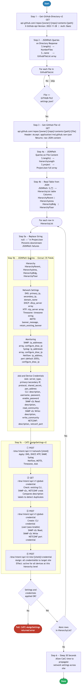

# 2.0 — Cisco Catalyst Center: Settings and Credentials

> **Workflow:** `GitOps-BuildSettings-v3.json`
> **Type:** Cisco Catalyst Center Generic Workflow (Intent API)
> **Subworkflows:** `Get-GitHub-Directory-v2`, `Get-GitHub-File-v2`, `CATC-AssignSettings-v2`
> **API Endpoints:**
> &nbsp;&nbsp;`GET  api.github.com/repos/{owner}/{repo}/contents/{path}` — retrieve directory file list from GitHub
> &nbsp;&nbsp;`GET  api.github.com/repos/{owner}/{repo}/contents/{path}/{file}` — retrieve raw settings.json from GitHub
> &nbsp;&nbsp;`POST /dna/intent/api/v1/network/{siteId}` — apply DNS, DHCP, NTP, SNMP, Syslog, Netflow, MOTD, TZ, AAA to site
> &nbsp;&nbsp;`GET  /dna/intent/api/v1/global-credential` — check existing CLI/SNMP/NETCONF credentials before creation
> &nbsp;&nbsp;`POST /dna/intent/api/v1/global-credential` — create CLI, SNMP v2c Read/Write, NETCONF device credentials
> &nbsp;&nbsp;`POST /dna/intent/api/v2/site/{siteId}/credential` — assign created credentials to the target site hierarchy
> **Minimum Catalyst Center version:** 2.3.7.9
> **Authors:** Keith Baldwin — Solutions Engineer - Automation HyperSpecialist (kebaldwi@cisco.com)
> **Copyright © 2024–2026 Cisco Systems, Inc. All rights reserved.**

---

## Table of Contents

1. [Overview](#overview)
   - [What it does](#what-it-does)
   - [What makes this workflow different](#what-makes-this-workflow-different)
   - [Logical Flow](#logical-flow)
2. [Prerequisites](#prerequisites)
3. [Directory Structure](#directory-structure)
4. [Workflow Input Parameters](#workflow-input-parameters)
5. [Input Data Structure — `settings.json`](#input-data-structure--settingsjson)
6. [How It Works](#how-it-works)
   - [Step 1 — Retrieve GitHub Directory Listing](#step-1--retrieve-github-directory-listing)
   - [Step 2 — Extract File List and Match Target File](#step-2--extract-file-list-and-match-target-file)
   - [Step 3 — Read Selected Settings File](#step-3--read-selected-settings-file)
   - [Step 4 — Parse Hierarchy and Settings Records from JSON](#step-4--parse-hierarchy-and-settings-records-from-json)
   - [Step 5 — Apply Settings and Credentials to Catalyst Center](#step-5--apply-settings-and-credentials-to-catalyst-center)
7. [Network Settings Assignment Payload Reference](#network-settings-assignment-payload-reference)
8. [Running the Workflow](#running-the-workflow)
9. [Expected Output](#expected-output)
10. [Workflow Ordering Dependency](#workflow-ordering-dependency)
11. [Troubleshooting](#troubleshooting)

---

## Overview

This Cisco Catalyst Center workflow applies **network settings and device credentials** to each level of the site hierarchy from structured data stored in a GitHub repository. Network settings include DNS servers, DHCP servers, NTP servers, SNMP, Syslog, Netflow, timezone, message of the day (MOTD), and AAA (RADIUS/TACACS) configuration. Device credentials include CLI (SSH/Telnet), SNMP v2c read/write, and NETCONF port assignments.

The workflow reads `settings.json` files from GitHub, parses network settings and credential definitions per hierarchy entry, and calls the `CATC-AssignSettings-v2` subworkflow to apply them to the correct site in Catalyst Center. This enables a GitOps model where the source of truth for all site network settings is version-controlled in GitHub.

### What it does

| Action | Mechanism |
|--------|-----------|
| List files in GitHub directory | `Get-GitHub-Directory-v2` — `GET api.github.com/repos/{owner}/{repo}/contents/{path}` |
| Filter to target settings file | `Condition Block` — `source_array[@] == GITHUB-FILE`; non-matching files skipped silently |
| Retrieve raw settings.json | `Get-GitHub-File-v2` — `GET .../{file}` with `Accept: application/vnd.github.raw+json` |
| Parse hierarchy table | `JSONPath Query` (`$.length()`, `$.project`) + `Read Table from JSON` (`$.[*]`) |
| Sanitise null values | `Replace String` — `null` → `""` in ProjectJson before per-row queries |
| Extract 35 settings fields per row | `JSONPath Query` — compound filter on `HierarchyParent/Area/Bldg/Floor`; extracts DNS, DHCP, NTP, TZ, MOTD, SNMP, Syslog, Netflow, AAA, CLI, SNMP v2c R/W, NETCONF |
| Apply network settings to site | `CATC-AssignSettings-v2` → `POST /dna/intent/api/v1/network/{siteId}` |
| Check existing device credentials | `CATC-AssignSettings-v2` → `GET /dna/intent/api/v1/global-credential` |
| Create device credentials | `CATC-AssignSettings-v2` → `POST /dna/intent/api/v1/global-credential` |
| Assign credentials to site | `CATC-AssignSettings-v2` → `POST /dna/intent/api/v2/site/{siteId}/credential` |

### What makes this workflow different

Unlike manual configuration of network settings per site in the Catalyst Center UI, this workflow:

1. **Codifies all site settings in GitHub** — DNS, DHCP, NTP, AAA, SNMP, credentials, and timezone are version-controlled, auditable, and reproducible.
2. **Supports bulk configuration** — multiple site hierarchy entries can be defined in a single `settings.json` file, each with their own unique settings and credentials.
3. **Idempotent** — re-running the workflow with the same `settings.json` does not duplicate credentials or settings. Existing configurations are detected and updated if `FORCE Update = true`, or left unchanged if `false`.
4. **Applies both network settings and device credentials in one pass** — the `CATC-AssignSettings-v2` subworkflow consumes 35 extracted fields and performs four ordered API calls (apply network, check credentials, create credentials, assign credentials) per hierarchy row.
5. **Integrates with GitOps pipeline** — settings changes are committed to GitHub first, then propagated to CatC via workflow execution, ensuring change tracking and rollback capability.

### Logical Flow

The diagram below shows every decision point and loop from startup to completion.
It also includes two embedded sub-flowcharts for the detailed subprocesses in Step 5b (field extraction) and Step 5c (API invocation sequence):



> Source: [`DIAGRAMS/logical-flow.mmd`](DIAGRAMS/logical-flow.mmd) — re-render with:
> ```bash
> npx -y @mermaid-js/mermaid-cli -i DIAGRAMS/logical-flow.mmd -o DIAGRAMS/logical-flow.png -w 885 -b white
> ```

---

## Prerequisites

| Requirement | Notes |
|-------------|-------|
| Cisco Catalyst Center | >= 2.3.7.9 |
| 1.0 Site Hierarchy workflow | Site hierarchy (Areas, Buildings, Floors) must already exist in CatC — run `GitOps-BuildHierarchy-v3` first |
| GitHub repository | Must contain `settings.json` files in the specified path with valid network settings and credential definitions |
| GitHub API access | CatC must be able to reach `api.github.com` (or configured GitHub Enterprise host) |
| Catalyst Center API access | CatC Intent API v1/v2 (network, global-credential endpoints) must be accessible and authenticated |
| Sufficient privileges in CatC | User/service account running the workflow must have permission to create network settings and global credentials |

---

## Directory Structure

```
2.0 Cisco Catalyst Center: Settings and Credentials/
├── GitOps-BuildSettings-v3.json       # Catalyst Center workflow definition (import via CatC UI)
├── DIAGRAMS/
│   ├── logical-flow.mmd               # Mermaid diagram source — re-render with npx mermaid-cli
│   └── logical-flow.png               # Rendered flowchart (referenced by this README)
└── README.md                          # This document
```

Settings source data is stored in GitHub:

```
Projects/
└── BGP_EVPN/
    └── Settings/
        ├── settings.json              # Network settings + credentials (one or more per file)
        └── (other .json files)        # Workflow scans all files; matches GITHUB-FILE
```

---

## Workflow Input Parameters

These parameters are entered when the workflow is launched from the Catalyst Center UI or triggered via the Workflow API.

| Parameter | Type | Default | Description |
|-----------|------|---------|-------------|
| `GITHUB-OWNER` | string | `kebaldwi` | GitHub account or organization that owns the repository |
| `GITHUB-REPO` | string | `TECOPS-2599` | Repository name containing `settings.json` and settings definitions |
| `GITHUB-PATH` | string | `Projects/BGP_EVPN/Settings` | Path within the repository to the folder containing settings files |
| `GITHUB-FILE` | string | `settings.json` | Filename to retrieve from the GitHub path (the workflow scans the directory for this file) |
| `FORCE Update` | string (`true`/`false`) | `false` | If `true`, overwrite existing settings and credentials. If `false`, skip entries that already exist in CatC |
| `TemplateHubProjectName` | string | `BGP_EVPN` | Project name in Catalyst Center Template Hub — used to scope template and project lookups |

---

## Input Data Structure — `settings.json`

The workflow reads `settings.json` files from GitHub to populate network settings and device credentials per site hierarchy entry.

### Top-Level Schema

```json
[
  {
    "HierarchyParent": "<root parent path>",
    "HierarchyArea": "<area name>",
    "HierarchyBldg": "<building name>",
    "HierarchyFloor": "<floor name>",
    "network_settings": {
      "dns_server": { ... },
      "dhcp_server": [ ... ],
      "ntp_server": [ ... ],
      "snmp_server": { ... },
      "syslog_server": { ... },
      "netflow_server": { ... },
      "message_of_the_day": { ... },
      "timezone": "<tz string>",
      "client_and_endpoint_aaa": { ... }
    },
    "device_credentials": {
      "cli_credential": { ... },
      "snmp_v2c_read": { ... },
      "snmp_v2c_write": { ... },
      "netconf_credential": { ... }
    }
  },
  ...
]
```

Each top-level array entry represents one site hierarchy target (Area → Building → Floor) with its complete network settings and credentials. Arrays are supported — the workflow iterates over each entry.

### Hierarchy Fields

| Field | Type | Required | Description |
|-------|------|----------|-------------|
| `HierarchyParent` | string | Yes | Root parent path — typically `Global`. Must already exist in CatC (created by 1.0 workflow). |
| `HierarchyArea` | string | Yes | Area name — must already exist under `HierarchyParent`. |
| `HierarchyBldg` | string | Yes | Building name — must already exist under `HierarchyArea`. |
| `HierarchyFloor` | string | Yes | Floor name — must already exist under `HierarchyBldg`. |

### Network Settings Fields

| Field Path | Type | Required | Description |
|-----------|------|----------|-------------|
| `network_settings.dns_server.primary_ip_address` | string | Yes | Primary DNS server IP address |
| `network_settings.dns_server.secondary_ip_address` | string | No | Secondary DNS server IP address (default: `""`) |
| `network_settings.dns_server.domain_name` | string | No | DNS domain name for the site (default: `""`) |
| `network_settings.dhcp_server` | array of strings | No | One or more DHCP server IP addresses (default: `[]`) |
| `network_settings.ntp_server` | array of strings | No | One or more NTP server IP addresses or hostnames (default: `[]`) |
| `network_settings.snmp_server.ip_addresses` | array of strings | No | SNMP trap receiver IP addresses |
| `network_settings.snmp_server.configure_dnac_ip` | boolean | No | Add CatC IP as SNMP trap receiver (default: `false`) |
| `network_settings.syslog_server.ip_addresses` | array of strings | No | Syslog collector IP addresses |
| `network_settings.syslog_server.configure_dnac_ip` | boolean | No | Add CatC IP as syslog receiver (default: `false`) |
| `network_settings.netflow_server.ip_address` | string | No | Netflow collector IP address |
| `network_settings.netflow_server.port` | integer | No | Netflow collector UDP port (default: `2055`) |
| `network_settings.netflow_server.configure_dnac_ip` | boolean | No | Add CatC IP as Netflow collector (default: `false`) |
| `network_settings.message_of_the_day.banner_message` | string | No | Login banner text for all managed devices |
| `network_settings.message_of_the_day.retain_existing_banner` | boolean | No | Preserve device's existing banner alongside new one (default: `false`) |
| `network_settings.timezone` | string | No | IANA timezone string (e.g., `America/Los_Angeles`) |
| `network_settings.client_and_endpoint_aaa.server_type` | string | No | AAA server type: `ISE` or `AAA` |
| `network_settings.client_and_endpoint_aaa.primary_server_address` | string | No | Primary AAA/RADIUS/TACACS server IP |
| `network_settings.client_and_endpoint_aaa.secondary_server_address` | string | No | Secondary AAA server IP |
| `network_settings.client_and_endpoint_aaa.protocol` | string | No | AAA protocol: `RADIUS` or `TACACS` |
| `network_settings.client_and_endpoint_aaa.shared_secret` | string | No | AAA shared secret key |
| `network_settings.client_and_endpoint_aaa.pan_address` | string | No | ISE Policy Admin Node (PAN) IP — used when `server_type` is `ISE` |

### Device Credentials Fields

| Field Path | Type | Required | Description |
|-----------|------|----------|-------------|
| `device_credentials.cli_credential.description` | string | Yes | Label for this CLI credential profile |
| `device_credentials.cli_credential.username` | string | Yes | SSH/Telnet login username |
| `device_credentials.cli_credential.password` | string | Yes | SSH/Telnet login password |
| `device_credentials.cli_credential.enable_password` | string | No | Privilege EXEC (enable) password |
| `device_credentials.snmp_v2c_read.description` | string | Yes | Label for this SNMP v2c read credential |
| `device_credentials.snmp_v2c_read.read_community` | string | Yes | SNMP v2c read community string |
| `device_credentials.snmp_v2c_write.description` | string | Yes | Label for this SNMP v2c write credential |
| `device_credentials.snmp_v2c_write.write_community` | string | Yes | SNMP v2c write community string |
| `device_credentials.netconf_credential.description` | string | Yes | Label for this NETCONF credential profile |
| `device_credentials.netconf_credential.netconf_port` | integer | Yes | NETCONF SSH port (typically `830`) |

### Full Example

```json
[
  {
    "HierarchyParent": "Global",
    "HierarchyArea": "NA",
    "HierarchyBldg": "HQ San Jose",
    "HierarchyFloor": "Floor 1",
    "network_settings": {
      "dns_server": {
        "primary_ip_address": "8.8.8.8",
        "secondary_ip_address": "8.8.4.4",
        "domain_name": "cisco.com"
      },
      "dhcp_server": ["192.168.1.1"],
      "ntp_server": ["pool.ntp.org"],
      "snmp_server": {
        "ip_addresses": ["10.0.0.5"],
        "configure_dnac_ip": true
      },
      "syslog_server": {
        "ip_addresses": ["10.0.0.6"],
        "configure_dnac_ip": false
      },
      "netflow_server": {
        "ip_address": "10.0.0.7",
        "port": 2055,
        "configure_dnac_ip": false
      },
      "message_of_the_day": {
        "banner_message": "Authorized access only. All activity monitored.",
        "retain_existing_banner": false
      },
      "timezone": "America/Los_Angeles",
      "client_and_endpoint_aaa": {
        "server_type": "ISE",
        "primary_server_address": "10.0.0.8",
        "secondary_server_address": "10.0.0.9",
        "protocol": "RADIUS",
        "shared_secret": "Cisco123!",
        "pan_address": "10.0.0.8"
      }
    },
    "device_credentials": {
      "cli_credential": {
        "description": "HQ-SSH-Creds",
        "username": "netadmin",
        "password": "Cisco123!",
        "enable_password": "Cisco123!"
      },
      "snmp_v2c_read": {
        "description": "HQ-SNMP-Read",
        "read_community": "public"
      },
      "snmp_v2c_write": {
        "description": "HQ-SNMP-Write",
        "write_community": "private"
      },
      "netconf_credential": {
        "description": "HQ-NETCONF",
        "netconf_port": 830
      }
    },
    ...
  }
]
```

---

## How It Works

### Step 1 — Retrieve GitHub Directory Listing

The `Get-GitHub-Directory-v2` subworkflow issues:

```
GET https://api.github.com/repos/{GITHUB_OWNER}/{GITHUB_REPO}/contents/{GITHUB_PATH}

Headers:
  X-GitHub-Api-Version: 2022-11-28
  Authorization: Basic {token}
```

This returns a JSON array of file metadata entries (not recursive). Each entry includes `name`, `type`, `size`, `download_url`, and `sha`. The full response is stored in `ProjectElements`.

---

### Step 2 — Extract File List and Match Target File

A `JSONPath Query` activity runs two queries against the directory response:

```
$.length()  →  NumberFiles         (integer count of directory entries)
$..name     →  GithubFileList      (string array of file names)
```

A `Set Variables` activity stores `GithubFileList` as the source for the outer `For Each` loop. The loop uses a `Condition Block` with `continue_on_failure: true` to silently skip non-matching files:

```
Condition: source_array[@]  ==  GITHUB-FILE
```

When the file name matches (e.g., `settings.json`), the `Condition Branch` body executes. Non-matching files fall through without error, allowing the workflow to scan directories containing other file types.

---

### Step 3 — Read Selected Settings File

The `Get-GitHub-File-v2` subworkflow retrieves the matched file:

```
GET https://api.github.com/repos/{GITHUB_OWNER}/{GITHUB_REPO}/contents/{GITHUB_PATH}/{GITHUB_FILE}

Headers:
  Accept: application/vnd.github.raw+json
  X-GitHub-Api-Version: 2022-11-28
```

Using the `raw+json` Accept header causes GitHub to return the file's raw JSON content directly (not base64-encoded), which is stored in output variable `GithubFile` for immediate downstream JSONPath querying.

---

### Step 4 — Parse Hierarchy and Settings Records from JSON

Two activities extract structured data from the file content:

#### Activity 4a — JSONPath Queries

```
$.length()  →  hierarchyLength    (integer count of top-level array entries)
$.project   →  ProjectJson        (full JSON string — stored for per-row querying)
```

A `Set Variables` activity then copies both outputs to workflow-scoped variables so they are reachable within the inner loop.

#### Activity 4b — Read Table from JSON

```
JSONPath:       $.[*]
Table type:     HierarchyList (tabletype_02UAXHRICHFOD7V5gkxfOgbAC98xfTqdUds)
Table columns:  HierarchyParent  (string)
                HierarchyArea    (string)
                HierarchyBldg    (string)
                HierarchyFloor   (string)
```

Each row corresponds to one site hierarchy target and drives one complete iteration of the inner loop. The table is persisted (`persist_output: true`) so it is available as the `For Each` source array.

---

### Step 5 — Apply Settings and Credentials to Catalyst Center

For each row in `HierarchyList`:

#### Activity 5a — Replace String (null sanitisation)

Before running JSONPath queries, the workflow replaces every literal `null` in `ProjectJson` with `""` (empty string). This prevents JSONPath from returning `null` typed results, which would cause downstream variable assignment failures.

```
Input:    ProjectJson (raw JSON text)
Replace:  null  →  ""
Output:   cleaned JSON string — used as input to Activity 5b
```

#### Activity 5b — JSONPath Queries — Extract 35 Fields

A single `JSONPath Query` activity runs 35 targeted queries against the cleaned JSON, all using the same compound filter to match the current hierarchy row:

```jsonpath
$..[?(@.HierarchyParent == '{row.HierarchyParent}'
   && @.HierarchyArea  == '{row.HierarchyArea}'
   && @.HierarchyBldg  == '{row.HierarchyBldg}'
   && @.HierarchyFloor == '{row.HierarchyFloor}')]
```

Field extraction summary:

| Category | Fields extracted | Default if absent |
|----------|-----------------|-------------------|
| Hierarchy | `HierarchyParent`, `HierarchyArea`, `HierarchyBldg`, `HierarchyFloor` | — |
| DNS | `primary_dns_server`, `secondary_dns_address`, `domain_name` | `""` |
| DHCP | `dhcp_server` (array) | `[]` |
| NTP | `ntp_server` (array) | `[]` |
| Timezone | `timezone` | `""` |
| MOTD | `motd_banner_message`, `motd_retain_banner` | `""`, `false` |
| SNMP | `snmp_servers` (array), `snmp_server_to_catc` | `[]`, `false` |
| Syslog | `syslog_servers` (array), `syslog_server_to_catc` | `[]`, `false` |
| Netflow | `netflow_server`, `netflow_port`, `netflow_to_catc` | `""`, `2055`, `false` |
| AAA | `aaa_endpoint_server_type`, `aaa_endpoint_primary_ip_address`, `aaa_endpoint_secondary_ip_address`, `aaa_endpoint_protocol`, `shared_secret`, `aaa_endpoint_pan_address` | `""` each |
| CLI credential | `cli_description`, `cli_username`, `cli_password`, `enable_password` | `""` each |
| SNMP v2c Read | `snmp_v2c_read_description`, `snmp_v2c_read_community` | `""` each |
| SNMP v2c Write | `snmp_v2c_write_description`, `snmp_v2c_write_community` | `""` each |
| NETCONF | `netconf_description`, `netconf_port` | `""`, `""` |

#### Activity 5c — CATC-AssignSettings-v2 Subworkflow (4-call API sequence)

All 35 extracted values are passed as inputs to `CATC-AssignSettings-v2`, which executes four API operations against the Catalyst Center endpoint:

**① Apply Network Settings**
```
POST /dna/intent/api/v1/network/{siteId}

Payload: DNS (primary, secondary, domain), DHCP servers,
         NTP servers, SNMP (IPs + CatC flag),
         Syslog (IPs + CatC flag), Netflow (IP, port, CatC flag),
         MOTD (banner, retain flag), Timezone, AAA (type, IPs,
         protocol, shared_secret, PAN address)
```

**② Check Existing Credentials**
```
GET /dna/intent/api/v1/global-credential

Query: existing CLI, SNMP v2c, and NETCONF credential descriptions
Purpose: avoid duplicates; honour FORCE Update flag
```

**③ Create Device Credentials**
```
POST /dna/intent/api/v1/global-credential

Payload: {
  cliCredential:  [{ description, username, password, enablePassword }],
  snmpV2cRead:    [{ description, readCommunity }],
  snmpV2cWrite:   [{ description, writeCommunity }],
  netconf:        [{ description, netconfPort }]
}
```

**④ Assign Credentials to Site**
```
POST /dna/intent/api/v2/site/{siteId}/credential

Payload: references to credentialIds returned from step ③
Effect:  credentials become active for all devices at
         Parent/Area/Building/Floor and below
```

**Error handling:** `continue_on_failure: false` on the subworkflow call — any API error (4xx/5xx) stops the inner loop and surfaces the failing API and response body in the execution log.

---

## Network Settings Assignment Payload Reference

Submitted to `POST /dna/intent/api/v1/network/{siteId}` by the `CATC-AssignSettings-v2` subworkflow for each site:

```json
{
  "settings": {
    "dnsServer": {
      "primaryIpAddress": "8.8.8.8",
      "secondaryIpAddress": "8.8.4.4",
      "domainName": "cisco.com"
    },
    "dhcpServer": ["192.168.1.1"],
    "ntpServer": ["pool.ntp.org"],
    "snmpServer": {
      "ipAddresses": ["10.0.0.5"],
      "configureDnacIP": true
    },
    "syslogServer": {
      "ipAddresses": ["10.0.0.6"],
      "configureDnacIP": false
    },
    "netflowcollector": {
      "ipAddress": "10.0.0.7",
      "port": 2055
    },
    "messageOfTheday": {
      "bannerMessage": "Authorized access only. All activity monitored.",
      "retainExistingBanner": false
    },
    "timezone": "America/Los_Angeles",
    "clientAndEndpointAaa": {
      "serverType": "ISE",
      "primaryServerAddress": "10.0.0.8",
      "secondaryServerAddress": "10.0.0.9",
      "protocol": "RADIUS",
      "sharedSecret": "Cisco123!",
      "panAddress": "10.0.0.8"
    }
  }
}
```

Device credential creation payload submitted to `POST /dna/intent/api/v1/global-credential`:

```json
{
  "cliCredential": [
    {
      "description": "HQ-SSH-Creds",
      "username": "netadmin",
      "password": "Cisco123!",
      "enablePassword": "Cisco123!"
    }
  ],
  "snmpV2cRead": [
    {
      "description": "HQ-SNMP-Read",
      "readCommunity": "public"
    }
  ],
  "snmpV2cWrite": [
    {
      "description": "HQ-SNMP-Write",
      "writeCommunity": "private"
    }
  ],
  "netconf": [
    {
      "description": "HQ-NETCONF",
      "netconfPort": "830"
    }
  ]
}
```

**Key field notes:**

| Field | Notes |
|-------|-------|
| `dnsServer.primaryIpAddress` | Required. Applied at the site level — overrides Global DNS for devices assigned to this site. |
| `dhcpServer` | Array of IPs. Applied per site. Devices at this site use these DHCP servers for relay forwarding. |
| `ntpServer` | Array of IPs or hostnames. Applied per site — standard for compliance and logging timestamp accuracy. |
| `snmpServer.configureDnacIP` | When `true`, adds the CatC management IP as an additional SNMP trap destination automatically. |
| `clientAndEndpointAaa.serverType` | `ISE` (Cisco Identity Services Engine) or `AAA` (generic RADIUS/TACACS). Use `ISE` when integrating with Cisco ISE. |
| `clientAndEndpointAaa.panAddress` | PAN (Policy Administration Node) address — only required when `serverType` is `ISE`. |
| `netconf.netconfPort` | Must be passed as a string (`"830"`), not an integer, for the CatC global-credential API even though the JSON source stores it as an integer. |

**Response on success (network settings apply):**

```json
{
  "executionId": "<task_id>",
  "executionStatusUrl": "/dna/intent/api/v1/task/{taskId}",
  "message": "Execution successfully started for POST request for endpoint: /dna/intent/api/v1/network/{siteId}"
}
```

---

## Running the Workflow

### Import the Workflow

1. In Catalyst Center, navigate to **Platform → Workflow Manager**.
2. Click **Import** and upload `GitOps-BuildSettings-v3.json`.
3. The workflow appears as **GitOps-BuildSettings-v3** in the workflow list.

### Execute the Workflow

1. Click **Run** on the imported workflow.
2. Fill in the input parameters:
   - **GITHUB-OWNER:** `kebaldwi`
   - **GITHUB-REPO:** `TECOPS-2599`
   - **GITHUB-PATH:** `Projects/BGP_EVPN/Settings`
   - **GITHUB-FILE:** `settings.json`
   - **FORCE Update:** `false` (set to `true` to overwrite existing settings and credentials)
   - **TemplateHubProjectName:** `BGP_EVPN`
3. Click **Execute**.
4. Monitor progress in **Workflow Executions** → **Execution Details**.

### Trigger via API

```bash
POST /dna/intent/api/v1/workflow-manager/workflows/{workflowId}/run
{
  "inputParameters": {
    "GITHUB-OWNER": "kebaldwi",
    "GITHUB-REPO": "TECOPS-2599",
    "GITHUB-PATH": "Projects/BGP_EVPN/Settings",
    "GITHUB-FILE": "settings.json",
    "FORCE Update": "false",
    "TemplateHubProjectName": "BGP_EVPN"
  }
}
```

---

## Expected Output

A successful run produces the following sequence in the workflow execution log:

```
Step 1       GitHub directory retrieved: /kebaldwi/TECOPS-2599/Projects/BGP_EVPN/Settings
Step 2       File list extracted: [settings.json, other.json, ...]
             Found target file: settings.json
Step 3       Settings file retrieved from GitHub (raw JSON response)
Step 4       Parsed settings.json — 2 hierarchy records found
             Record 1: Parent=Global, Area=NA, Building=HQ San Jose, Floor=Floor 1
             Record 2: Parent=Global, Area=EMEA, Building=Dublin Office, Floor=Floor 2
Step 5 [1/2] Processing hierarchy: Global / NA / HQ San Jose / Floor 1
             5a Replace String: null → "" (sanitise ProjectJson)
             5b JSONPath Query: extracted 35 fields for this hierarchy row
             5c.1 POST /dna/intent/api/v1/network/{siteId} → Task complete
             5c.2 GET  /dna/intent/api/v1/global-credential → existing creds checked
             5c.3 POST /dna/intent/api/v1/global-credential → CLI/SNMP/NETCONF created
             5c.4 POST /dna/intent/api/v2/site/{siteId}/credential → assigned to site
             Result: Global/NA/HQ San Jose/Floor 1 ✓ SUCCESS
Step 5 [2/2] Processing hierarchy: Global / EMEA / Dublin Office / Floor 2
             CLI credential Dublin-SSH-Creds already exists → Skipping (FORCE Update = false)
             Network settings applied → Task complete  ✓ SUCCESS (partial no-op)
             Sleep 30 seconds...
Completed    All 2 hierarchy records processed successfully
             Total applied: 2
             Total skipped: 0
             Total errors: 0
```

---

## Workflow Ordering Dependency

This workflow is **second** in the GitOps provisioning suite and depends on site hierarchy being established by 1.0 first. Network settings and credentials are meaningless without existing site objects to bind them to.

| Workflow | Purpose | Depends on | Required before |
|----------|---------|------------|-----------------|
| 1.0 — Site Hierarchy | Creates Area / Building / Floor hierarchy | — | **Yes — must run first** |
| **2.0 — This workflow** | Applies network settings and device credentials | 1.0 | — |
| 3.0 — Device Discovery | Discovers devices and adds to inventory | 1.0, 2.0 | — |
| 4.0 — Assign to Site | Moves devices from Global to target site | 1.0, 2.0 | — |
| 5.0 — Template GitOps | Syncs templates from GitHub to CatC | 1.0 | — |
| 6.0 — Network Profile | Creates profiles and assigns to site | 1.0, 2.0 | — |
| 7.0 — Provision Composite | Provisions devices + deploys templates | 1.0–6.0 | — |

---

## Troubleshooting

| Symptom | Likely Cause | Resolution |
|---------|-------------|------------|
| `GitHub file retrieval fails` | Repository is private, wrong path, or CatC cannot reach GitHub | Verify `GITHUB-OWNER`, `GITHUB-REPO`, `GITHUB-PATH`, `GITHUB-FILE` parameters. Check CatC outbound internet connectivity (`ping api.github.com`). |
| `File not found in directory listing` | Target `GITHUB-FILE` name does not match any file in the specified path | List GitHub path contents manually. Verify filename spelling and case (GitHub paths are case-sensitive). |
| `Failed to parse JSON` | `settings.json` is malformed or contains invalid JSON syntax | Validate with `jq . settings.json` or an online JSON validator. Common issues: trailing commas, unquoted strings, missing brackets. |
| `Site not found in CatC` | `HierarchyParent/Area/Building/Floor` path does not exist | Run workflow 1.0 (Site Hierarchy Build) first to create the site objects before applying settings. |
| `Network settings assignment fails — 400 Bad Request` | Invalid field value (e.g., malformed IP, wrong timezone string, port out of range) | Check the execution log for the specific field that failed. Validate IP addresses, IANA timezone strings, and integer port values in `settings.json`. |
| `Global credential creation fails — duplicate` | A credential with the same description already exists in CatC | Set `FORCE Update = true` to overwrite, or rename the credential description in `settings.json` to create a new one alongside the existing. |
| `Credential assignment fails — siteId not found` | Site exists but lookup failed due to hierarchy path mismatch | Confirm the exact site hierarchy path in CatC UI (`Provision → Sites`). Parent names must match CatC exactly (case-sensitive). |
| `AAA settings not applying — ISE integration error` | `panAddress` missing or ISE is unreachable from device subnet | Verify `panAddress` is populated when `server_type` is `ISE`. Confirm network reachability between managed device subnets and the ISE PAN node. |
| `NETCONF credential fails with type error` | `netconf_port` is sent as integer but API expects string | The workflow converts the port to string before submission. If you see this error, verify the source JSON has `"netconf_port": 830` (integer) — the workflow handles conversion. |
| `Workflow completes but settings not visible in CatC` | Async task propagation delay or browser cache | Wait 30 seconds (the workflow includes a built-in sleep), then refresh the CatC UI. Verify via API: `GET /dna/intent/api/v1/network?siteId={siteId}` |

---

## Additional Notes

- **Null value handling:** The workflow automatically replaces `null` values in the parsed JSON with empty strings before running JSONPath queries. This prevents failures when optional fields (e.g., `secondary_dns_address`) are omitted from `settings.json`.
- **Multiple settings files:** The workflow supports directories with multiple `.json` files. Each file is scanned; only the file matching `GITHUB-FILE` is processed. Different project folders can maintain separate `settings.json` files.
- **Credential scoping:** Device credentials created by this workflow are global in CatC (visible under **Design → Network Settings → Device Credentials**) but are explicitly bound to the target site via the site-credential assignment API call.
- **Idempotency:** Running the workflow multiple times with the same `settings.json` is safe when `FORCE Update = false`. Existing network settings are updated in-place; existing credentials are skipped if a credential with the same description already exists.
- **AAA server types:** Use `server_type: "ISE"` when integrating with Cisco Identity Services Engine — this enables ISE-specific fields (`pan_address`). Use `"AAA"` for generic RADIUS or TACACS+ servers without ISE.
- **SNMP and Syslog CatC IP flag:** Setting `configure_dnac_ip: true` on SNMP or Syslog adds the CatC cluster VIP as an additional receiver automatically — no manual IP lookup required.
