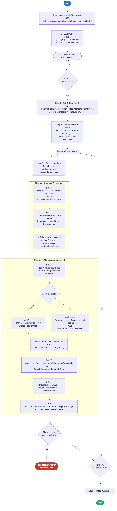

# 3.0 — Cisco Catalyst Center: Device Discovery and Assign

> **Workflow:** `GitOps-DeviceDiscovery.json`
> **Type:** Cisco Catalyst Center Generic Workflow (Intent API)
> **Subworkflows:** `Get-GitHub-Directory-v2`, `Get-GitHub-File-v2`, `CATC-DeviceDiscovery-v3`
> **API Endpoints:**
> &nbsp;&nbsp;`GET  api.github.com/repos/{owner}/{repo}/contents/{path}` — retrieve directory file list from GitHub
> &nbsp;&nbsp;`GET  api.github.com/repos/{owner}/{repo}/contents/{path}/{file}` — retrieve raw settings.json discovery data from GitHub
> &nbsp;&nbsp;`GET  /dna/intent/api/v2/global-credential` — retrieve all global credentials and extract UUIDs by name/description
> &nbsp;&nbsp;`GET  /dna/intent/api/v1/dnac-release` — determine installed Catalyst Center version (affects separator format)
> &nbsp;&nbsp;`GET  /api/v1/discovery/1/100` — list existing discovery jobs to detect duplicates
> &nbsp;&nbsp;`POST /dna/intent/api/v1/discovery` — create a new discovery job (Range or Multi Range)
> &nbsp;&nbsp;`DELETE /dna/intent/api/v1/discovery/{id}` — delete stale discovery job before recreating
> &nbsp;&nbsp;`GET  /dna/intent/api/v1/task/{taskId}` — poll task status until discovery job is registered
> &nbsp;&nbsp;`GET  /dna/intent/api/v1/discovery/{id}/network-device` — retrieve discovered devices and UUIDs
> &nbsp;&nbsp;`GET  /dna/intent/api/v2/site` — query site by groupNameHierarchy to retrieve siteId
> &nbsp;&nbsp;`POST /dna/intent/api/v1/networkDevices/assignToSite/apply` — assign discovered devices to target site
> **Minimum Catalyst Center version:** 2.3.7.9
> **Authors:** Keith Baldwin — Solutions Engineer - Automation HyperSpecialist (kebaldwi@cisco.com)
> **Copyright © 2024–2026 Cisco Systems, Inc. All rights reserved.**

---

## Table of Contents

1. [Overview](#overview)
   - [What it does](#what-it-does)
   - [What makes this workflow different](#what-makes-this-workflow-different)
   - [Logical Flow](#logical-flow)
2. [Prerequisites](#prerequisites)
3. [Directory Structure](#directory-structure)
4. [Workflow Input Parameters](#workflow-input-parameters)
5. [Input Data Structure — `settings.json`](#input-data-structure--settingsjson)
6. [How It Works](#how-it-works)
   - [Step 1 — Retrieve GitHub Directory Listing](#step-1--retrieve-github-directory-listing)
   - [Step 2 — Extract File List and Match Target File](#step-2--extract-file-list-and-match-target-file)
   - [Step 3 — Read Selected Settings File](#step-3--read-selected-settings-file)
   - [Step 4 — Parse Discovery Records from JSON](#step-4--parse-discovery-records-from-json)
   - [Step 5 — Discover and Assign Devices in Catalyst Center](#step-5--discover-and-assign-devices-in-catalyst-center)
7. [Discovery API Payload Reference](#discovery-api-payload-reference)
8. [Running the Workflow](#running-the-workflow)
9. [Expected Output](#expected-output)
10. [Workflow Ordering Dependency](#workflow-ordering-dependency)
11. [Troubleshooting](#troubleshooting)

---

## Overview

This Cisco Catalyst Center workflow discovers network devices by IP address range and assigns them to the correct site in the Catalyst Center inventory. Device discovery is a critical onboarding step — it uses credential lookups, version-aware payload construction, and an intelligent duplicate-detection mechanism to ensure each discovery job is created cleanly and produces reliable results.

The workflow reads `settings.json` files from GitHub, parses device lists and credential references per site hierarchy entry, and then executes the `CATC-DeviceDiscovery-v3` subworkflow for each row. That subworkflow resolves global credential UUIDs, creates the discovery job in Catalyst Center, polls until completion, and finally assigns all discovered device UUIDs to the target site. This results in a fully automated GitOps pipeline where device inventory is driven entirely from version-controlled JSON stored in GitHub.

### What it does

| Action | Mechanism |
|--------|-----------|
| List files in GitHub directory | `Get-GitHub-Directory-v2` — `GET api.github.com/repos/{owner}/{repo}/contents/{path}` |
| Filter to target settings file | `Condition Block` — `source_array[@] == GITHUB-FILE`; non-matching files skipped silently |
| Retrieve raw settings.json | `Get-GitHub-File-v2` — `GET .../{file}` with `Accept: application/vnd.github.raw+json` |
| Parse discovery table | `JSONPath Query` (`$.length()`, `$.project`) + `Read Table from JSON` (`$.[*]`) |
| Extract 10 fields per row | `Replace String` + `JSONPath Query` — compound filter on `HierarchyParent`/`Area`/`Bldg`/`Floor`; extracts site hierarchy, credential references, and `device_list` |
| Resolve global credential UUIDs | `CATC-DeviceDiscovery-v3` → `GET /dna/intent/api/v2/global-credential` |
| Determine CatC version | `CATC-DeviceDiscovery-v3` → `GET /dna/intent/api/v1/dnac-release` |
| Transform discovery payload | `CATC-DeviceDiscovery-v3` → Python script — builds `ipAddressList`, `discoveryType`, and version-aware `ip-ip`/`ip–ip` separator |
| List existing discovery jobs | `CATC-DeviceDiscovery-v3` → `GET /api/v1/discovery/1/100` |
| Detect and delete duplicate | `CATC-DeviceDiscovery-v3` → `JSONPath` match on `siteNameHierarchy`; if found: `DELETE /dna/intent/api/v1/discovery/{id}` + 8 s pause |
| Create discovery job | `CATC-DeviceDiscovery-v3` → `POST /dna/intent/api/v1/discovery` |
| Poll task until complete | `CATC-DeviceDiscovery-v3` → `GET /dna/intent/api/v1/task/{taskId}` — 5 s poll interval |
| Wait for discovery to settle | `CATC-DeviceDiscovery-v3` → `Sleep 180 s` |
| Retrieve discovered devices | `CATC-DeviceDiscovery-v3` → `GET /dna/intent/api/v1/discovery/{id}/network-device` |
| Resolve target siteId | `CATC-DeviceDiscovery-v3` → `GET /dna/intent/api/v2/site?groupNameHierarchy=…` |
| Assign devices to site | `CATC-DeviceDiscovery-v3` → `POST /dna/intent/api/v1/networkDevices/assignToSite/apply` |
| Allow inventory to settle | Top-level `Sleep 30 s` after all rows complete |

### What makes this workflow different

Unlike manual point-and-click discovery in the Catalyst Center UI, this workflow:

1. **Codifies device inventory in GitHub** — the list of devices to discover, along with site targeting and credential references, is version-controlled in `settings.json`. Changes are committed to GitHub before being applied to CatC.
2. **Resolves credential UUIDs dynamically** — rather than hardcoding credential IDs, the workflow calls `GET /dna/intent/api/v2/global-credential` at runtime and matches credentials by username, description, or port. This makes the workflow portable across environments with different internal UUIDs.
3. **Version-aware payload construction** — a Python transformation step inspects the installed Catalyst Center version and adjusts the IP range separator format (`ip-ip` vs `ip–ip`) accordingly. This prevents discovery failures caused by API format changes across versions.
4. **Intelligent duplicate detection** — before creating a new discovery job, the workflow lists all existing discovery jobs and searches for one whose `siteNameHierarchy` matches the target. If a match is found, the old job is deleted and recreated cleanly, ensuring accurate results rather than retaining stale state.
5. **Full end-to-end automation** — a single `settings.json` entry drives the entire discover → poll → retrieve → assign pipeline. No manual GUID lookups or follow-up API calls are needed.
6. **Integrates with GitOps pipeline** — device onboarding changes are committed to GitHub first, then propagated to CatC via workflow execution.

### Logical Flow

The diagram below shows every decision point and loop from startup to completion.
It also includes two embedded sub-flowcharts for Step 5b (resolved discovery inputs) and Step 5c (CATC-DeviceDiscovery-v3 full API/check/create/poll/assign sequence):



> Source: [`DIAGRAMS/logical-flow.mmd`](DIAGRAMS/logical-flow.mmd) — re-render with:
> ```bash
> npx -y @mermaid-js/mermaid-cli -i DIAGRAMS/logical-flow.mmd -o DIAGRAMS/logical-flow.png -w 885 -b white
> ```

---

## Prerequisites

| Requirement | Notes |
|-------------|-------|
| Cisco Catalyst Center | >= 2.3.7.9 |
| Workflow 1.0 — Site Hierarchy | Site hierarchy (Area, Building, Floor) must already exist in CatC before this workflow runs |
| Workflow 2.0 — Settings and Credentials | Global credentials (CLI, SNMPv2c Read/Write, NETCONF) must already be configured in CatC — this workflow resolves them by name at runtime |
| GitHub repository | Must contain `settings.json` files in the specified path with `device_list` and `device_credentials` fields populated |
| GitHub API access | CatC must be able to reach `api.github.com` (or configured GitHub Enterprise host) |
| Catalyst Center API access | CatC Intent API v1 (discovery, site, task, credential endpoints) must be accessible and authenticated |
| Sufficient privileges in CatC | User/service account running workflow must have permission to manage discovery jobs, read credentials, and assign devices to sites |
| Reachable devices | Target IP addresses in `device_list` must be reachable from CatC over the management network via SSH/SNMP/NETCONF |

---

## Directory Structure

```
3.0 Cisco Catalyst Center: Device Discovery and Assign/
├── GitOps-DeviceDiscovery.json        # Catalyst Center workflow definition (import via CatC UI)
├── DIAGRAMS/
│   ├── logical-flow.mmd               # Mermaid diagram source — re-render with npx mermaid-cli
│   └── logical-flow.png               # Rendered flowchart (referenced by this README)
└── README.md                          # This document
```

Discovery source data is stored in GitHub:

```
Projects/
└── BGP_EVPN/
    └── Settings/
        ├── settings.json              # Device discovery definitions (one or more site blocks)
        └── (other .json files)        # Workflow scans all files; matches GITHUB-FILE
```

---

## Workflow Input Parameters

These parameters are entered when the workflow is launched from the Catalyst Center UI or triggered via the Workflow API.

| Parameter | Type | Default | Description |
|-----------|------|---------|-------------|
| `GITHUB-OWNER` | string | `kebaldwi` | GitHub account or organization that owns the repository |
| `GITHUB-REPO` | string | `TECOPS-2599` | Repository name containing `settings.json` and discovery definitions |
| `GITHUB-PATH` | string | `Projects/BGP_EVPN/Settings` | Path within the repository to the folder containing settings files |
| `GITHUB-FILE` | string | `settings.json` | Filename to retrieve from the GitHub path (the workflow scans the directory for this file) |
| `TemplateHubProjectName` | string | `BGP_EVPN` | Project name used to scope Template Hub lookups (carried through to subworkflow context) |
| `FORCE Update` | string (`true`/`false`) | `false` | If `true`, stale discovery jobs are deleted and recreated regardless of state. If `false`, existing jobs are still replaced when found (delete + recreate) |

---

## Input Data Structure — `settings.json`

The workflow reads `settings.json` files from GitHub to drive all discovery and site-assignment operations. Each top-level object in the `project` array represents one discovery scope (one site hierarchy target with its own device list and credentials).

### Top-Level Schema

```json
{
  "project": [
    {
      "HierarchyParent": "<root parent path>",
      "HierarchyArea": "<area name>",
      "HierarchyBldg": "<building name>",
      "HierarchyFloor": "<floor name>",
      "HierarchyBldgAddress": "<building address>",
      "network_settings": {...
      },
      "device_credentials": {
        "cli_credential": {
          "username": "<cli username>",
          ...
        },
        "snmp_v2c_read": {
          "description": "<snmpv2c read community description>"
          ...
        },
        "snmp_v2c_write": {
          "description": "<snmpv2c write community description>"
          ...
        },
        "netconf_credential": {
          "netconf_port": "<port number>"
          ...
        }
      },
      "device_list": "<comma-separated IP addresses>",
      "network_profile": {...}
    }
  ]
}
```

Each object in the `project` array is one discovery row. The workflow iterates over each row and runs `CATC-DeviceDiscovery-v3` once per row.

### Field Definitions

| Field | Type | Required | Description |
|-------|------|----------|-------------|
| `HierarchyParent` | string | Yes | Root parent path in the site hierarchy — e.g., `Global/PODS`. The target site is built from Parent/Area/Building/Floor. Must already exist in CatC (created by workflow 1.0). |
| `HierarchyArea` | string | Yes | Area name — second-level site (e.g., `POD 0`). |
| `HierarchyBldg` | string | Yes | Building name — third-level site (e.g., `Building P0`). |
| `HierarchyFloor` | string | Yes | Floor name — fourth-level site (e.g., `Floor 1`). The full `siteNameHierarchy` used for the discovery job and site assignment is constructed as `Parent/Area/Building/Floor`. |
| `HierarchyBldgAddress` | string | No | Building street address — passed to the subworkflow for optional reference; not used in discovery job creation. |
| `device_credentials.cli_credential.username` | string | Yes | Username of the CLI credential stored in CatC global credentials. The subworkflow looks this up via `GET /dna/intent/api/v2/global-credential` to retrieve the UUID. |
| `device_credentials.snmp_v2c_read.description` | string | Yes | Description (label) of the SNMPv2c Read community stored in CatC global credentials. Used to resolve `uuidSNMPv2READ`. |
| `device_credentials.snmp_v2c_write.description` | string | Yes | Description (label) of the SNMPv2c Write community stored in CatC global credentials. Used to resolve `uuidSNMPv2WRITE`. |
| `device_credentials.netconf_credential.netconf_port` | string | Yes | Port number of the NETCONF credential stored in CatC global credentials (e.g., `"830"`). Used to resolve `uuidNETCONF`. |
| `device_list` | string | Yes | Comma-separated list of device management IP addresses to discover (e.g., `"198.19.1.1,198.19.1.2,198.19.1.3"`). The Python transformation step splits this into individual IPs or builds a Range/Multi Range payload. |

### Full Example

```json
{
  "project": [
    {
      "HierarchyParent": "Global/PODS",
      "HierarchyArea": "POD 0",
      "HierarchyBldg": "Building P0",
      "HierarchyFloor": "Floor 1",
      "HierarchyBldgAddress": "300 E Tasman Dr, Bldg 10, San Jose, CA 95134",
      "device_credentials": {
        "cli_credential": {
          "username": "net-admin"
        },
        "snmp_v2c_read": {
          "description": "RO"
        },
        "snmp_v2c_write": {
          "description": "RW"
        },
        "netconf_credential": {
          "netconf_port": "830"
        }
      },
      "device_list": "198.19.1.1,198.19.1.2,198.19.1.3,198.19.1.4,198.19.1.5,198.19.1.6"
    }
  ]
}
```

This example defines one discovery scope targeting six devices in `Global/PODS/POD 0/Building P0/Floor 1`.

---

## How It Works

### Step 1 — Retrieve GitHub Directory Listing

The `Get-GitHub-Directory-v2` subworkflow calls the GitHub Contents API:

```
GET https://api.github.com/repos/{GITHUB_OWNER}/{GITHUB_REPO}/contents/{GITHUB_PATH}
```

This returns metadata for all files in the directory (not recursive). The response structure includes `name`, `type`, and `size` for each entry. Authentication uses Basic credentials (GitHub token) configured in the CatC HTTP target.

---

### Step 2 — Extract File List and Match Target File

A JSONPath query extracts file names from the directory listing:

```
$.length()  → NumberFiles
$..name     → GithubFileList (array)
```

The `GithubFileList` array is then stored in a workflow variable and iterated with a `For Each GitHub File` loop. For each file in the array, a `Condition Block` compares the current filename against the `GITHUB-FILE` input parameter:

**Condition:** `if (source_array[@] == GITHUB-FILE) then proceed to Step 3, else skip`

This allows the workflow to:
- Ignore non-JSON files and directories in the path
- Scan multiple files but only act on the target settings file
- Support future expansion to multiple scoped settings files

---

### Step 3 — Read Selected Settings File

When the target file is found (e.g., `settings.json`), the `Get-GitHub-File-v2` subworkflow retrieves its full content:

```
GET https://api.github.com/repos/{GITHUB_OWNER}/{GITHUB_REPO}/contents/{GITHUB_PATH}/{GITHUB_FILE}

Headers:
  Accept: application/vnd.github.raw+json
  X-GitHub-Api-Version: 2022-11-28
```

Using the `raw+json` Accept header returns the file content as raw JSON, which the workflow parses directly without a base64-decode step.

---

### Step 4 — Parse Discovery Records from JSON

Two activities extract structure from the parsed JSON:

#### Activity 4a — JSONPath Query

```
JSONPath: $.length()   → hierarchyLength   (integer — row count)
JSONPath: $.project    → ProjectJson       (string — full JSON array)
```

`ProjectJson` stores the entire parsed settings file as a string for use in the compound JSONPath row filter later in Step 5.

#### Activity 4b — Read Table from JSON

```
JSONPath: $.[*]
Table columns: [HierarchyParent, HierarchyArea, HierarchyBldg, HierarchyFloor]
```

Converts the JSON array into a tabular format with one row per discovery record. This table (`HierarchyList`) becomes the source for the inner `For Each` loop in Step 5. The `HierarchyList` table drives iteration; the full `ProjectJson` string is used for precise field extraction via compound JSONPath filter in Step 5a.

---

### Step 5 — Discover and Assign Devices in Catalyst Center

For each row in `HierarchyList`, the workflow runs the following sequence:

#### Activity 5a — Replace String + JSONPath Queries (row field extraction)

Before running JSONPath, a `Replace String` activity normalizes `null` values in `ProjectJson` to `""` to prevent JSONPath failures on null fields.

The workflow then runs a single JSONPath query activity with a compound row filter that extracts **10 fields** for the current row:

```jsonpath
$..[?(@.HierarchyParent == '{row.HierarchyParent}'
  && @.HierarchyArea  == '{row.HierarchyArea}'
  && @.HierarchyBldg  == '{row.HierarchyBldg}'
  && @.HierarchyFloor == '{row.HierarchyFloor}')].<field>
```

The 10 extracted fields are:

| JSONPath Output Name | Source Field | Purpose |
|----------------------|--------------|---------|
| `HierarchyParent` | `$.HierarchyParent` | Site path root |
| `HierarchyArea` | `$.HierarchyArea` | Area name for site lookup |
| `HierarchyBldg` | `$.HierarchyBldg` | Building name |
| `HierarchyFloor` | `$.HierarchyFloor` | Floor name |
| `HierarchyBldgAddress` | `$.HierarchyBldgAddress` | Building address (optional) |
| `cli_username` | `$.device_credentials.cli_credential.username` | CLI credential lookup key |
| `snmp_v2c_read_description` | `$.device_credentials.snmp_v2c_read.description` | SNMPv2c Read lookup key |
| `snmp_v2c_write_description` | `$.device_credentials.snmp_v2c_write.description` | SNMPv2c Write lookup key |
| `netconf_port` | `$.device_credentials.netconf_credential.netconf_port` | NETCONF credential lookup key |
| `deviceDiscoveryList` | `$.device_list` | Comma-separated IP list to discover |

#### Activity 5b — Resolved Discovery Inputs (sub-flow)

The extracted fields are passed directly as input variables to `CATC-DeviceDiscovery-v3`. The inputs collectively define the full discovery context:

- **Site target:** `HierarchyParent` / `HierarchyArea` / `HierarchyBldg` / `HierarchyFloor` → constructs `siteNameHierarchy`
- **Credential lookups:** `cli_username`, `snmp_v2c_read_description`, `snmp_v2c_write_description`, `netconf_port` → used to match UUIDs from global credential store
- **Device scope:** `deviceDiscoveryList` → comma-separated IP list processed by Python transformation

#### Activity 5c — CATC-DeviceDiscovery-v3 Subworkflow (12-step sequence)

The subworkflow executes the following ordered logic per discovery row:

**1) Retrieve all global credentials**
```
GET /dna/intent/api/v2/global-credential
```
Returns all CLI, SNMP, and NETCONF credentials stored in CatC.

**2) Extract credential UUIDs via JSONPath**

Four JSONPath queries extract UUIDs by matching credential metadata:
- `cliCredential` matched by `username` → `uuidCLI`
- `snmpV2cRead` matched by `description` → `uuidSNMPv2READ`
- `snmpV2cWrite` matched by `description` → `uuidSNMPv2WRITE`
- `netconfCredential` matched by `port` → `uuidNETCONF`

These runtime UUIDs replace any hardcoded values, making the workflow fully portable across CatC environments.

**3) Determine Catalyst Center version**
```
GET /dna/intent/api/v1/dnac-release
```
The installed version string is used in Step 4 to pick the correct IP range separator.

**4) Python Data Transformation**

A Python script processes the raw `deviceDiscoveryList` string into the discovery API payload format:

- **`DiscoveryType`:** If only one IP is provided → `"Single"`; if IPs form a consecutive range → `"Range"`; if multiple non-consecutive IPs → `"Multi Range"`
- **`DeviceRange`:** For Range/Multi Range, IPs are formatted as `ip-ip` (older CatC versions) or `ip–ip` (en-dash, newer versions) based on the version string
- **`siteNameHierarchy`:** Concatenated as `HierarchyParent/HierarchyArea/HierarchyBldg/HierarchyFloor`

**5) List existing discovery jobs**
```
GET /api/v1/discovery/1/100
```
Returns up to 100 existing discovery jobs. The result is searched in the next step to detect duplicates.

**6) Detect duplicate discovery by siteNameHierarchy**

A JSONPath query searches the existing discovery jobs for one whose `name` matches the target `siteNameHierarchy`. If a match is found, the existing `discoveryId` is extracted.

**7a) Create new discovery job** *(if no duplicate found — 400/no match)*
```
POST /dna/intent/api/v1/discovery
Body:
{
  "name": "<siteNameHierarchy>",
  "discoveryType": "Range",
  "ipAddressList": "198.19.1.1-198.19.1.6",
  "protocolOrder": "ssh",
  "timeOut": 5,
  "retry": 3,
  "globalCredentialIdList": ["<uuidCLI>", "<uuidSNMPv2READ>", "<uuidSNMPv2WRITE>", "<uuidNETCONF>"]
}
```
The `taskId` is extracted from the response for polling.

**7b) Delete and recreate discovery job** *(if duplicate exists)*
```
DELETE /dna/intent/api/v1/discovery/{id}
```
After an 8-second pause to allow the deletion to propagate, the same `POST /dna/intent/api/v1/discovery` body from 7a is submitted to create a fresh job.

**8) Poll task status**

The workflow polls `GET /dna/intent/api/v1/task/{taskId}` every 5 seconds until the task's `endTime` is set, indicating the discovery job has been registered and the `discoveryId` is available in the task `progress` field.

**9) Extract discoveryId and wait for discovery to complete**

The `discoveryId` is parsed from the task progress response. The workflow then sleeps **180 seconds** to allow Catalyst Center to contact all target devices, complete SNMP/SSH/NETCONF polling, and populate the device inventory.

**10) Retrieve discovered devices**
```
GET /dna/intent/api/v1/discovery/{discoveryId}/network-device
```
Returns an array of device objects. JSONPath extracts:
- `deviceUuid` array → list of device IDs to assign
- `managementIpAddress` list → for output/logging

**11) Resolve target siteId**
```
GET /dna/intent/api/v2/site?groupNameHierarchy=<siteNameHierarchy>
```
Returns the site object whose `groupNameHierarchy` matches the discovery target. The `siteId` is extracted via JSONPath.

**12) Assign discovered devices to site**
```
POST /dna/intent/api/v1/networkDevices/assignToSite/apply
Body:
{
  "deviceIds": ["<uuid1>", "<uuid2>", ...],
  "siteId": "<siteId>"
}
```
Moves all discovered devices from the Global unassigned pool to the target site hierarchy. The subworkflow returns `discoveredDevices` and `siteNameHierarchy` as output variables.

**Error handling:**
- The top-level call to `CATC-DeviceDiscovery-v3` is configured with `continue_on_failure: false`, so any failure in the subworkflow stops the current row and does not process subsequent rows.
- The `FORCE Update` input flag controls whether existing discovery state is preserved or replaced. In the current implementation, any pre-existing job for the target site is always deleted and recreated to ensure freshness.
- Individual task poll retries inside the subworkflow use configurable 5-second intervals.

---

## Discovery API Payload Reference

Submitted to `POST /dna/intent/api/v1/discovery` by the `CATC-DeviceDiscovery-v3` subworkflow.

**Single device:**
```json
{
  "name": "Global/PODS/POD 0/Building P0/Floor 1",
  "discoveryType": "Single",
  "ipAddressList": "198.19.1.1",
  "protocolOrder": "ssh",
  "timeOut": 5,
  "retry": 3,
  "globalCredentialIdList": [
    "<uuidCLI>",
    "<uuidSNMPv2READ>",
    "<uuidSNMPv2WRITE>",
    "<uuidNETCONF>"
  ]
}
```

**Range of consecutive IPs:**
```json
{
  "name": "Global/PODS/POD 0/Building P0/Floor 1",
  "discoveryType": "Range",
  "ipAddressList": "198.19.1.1-198.19.1.6",
  "protocolOrder": "ssh",
  "timeOut": 5,
  "retry": 3,
  "globalCredentialIdList": [
    "<uuidCLI>",
    "<uuidSNMPv2READ>",
    "<uuidSNMPv2WRITE>",
    "<uuidNETCONF>"
  ]
}
```

**Multi Range (non-consecutive IPs):**
```json
{
  "name": "Global/PODS/POD 0/Building P0/Floor 1",
  "discoveryType": "Multi Range",
  "ipAddressList": "198.19.1.1-198.19.1.1,198.19.1.5-198.19.1.6",
  "protocolOrder": "ssh",
  "timeOut": 5,
  "retry": 3,
  "globalCredentialIdList": [
    "<uuidCLI>",
    "<uuidSNMPv2READ>",
    "<uuidSNMPv2WRITE>",
    "<uuidNETCONF>"
  ]
}
```

**Device assignment payload:**
```json
{
  "deviceIds": [
    "5b5cf98e-6a22-4f1d-a5b1-0001a2b3c4d5",
    "6c6de09f-7b33-5g2e-b6c2-1112b3c4d5e6"
  ],
  "siteId": "a1b2c3d4-e5f6-7890-abcd-ef1234567890"
}
```

**Response on discovery create (success):**
```json
{
  "response": {
    "taskId": "<task_uuid>",
    "url": "/api/v1/task/<task_uuid>"
  },
  "version": "1.0"
}
```

The `taskId` is polled until the task progress contains a `discoveryId` and `endTime` is set, indicating the discovery job is registered.

---

## Running the Workflow

### Import the Workflow

1. In Catalyst Center, navigate to **Platform → Workflow Manager**.
2. Click **Import** and upload `GitOps-DeviceDiscovery.json`.
3. The workflow appears as **GitOps-DeviceDiscovery** in the workflow list.

### Execute the Workflow

1. Click **Run** on the imported workflow.
2. Select the **Catalyst Center target** when prompted (the target endpoint CatC communicates with).
3. Fill in the input parameters:
   - **GITHUB-OWNER:** `kebaldwi`
   - **GITHUB-REPO:** `TECOPS-2599`
   - **GITHUB-PATH:** `Projects/BGP_EVPN/Settings`
   - **GITHUB-FILE:** `settings.json`
   - **TemplateHubProjectName:** `BGP_EVPN`
   - **FORCE Update:** `false`
4. Click **Execute**.
5. Monitor progress in **Workflow Executions** → **Execution Details**.

> **Note:** Each discovery row takes approximately 3–4 minutes to complete (180-second discovery settle time plus API polling overhead). Plan accordingly for settings files with multiple rows.

### Trigger via API

```bash
POST /dna/intent/api/v1/workflow-manager/workflows/{workflowId}/run
{
  "inputParameters": {
    "GITHUB-OWNER": "kebaldwi",
    "GITHUB-REPO": "TECOPS-2599",
    "GITHUB-PATH": "Projects/BGP_EVPN/Settings",
    "GITHUB-FILE": "settings.json",
    "TemplateHubProjectName": "BGP_EVPN",
    "FORCE Update": "false"
  }
}
```

---

## Expected Output

A successful run produces the following sequence in the workflow execution log:

```
Step 1       GitHub directory retrieved: /kebaldwi/TECOPS-2599/Projects/BGP_EVPN/Settings
Step 2       File list extracted: [settings.json, ...]
             Found target file: settings.json
Step 3       Settings file retrieved from GitHub (raw JSON response)
Step 4       Parsed settings.json — 1 discovery record found
             Record 1: Parent=Global/PODS, Area=POD 0, Building=Building P0,
                        Floor=Floor 1, Devices=198.19.1.1-198.19.1.6

Step 5 [1/1] Processing discovery: Global/PODS/POD 0/Building P0/Floor 1
             5a Replace String + JSONPath extraction complete:
                HierarchyParent=Global/PODS, HierarchyArea=POD 0,
                HierarchyBldg=Building P0, HierarchyFloor=Floor 1
                cli_username=net-admin, snmp_v2c_read=RO, snmp_v2c_write=RW,
                netconf_port=830, deviceDiscoveryList=198.19.1.1,...,198.19.1.6
             5c.1 GET /dna/intent/api/v2/global-credential → 4 UUIDs resolved:
                  uuidCLI, uuidSNMPv2READ, uuidSNMPv2WRITE, uuidNETCONF
             5c.2 GET /dna/intent/api/v1/dnac-release → version detected
             5c.3 Python transform: DiscoveryType=Range, DeviceRange=198.19.1.1-198.19.1.6
                  siteNameHierarchy=Global/PODS/POD 0/Building P0/Floor 1
             5c.4 GET /api/v1/discovery/1/100 → existing discovery job found → deleting
                  DELETE /dna/intent/api/v1/discovery/{id} → 204 OK
             5c.5 POST /dna/intent/api/v1/discovery → taskId extracted
             5c.6 Polling task every 5 s ... discoveryId resolved
             5c.7 Sleeping 180 s for discovery to complete
             5c.8 GET /dna/intent/api/v1/discovery/{id}/network-device
                  → 6 devices discovered: 198.19.1.1, 198.19.1.2, ..., 198.19.1.6
             5c.9 GET /dna/intent/api/v2/site → siteId resolved
             5c.10 POST /dna/intent/api/v1/networkDevices/assignToSite/apply
                   → 6 devices assigned to Global/PODS/POD 0/Building P0/Floor 1 ✓ SUCCESS

Step 6       Sleep 30 s — allowing Catalyst Center inventory to settle
Completed    All 1 discovery records processed successfully
             Total discovered: 6
             Total assigned: 6
             Total errors: 0
```

---

## Workflow Ordering Dependency

This workflow is the **third** in the GitOps provisioning suite. It requires Workflows 1.0 and 2.0 to have already been executed — site hierarchy must exist before devices can be assigned, and global credentials must be configured before credential UUIDs can be resolved.

| Workflow | Purpose | Depends on | Required before |
|----------|---------|------------|-----------------|
| 1.0 — Site Hierarchy | Creates Area / Building / Floor hierarchy | — | **Yes — must run first** |
| 2.0 — Settings and Credentials | Applies network settings and configures global credentials | 1.0 | **Yes — must run before 3.0** |
| **3.0 — This workflow** | Discovers devices and assigns them to site inventory | 1.0, 2.0 | — |
| 4.0 — Templates GitOps | Syncs Jinja2 templates from GitHub to CatC template hub | 1.0 | — |
| 5.0 — Templates Composite | Builds composite template configurations in CatC | 1.0, 4.0 | — |
| 6.0 — Network Profile | Creates network profiles and assigns to sites | 1.0, 2.0 | — |
| 7.0 — Provision Composite | Provisions devices and deploys composite templates | 1.0–6.0 | — |

---

## Troubleshooting

| Symptom | Likely Cause | Resolution |
|---------|-------------|------------|
| `GitHub file retrieval fails` | Repository is private, wrong path, or CatC cannot reach GitHub | Verify `GITHUB-OWNER`, `GITHUB-REPO`, `GITHUB-PATH`, `GITHUB-FILE` parameters. Check CatC outbound internet connectivity (`ping api.github.com`). |
| `File not found in directory listing` | Target `GITHUB-FILE` name does not exist in the specified path | List the GitHub path manually. Verify filename spelling and case sensitivity. |
| `Failed to parse JSON` | `settings.json` is malformed or missing required fields | Validate JSON syntax with `jq`. Ensure `project` is a top-level array and each object contains all required fields including `device_list` and `device_credentials`. |
| `Credential UUID not found` | CLI username, SNMP description, or NETCONF port in `settings.json` does not match any credential in CatC global credential store | In CatC, navigate to **System → Settings → Device Credentials**. Verify the username, description, and port values. Update `settings.json` to match exactly. |
| `Discovery task fails immediately` | Credentials are invalid, IP format is wrong, or CatC lacks connectivity to the target subnet | Check the task error message in CatC Platform → Workflow executions. Validate IP addresses in `device_list`. Confirm CatC management interface can reach the device subnet. |
| `No devices discovered after 180 s` | Devices are unreachable over SSH/SNMP or credentials are incorrect | Manually test with `ssh net-admin@<IP>` from the CatC server. Confirm SNMP community strings. Check firewall rules between CatC and device management subnet. |
| `Site not found — siteId resolution fails` | `siteNameHierarchy` constructed from `settings.json` does not match any site in CatC | Verify Workflow 1.0 ran successfully and the exact hierarchy path exists in CatC. Ensure field values (`HierarchyParent`, `HierarchyArea`, `HierarchyBldg`, `HierarchyFloor`) match the site names precisely (case-sensitive). |
| `Device assign fails — 400 error` | One or more `deviceIds` in the assign payload are invalid or already assigned to this site | Check the device UUIDs returned by the discovery endpoint. If devices are already assigned, them re-assigning is idempotent in newer CatC versions — confirm CatC version compatibility. |
| `Duplicate discovery detected but delete fails` | Discovery job is in a locked state (currently running) | Wait for the in-progress discovery to complete before re-running the workflow. Check the CatC discovery dashboard for active jobs. |
| `Python transformation error` | Unexpected `device_list` format (e.g., whitespace, non-IP value, empty string) | Validate `device_list` in `settings.json`. Ensure it is a comma-separated string of valid IPv4 addresses with no trailing commas or spaces. |
| `Workflow times out mid-discovery` | Large IP range or slow devices exceed the default activity timeout | The 180-second settle time assumes accessible devices respond within that window. For large ranges, consider splitting `device_list` into multiple `settings.json` entries or increasing the subworkflow sleep interval. |

---

## Additional Notes

- **Sleep timings:** The 180-second sleep in `CATC-DeviceDiscovery-v3` and the 30-second post-loop sleep are tuned for lab environments for the number of devices listed. In production with larger device counts or slower management networks, these may need to be extended.
- **Discovery naming convention:** The discovery job is named using `siteNameHierarchy` (e.g., `Global/PODS/POD 0/Building P0/Floor 1`). This is the key used for duplicate detection on subsequent runs. Do not manually rename discovery jobs in the CatC UI if you intend to re-run this workflow against the same site.
- **Credential matching is case-sensitive:** The JSONPath queries that match credentials by `username`, `description`, and `port` perform exact string comparisons. Ensure `settings.json` values match the credential metadata in CatC exactly, including capitalization.
- **Multiple settings files:** The workflow supports scanning a directory with multiple `.json` files. This is driven by the outer `For Each GitHub File` loop. Only files named exactly `settings.json` (matching `GITHUB-FILE`) are processed; all others are silently skipped.
- **Device re-assignment:** Assigning a device that is already assigned to the target site is safe — CatC treats it as a no-op for that device. Devices assigned to a different site will be moved to the target site.
- **Version-aware IP separator:** The Python transformation step automatically detects whether the running CatC version requires a hyphen (`-`) or en-dash (`–`) in the IP range format. This prevents silent discovery failures caused by API format changes between versions.
