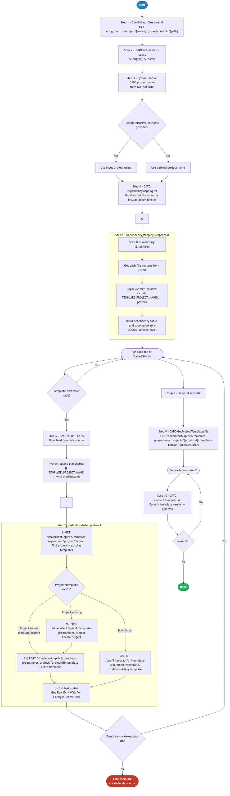

# 4.0 — Cisco Catalyst Center: Templates GitHub Integration

> **Workflow:** `GitOps-ImportTemplates.json`
> **Type:** Cisco Catalyst Center Generic Workflow (Intent API)
> **Subworkflows:** `Get-GitHub-Directory-v2`, `Get-GitHub-File-v2`, `CATC-DependencyMapping-v1`, `CATC-CreateTemplate-v3`, `CATC-CommitTemplate-v2`, `CATC-GetProjectTemplatesIDs`
> **API Endpoints:**
> &nbsp;&nbsp;`GET  api.github.com/repos/{owner}/{repo}/contents/{path}` — retrieve directory file list from GitHub
> &nbsp;&nbsp;`GET  api.github.com/repos/{owner}/{repo}/contents/{path}/{file}` — retrieve raw Jinja2 template content from GitHub
> &nbsp;&nbsp;`GET  /dna/intent/api/v1/template-programmer/project` — find or create Template Hub project by name
> &nbsp;&nbsp;`GET  /dna/intent/api/v1/template-programmer/project/{id}/template` — check whether template already exists in project
> &nbsp;&nbsp;`POST /dna/intent/api/v1/template-programmer/project/{id}/template` — create or update a template in the project
> &nbsp;&nbsp;`POST /dna/intent/api/v1/template-programmer/template/version` — commit and version (publish) each template
> **Minimum Catalyst Center version:** 2.3.7.9
> **Authors:** Keith Baldwin — Solutions Engineer - Automation HyperSpecialist (kebaldwi@cisco.com)
> **Copyright © 2024–2026 Cisco Systems, Inc. All rights reserved.**

---

## Table of Contents

1. [Overview](#overview)
   - [What it does](#what-it-does)
   - [What makes this workflow different](#what-makes-this-workflow-different)
   - [Logical Flow](#logical-flow)
2. [Prerequisites](#prerequisites)
3. [Directory Structure](#directory-structure)
4. [Workflow Input Parameters](#workflow-input-parameters)
5. [Input Data — Jinja2 Templates](#input-data--jinja2-templates)
6. [How It Works](#how-it-works)
   - [Step 1 — Retrieve GitHub Directory Listing](#step-1--retrieve-github-directory-listing)
   - [Step 2 — Extract File List and Determine Project Name](#step-2--extract-file-list-and-determine-project-name)
   - [Step 3 — Python Script: Derive CATC-ProjectName](#step-3--python-script-derive-catc-projectname)
   - [Step 4 — CATC-DependencyMapping-v1: Dependency-Ordered Import List](#step-4--catc-dependencymapping-v1-dependency-ordered-import-list)
   - [Step 5 — Loop: Filter and Retrieve Each Template File](#step-5--loop-filter-and-retrieve-each-template-file)
   - [Step 6 — Process and Import Each Template](#step-6--process-and-import-each-template)
   - [Step 7 — Post-Loop: Retrieve and Commit All Template IDs](#step-7--post-loop-retrieve-and-commit-all-template-ids)
7. [Template Creation API Payload Reference](#template-creation-api-payload-reference)
8. [Running the Workflow](#running-the-workflow)
9. [Expected Output](#expected-output)
10. [Workflow Ordering Dependency](#workflow-ordering-dependency)
11. [Troubleshooting](#troubleshooting)

---

## Overview

This Cisco Catalyst Center workflow imports Jinja2 (`.j2`) and Velocity (`.vm`) template files stored in a GitHub repository directly into the Catalyst Center Template Hub. It creates or updates the target Template Hub project, performs a dependency analysis to determine safe import order, retrieves each template file from GitHub, processes placeholder text, and commits every template to make it available for provisioning.

The workflow enables a full GitOps model for template management — templates are authored and version-controlled in GitHub, and the workflow synchronizes those templates into Catalyst Center on demand. This eliminates manual copy-paste operations and ensures the Template Hub always reflects the current state of the source repository.

### What it does

| Action | Mechanism |
|--------|-----------|
| List files in GitHub directory | `Get-GitHub-Directory-v2` — `GET api.github.com/repos/{owner}/{repo}/contents/{path}` |
| Extract file list and count | `JSONPath Query` — `$.length()` → `NumberFiles`; `$..name` → `GithubFileList` |
| Derive CatC project name | `Execute Python Script` — extracts last path segment, strips non-alpha characters → `CATC-ProjectName` |
| Determine project name source | `Condition` — if `TemplateHubProjectName` provided: use it; else: use Python-derived path segment |
| Analyze template dependencies | `CATC-DependencyMapping-v1` — parses each `.j2`/`.vm` file for `` or `#parse` references; reorders `GithubFileList` so dependencies import first |
| Filter to valid template files | `For Each` loop + `Condition` — only `.j2`, `.vm`, and `.json` extensions proceed |
| Retrieve template content | `Get-GitHub-File-v2` — `GET .../{file}` with `Accept: application/vnd.github.raw+json` |
| Process template placeholder | `Execute Python Script` — replaces `{{ TEMPLATE_PROJECT_NAME }}` with `ProjectName` in template body |
| Create or update template | `CATC-CreateTemplate-v3` → `GET project` + `GET templates` + conditional `POST template` |
| Retrieve all project template IDs | `CATC-GetProjectTemplatesIDs` → `GET /dna/intent/api/v1/template-programmer/project` + `JSONPath` → `TemplateListIDs` |
| Commit and version each template | `For Each` over `TemplateListIDs` → `CATC-CommitTemplate-v2` → `POST /dna/intent/api/v1/template-programmer/template/version` |
| Allow Template Hub to settle | `Sleep 30 s` after import loop completes |

### What makes this workflow different

Unlike manual template creation through the Catalyst Center UI, this workflow:

1. **Synchronizes templates directly from GitHub** — any `.j2` or `.vm` file committed to the specified GitHub path is automatically imported into the Template Hub. No copy-paste or manual upload is needed.
2. **Dependency-aware import ordering** — the `CATC-DependencyMapping-v1` subworkflow analyzes template include/parse directives before the import loop begins, ensuring that referenced templates are imported before the templates that depend on them. This prevents broken template references inside Catalyst Center.
3. **Placeholder substitution** — a Python script replaces the `{{ TEMPLATE_PROJECT_NAME }}` placeholder in template content with the actual project name at import time, eliminating hardcoded project references in the template source.
4. **Idempotent operation** — the `CATC-CreateTemplate-v3` subworkflow checks whether the template already exists in the project before creating it. When `FORCE Update = false`, existing templates are left unchanged; when `true`, they are overwritten.
5. **Automatic commit / versioning** — after all templates are imported, a second loop retrieves every template ID in the project and calls `CATC-CommitTemplate-v2` on each one to publish them. Templates must be committed before they can be used in provisioning or composite templates.
6. **Integrates with GitOps pipeline** — template changes are committed to GitHub first, then propagated to CatC via workflow execution. The Template Hub always matches the authoritative source in GitHub.

### Logical Flow

The diagram below shows every decision point and loop from startup to completion, including the dependency mapping subgraph, the per-file retrieval and processing steps, the CATC-CreateTemplate-v3 sequence, and the final commit loop:



> Source: [`DIAGRAMS/logical-flow.mmd`](DIAGRAMS/logical-flow.mmd) — re-render with:
> ```bash
> npx -y @mermaid-js/mermaid-cli -i DIAGRAMS/logical-flow.mmd -o DIAGRAMS/logical-flow.png -w 885 -b white
> ```

---

## Prerequisites

| Requirement | Notes |
|-------------|-------|
| Cisco Catalyst Center | >= 2.3.7.9 |
| Workflow 1.0 — Site Hierarchy | Site hierarchy must exist in CatC (required for template device type context) |
| GitHub repository | Must contain `.j2` or `.vm` Jinja2/Velocity template files in the specified path |
| GitHub API access | CatC must be able to reach `api.github.com` (or configured GitHub Enterprise host) |
| Catalyst Center API access | CatC Template Programmer API endpoints must be accessible and authenticated |
| Sufficient privileges in CatC | User/service account must have permission to create, update, and commit templates in the Template Hub |
| Template file naming | Template filenames must not contain characters that are invalid in CatC template names (avoid spaces, special characters beyond `.` and `-`) |

---

## Directory Structure

```
4.0 Cisco Catalyst Center: Templates GitHub Integration/
├── GitOps-ImportTemplates.json        # Catalyst Center workflow definition (import via CatC UI)
├── DIAGRAMS/
│   ├── logical-flow.mmd               # Mermaid diagram source — re-render with npx mermaid-cli
│   └── logical-flow.png               # Rendered flowchart (referenced by this README)
└── README.md                          # This document
```

Template source files are stored in GitHub:

```
Projects/
└── BGP_EVPN/
    └── DayNTemplates/
        ├── BGP-EVPN-BUILD.j2          # Primary Jinja2 Day-N template
        ├── DEFN-CLIENT-PORTS.j2       # Shared definition template (dependency)
        ├── DEFN-VRF.j2                # Shared VRF definition template
        ├── FABRIC-EVPN.j2             # Fabric EVPN configuration template
        └── (additional .j2 files)     # All .j2 and .vm files in the directory are imported
```

---

## Workflow Input Parameters

These parameters are entered when the workflow is launched from the Catalyst Center UI or triggered via the Workflow API.

| Parameter | Type | Default | Description |
|-----------|------|---------|-------------|
| `GITHUB-OWNER` | string | `kebaldwi` | GitHub account or organization that owns the repository |
| `GITHUB-REPO` | string | `TECOPS-2599` | Repository name containing the template files |
| `GITHUB-PATH` | string | `Projects/BGP_EVPN/DayNTemplates` | Path within the repository to the folder containing `.j2`/`.vm` template files |
| `TemplateHubProjectName` | string | `BGP_EVPN` | If provided, this name is used directly as both the `ProjectName` and `CATC-ProjectName` in the Template Hub. If left empty, the name is derived from the last segment of `GITHUB-PATH` |
| `FORCE Update` | string (`true`/`false`) | `false` | If `true`, existing templates in the project are overwritten with the GitHub version. If `false`, templates that already exist in the project are skipped |

---

## Input Data — Jinja2 Templates

The workflow imports raw Jinja2 (`.j2`) or Velocity (`.vm`) template files directly from the GitHub path. No structured JSON settings file is read — the template source files themselves are the input.

### Supported File Types

| Extension | Template Language | Notes |
|-----------|------------------|-------|
| `.j2` | Jinja2 | Primary format used for Cisco IOS-XE device configuration templates |
| `.vm` | Velocity | Alternative template language supported by Catalyst Center Template Hub |
| `.json` | JSON | JSON-format template definitions; also accepted by the file filter |

Files with any other extension (e.g., `.md`, `.yml`, `.txt`) are silently skipped by the `For Each GitHub File` loop condition.

### Template Placeholder

Templates may contain the placeholder `{{ TEMPLATE_PROJECT_NAME }}`, which is substituted with the resolved `ProjectName` value during import. This allows a single template to be reused across multiple projects without modification:

```jinja2
{# BGP-EVPN-BUILD.j2 — project: {{ TEMPLATE_PROJECT_NAME }} #}

```

After substitution, `{{ TEMPLATE_PROJECT_NAME }}` is replaced with the actual project name (e.g., `BGP_EVPN`) in the imported template body stored in Catalyst Center.

### Template Include / Dependency Directives

Templates may reference other templates using Jinja2 include syntax. These references are detected by `CATC-DependencyMapping-v1` to determine safe import ordering:

```jinja2


```

Referenced templates are added to the beginning of the import list so they are available in Catalyst Center before the template that depends on them is imported.

---

## How It Works

### Step 1 — Retrieve GitHub Directory Listing

The `Get-GitHub-Directory-v2` subworkflow calls the GitHub Contents API:

```
GET https://api.github.com/repos/{GITHUB_OWNER}/{GITHUB_REPO}/contents/{GITHUB_PATH}
```

This returns metadata for all files in the directory (not recursive). The response structure includes `name`, `type`, and `size` for each entry. Authentication uses Basic credentials (GitHub token) configured in the CatC HTTP target.

---

### Step 2 — Extract File List and Determine Project Name

A JSONPath query activity extracts data from the directory response:

```
$.length()  → NumberFiles      (integer count of entries)
$..name     → GithubFileList   (array of filenames)
```

These results are stored in workflow variables for use in subsequent steps.

---

### Step 3 — Python Script: Derive CATC-ProjectName

A Python script processes the `GITHUB-PATH` input to extract the final directory segment and strip any non-alphanumeric characters from it:

```python
# Example: "Projects/BGP_EVPN/DayNTemplates" → "DayNTemplates"
last_segment = github_path.split("/")[-1]
project_name = re.sub(r'[^a-zA-Z0-9_-]', '', last_segment)
```

A condition then selects which project name to use:

| Branch | Condition | Result |
|--------|-----------|--------|
| Branch A | `TemplateHubProjectName` is empty | `ProjectName = GITHUB-PATH`, `CATC-ProjectName = Python-derived segment` |
| Branch B | `TemplateHubProjectName` is provided | `ProjectName = TemplateHubProjectName`, `CATC-ProjectName = TemplateHubProjectName` |

Both branches also store `GithubFileList` and `NumberFiles` into workflow variables.

---

### Step 4 — CATC-DependencyMapping-v1: Dependency-Ordered Import List

Before the import loop begins, the `CATC-DependencyMapping-v1` subworkflow analyses the content of every template file in the GitHub directory:

**Inputs:** `GITHUB-OWNER`, `GITHUB-REPO`, `GITHUB-PATH`, `TemplateHubProjectName`, `FORCE Update`

**Algorithm:**
1. For each file in `GithubFileList`, retrieve its raw content from GitHub.
2. Parse the content for dependency directives (`` in Jinja2; `#parse('...')` in Velocity).
3. Build a directed dependency graph where each template lists its dependencies.
4. Produce a topologically sorted `GithubFileList` where referenced templates appear before the templates that include them.

**Output:** An updated `GithubFileList` in dependency-safe import order.

A `Set Variables` activity after the subworkflow updates the main `GithubFileList` variable with the reordered list. All subsequent iterations in Steps 5 and 6 use this dependency-ordered list.

---

### Step 5 — Loop: Filter and Retrieve Each Template File

A `For Each GitHub File` loop iterates over every entry in the dependency-ordered `GithubFileList`. For each file, a condition checks the file extension:

**Extension filter condition:**
```
if file.endswith('.j2') OR file.endswith('.vm') OR file.endswith('.json'):
    proceed to Step 6
else:
    skip (continue to next file)
```

Files that pass the filter proceed through a three-stage processing sequence.

---

### Step 6 — Process and Import Each Template

For each file that passes the extension filter, three activities run before the import subworkflow:

#### Activity 6a — Get-GitHub-File-v2

```
GET https://api.github.com/repos/{GITHUB_OWNER}/{GITHUB_REPO}/contents/{GITHUB_PATH}/{file}

Headers:
  Accept: application/vnd.github.raw+json
  X-GitHub-Api-Version: 2022-11-28
```

Returns the raw template content (Jinja2 or Velocity source) directly as a string.

#### Activity 6b — Python Script: Placeholder Substitution

A Python script processes the raw template content and replaces the `{{ TEMPLATE_PROJECT_NAME }}` marker with the resolved `ProjectName`:

```python
output = template_body.replace("{{ TEMPLATE_PROJECT_NAME }}", project_name)
```

The output is the processed template body ready for import.

#### Activity 6c — Set File Data

```
OUTPUT       = processed template body (from 6b)
TemplateName = current filename (e.g., "BGP-EVPN-BUILD.j2")
```

#### Activity 6d — CATC-CreateTemplate-v3 Subworkflow (4-step API sequence)

**1) Find or create the Template Hub project**
```
GET /dna/intent/api/v1/template-programmer/project?name={CATC-ProjectName}
```
If no project is found, the subworkflow creates one. The `projectId` is extracted for use in subsequent calls.

**2) Check if template already exists in the project**
```
GET /dna/intent/api/v1/template-programmer/project/{projectId}/template
```
Searches for a template with the same `TemplateName`. The result determines the next branch.

**3a) Skip — template exists and `FORCE Update = false`**

If a template with the same name is already present and `FORCE Update` is `false`, the subworkflow returns without making changes. The next file in the loop is processed.

**3b) Create or overwrite template — template missing or `FORCE Update = true`**
```
POST /dna/intent/api/v1/template-programmer/project/{projectId}/template
Body:
{
  "name": "BGP-EVPN-BUILD.j2",
  "language": "JINJA",
  "softwareType": "IOS-XE",
  "templateContent": "<processed Jinja2 content>",
  "deviceTypes": [
    { "productFamily": "Switches and Hubs", "productSeries": "Cisco Catalyst 9000 Series Switches" },
    { "productFamily": "Switches and Hubs", "productSeries": "Cisco Catalyst 9300 Series Switches" },
    { "productFamily": "Switches and Hubs", "productSeries": "Cisco Catalyst 9400 Series Switches" },
    { "productFamily": "Switches and Hubs", "productSeries": "Cisco Catalyst 9500 Series Switches" }
  ]
}
```

**4) Return template create / update result**

The subworkflow returns the result of the create or skip operation to the main workflow loop.

---

### Step 7 — Post-Loop: Retrieve and Commit All Template IDs

After all template files have been imported, the workflow executes the commit phase:

#### Sleep 30 Seconds

Allows the Catalyst Center Template Hub to finish processing all newly created or updated templates before the commit loop begins.

#### CATC-GetProjectTemplatesIDs

```
GET /dna/intent/api/v1/template-programmer/project?name={CATC-ProjectName}
```

Returns all project metadata including the list of templates. A JSONPath query extracts all template IDs:

```
$.response..templates[*].id  →  ListTemplateId (array)
```

The `ListTemplateId` array is stored in `TemplateListIDs`.

#### For Each Template in TemplateListIDs — CATC-CommitTemplate-v2

```
POST /dna/intent/api/v1/template-programmer/template/version
Body:
{
  "templateId": "<current_template_id>"
}
```

This commits and versions the template, changing its status from `DRAFT` to `PUBLISHED`. Templates must be published before they can be referenced in composite templates (Workflow 5.0) or assigned to network profiles (Workflow 6.0).

The loop repeats for every template ID in `TemplateListIDs`.

---

## Template Creation API Payload Reference

### Create Template

Submitted to `POST /dna/intent/api/v1/template-programmer/project/{id}/template`:

```json
{
  "name": "BGP-EVPN-BUILD.j2",
  "language": "JINJA",
  "softwareType": "IOS-XE",
  "templateContent": "\n...<jinja2 content>...",
  "deviceTypes": [
    {
      "productFamily": "Switches and Hubs",
      "productSeries": "Cisco Catalyst 9000 Series Switches"
    }
  ]
}
```

**Key field notes:**

| Field | Notes |
|-------|-------|
| `name` | The template filename from GitHub (e.g., `BGP-EVPN-BUILD.j2`). This is the display name in the Template Hub. |
| `language` | `JINJA` for `.j2` files; `VELOCITY` for `.vm` files. Set automatically based on file extension. |
| `softwareType` | Target device OS. Set to `IOS-XE` for Catalyst 9000-series switches. |
| `templateContent` | The raw Jinja2 or Velocity source after placeholder substitution. |
| `deviceTypes` | Array of target device platform/series pairs. The workflow targets Catalyst 9000/9300/9400/9500 series. |

### Commit Template

Submitted to `POST /dna/intent/api/v1/template-programmer/template/version`:

```json
{
  "templateId": "a1b2c3d4-e5f6-7890-abcd-ef1234567890"
}
```

**Response on successful commit:**
```json
{
  "response": {
    "taskId": "<task_uuid>",
    "url": "/api/v1/task/<task_uuid>"
  },
  "version": "1.0"
}
```

A committed template receives an incremented version number. Re-importing and committing the same template creates a new version while preserving the previous version history.

---

## Running the Workflow

### Import the Workflow

1. In Catalyst Center, navigate to **Platform → Workflow Manager**.
2. Click **Import** and upload `GitOps-ImportTemplates.json`.
3. The workflow appears as **GitOps-ImportTemplates** in the workflow list.

### Execute the Workflow

1. Click **Run** on the imported workflow.
2. Select the **Catalyst Center target** when prompted.
3. Fill in the input parameters:
   - **GITHUB-OWNER:** `kebaldwi`
   - **GITHUB-REPO:** `TECOPS-2599`
   - **GITHUB-PATH:** `Projects/BGP_EVPN/DayNTemplates`
   - **TemplateHubProjectName:** `BGP_EVPN`
   - **FORCE Update:** `false` (set to `true` to overwrite existing templates)
4. Click **Execute**.
5. Monitor progress in **Workflow Executions** → **Execution Details**.

### Trigger via API

```bash
POST /dna/intent/api/v1/workflow-manager/workflows/{workflowId}/run
{
  "inputParameters": {
    "GITHUB-OWNER": "kebaldwi",
    "GITHUB-REPO": "TECOPS-2599",
    "GITHUB-PATH": "Projects/BGP_EVPN/DayNTemplates",
    "TemplateHubProjectName": "BGP_EVPN",
    "FORCE Update": "false"
  }
}
```

---

## Expected Output

A successful run produces the following sequence in the workflow execution log:

```
Step 1       GitHub directory retrieved: /kebaldwi/TECOPS-2599/Projects/BGP_EVPN/DayNTemplates
Step 2       File list extracted: 20 files found
             GithubFileList: [BGP-EVPN-BUILD.j2, DEFN-CLIENT-PORTS.j2, ...]
Step 3       Python script: CATC-ProjectName = BGP_EVPN
             TemplateHubProjectName provided → Branch B selected
             ProjectName = BGP_EVPN
Step 4       CATC-DependencyMapping-v1: dependency analysis complete
             Reordered import list: [DEFN-CLIENT-PORTS.j2, DEFN-VRF.j2, ..., BGP-EVPN-BUILD.j2]
Step 5/6     Processing file: DEFN-CLIENT-PORTS.j2 (.j2 — accepted)
             Content retrieved from GitHub
             Placeholder substitution complete
             CATC-CreateTemplate-v3: template created in project BGP_EVPN ✓
Step 5/6     Processing file: README.md (.md — skipped)
Step 5/6     Processing file: BGP-EVPN-BUILD.j2 (.j2 — accepted)
             Content retrieved from GitHub
             Placeholder substitution complete
             CATC-CreateTemplate-v3: template created in project BGP_EVPN ✓
             ... (repeats for all .j2 files)
Step 7       Sleep 30 s — Template Hub settling
             CATC-GetProjectTemplatesIDs → 18 template IDs collected
             Commit loop — committing template 1/18 ✓
             Commit loop — committing template 2/18 ✓
             ... (repeats for all templates)
             Commit loop — committing template 18/18 ✓
Completed    All templates imported and committed successfully
             Total imported: 18
             Total skipped: 2 (non-.j2 files)
             Total committed: 18
```

---

## Workflow Ordering Dependency

This workflow is the **fourth** in the GitOps provisioning suite. It must run before Workflow 5.0 (Composite Templates) and Workflow 6.0 (Network Profile), because both require individual templates to already exist in the Template Hub before they can be referenced as composite members or profile assignments.

| Workflow | Purpose | Depends on | Required before |
|----------|---------|------------|-----------------|
| 1.0 — Site Hierarchy | Creates Area / Building / Floor hierarchy | — | Yes — must run first |
| 2.0 — Settings and Credentials | Applies network settings and global credentials | 1.0 | Yes — must run before 3.0 |
| 3.0 — Device Discovery | Discovers devices and assigns them to site | 1.0, 2.0 | — |
| **4.0 — This workflow** | Imports Jinja2 templates from GitHub into Template Hub | 1.0 | **Yes — must run before 5.0 and 6.0** |
| 5.0 — Templates Composite | Builds composite templates from individually imported templates | 1.0, 4.0 | Yes — must run before 7.0 |
| 6.0 — Network Profile | Creates network profiles and assigns templates to sites | 1.0, 2.0, 4.0 | Yes — must run before 7.0 |
| 7.0 — Provision Composite | Provisions devices and deploys composite templates | 1.0–6.0 | — |

---

## Troubleshooting

| Symptom | Likely Cause | Resolution |
|---------|-------------|------------|
| `GitHub directory retrieval fails` | Repository is private, wrong path, or CatC cannot reach GitHub | Verify `GITHUB-OWNER`, `GITHUB-REPO`, `GITHUB-PATH`. Check CatC outbound internet connectivity (`ping api.github.com`). |
| `No .j2 or .vm files found` | The specified `GITHUB-PATH` contains no files matching the extension filter | Verify the path contains Jinja2 or Velocity files. Check file extensions — only `.j2`, `.vm`, and `.json` pass the filter. |
| `Template creation fails — 400 error` | Template name contains invalid characters, or `softwareType` mismatch | Template names should only contain alphanumeric characters, hyphens, and dots. Verify the target device type is supported by the Template Programmer API. |
| `Template exists but FORCE Update is false` | Existing template is not overwritten when `FORCE Update = false` | This is expected behavior (idempotent). Set `FORCE Update = true` to overwrite existing templates with the latest GitHub version. |
| `Dependency mapping loop takes too long` | Large number of template files with deep include chains | Dependency analysis is proportional to file count and include depth. For large template sets, reduce the directory scope or split templates across multiple paths. |
| `Template commit fails` | Template was created but contains syntax errors that prevent publishing | Check the template content in the CatC Template Hub UI. Navigate to the template, click **Edit**, and use the built-in validator to identify Jinja2 syntax issues. |
| `Placeholder not substituted` | Template does not contain `{{ TEMPLATE_PROJECT_NAME }}` or Python script error | The placeholder substitution is only applied to the exact string `{{ TEMPLATE_PROJECT_NAME }}`. Verify the template source uses this exact string if substitution is required. Check Python script execution status in the workflow log. |
| `All templates imported but none appear in Composite Template workflow` | Templates were not committed (still in DRAFT state) | Verify the commit loop completed successfully. In CatC Template Hub, confirm each template shows **Published** status. Re-run the workflow if needed. |
| `Wrong project name used in Template Hub` | `TemplateHubProjectName` and `GITHUB-PATH` both affect project naming | If `TemplateHubProjectName` is provided, it always overrides the Python-derived name. Verify the parameter value matches the desired Template Hub project name exactly. |

---

## Additional Notes

- **Template versioning:** Each time a template is committed, Catalyst Center increments its version number. The Template Hub maintains full version history, allowing rollback to previous template versions via the UI or API.
- **Dependency ordering safety:** The `CATC-DependencyMapping-v1` subworkflow only reorders the import sequence — it does not modify template content. Templates that have no dependencies are placed after dependency templates in the list.
- **File extension case sensitivity:** The extension filter compares using lowercase matching. Ensure template files use lowercase extensions (`.j2`, `.vm`) to match the filter correctly.
- **Multiple template directories:** To import templates from multiple GitHub paths into different Template Hub projects, run the workflow multiple times with different `GITHUB-PATH` and `TemplateHubProjectName` values.
- **Template Hub project creation:** If the named project does not exist in Catalyst Center, `CATC-CreateTemplate-v3` automatically creates it. This means the workflow is fully self-provisioning for new environments.
- **Re-running the workflow:** Re-running with `FORCE Update = false` is safe — existing templates are skipped and only new files are imported. Running with `FORCE Update = true` replaces all templates with their current GitHub versions and recommits them, creating a new version entry for each.
