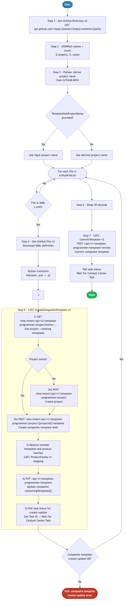

# 5.0 — Cisco Catalyst Center: Templates Composite

> **Workflow:** `GitOps-BuildCompositeTemplate.json`
> **Type:** Cisco Catalyst Center Generic Workflow (Intent API)
> **Subworkflows:** `Get-GitHub-Directory-v2`, `Get-GitHub-File-v2`, `CATC-CreateCompositeTemplate-v3`, `CATC-CommitTemplate-v2`
> **API Endpoints:**
> &nbsp;&nbsp;`GET  api.github.com/repos/{owner}/{repo}/contents/{path}` — retrieve directory file list from GitHub
> &nbsp;&nbsp;`GET  api.github.com/repos/{owner}/{repo}/contents/{path}/{file}` — retrieve raw YAML composite template definition from GitHub
> &nbsp;&nbsp;`GET  /dna/intent/api/v1/template-programmer/project` — find or create Template Hub project by name
> &nbsp;&nbsp;`GET  /dna/intent/api/v1/template-programmer/project/{id}/template` — check whether composite template already exists
> &nbsp;&nbsp;`GET  /dna/intent/api/v1/template-programmer/template` — resolve member template names to IDs
> &nbsp;&nbsp;`POST /dna/intent/api/v1/template-programmer/project/{id}/template` — create the composite template with ordered member references
> &nbsp;&nbsp;`POST /dna/intent/api/v1/template-programmer/template/version` — commit and version (publish) the composite template
> **Minimum Catalyst Center version:** 2.3.7.9
> **Authors:** Keith Baldwin — Solutions Engineer - Automation HyperSpecialist (kebaldwi@cisco.com)
> **Copyright © 2024–2026 Cisco Systems, Inc. All rights reserved.**

---

## Table of Contents

1. [Overview](#overview)
   - [What it does](#what-it-does)
   - [What makes this workflow different](#what-makes-this-workflow-different)
   - [Logical Flow](#logical-flow)
2. [Prerequisites](#prerequisites)
3. [Directory Structure](#directory-structure)
4. [Workflow Input Parameters](#workflow-input-parameters)
5. [Input Data Structure — YAML Composite Definition](#input-data-structure--yaml-composite-definition)
6. [How It Works](#how-it-works)
   - [Step 1 — Retrieve GitHub Directory Listing](#step-1--retrieve-github-directory-listing)
   - [Step 2 — Extract File List and Determine Project Name](#step-2--extract-file-list-and-determine-project-name)
   - [Step 3 — Python Script: Derive CATC-ProjectName](#step-3--python-script-derive-catc-projectname)
   - [Step 4 — Loop: Filter and Process YAML Files](#step-4--loop-filter-and-process-yaml-files)
   - [Step 5 — Process Each YAML Composite Definition](#step-5--process-each-yaml-composite-definition)
   - [Step 6 — Commit the Composite Template](#step-6--commit-the-composite-template)
7. [Composite Template API Payload Reference](#composite-template-api-payload-reference)
8. [Running the Workflow](#running-the-workflow)
9. [Expected Output](#expected-output)
10. [Workflow Ordering Dependency](#workflow-ordering-dependency)
11. [Troubleshooting](#troubleshooting)

---

## Overview

This Cisco Catalyst Center workflow creates **composite templates** in the Catalyst Center Template Hub from YAML definition files stored in a GitHub repository. A composite template is a logical grouping of individually imported Jinja2/Velocity templates that are deployed together as an ordered sequence to a device. Composite templates are required for provisioning workflows because they bundle multiple configuration templates into a single deployable unit.

The workflow reads `.yml` YAML definition files from GitHub, each of which describes the ordered sequence of member templates that form the composite. For each YAML file, the workflow resolves the referenced member template names to their Template Hub IDs, creates the composite template in Catalyst Center, and then commits it for publishing. This allows composite template structure to be version-controlled in GitHub and synchronized into Catalyst Center on demand.

### What it does

| Action | Mechanism |
|--------|-----------|
| List files in GitHub directory | `Get-GitHub-Directory-v2` — `GET api.github.com/repos/{owner}/{repo}/contents/{path}` |
| Extract file list and count | `JSONPath Query` — `$.length()` → `NumberFiles`; `$..name` → `GithubFileList` |
| Derive CatC project name | `Execute Python Script` — extracts last path segment, strips non-alpha characters → `CATC-ProjectName` |
| Determine project name source | `Condition` — if `TemplateHubProjectName` provided: use it; else: use Python-derived path segment |
| Filter to YAML files only | `For Each` loop + `Condition` — only `.yml` files proceed |
| Retrieve YAML composite definition | `Get-GitHub-File-v2` — `GET .../{file}` with `Accept: application/vnd.github.raw+json` |
| Derive member template name | `Execute Python Script` — replaces `.yml` extension with `.j2` → `TemplateName` |
| Create composite template | `CATC-CreateCompositeTemplate-v3` → `GET project` + `GET templates` + resolve member IDs + conditional `POST template` |
| Commit composite template | `CATC-CommitTemplate-v2` → `POST /dna/intent/api/v1/template-programmer/template/version` |
| Allow Template Hub to settle | `Sleep 30 s` after composite creation loop |

### What makes this workflow different

Unlike manually assembling composite templates through the Catalyst Center UI, this workflow:

1. **Defines composite structure in GitHub** — the membership and sequencing of a composite template is declared in a YAML file committed to GitHub. This makes composite template structure version-controlled and auditable alongside the template source files.
2. **Automatically resolves member template IDs at runtime** — rather than hardcoding UUID references, the `CATC-CreateCompositeTemplate-v3` subworkflow calls `GET /dna/intent/api/v1/template-programmer/template` at runtime and resolves each member template name to its current Template Hub ID. This makes the workflow portable across environments.
3. **Maintains member template ordering** — the YAML definition specifies the exact sequence in which member templates are assembled. The composite is created with `containingTemplates` in the same order, ensuring deterministic configuration deployment.
4. **Idempotent composite creation** — the subworkflow checks for an existing composite with the same name before creating. If `FORCE Update = false` and the composite already exists, it is skipped. If `FORCE Update = true`, the existing composite is replaced.
5. **Automatic commit after creation** — unlike Workflow 4.0, which mass-commits all templates in the project at the end, this workflow commits only the composite template it just created, immediately after creation. This allows targeted re-runs without recommitting unrelated templates.
6. **Integrates with GitOps pipeline** — composite template changes are committed to GitHub first, then synchronized into Catalyst Center by running this workflow.

### Logical Flow

The diagram below shows every decision point and loop from startup to completion, including the project name determination branches, the YAML-only file filter, the CATC-CreateCompositeTemplate-v3 sequence with member ID resolution, and the final commit step:



> Source: [`DIAGRAMS/logical-flow.mmd`](DIAGRAMS/logical-flow.mmd) — re-render with:
> ```bash
> npx -y @mermaid-js/mermaid-cli -i DIAGRAMS/logical-flow.mmd -o DIAGRAMS/logical-flow.png -w 885 -b white
> ```

---

## Prerequisites

| Requirement | Notes |
|-------------|-------|
| Cisco Catalyst Center | >= 2.3.7.9 |
| Workflow 1.0 — Site Hierarchy | Site hierarchy must exist in CatC |
| Workflow 4.0 — Templates GitHub Integration | All member templates referenced in the YAML composite definition must already be imported and committed in the Catalyst Center Template Hub before this workflow runs |
| GitHub repository | Must contain `.yml` YAML composite definition files in the specified path |
| GitHub API access | CatC must be able to reach `api.github.com` (or configured GitHub Enterprise host) |
| Catalyst Center API access | CatC Template Programmer API endpoints must be accessible and authenticated |
| Sufficient privileges in CatC | User/service account must have permission to create and commit composite templates in the Template Hub |

---

## Directory Structure

```
5.0 Cisco Catalyst Center: Templates Composite/
├── GitOps-BuildCompositeTemplate.json  # Catalyst Center workflow definition (import via CatC UI)
├── DIAGRAMS/
│   ├── logical-flow.mmd                # Mermaid diagram source — re-render with npx mermaid-cli
│   └── logical-flow.png                # Rendered flowchart (referenced by this README)
└── README.md                           # This document
```

Composite template definition files are stored in GitHub alongside the individual templates they reference:

```
Projects/
└── BGP_EVPN/
    └── DayNTemplates/
        ├── BGP-EVPN-BUILD.yml          # YAML composite definition → maps to BGP-EVPN-BUILD.j2 members
        ├── BGP-EVPN-BUILD.j2           # Individual template (imported by Workflow 4.0)
        ├── DEFN-CLIENT-PORTS.j2        # Member template referenced in the composite
        └── (other .j2 and .yml files)
```

> **Note:** Each `.yml` file defines one composite template. The `.j2` member templates it references must already exist in the Template Hub (created by Workflow 4.0) before this workflow runs.

---

## Workflow Input Parameters

These parameters are entered when the workflow is launched from the Catalyst Center UI or triggered via the Workflow API.

| Parameter | Type | Default | Description |
|-----------|------|---------|-------------|
| `GITHUB-OWNER` | string | `kebaldwi` | GitHub account or organization that owns the repository |
| `GITHUB-REPO` | string | `TECOPS-2599` | Repository name containing the YAML composite definition files |
| `GITHUB-PATH` | string | `Projects/BGP_EVPN/DayNTemplates` | Path within the repository to the folder containing `.yml` composite definition files |
| `TemplateHubProjectName` | string | `BGP_EVPN` | If provided, used directly as `ProjectName` and `CATC-ProjectName`. If empty, derived from the last segment of `GITHUB-PATH` |
| `FORCE Update` | string (`true`/`false`) | `false` | If `true`, existing composite templates are overwritten with the GitHub definition. If `false`, existing composites are skipped |

---

## Input Data Structure — YAML Composite Definition

The workflow reads `.yml` YAML files from the specified GitHub path. Each YAML file defines one composite template — specifying its name, the project it belongs to, and the ordered sequence of member templates that make up its deployment payload.

### YAML Schema

```yaml
# BGP-EVPN-BUILD.yml
composite:
  name: BGP-EVPN-BUILD          # Name of the composite template in the Template Hub
  project: BGP_EVPN             # Template Hub project the composite belongs to
  description: "BGP EVPN Build composite for Catalyst 9000 fabric"
  sequence:
    - template: DEFN-CLIENT-PORTS.j2    # Member 1 — runs first
    - template: DEFN-VRF.j2             # Member 2
    - template: FABRIC-EVPN.j2          # Member 3
    - template: FABRIC-NVE.j2           # Member 4
    - template: BGP-EVPN-BUILD.j2       # Member 5 — main build template (runs last)
```

### Field Definitions

| Field | Type | Required | Description |
|-------|------|----------|-------------|
| `composite.name` | string | Yes | The name of the composite template as it will appear in the Catalyst Center Template Hub. Typically matches the YAML filename without the `.yml` extension. |
| `composite.project` | string | Yes | Name of the Template Hub project that owns this composite template. Should match the `TemplateHubProjectName` workflow input. |
| `composite.description` | string | No | Human-readable description of the composite template's purpose, shown in the Template Hub UI. |
| `composite.sequence[].template` | string | Yes | Filename of each member template (including `.j2` or `.vm` extension) in the order they will be deployed. Each name is resolved to a Template Hub UUID at runtime. |

### How the YAML Drives the Composite

When `CATC-CreateCompositeTemplate-v3` processes the YAML body:

1. It parses the `sequence` array to extract member template names in order.
2. For each member name, it calls `GET /dna/intent/api/v1/template-programmer/template` and searches for a template matching that name in the project.
3. The resolved UUID of each member is added to the `containingTemplates` array in sequence order.
4. The composite template `POST` body is assembled with the ordered `containingTemplates` list.

This means the physical deployment order of configuration blocks to a device matches the `sequence` order in the YAML definition.

---

## How It Works

### Step 1 — Retrieve GitHub Directory Listing

The `Get-GitHub-Directory-v2` subworkflow calls the GitHub Contents API:

```
GET https://api.github.com/repos/{GITHUB_OWNER}/{GITHUB_REPO}/contents/{GITHUB_PATH}
```

Returns metadata for all files in the directory. The response includes `name`, `type`, and `size` for each entry.

---

### Step 2 — Extract File List and Determine Project Name

A JSONPath query extracts file metadata:

```
$.length()  → NumberFiles      (integer count)
$..name     → GithubFileList   (array of filenames)
```

---

### Step 3 — Python Script: Derive CATC-ProjectName

A Python script extracts the last path segment from `GITHUB-PATH` and strips non-alphanumeric characters to produce a safe project name. A condition then selects which name to use:

| Branch | Condition | Result |
|--------|-----------|--------|
| Branch A | `TemplateHubProjectName` is empty | `ProjectName = GITHUB-PATH`; `CATC-ProjectName = Python-derived segment` |
| Branch B | `TemplateHubProjectName` is provided | `ProjectName = TemplateHubProjectName`; `CATC-ProjectName = TemplateHubProjectName` |

Both branches also set `GithubFileList` and `NumberFiles` into workflow variables.

---

### Step 4 — Loop: Filter and Process YAML Files

A `For Each` loop iterates over every entry in `GithubFileList`. For each file, a condition checks the file extension:

**Extension filter condition:**
```
if file.endswith('.yml'):
    proceed to Step 5
else:
    skip (continue to next file)
```

Only `.yml` files are processed — `.j2`, `.vm`, `.md`, and all other file types are silently skipped. This allows the workflow to operate on a mixed directory that contains both template source files and composite definition YAML files.

---

### Step 5 — Process Each YAML Composite Definition

For each `.yml` file that passes the filter, three preparation activities run before the composite creation subworkflow:

#### Activity 5a — Get-GitHub-File-v2

```
GET https://api.github.com/repos/{GITHUB_OWNER}/{GITHUB_REPO}/contents/{GITHUB_PATH}/{file}

Headers:
  Accept: application/vnd.github.raw+json
  X-GitHub-Api-Version: 2022-11-28
```

Returns the raw YAML composite definition content.

#### Activity 5b — Python Script: Derive TemplateName

A Python script replaces the `.yml` extension with `.j2` to derive the matching Jinja2 template filename used as the composite's internal name in the Template Hub:

```python
# Example: "BGP-EVPN-BUILD.yml" → "BGP-EVPN-BUILD.j2"
template_name = yaml_filename.replace('.yml', '.j2')
```

The result is stored as `TemplateName`.

#### Activity 5c — Set File Data

```
OUTPUT       = raw YAML content (from 5a)
TemplateName = .j2 filename derived from .yml (from 5b)
```

#### Activity 5d — CATC-CreateCompositeTemplate-v3 Subworkflow (5-step sequence)

**1) Find or create the Template Hub project**
```
GET /dna/intent/api/v1/template-programmer/project?name={ProjectName}
```
If no project is found, the subworkflow creates it. The `projectId` is extracted for use in subsequent calls.

**2) Check if composite template already exists**
```
GET /dna/intent/api/v1/template-programmer/project/{projectId}/template
```
Searches for a template with `TemplateName` in the project. If found and `FORCE Update = false`, the subworkflow skips to Step 5 and returns the existing `compositeId`.

**3) Parse YAML and resolve member template IDs** *(only when creating or FORCE = true)*

The YAML `sequence` array is parsed to extract member template names in order. For each name:
```
GET /dna/intent/api/v1/template-programmer/template?name={memberTemplateName}
```
The resolved UUID for each member is accumulated into an ordered `containingTemplates` array.

**4) Create the composite template**
```
POST /dna/intent/api/v1/template-programmer/project/{projectId}/template
Body:
{
  "name": "BGP-EVPN-BUILD.j2",
  "language": "JINJA",
  "softwareType": "IOS-XE",
  "composite": true,
  "containingTemplates": [
    { "id": "<uuid-DEFN-CLIENT-PORTS>", "name": "DEFN-CLIENT-PORTS.j2" },
    { "id": "<uuid-DEFN-VRF>",          "name": "DEFN-VRF.j2" },
    { "id": "<uuid-FABRIC-EVPN>",       "name": "FABRIC-EVPN.j2" },
    { "id": "<uuid-BGP-EVPN-BUILD>",    "name": "BGP-EVPN-BUILD.j2" }
  ],
  "deviceTypes": [
    { "productFamily": "Switches and Hubs", "productSeries": "Cisco Catalyst 9000 Series Switches" },
    { "productFamily": "Switches and Hubs", "productSeries": "Cisco Catalyst 9300 Series Switches" }
  ]
}
```

**5) Return compositeId**

The subworkflow returns the `compositeId` of the created or existing composite template. A `Set Variables` activity stores this in the workflow variable `CompositeId`.

---

### Step 6 — Commit the Composite Template

After the composite loop processes all `.yml` files, two final steps publish the composite:

#### Sleep 30 Seconds

Allows the Template Hub to finish processing the newly created composite before the commit call.

#### CATC-CommitTemplate-v2

```
POST /dna/intent/api/v1/template-programmer/template/version
Body:
{
  "templateId": "<CompositeId>"
}
```

Commits and versions the composite template, changing its status from `DRAFT` to `PUBLISHED`. The composite is then available for use in network profile assignments (Workflow 6.0) and device provisioning (Workflow 7.0).

> **Note:** This commit applies only to the composite template itself — not to the individual member templates. Member templates must be committed separately (Workflow 4.0 handles this in its commit loop).

---

## Composite Template API Payload Reference

### Create Composite Template

Submitted to `POST /dna/intent/api/v1/template-programmer/project/{id}/template`:

```json
{
  "name": "BGP-EVPN-BUILD.j2",
  "language": "JINJA",
  "softwareType": "IOS-XE",
  "composite": true,
  "containingTemplates": [
    {
      "id": "a1b2c3d4-0001-0001-0001-000000000001",
      "name": "DEFN-CLIENT-PORTS.j2",
      "version": "1"
    },
    {
      "id": "a1b2c3d4-0001-0001-0001-000000000002",
      "name": "DEFN-VRF.j2",
      "version": "1"
    },
    {
      "id": "a1b2c3d4-0001-0001-0001-000000000003",
      "name": "FABRIC-EVPN.j2",
      "version": "1"
    },
    {
      "id": "a1b2c3d4-0001-0001-0001-000000000004",
      "name": "BGP-EVPN-BUILD.j2",
      "version": "1"
    }
  ],
  "deviceTypes": [
    {
      "productFamily": "Switches and Hubs",
      "productSeries": "Cisco Catalyst 9000 Series Switches"
    }
  ]
}
```

**Key field notes:**

| Field | Notes |
|-------|-------|
| `composite` | Must be `true` to create a composite template. Non-composite templates are created by Workflow 4.0. |
| `containingTemplates` | Ordered array of member template objects. Deployment applies them in array order. |
| `containingTemplates[].id` | UUID of the member template resolved at runtime from `GET /dna/intent/api/v1/template-programmer/template`. |
| `name` | The composite template name. Derived from the YAML filename with `.yml` replaced by `.j2`. |

### Commit Composite Template

Submitted to `POST /dna/intent/api/v1/template-programmer/template/version`:

```json
{
  "templateId": "b5c6d7e8-f9a0-1234-5678-abcdef123456"
}
```

**Response on successful commit:**
```json
{
  "response": {
    "taskId": "<task_uuid>",
    "url": "/api/v1/task/<task_uuid>"
  },
  "version": "1.0"
}
```

---

## Running the Workflow

### Import the Workflow

1. In Catalyst Center, navigate to **Platform → Workflow Manager**.
2. Click **Import** and upload `GitOps-BuildCompositeTemplate.json`.
3. The workflow appears as **GitOps-BuildCompositeTemplate** in the workflow list.

### Execute the Workflow

1. Click **Run** on the imported workflow.
2. Select the **Catalyst Center target** when prompted.
3. Fill in the input parameters:
   - **GITHUB-OWNER:** `kebaldwi`
   - **GITHUB-REPO:** `TECOPS-2599`
   - **GITHUB-PATH:** `Projects/BGP_EVPN/DayNTemplates`
   - **TemplateHubProjectName:** `BGP_EVPN`
   - **FORCE Update:** `false` (set to `true` to overwrite existing composite)
4. Click **Execute**.
5. Monitor progress in **Workflow Executions** → **Execution Details**.

### Trigger via API

```bash
POST /dna/intent/api/v1/workflow-manager/workflows/{workflowId}/run
{
  "inputParameters": {
    "GITHUB-OWNER": "kebaldwi",
    "GITHUB-REPO": "TECOPS-2599",
    "GITHUB-PATH": "Projects/BGP_EVPN/DayNTemplates",
    "TemplateHubProjectName": "BGP_EVPN",
    "FORCE Update": "false"
  }
}
```

---

## Expected Output

A successful run produces the following sequence in the workflow execution log:

```
Step 1       GitHub directory retrieved: /kebaldwi/TECOPS-2599/Projects/BGP_EVPN/DayNTemplates
Step 2       File list extracted: 22 files found
             GithubFileList: [BGP-EVPN-BUILD.yml, BGP-EVPN-BUILD.j2, DEFN-VRF.j2, ...]
Step 3       Python script: CATC-ProjectName = BGP_EVPN
             TemplateHubProjectName provided → Branch B selected
             ProjectName = BGP_EVPN
Step 4       For Each loop: evaluating 22 files
             File: BGP-EVPN-BUILD.j2 (.j2 — skipped, not .yml)
             File: BGP-EVPN-BUILD.yml (.yml — accepted)
Step 5       Processing: BGP-EVPN-BUILD.yml
             YAML content retrieved from GitHub
             TemplateName derived: BGP-EVPN-BUILD.j2
             CATC-CreateCompositeTemplate-v3:
               Project BGP_EVPN found (id: <uuid>)
               Composite BGP-EVPN-BUILD.j2 not found → creating
               Member templates resolved:
                 DEFN-CLIENT-PORTS.j2  →  <uuid-1>
                 DEFN-VRF.j2           →  <uuid-2>
                 FABRIC-EVPN.j2        →  <uuid-3>
                 BGP-EVPN-BUILD.j2     →  <uuid-4>
               POST /dna/intent/api/v1/template-programmer/project/{id}/template
               CompositeId: <composite-uuid>  ✓ SUCCESS
             CompositeId stored
Step 6       Sleep 30 s — Template Hub settling
             CATC-CommitTemplate-v2: POST template/version
             Composite template committed ✓ PUBLISHED
Completed    1 composite template created and published successfully
```

---

## Workflow Ordering Dependency

This workflow is the **fifth** in the GitOps provisioning suite. All individual member templates must be imported (Workflow 4.0) before this workflow can resolve their IDs. The resulting composite is used by Workflow 6.0 (Network Profile) and deployed by Workflow 7.0 (Provision Composite).

| Workflow | Purpose | Depends on | Required before |
|----------|---------|------------|-----------------|
| 1.0 — Site Hierarchy | Creates Area / Building / Floor hierarchy | — | Yes — must run first |
| 2.0 — Settings and Credentials | Applies network settings and global credentials | 1.0 | Yes — before 3.0 |
| 3.0 — Device Discovery | Discovers devices and assigns them to site | 1.0, 2.0 | — |
| 4.0 — Templates GitHub Integration | Imports individual Jinja2 templates into Template Hub | 1.0 | **Yes — must run before 5.0** |
| **5.0 — This workflow** | Assembles composite templates from individual member templates | 1.0, 4.0 | **Yes — must run before 6.0 and 7.0** |
| 6.0 — Network Profile | Creates network profiles and assigns composite templates to sites | 1.0, 2.0, 4.0 | Yes — before 7.0 |
| 7.0 — Provision Composite | Provisions devices and deploys composite templates | 1.0–6.0 | — |

---

## Troubleshooting

| Symptom | Likely Cause | Resolution |
|---------|-------------|------------|
| `GitHub directory retrieval fails` | Repository is private, wrong path, or CatC cannot reach GitHub | Verify `GITHUB-OWNER`, `GITHUB-REPO`, `GITHUB-PATH`. Check CatC outbound internet connectivity. |
| `No .yml files found — nothing processed` | The specified `GITHUB-PATH` contains no `.yml` files | Verify the path contains YAML composite definition files. Only `.yml` files pass the loop filter. |
| `Member template not found — UUID resolution fails` | A template name in the YAML `sequence` does not exist in the Template Hub | Run Workflow 4.0 first to ensure all referenced member templates are imported and committed. Verify template names in the YAML match Template Hub names exactly (case-sensitive). |
| `Composite creation fails — 400 error` | The `containingTemplates` array is empty, malformed, or references non-existent template IDs | Verify the YAML `sequence` is correctly structured and all member templates exist in CatC. Check that member templates were committed (published) by Workflow 4.0. |
| `Composite exists but FORCE Update is false` | Existing composite is not overwritten when `FORCE Update = false` | This is expected behavior (idempotent). Set `FORCE Update = true` to rebuild the composite with updated member ID references or sequence changes. |
| `Composite created but commit fails` | Composite template is in DRAFT state and commit call errored | Check the workflow execution log for the `CATC-CommitTemplate-v2` step. Common cause: one or more member templates are not published. Ensure Workflow 4.0 committed all members successfully. |
| `Wrong member template version used` | Multiple versions of a member template exist; latest may not be the one intended | Composite templates reference the current published version of each member at creation time. Re-running with `FORCE Update = true` refreshes member ID references to the latest published versions. |
| `Composite appears in Template Hub but cannot be provisioned` | Composite template is still in DRAFT (commit step failed or was skipped) | In CatC Template Hub, verify the composite status shows **Published**. If Draft, manually commit it via `Template Actions → Commit` or re-run this workflow. |

---

## Additional Notes

- **YAML filename convention:** The `.yml` filename determines the `TemplateName` used in the Template Hub (with `.yml` replaced by `.j2`). Keep YAML filenames consistent with the primary member template they represent.
- **Single composite per YAML file:** Each `.yml` file in the GitHub directory creates exactly one composite template. To manage multiple composite templates, create multiple `.yml` files in the same directory.
- **Mixed directory support:** The `.yml` extension filter means this workflow safely ignores all `.j2`, `.vm`, and other template files in the directory. You can run Workflows 4.0 and 5.0 against the same `GITHUB-PATH` without conflict.
- **Composite versioning:** Each commit creates a new version of the composite. Catalyst Center maintains composite version history, allowing rollback via the UI or API.
- **Re-running the workflow:** Re-running with `FORCE Update = false` is safe — existing composites are skipped. Run with `FORCE Update = true` to rebuild composites after member template changes (e.g., after adding a new member to the YAML sequence).
- **Device type targeting:** The composite template is created with the same device type targets as the workflow configuration (Catalyst 9000/9300/9400/9500 series). All member templates should also target compatible device families.
