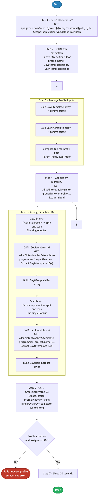

# 6.0 — Cisco Catalyst Center: Network Profile

> **Workflow:** `GitOps-BuildNetworkProfile.json`
> **Type:** Cisco Catalyst Center Generic Workflow (Intent API)
> **Subworkflows:** `Get-GitHub-File-v2`, `CATC-GetTemplates-v2`, `CATC-CreateSiteProfile-v3`
> **API Endpoints:**
> &nbsp;&nbsp;`GET  api.github.com/repos/{owner}/{repo}/contents/{path}/settings.json` — retrieve raw settings.json from GitHub
> &nbsp;&nbsp;`GET  /dna/intent/api/v1/template-programmer/template` — resolve template names to Template Hub IDs (Day0 and DayN)
> &nbsp;&nbsp;`GET  /dna/intent/api/v2/site` — resolve site hierarchy path to siteId UUID
> &nbsp;&nbsp;`GET  /dna/intent/api/v1/network-profile` — check whether the switching profile already exists
> &nbsp;&nbsp;`POST /dna/intent/api/v1/network-profile` — create the switching network profile with template assignments
> &nbsp;&nbsp;`GET  /dna/intent/api/v1/network-profile/{id}/site` — verify current site assignment for the profile
> &nbsp;&nbsp;`POST /dna/intent/api/v1/network-profile/{id}/site` — assign the network profile to the target site
> **Minimum Catalyst Center version:** 2.3.7.9
> **Authors:** Keith Baldwin — Solutions Engineer - Automation HyperSpecialist (kebaldwi@cisco.com)
> **Copyright © 2024–2026 Cisco Systems, Inc. All rights reserved.**

---

## Table of Contents

1. [Overview](#overview)
   - [What it does](#what-it-does)
   - [What makes this workflow different](#what-makes-this-workflow-different)
   - [Logical Flow](#logical-flow)
2. [Prerequisites](#prerequisites)
3. [Directory Structure](#directory-structure)
4. [Workflow Input Parameters](#workflow-input-parameters)
5. [Input Data Structure — `settings.json`](#input-data-structure--settingsjson)
6. [How It Works](#how-it-works)
   - [Step 1 — Retrieve settings.json from GitHub](#step-1--retrieve-settingsjson-from-github)
   - [Step 2 — JSONPath Queries on Settings File](#step-2--jsonpath-queries-on-settings-file)
   - [Step 3 — Parallel Block: Prepare Template Names and Site Data](#step-3--parallel-block-prepare-template-names-and-site-data)
   - [Step 4 — Parallel Block: Resolve Template Names to IDs](#step-4--parallel-block-resolve-template-names-to-ids)
   - [Step 5 — CATC-CreateSiteProfile-v3: Create and Assign Network Profile](#step-5--catc-createsiteprofile-v3-create-and-assign-network-profile)
7. [Network Profile API Payload Reference](#network-profile-api-payload-reference)
8. [Running the Workflow](#running-the-workflow)
9. [Expected Output](#expected-output)
10. [Workflow Ordering Dependency](#workflow-ordering-dependency)
11. [Troubleshooting](#troubleshooting)

---

## Overview

This Cisco Catalyst Center workflow creates a **switching network profile** in Catalyst Center and assigns it to the correct site hierarchy using structured data stored in `settings.json` on GitHub. A network profile in Catalyst Center binds Day0 (PnP) and DayN configuration templates to a site — without a profile assigned to a site, devices provisioned at that site cannot automatically receive their configuration templates.

The workflow reads `settings.json` to determine the target site hierarchy, the profile name, and the names of the Day0 and DayN templates to associate with the profile. It executes template name resolution, site ID resolution, and profile creation/assignment in parallel where possible, then calls the `CATC-CreateSiteProfile-v3` subworkflow to create the profile and bind it to the site. A 30-second sleep at the end allows Catalyst Center to finalize the assignment before downstream workflows begin provisioning.

### What it does

| Action | Mechanism |
|--------|-----------|
| Retrieve settings.json from GitHub | `Get-GitHub-File-v2` — `GET .../{GITHUB-FILE}` with `Accept: application/vnd.github.raw+json` |
| Extract hierarchy, profile, and template names | `JSONPath Query` — 9 fields including `HierarchyParent/Area/Bldg/Floor`, `ProfileName`, `DayNTemplateNames`, `Day0TemplateNames`, template counts |
| Join Day0 template names (parallel) | `Parallel Branch 3a` — join array to comma-separated string; empty string if null |
| Join DayN template names (parallel) | `Parallel Branch 3b` — join array to comma-separated string; empty string if null |
| Compose site hierarchy path + resolve siteId (parallel) | `Parallel Branch 3c` — concatenate hierarchy fields → `groupNameHierarchy`; `GET /dna/intent/api/v2/site`; extract `siteId` |
| Resolve Day0 template names to IDs | `Parallel Branch 4a` — `CATC-GetTemplates-v2`: single or multi-template ID resolution via JSONPath |
| Resolve DayN template names to IDs | `Parallel Branch 4b` — `CATC-GetTemplates-v2`: single or multi-template ID resolution via JSONPath |
| Check if profile exists and create or update | `CATC-CreateSiteProfile-v3` → `GET /dna/intent/api/v1/network-profile`; conditional `POST /dna/intent/api/v1/network-profile` |
| Verify and assign profile to site | `CATC-CreateSiteProfile-v3` → `GET /dna/intent/api/v1/network-profile/{id}/site`; `POST .../site` |
| Allow assignment to settle | Top-level `Sleep 30 s` after profile assignment |

### What makes this workflow different

Unlike manually creating and assigning network profiles through the Catalyst Center UI, this workflow:

1. **Drives profile creation from GitHub** — the profile name, template associations, and site assignment are all defined in `settings.json`, making them version-controlled and auditable. Profile changes are committed to GitHub first, then applied via workflow.
2. **Parallel execution for speed** — Steps 3 and 4 each use parallel blocks to execute site ID resolution and template name preparation simultaneously, rather than sequentially. This reduces total workflow runtime, particularly when both Day0 and DayN template sets require resolution.
3. **Dynamic template ID resolution** — rather than hardcoding template UUIDs in the profile payload, the workflow calls `CATC-GetTemplates-v2` at runtime to resolve template names to their current IDs. This makes the workflow portable across Catalyst Center instances with different internal UUIDs.
4. **Supports multiple templates per profile** — both `Day0TemplateNames` and `DayNTemplateNames` in `settings.json` are arrays. The workflow handles single-template and multi-template cases, splitting comma-separated name strings and resolving each to an ID.
5. **Site assignment verification** — before assigning the profile to a site, the subworkflow checks whether the profile is already assigned to that site. This prevents duplicate assignment errors on re-runs.
6. **Integrates with GitOps pipeline** — network profile definitions are committed to GitHub first, then applied via workflow execution.

### Logical Flow

The diagram below shows every decision point and branch from startup to completion, including the two-level parallel block structure (Steps 3 and 4) and the CATC-CreateSiteProfile-v3 four-step sequence:



> Source: [`DIAGRAMS/logical-flow.mmd`](DIAGRAMS/logical-flow.mmd) — re-render with:
> ```bash
> npx -y @mermaid-js/mermaid-cli -i DIAGRAMS/logical-flow.mmd -o DIAGRAMS/logical-flow.png -w 885 -b white
> ```

---

## Prerequisites

| Requirement | Notes |
|-------------|-------|
| Cisco Catalyst Center | >= 2.3.7.9 |
| Workflow 1.0 — Site Hierarchy | Site hierarchy (Area, Building, Floor) must already exist in CatC — the workflow resolves `siteId` from the hierarchy path |
| Workflow 2.0 — Settings and Credentials | Network settings must be applied to the site before profile assignment |
| Workflow 4.0 — Templates GitHub Integration | All DayN and Day0 templates referenced in `settings.json` must be imported and committed in the Template Hub before this workflow resolves their IDs |
| GitHub repository | Must contain `settings.json` with `network_profile` section populated |
| GitHub API access | CatC must be able to reach `api.github.com` (or configured GitHub Enterprise host) |
| Catalyst Center API access | Network Profile and Site API endpoints must be accessible and authenticated |
| Sufficient privileges in CatC | User/service account must have permission to create network profiles and assign them to sites |

---

## Directory Structure

```
6.0 Cisco Catalyst Center: Network Profile/
├── GitOps-BuildNetworkProfile.json    # Catalyst Center workflow definition (import via CatC UI)
├── DIAGRAMS/
│   ├── logical-flow.mmd               # Mermaid diagram source — re-render with npx mermaid-cli
│   └── logical-flow.png               # Rendered flowchart (referenced by this README)
└── README.md                          # This document
```

Profile source data is stored in the same `settings.json` used by Workflows 2.0 and 3.0:

```
Projects/
└── BGP_EVPN/
    └── Settings/
        └── settings.json              # Contains network_profile section with template assignments
```

---

## Workflow Input Parameters

These parameters are entered when the workflow is launched from the Catalyst Center UI or triggered via the Workflow API.

| Parameter | Type | Default | Description |
|-----------|------|---------|-------------|
| `GITHUB-OWNER` | string | `kebaldwi` | GitHub account or organization that owns the repository |
| `GITHUB-REPO` | string | `TECOPS-2599` | Repository name containing `settings.json` |
| `GITHUB-PATH` | string | `Projects/BGP_EVPN/Settings` | Path within the repository to the folder containing `settings.json` |
| `GITHUB-FILE` | string | `settings.json` | Filename to retrieve (pre-configured; the workflow directly retrieves this file without a directory scan loop) |
| `TemplateHubProjectName` | string | `BGP_EVPN` | Template Hub project name used when resolving template names to IDs via `CATC-GetTemplates-v2` |

> **Note:** Unlike Workflows 3.0 and 4.0, this workflow does not iterate over a directory listing. It retrieves `settings.json` directly using the combined `GITHUB-PATH` + `GITHUB-FILE` path. The `GITHUB-FILE` value is built into the workflow and defaults to `settings.json`.

---

## Input Data Structure — `settings.json`

The `network_profile` section within `settings.json` drives all network profile creation and assignment operations. The workflow reads a single `settings.json` file (one site entry) and creates one switching network profile for that site.

### Top-Level Schema (profile-relevant fields)

```json
{
  "project": [
    {
      "HierarchyParent": "Global/PODS",
      "HierarchyArea": "POD 0",
      "HierarchyBldg": "Building P0",
      "HierarchyFloor": "Floor 1",
      "network_settings": {...
      },            
      "device_credentials": {...
      },   
      "device_list": "...",   
      "network_profile": {
        "profile_name": "BGP-EVPN-Switching",
        "DayNTemplateNames": [
          {
            "TemplateName": "BGP-EVPN-BUILD.j2",
            "TemplateTag": "DEMO",
            "Project": "Building P0",
            "TemplateTarget": ["198.19.1.1", "198.19.1.2"],
            "DeployTemplate": true
          }
        ],
        "Day0TemplateNames": [
          {
            "TemplateName": null,
            "TemplateTag": null,
            "Project": null,
            "TemplateTarget": [],
            "DeployTemplate": null
          }
        ]
      }
    }
  ]
}
```

### Field Definitions

| Field | Type | Required | Description |
|-------|------|----------|-------------|
| `HierarchyParent` | string | Yes | Root parent path in the site hierarchy (e.g., `Global/PODS`). Combined with Area, Building, Floor to form the full `groupNameHierarchy` used to resolve `siteId`. |
| `HierarchyArea` | string | Yes | Area name (e.g., `POD 0`). |
| `HierarchyBldg` | string | Yes | Building name (e.g., `Building P0`). |
| `HierarchyFloor` | string | Yes | Floor name (e.g., `Floor 1`). |
| `network_profile.profile_name` | string | Yes | Name of the switching network profile to create in Catalyst Center. Must be unique across all network profiles in CatC. |
| `network_profile.DayNTemplateNames[].TemplateName` | string | Yes* | Filename of the DayN template in the Template Hub (e.g., `BGP-EVPN-BUILD.j2`). Resolved to a UUID at runtime. Set to `null` if no DayN template is needed. |
| `network_profile.Day0TemplateNames[].TemplateName` | string | No | Filename of the Day0 (PnP) template in the Template Hub. Resolved to UUID at runtime. Set to `null` if no Day0 template is needed (common for fabric deployments where PnP uses a separate seed process). |

> *`TemplateName` must reference an existing, committed template in the Template Hub. The workflow uses `CATC-GetTemplates-v2` to resolve the name to a UUID — if the name is not found, the resolution step fails.

### Full Example — BGP EVPN Profile

```json
{
  "project": [
    {
      "HierarchyParent": "Global/PODS",
      "HierarchyArea": "POD 0",
      "HierarchyBldg": "Building P0",
      "HierarchyFloor": "Floor 1",
      "network_profile": {
        "profile_name": "BGP-EVPN-Switching",
        "DayNTemplateNames": [
          {
            "TemplateName": "BGP-EVPN-BUILD.j2",
            "TemplateTag": "DEMO",
            "Project": "Building P0",
            "TemplateTarget": [
              "198.19.1.1", "198.19.1.2", "198.19.1.3",
              "198.19.1.4", "198.19.1.5", "198.19.1.6"
            ],
            "DeployTemplate": true
          }
        ],
        "Day0TemplateNames": [
          {
            "TemplateName": null,
            "TemplateTag": null,
            "Project": null,
            "TemplateTarget": [],
            "DeployTemplate": null
          }
        ]
      }
    }
  ]
}
```

This example creates a switching profile named `BGP-EVPN-Switching` with one DayN template (`BGP-EVPN-BUILD.j2`) and no Day0 template, assigned to the site `Global/PODS/POD 0/Building P0/Floor 1`.

---

## How It Works

### Step 1 — Retrieve settings.json from GitHub

The `Get-GitHub-File-v2` subworkflow calls the GitHub Contents API directly to retrieve the settings file:

```
GET https://api.github.com/repos/{GITHUB_OWNER}/{GITHUB_REPO}/contents/{GITHUB_PATH}/{GITHUB_FILE}

Headers:
  Accept: application/vnd.github.raw+json
  X-GitHub-Api-Version: 2022-11-28
```

Returns the full `settings.json` content as raw JSON. Unlike Workflows 3.0 and 4.0, there is no directory scan loop — the file is retrieved directly.

---

### Step 2 — JSONPath Queries on Settings File

A single JSONPath query activity extracts 9 fields from the parsed `settings.json`:

```
$.length()                                           → length (record count)
$..HierarchyParent                                   → HierarchyParent
$..HierarchyArea                                     → HierarchyArea
$..HierarchyBldg                                     → HierarchyBldg
$..HierarchyFloor                                    → HierarchyFloor
$..network_profile.profile_name                      → ProfileName
$..network_profile.DayNTemplateNames[*].TemplateName → DayNTemplates (array)
$..network_profile.Day0TemplateNames[*].TemplateName → Day0Templates (array)
$..network_profile.DayNTemplateNames.length()        → numberDayNTemplates
$..network_profile.Day0TemplateNames.length()        → numberDay0Templates
```

These values drive the two parallel blocks that follow.

---

### Step 3 — Parallel Block: Prepare Template Names and Site Data

Three branches execute simultaneously:

#### Branch 3a — Day0 Template Names Preparation

Joins the `Day0Templates` array into a comma-separated string:
- If the result is valid and non-empty: `Day0TemplateNames = joined string`
- If null or empty (no Day0 templates configured): `Day0TemplateNames = ""`

#### Branch 3b — DayN Template Names Preparation

Joins the `DayNTemplates` array into a comma-separated string:
- If the result is valid and non-empty: `DayNTemplateNames = joined string`
- If null or empty: `DayNTemplateNames = ""`

For the reference example, this produces: `DayNTemplateNames = "BGP-EVPN-BUILD.j2"`

#### Branch 3c — Site Hierarchy Composition and siteId Resolution

Three sequential activities execute within this branch:

**1) Compose Site Hierarchy Name**

Uses `Compose Site Hierarchy Name-v2` to concatenate the four hierarchy fields:
```
siteNameHierarchy = HierarchyParent + "/" + HierarchyArea + "/" + HierarchyBldg + "/" + HierarchyFloor
                  = "Global/PODS/POD 0/Building P0/Floor 1"
```

**2) GET /dna/intent/api/v2/site**

```
GET /dna/intent/api/v2/site?groupNameHierarchy=Global/PODS/POD%200/Building%20P0/Floor%201
```

Returns the site object whose `groupNameHierarchy` matches the composed path.

**3) Extract siteId**
```
JSONPath: find site where groupNameHierarchy == siteNameHierarchy → siteId
```
The `siteId` UUID is stored for use in the profile assignment call.

All three branches complete before the workflow proceeds to Step 4.

---

### Step 4 — Parallel Block: Resolve Template Names to Template IDs

Two branches execute simultaneously to resolve template names to Template Hub UUIDs:

#### Branch 4a — Day0 Template ID Resolution

If `Day0TemplateNames` is non-empty, the branch resolves each name to an ID. Two sub-cases are handled:

**Single template** (no comma in `Day0TemplateNames`):
```
CATC-GetTemplates-v2 → GET all templates in project
JSONPath: find template where name == Day0TemplateName → Day0TemplateIDs
```

**Multiple templates** (comma-separated string):
```
Split Day0TemplateNames by comma → name array
For Each name:
  CATC-GetTemplates-v2 → GET all templates
  JSONPath: extract template ID by name
  Accumulate: "id1,id2,id3..." → Day0TemplateIDs
```

If `Day0TemplateNames` is empty (null configured in settings.json), `Day0TemplateIDs` is set to an empty string and the branch completes immediately.

#### Branch 4b — DayN Template ID Resolution

Same logic as Branch 4a, applied to `DayNTemplateNames`:

```
CATC-GetTemplates-v2 → GET all templates in project BGP_EVPN
JSONPath: find template where name == "BGP-EVPN-BUILD.j2" → DayNTemplateIDs
```

Both branches complete before the workflow proceeds to Step 5.

---

### Step 5 — CATC-CreateSiteProfile-v3: Create and Assign Network Profile

The `CATC-CreateSiteProfile-v3` subworkflow executes a four-step sequence:

**1) Check if switching profile exists**
```
GET /dna/intent/api/v1/network-profile?name={profileName}&type=switching
```
If a profile with the same name and type already exists, its ID is extracted and used in steps 3 and 4. If it does not exist, step 2 creates it.

**2) Create switching network profile**
```
POST /dna/intent/api/v1/network-profile
Body:
{
  "name": "BGP-EVPN-Switching",
  "type": "switching",
  "templates": {
    "day0": { "id": "<Day0TemplateIDs>" },
    "dayN": { "id": "<DayNTemplateIDs>" }
  }
}
```

The `profileId` is extracted from the response for use in the site assignment call.

**3) Check current site assignment**
```
GET /dna/intent/api/v1/network-profile/{profileId}/site
```

Checks whether the profile is already assigned to the target site. If already assigned, step 4 is skipped.

**4) Assign profile to target site**
```
POST /dna/intent/api/v1/network-profile/{profileId}/site
Body:
{
  "siteId": "<siteId>"
}
```

Binds the network profile to the site. Once assigned, devices provisioned at this site will automatically receive the Day0 and DayN templates associated with the profile.

**Final Step:**
```
Sleep 30 seconds
```
Allows Catalyst Center to propagate the profile assignment before downstream provisioning workflows begin.

---

## Network Profile API Payload Reference

### Create Network Profile

Submitted to `POST /dna/intent/api/v1/network-profile`:

```json
{
  "name": "BGP-EVPN-Switching",
  "type": "switching",
  "templates": {
    "dayN": {
      "id": "a1b2c3d4-e5f6-7890-abcd-ef1234567890"
    }
  }
}
```

When Day0 templates are also configured:

```json
{
  "name": "BGP-EVPN-Switching",
  "type": "switching",
  "templates": {
    "day0": {
      "id": "b2c3d4e5-f6a7-8901-bcde-f12345678901"
    },
    "dayN": {
      "id": "a1b2c3d4-e5f6-7890-abcd-ef1234567890"
    }
  }
}
```

**Key field notes:**

| Field | Notes |
|-------|-------|
| `name` | The profile name from `settings.json`. Must be unique across all network profiles in Catalyst Center. |
| `type` | Always `switching` for this workflow. Other supported values (`wireless`, `routing`) require different API payloads and are not handled by this workflow. |
| `templates.dayN.id` | UUID of the DayN template resolved at runtime via `CATC-GetTemplates-v2`. |
| `templates.day0.id` | UUID of the Day0 (PnP onboarding) template. Omitted from the payload when `Day0TemplateNames` is null/empty. |

### Assign Profile to Site

Submitted to `POST /dna/intent/api/v1/network-profile/{profileId}/site`:

```json
{
  "siteId": "c3d4e5f6-a7b8-9012-cdef-123456789012"
}
```

**Response on success:**
```json
{
  "executionId": "<task_uuid>",
  "executionStatusUrl": "/dna/intent/api/v1/task/<task_uuid>",
  "message": "Execution successfully started"
}
```

---

## Running the Workflow

### Import the Workflow

1. In Catalyst Center, navigate to **Platform → Workflow Manager**.
2. Click **Import** and upload `GitOps-BuildNetworkProfile.json`.
3. The workflow appears as **GitOps-BuildNetworkProfile** in the workflow list.

### Execute the Workflow

1. Click **Run** on the imported workflow.
2. Select the **Catalyst Center target** when prompted.
3. Fill in the input parameters:
   - **GITHUB-OWNER:** `kebaldwi`
   - **GITHUB-REPO:** `TECOPS-2599`
   - **GITHUB-PATH:** `Projects/BGP_EVPN/Settings`
   - **GITHUB-FILE:** `settings.json`
   - **TemplateHubProjectName:** `BGP_EVPN`
4. Click **Execute**.
5. Monitor progress in **Workflow Executions** → **Execution Details**.

### Trigger via API

```bash
POST /dna/intent/api/v1/workflow-manager/workflows/{workflowId}/run
{
  "inputParameters": {
    "GITHUB-OWNER": "kebaldwi",
    "GITHUB-REPO": "TECOPS-2599",
    "GITHUB-PATH": "Projects/BGP_EVPN/Settings",
    "GITHUB-FILE": "settings.json",
    "TemplateHubProjectName": "BGP_EVPN"
  }
}
```

---

## Expected Output

A successful run produces the following sequence in the workflow execution log:

```
Step 1       settings.json retrieved from GitHub:
             /kebaldwi/TECOPS-2599/Projects/BGP_EVPN/Settings/settings.json
Step 2       JSONPath extraction complete:
             HierarchyParent=Global/PODS, HierarchyArea=POD 0
             HierarchyBldg=Building P0, HierarchyFloor=Floor 1
             ProfileName=BGP-EVPN-Switching
             DayNTemplates=[BGP-EVPN-BUILD.j2], Day0Templates=[null]
             numberDayNTemplates=1, numberDay0Templates=1

Step 3       Parallel block started (3 branches)
  Branch 3a  Day0TemplateNames: null → Day0TemplateNames = ""
  Branch 3b  DayNTemplateNames: BGP-EVPN-BUILD.j2 joined string OK
  Branch 3c  siteNameHierarchy = Global/PODS/POD 0/Building P0/Floor 1
             GET /dna/intent/api/v2/site → siteId extracted ✓
             Parallel block complete

Step 4       Parallel block started (2 branches)
  Branch 4a  Day0TemplateNames = "" → Day0TemplateIDs = "" (no template)
  Branch 4b  BGP-EVPN-BUILD.j2 → DayNTemplateIDs = <uuid> ✓
             Parallel block complete

Step 5       CATC-CreateSiteProfile-v3:
             GET /dna/intent/api/v1/network-profile → profile not found
             POST /dna/intent/api/v1/network-profile → BGP-EVPN-Switching created
             profileId extracted
             GET /dna/intent/api/v1/network-profile/{id}/site → not assigned yet
             POST /dna/intent/api/v1/network-profile/{id}/site
             → Assigned to Global/PODS/POD 0/Building P0/Floor 1 ✓ SUCCESS

Step 6       Sleep 30 s — profile assignment settling
Completed    Network profile BGP-EVPN-Switching created and assigned successfully
```

---

## Workflow Ordering Dependency

This workflow is the **sixth** in the GitOps provisioning suite. It requires site hierarchy (Workflow 1.0), network settings (Workflow 2.0), imported templates (Workflow 4.0), and optionally composite templates (Workflow 5.0) to already be in place before it can resolve all required IDs and create the profile assignment.

| Workflow | Purpose | Depends on | Required before |
|----------|---------|------------|-----------------|
| 1.0 — Site Hierarchy | Creates Area / Building / Floor hierarchy | — | Yes — must run first |
| 2.0 — Settings and Credentials | Applies network settings and global credentials | 1.0 | Yes — before 3.0 |
| 3.0 — Device Discovery | Discovers devices and assigns them to site | 1.0, 2.0 | — |
| 4.0 — Templates GitHub Integration | Imports individual Jinja2 templates into Template Hub | 1.0 | **Yes — must run before 6.0** |
| 5.0 — Templates Composite | Assembles composite templates from individual members | 1.0, 4.0 | Recommended before 6.0 if profile uses composite |
| **6.0 — This workflow** | Creates switching network profile and assigns to site | 1.0, 2.0, 4.0 | **Yes — must run before 7.0** |
| 7.0 — Provision Composite | Provisions devices and deploys composite templates | 1.0–6.0 | — |

---

## Troubleshooting

| Symptom | Likely Cause | Resolution |
|---------|-------------|------------|
| `GitHub file retrieval fails` | Repository is private, wrong path, or CatC cannot reach GitHub | Verify `GITHUB-OWNER`, `GITHUB-REPO`, `GITHUB-PATH`, `GITHUB-FILE`. Check outbound CatC internet connectivity. |
| `JSONPath extraction returns empty fields` | `settings.json` is missing the `network_profile` section or `project` wrapper | Validate the JSON structure. Ensure `settings.json` contains `project[].network_profile.profile_name` and `DayNTemplateNames`. |
| `siteId resolution fails` | `groupNameHierarchy` does not match any site in CatC | Verify Workflow 1.0 ran successfully and the hierarchy path exists exactly as configured. Values are case-sensitive. |
| `Template ID resolution fails` | Template name in `DayNTemplateNames` does not exist in the Template Hub or is not committed | Run Workflow 4.0 to import and commit the missing templates. Verify the template name in `settings.json` matches the filename exactly (including `.j2` extension). |
| `Network profile creation fails — 409 conflict` | A profile with the same name already exists in CatC | The workflow currently checks for an existing profile but may fail if the profile exists with different template assignments. Delete the existing profile in CatC UI first, then re-run. |
| `Profile created but not assigned to site` | `POST .../site` call failed — siteId was invalid or site already has a profile of the same type | Check the CatC execution log for the assignment step error. Verify only one switching profile is assigned to the target site at a time. |
| `Day0 template assigned when it should be empty` | `settings.json` has `TemplateName: null` but the null is being joined as the string "null" | The workflow's parallel branch should detect null values and set `Day0TemplateNames = ""`. If this happens, verify the JSONPath extraction for Day0 templates returns a proper null/empty result. |
| `Profile assignment not visible in CatC UI` | 30-second sleep was insufficient for propagation | Navigate to CatC **Design → Network Profiles** and verify the profile exists and shows the site assignment. Refresh the browser — propagation typically completes within 30 seconds but may take longer under load. |

---

## Additional Notes

- **Profile type:** This workflow creates `switching` type profiles only. Wireless and routing profiles require different API payloads and subworkflows not included here.
- **Single site per run:** The workflow reads one `settings.json` file and creates one profile assignment for the site defined in it. To apply the same profile to multiple sites, either define multiple entries in `settings.json` (if the subworkflow supports iteration) or run the workflow separately with different `GITHUB-PATH` values pointing to different settings files.
- **Template type compatibility:** The `DayNTemplateNames` field should point to the composite template (created by Workflow 5.0) when deploying BGP EVPN configurations. The composite template name is typically the same as the `.yml` definition file (with `.j2` extension), e.g., `BGP-EVPN-BUILD.j2`.
- **Profile re-assignment:** Assigning a profile to a site that already has it assigned is handled by the subworkflow's check (`GET .../site`). If already assigned, the POST is skipped, making re-runs safe.
- **Parallel execution timing:** Both parallel blocks (Steps 3 and 4) require all branches to complete before the flow continues. If one branch fails, the parallel block fails and the workflow stops.
- **Profile deletion is not automated:** If you need to change the name of an existing profile or remove template associations, manually delete the profile in the CatC UI (`Design → Network Profiles → Delete`) before re-running the workflow with updated `settings.json`.
