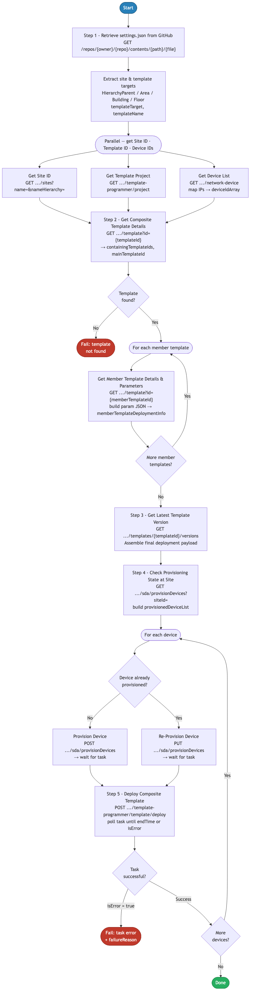

# 7.0 — Cisco Catalyst Center: Provision Composite

> **Workflow:** `GitOps-DeviceProvisioning.json`
> **Type:** Cisco Catalyst Center Generic Workflow (Intent API)
> **Subworkflows:** `Get-GitHub-File-v2`
> **API Endpoints:**
> &nbsp;&nbsp;`GET  api.github.com/repos/{owner}/{repo}/contents/{path}/settings.json` — retrieve raw settings.json from GitHub
> &nbsp;&nbsp;`GET  /dna/intent/api/v1/sites?nameHierarchy={path}` — resolve site hierarchy path to siteId UUID
> &nbsp;&nbsp;`GET  /dna/intent/api/v2/template-programmer/project?name={Project Name}` — retrieve project and composite template metadata
> &nbsp;&nbsp;`GET  /dna/intent/api/v1/network-device` — retrieve all managed devices and resolve hostnames by IP
> &nbsp;&nbsp;`GET  /dna/intent/api/v2/template-programmer/template?id={templateId}` — fetch composite template definition and member template list
> &nbsp;&nbsp;`GET  /dna/intent/api/v1/templates/{templateId}/versions` — retrieve version history and resolve latest versionId
> &nbsp;&nbsp;`GET  /dna/intent/api/v1/sda/provisionDevices` — check SDA provisioning status per device
> &nbsp;&nbsp;`POST /dna/intent/api/v1/sda/provisionDevices` — provision device to site (first-time)
> &nbsp;&nbsp;`PUT  /dna/intent/api/v1/sda/provisionDevices` — re-provision device already assigned to a site
> &nbsp;&nbsp;`POST /dna/intent/api/v2/template-programmer/template/deploy` — deploy composite template to a specific device
> **Minimum Catalyst Center version:** 2.3.7.9
> **Authors:** Keith Baldwin — Solutions Engineer - Automation HyperSpecialist (kebaldwi@cisco.com)
> **Copyright © 2024–2026 Cisco Systems, Inc. All rights reserved.**

---

## Table of Contents

1. [Overview](#overview)
   - [What it does](#what-it-does)
   - [What makes this workflow different](#what-makes-this-workflow-different)
   - [Logical Flow](#logical-flow)
2. [Prerequisites](#prerequisites)
3. [Directory Structure](#directory-structure)
4. [Workflow Input Parameters](#workflow-input-parameters)
5. [Input Data Structure — `settings.json`](#input-data-structure--settingsjson)
6. [How It Works](#how-it-works)
   - [Step 1 — Retrieve settings.json from GitHub](#step-1--retrieve-settingsjson-from-github)
   - [Step 2 — JSONPath Queries on Settings File](#step-2--jsonpath-queries-on-settings-file)
   - [Step 3 — Parallel Block: Resolve Site, Template, and Device IDs](#step-3--parallel-block-resolve-site-template-and-device-ids)
   - [Step 4 — Get Composite Template Structure](#step-4--get-composite-template-structure)
   - [Step 5 — For Each Member: Build Member Deployment Info](#step-5--for-each-member-build-member-deployment-info)
   - [Step 6 — Build Versioned Composite Request Body](#step-6--build-versioned-composite-request-body)
   - [Step 7 — Deploy to Each Device](#step-7--deploy-to-each-device)
7. [Template Deployment API Payload Reference](#template-deployment-api-payload-reference)
8. [Running the Workflow](#running-the-workflow)
9. [Expected Output](#expected-output)
10. [Workflow Ordering Dependency](#workflow-ordering-dependency)
11. [Troubleshooting](#troubleshooting)

---

## Overview

This Cisco Catalyst Center workflow is the final provisioning step in the GitOps suite. It provisions network devices to their assigned site in Catalyst Center and deploys the correct composite configuration template to each device. This is the culmination of all preceding workflows — site hierarchy is already created, credentials and settings are applied, devices are discovered and site-assigned, templates are imported and composited, and a network profile is active. This workflow activates the configuration on each physical device.

The workflow reads `settings.json` from GitHub to identify the target site, the composite template to deploy, and the list of device IP addresses to configure. It executes three parallel resolution branches simultaneously (site ID, composite template ID, and device IDs), then constructs the full composite deployment payload by iterating over each member template to build deployment info, retrieves the latest composite version, and finally provisions and deploys the template to each device in a per-device loop that differentiates between first-time and re-provisioning cases.

### What it does

| Action | Mechanism |
|--------|-----------|
| Retrieve settings.json from GitHub | `Get-GitHub-File-v2` — `GET .../{GITHUB_FILE}` with `Accept: application/vnd.github.raw+json` |
| Extract site hierarchy, template name, and device targets | `JSONPath Query` — `HierarchyParent`, `HierarchyArea`, `HierarchyBldg`, `HierarchyFloor`, `templateTarget` array, `templateName` |
| Resolve siteId from hierarchy path (parallel) | `Branch 3a` — `GET /dna/intent/api/v1/sites?nameHierarchy=…`; JSONPath → `siteId` |
| Resolve composite templateId by name (parallel) | `Branch 3b` — `GET /dna/intent/api/v2/template-programmer/project?name={Project Name}`; JSONPath → `compositeTemplateId` |
| Resolve all device UUIDs from IP list (parallel) | `Branch 3c` — `GET /dna/intent/api/v1/network-device`; For Each IP: JSONPath → `deviceId`; accumulate `deviceIdArray` |
| Fetch composite template definition | `GET /dna/intent/api/v2/template-programmer/template?id={compositeTemplateId}` — extract `containingTemplateIds` array |
| For each member template: fetch details and build paramBlock | `For Each memberId` — `GET template?id={memberId}`; extract `templateParams`; build `{ paramName: defaultValue }` JSON |
| Build `memberTemplateDeploymentInfo` array | Per-member loop — accumulate `{ templateId, mainTemplateId, targetInfo, params }` entries |
| Retrieve latest composite version | `GET /dna/intent/api/v1/templates/{templateId}/versions` — JSONPath → `versionNumber`; resolve `versionId` |
| Assemble full composite deployment body | `Set Variables` — `isComposite`, `targetInfo` placeholder, `mainTemplateId`, versioned `templateId`, `forcePushTemplate=true`, `memberTemplateDeploymentInfo` |
| Check each device's SDA provisioning status | Per-device — `GET /dna/intent/api/v1/sda/provisionDevices`; JSONPath → `provisionedFlag` |
| Provision device to site (first-time) | If not provisioned: `POST /dna/intent/api/v1/sda/provisionDevices`; poll task |
| Re-provision device (already assigned) | If already provisioned: `PUT /dna/intent/api/v1/sda/provisionDevices`; poll task |
| Deploy composite template to device | `POST /dna/intent/api/v2/template-programmer/template/deploy` — body with device UUID/hostname substituted; poll task |

### What makes this workflow different

Unlike manually provisioning and deploying templates through the Catalyst Center UI, this workflow:

1. **End-to-end composite deployment in one automated pass** — a single workflow execution provisions the device to its site and deploys the entire composite template stack in sequence, eliminating the need to manually navigate through Platform → Provisioning → Deploy Template for each device.
2. **Parallel resolution for efficiency** — site ID, composite template ID, and all device IDs are resolved simultaneously in a three-branch parallel block, reducing wait time before the deployment loop begins.
3. **Intelligent provisioning state detection** — before each device is provisioned, the workflow queries `GET /dna/intent/api/v1/sda/provisionDevices` to determine whether the device is provisioned for the first time (`POST`) or needs re-provisioning (`PUT`). This differentiates the two cases cleanly without requiring manual tracking.
4. **Per-member-template parameter resolution** — the composite template deployment payload requires individual `memberTemplateDeploymentInfo` entries for each member template, including its parameters with default values. The workflow fetches each member template's `templateParams`, handles single-param and multi-param cases differently (simple JSON vs. Python-transformed object), and assembles the complete deployment info array automatically.
5. **Version-aware deployment** — the workflow retrieves the full version history of the composite template and resolves the latest `versionId` before constructing the deployment payload. This ensures deployment always targets the most recently committed version of the composite.
6. **Device-level placeholder substitution** — the deployment body template uses `**REPLACE_DEVICE_HOSTNAME**` and `**REPLACE_DEVICE_ID**` placeholders. A `Replace String` activity substitutes the actual device hostname and UUID for each iteration of the per-device loop, producing a correctly targeted payload for each device.
7. **Integrates with GitOps pipeline** — the `templateTarget` device IP list and composite template name are sourced from `settings.json` on GitHub. Changes to which devices receive which templates are version-controlled and applied via workflow.

### Logical Flow

The diagram below shows every decision point and loop, including the three-branch parallel resolution block (Step 3), the member template iteration loop (Steps 4–5), the composite body assembly (Step 6), the provisioning state check, and the per-device deploy loop with task polling (Step 7):



> Source: [`DIAGRAMS/logical-flow.mmd`](DIAGRAMS/logical-flow.mmd) — re-render with:
> ```bash
> npx -y @mermaid-js/mermaid-cli -i DIAGRAMS/logical-flow.mmd -o DIAGRAMS/logical-flow.png -w 885 -b white
> ```

---

## Prerequisites

| Requirement | Notes |
|-------------|-------|
| Cisco Catalyst Center | >= 2.3.7.9 |
| Workflow 1.0 — Site Hierarchy | Site hierarchy must exist; `siteId` is resolved from the hierarchy path |
| Workflow 2.0 — Settings and Credentials | Network settings and device credentials must be applied to the site |
| Workflow 3.0 — Device Discovery | Devices must be discovered and assigned to the site — their UUIDs are resolved from management IP addresses |
| Workflow 4.0 — Templates GitHub Integration | All member templates must be imported and committed in the Template Hub |
| Workflow 5.0 — Templates Composite | The composite template referenced in `settings.json` must be created and committed |
| Workflow 6.0 — Network Profile | A switching network profile must be created and assigned to the target site |
| GitHub repository | Must contain `settings.json` with `network_profile.DayNTemplateNames` and `TemplateTarget` populated |
| GitHub API access | CatC must be able to reach `api.github.com` (or configured GitHub Enterprise host) |
| Catalyst Center API access | All intent API endpoints (template-programmer, sda, network-device, sites) must be accessible and authenticated |
| Sufficient privileges in CatC | User/service account must have permission to provision devices to sites and deploy templates |
| Device reachability | Devices must be reachable from Catalyst Center over the management network (SSH/SNMP) at deployment time |

---

## Directory Structure

```
7.0 Cisco Catalyst Center: Provision Composite/
├── GitOps-DeviceProvisioning.json    # Catalyst Center workflow definition (import via CatC UI)
├── DIAGRAMS/
│   ├── logical-flow.mmd              # Mermaid diagram source — re-render with npx mermaid-cli
│   └── logical-flow.png              # Rendered flowchart (referenced by this README)
└── README.md                         # This document
```

Provisioning source data is stored in the same `settings.json` used by Workflows 2.0, 3.0, and 6.0:

```
Projects/
└── BGP_EVPN/
    └── Settings/
        └── settings.json              # Contains network_profile.DayNTemplateNames and TemplateTarget
```

---

## Workflow Input Parameters

These parameters are entered when the workflow is launched from the Catalyst Center UI or triggered via the Workflow API.

| Parameter | Type | Default | Description |
|-----------|------|---------|-------------|
| `HierarchyParent` | string | `Global/PODS` | Root parent path in the site hierarchy (e.g., `Global/PODS`). Combined with Area, Building, Floor to form the full site path for siteId resolution. |
| `HierarchyArea` | string | `POD 0` | Area name — second-level site (e.g., `POD 0`). |
| `HierarchyBldg` | string | `Building P0` | Building name — third-level site (e.g., `Building P0`). |
| `HierarchyFloor` | string | `Floor 1` | Floor name — fourth-level site (e.g., `Floor 1`). |
| `Project Name` | string | `BGP_EVPN` | Template Hub project name where the composite template resides. Used to resolve the composite template ID. |
| `GITHUB_USER` | string | `kebaldwi` | GitHub account or organization that owns the repository. |
| `GITHUB_REPO` | string | `TECOPS-2599` | Repository name containing `settings.json`. |
| `GITHUB_PATH` | string | `Projects/BGP_EVPN/Settings` | Path within the repository to the folder containing `settings.json`. |
| `GITHUB_FILE` | string | `settings.json` | Filename to retrieve from GitHub. |

> **Note:** Unlike Workflows 4.0 and 5.0, the site hierarchy fields (`HierarchyParent`, `HierarchyArea`, `HierarchyBldg`, `HierarchyFloor`) are direct workflow input parameters in addition to being read from `settings.json`. The JSON fields drive template target and composite name extraction; the input parameters drive site and device resolution.

---

## Input Data Structure — `settings.json`

The workflow reads `settings.json` to extract the composite template name and the list of device IP addresses to provision and configure.

### Top-Level Schema (provisioning-relevant fields)

```json
{
  "project": [
    {
      "HierarchyParent": "Global/PODS",
      "HierarchyArea": "POD 0",
      "HierarchyBldg": "Building P0",
      "HierarchyFloor": "Floor 1",
      "network_settings": {...
      },            
      "device_credentials": {...
      },   
      "device_list": "...",   
      "network_profile": {
        "profile_name": "BGP-EVPN-Switching",
        "DayNTemplateNames": [
          {
            "TemplateName": "BGP-EVPN-BUILD.j2",
            "TemplateTag": "DEMO",
            "Project": "Building P0",
            "TemplateTarget": [
              "198.19.1.1",
              "198.19.1.2",
              "198.19.1.3",
              "198.19.1.4",
              "198.19.1.5",
              "198.19.1.6"
            ],
            "DeployTemplate": true
          }
        ],
        "Day0TemplateNames": [
          {
            "TemplateName": null,
            "TemplateTag": null,
            "Project": null,
            "TemplateTarget": [],
            "DeployTemplate": null
          }
      }
    }
  ]
}
```

### Field Definitions (provisioning-relevant)

| Field | Type | Required | Description |
|-------|------|----------|-------------|
| `network_profile.DayNTemplateNames[].TemplateName` | string | Yes | Filename of the composite template in the Template Hub (e.g., `BGP-EVPN-BUILD.j2`). The workflow uses this name to locate the composite template in the specified Template Hub project (`Project Name` input parameter). |
| `network_profile.DayNTemplateNames[].TemplateTarget` | array | Yes | List of device management IP addresses that should receive the composite template deployment. The workflow resolves each IP to a device UUID and iterates over the list in the per-device deploy loop. |
| `network_profile.DayNTemplateNames[].DeployTemplate` | boolean | No | Indicates whether template deployment is intended (`true`) or should be skipped (`false`). Currently used as metadata — the workflow deploys to all devices in `TemplateTarget` regardless of this flag. |

---

## How It Works

### Step 1 — Retrieve settings.json from GitHub

The `Get-GitHub-File-v2` subworkflow calls the GitHub Contents API directly:

```
GET https://api.github.com/repos/{GITHUB_USER}/{GITHUB_REPO}/contents/{GITHUB_PATH}/{GITHUB_FILE}

Headers:
  Accept: application/vnd.github.raw+json
  X-GitHub-Api-Version: 2022-11-28
```

Returns the raw `settings.json` content. As with Workflow 6.0, there is no directory scan loop — the file is retrieved directly.

---

### Step 2 — JSONPath Queries on Settings File

A JSONPath query activity extracts key provisioning fields from the parsed JSON:

```
$.project[*].HierarchyParent                               → HierarchyParent
$.project[*].HierarchyArea                                 → HierarchyArea
$.project[*].HierarchyBldg                                 → HierarchyBldg
$.project[*].HierarchyFloor                                → HierarchyFloor
$.project[*].network_profile.DayNTemplateNames[*].TemplateTarget → templateTarget (array of IPs)
$.project[*].network_profile.DayNTemplateNames[*].TemplateName  → templateName
```

The `templateTarget` array contains the device IP addresses to provision and configure. The `templateName` is the composite template filename used to locate the template in the Hub.

---

### Step 3 — Parallel Block: Resolve Site, Template, and Device IDs

Three branches execute simultaneously:

#### Branch 3a — Site ID Resolution

```
GET /dna/intent/api/v1/sites?nameHierarchy={HierarchyParent}/{HierarchyArea}/{HierarchyBldg}/{HierarchyFloor}
```

Returns site objects matching the full hierarchy path. JSONPath extracts:
```
$.[*].id  →  siteId
```

The `siteId` UUID is stored for use in the SDA provisioning calls.

#### Branch 3b — Composite Template ID Resolution

```
GET /dna/intent/api/v2/template-programmer/project?name={Project Name}
```

Returns the project metadata including all templates. JSONPath extracts:
```
$..templates[?(@.name == templateName)].id  →  compositeTemplateId
```

The `compositeTemplateId` UUID is stored as `templateId` for use in Steps 4–7.

#### Branch 3c — Device ID Resolution

The branch stores the `templateTarget` IP array into a workflow variable, then iterates over each IP with a counter-based accumulation loop:

```
For Each IP in templateTarget:
  GET /dna/intent/api/v1/network-device  (fetched once, results cached)
  JSONPath: $.response[?(@.managementIpAddress == '{ip}')].id  →  deviceId
  
  if counter == 0 (first pass):
    deviceId_string = deviceId          # initialize
  else:
    deviceId_string = deviceId_string + "," + deviceId  # append
  
  increment counter
```

After the loop:
```
Split deviceId_string by "," → parts array
Store parts array → deviceIdArray
Reset counter to 0
```

The `deviceIdArray` is the ordered list of device UUIDs that will be iterated in Step 7.

All three branches complete before the workflow proceeds to Step 4.

---

### Step 4 — Get Composite Template Structure

Three activities retrieve the composite template's full definition and extract its member template list:

**Step 4a — Get Composite Template Details**
```
GET /dna/intent/api/v2/template-programmer/template?id={compositeTemplateId}
```

**Step 4b — Main Template JSONPath Query**
```
$.response[*].containingTemplates[*].id  →  containingTemplateIds (array)
$.response[?(@.id == compositeTemplateId)].composite   →  isComposite (boolean)
$.response[?(@.id == compositeTemplateId)].id          →  mainTemplateId
```

The `containingTemplateIds` array lists the UUIDs of every member template in the composite, in deployment order.

**Step 4c — Set Array Variables**

The `containingTemplateIds` array is stored in `containingTemplateArray` for use in the per-member loop in Step 5.

---

### Step 5 — For Each Member: Build Member Deployment Info

The workflow iterates over every member template UUID in `containingTemplateArray`. For each member:

**5a — Get Member Template Details**
```
GET /dna/intent/api/v2/template-programmer/template?id={memberId}
```

**5b — Child Details JSONPath Query**

Extracts member template metadata:
```
$.response[?(@.id == memberId)]                          →  childTemplateBody
$.response[?(@.id == memberId)].parentTemplateId         →  mainTemplateId
$.response[?(@.id == memberId)].composite                →  isComposite
$.response[?(@.id == memberId)].templateParams[*].parameterName → params
$.response[?(@.id == memberId)].templateParams[*].defaultValue  → defaultValue
$.response[?(@.id == memberId)].templateParams[*]               → templateParams
```

**5c — Read Table from JSON**
```
JSONPath: $.  →  templateParams table
Columns populated from templateParams array entries
```

**5d — Build Parameter JSON Object**

The parameter count determines the handling approach:

| Condition | Handling | Result |
|-----------|----------|--------|
| `row_count <= 1` (zero or one param) | `Set Variables` — build simple JSON object | `{ "paramName": "defaultValue" }` |
| `row_count > 1` (multiple params) | `Execute Python Script` — transform param array | `{ "param1": "val1", "param2": "val2", ... }` |

**5e — Accumulate memberTemplateDeploymentInfo**

The deployment info for each member is accumulated using the pass counter:

| Pass | Operation |
|------|-----------|
| counter == 0 (1st member) | Initialize `memberTemplateDeploymentInfo` with first entry; increment counter |
| counter >= 1 (subsequent) | Append next member entry to deployment info array; increment counter |

Each entry in `memberTemplateDeploymentInfo` has the structure:
```json
{
  "templateId": "<memberTemplateId>",
  "parentTemplateId": "<mainTemplateId>",
  "targetInfo": [
    {
      "id": "**REPLACE_DEVICE_ID**",
      "type": "MANAGED_DEVICE_UUID",
      "hostName": "**REPLACE_DEVICE_HOSTNAME**"
    }
  ],
  "params": { "paramName": "defaultValue" }
}
```

The `**REPLACE_DEVICE_ID**` and `**REPLACE_DEVICE_HOSTNAME**` placeholders are substituted per-device in Step 7.

The loop repeats for every member in `containingTemplateArray`.

---

### Step 6 — Build Versioned Composite Request Body

**6a — Retrieve Composite Version History**
```
GET /dna/intent/api/v1/templates/{compositeTemplateId}/versions
```

**6b — Resolve Latest Version Number**
```
$.response.length()  →  versionNumber (integer — total version count = latest version)
```

**6c — Resolve Latest versionId**
```
$.response[?(@.version == versionNumber)].versionId  →  templateId (versioned UUID)
```

**6d — Assemble Complete Deployment Body**

The full composite deployment request body is assembled using all resolved values:

```json
{
  "isComposite": true,
  "forcePushTemplate": true,
  "targetInfo": [
    {
      "id": "**REPLACE_DEVICE_ID**",
      "type": "MANAGED_DEVICE_UUID",
      "hostName": "**REPLACE_DEVICE_HOSTNAME**"
    }
  ],
  "templateId": "<versionId>",
  "mainTemplateId": "<compositeTemplateId>",
  "memberTemplateDeploymentInfo": [ ... ]
}
```

The `requestBody` variable holds this assembled body with device placeholders intact. Step 7 substitutes actual device values for each device in the loop.

---

### Step 7 — Deploy to Each Device

A `For Each Device in deviceIdArray` loop executes the following sequence per device:

#### Group: Prep Body for Device

**7a — Copy requestBody to working variable**

The master `requestBody` template is copied to a per-iteration working variable before placeholder substitution, preserving the original for subsequent iterations.

**7b — Resolve device hostname**
```
GET /dna/intent/api/v1/network-device  (result cached from Step 3c)
JSONPath: $.response[?(@.id == deviceId)].hostname  →  hostname
```

**7c — Replace String: Substitute device-specific values**
```
**REPLACE_DEVICE_HOSTNAME**  →  hostname
**REPLACE_DEVICE_ID**        →  deviceId
```

Both substitutions are applied to both the top-level `targetInfo` and every entry in `memberTemplateDeploymentInfo`, producing a fully device-specific deployment body.

#### Check Provisioning Status

**7d — Query SDA provisioning status**
```
GET /dna/intent/api/v1/sda/provisionDevices
JSONPath: $.response[?(@.networkDeviceId == deviceId)].siteId  →  provisionedFlag
JSONPath: $.response[?(@.networkDeviceId == deviceId)].id      →  provisionedId
```

The `provisionedFlag` determines the provisioning path:

| `provisionedFlag` | Interpretation | Action |
|------------------|----------------|--------|
| Empty string | Device not yet provisioned to site | `POST /dna/intent/api/v1/sda/provisionDevices` |
| Non-empty | Device already provisioned to site | `PUT /dna/intent/api/v1/sda/provisionDevices` |

**7e — First-time provisioning** *(if not provisioned)*
```
POST /dna/intent/api/v1/sda/provisionDevices
Body: { "siteId": "<siteId>", "networkDeviceId": "<deviceId>" }
```
Followed by `Wait For Catalyst Center Task` — polls until task completes.

**7f — Re-provisioning** *(if already provisioned)*
```
PUT /dna/intent/api/v1/sda/provisionDevices
Body: { "id": "<provisionedId>", "siteId": "<siteId>", "networkDeviceId": "<deviceId>" }
```
Followed by `Wait For Catalyst Center Task` — polls until task completes.

#### Group: Deploy Template

**7g — Deploy composite template to device**
```
POST /dna/intent/api/v2/template-programmer/template/deploy
Body: <device-specific deployment body>
```

Returns a Catalyst Center Service Task ID.

**7h — Extract Task ID and poll**

The Task ID is extracted from the response body and polled at 5-second intervals via `Wait For Catalyst Center Task` until the deployment completes or fails.

The loop repeats for every device UUID in `deviceIdArray`.

---

## Template Deployment API Payload Reference

### Deploy Composite Template

Submitted to `POST /dna/intent/api/v2/template-programmer/template/deploy`:

```json
{
  "isComposite": true,
  "forcePushTemplate": true,
  "templateId": "versioned-uuid-of-composite",
  "mainTemplateId": "composite-template-uuid",
  "targetInfo": [
    {
      "id": "device-uuid-here",
      "type": "MANAGED_DEVICE_UUID",
      "hostName": "switch-hostname-here"
    }
  ],
  "memberTemplateDeploymentInfo": [
    {
      "templateId": "member-template-uuid-1",
      "parentTemplateId": "composite-template-uuid",
      "targetInfo": [
        {
          "id": "device-uuid-here",
          "type": "MANAGED_DEVICE_UUID",
          "hostName": "switch-hostname-here"
        }
      ],
      "params": {
        "VLAN_ID": "100",
        "VRF_NAME": "DEFAULT"
      }
    },
    {
      "templateId": "member-template-uuid-2",
      "parentTemplateId": "composite-template-uuid",
      "targetInfo": [
        {
          "id": "device-uuid-here",
          "type": "MANAGED_DEVICE_UUID",
          "hostName": "switch-hostname-here"
        }
      ],
      "params": {
        "LOOPBACK_IP": "10.0.0.1"
      }
    }
  ]
}
```

**Key field notes:**

| Field | Notes |
|-------|-------|
| `isComposite` | Must be `true` for composite template deployment. |
| `forcePushTemplate` | Set to `true` to push the template even if a previous deployment exists. Ensures re-runs always apply the latest template version. |
| `templateId` | The versioned UUID of the composite — from `GET .../versions?version=latest`. |
| `mainTemplateId` | The base composite template UUID (not version-specific). |
| `targetInfo[].type` | Always `MANAGED_DEVICE_UUID` for device deployments. |
| `memberTemplateDeploymentInfo` | One entry per member template in the composite. Each entry carries the member's `templateId`, its `parentTemplateId` (composite UUID), device-specific `targetInfo`, and all template parameters with their default values. |
| `params` | Key-value pairs of template parameter names and their default values. Extracted from each member template's `templateParams` array. |

### SDA Provision Device (First-time)

Submitted to `POST /dna/intent/api/v1/sda/provisionDevices`:

```json
{
  "siteId": "a1b2c3d4-e5f6-7890-abcd-ef1234567890",
  "networkDeviceId": "b2c3d4e5-f6a7-8901-bcde-f12345678901"
}
```

### SDA Re-Provision Device

Submitted to `PUT /dna/intent/api/v1/sda/provisionDevices`:

```json
{
  "id": "existing-provision-record-uuid",
  "siteId": "a1b2c3d4-e5f6-7890-abcd-ef1234567890",
  "networkDeviceId": "b2c3d4e5-f6a7-8901-bcde-f12345678901"
}
```

---

## Running the Workflow

### Import the Workflow

1. In Catalyst Center, navigate to **Platform → Workflow Manager**.
2. Click **Import** and upload `GitOps-DeviceProvisioning.json`.
3. The workflow appears as **GitOps-DeviceProvisioning** in the workflow list.

### Execute the Workflow

1. Click **Run** on the imported workflow.
2. Select the **Catalyst Center target** when prompted.
3. Fill in the input parameters:
   - **HierarchyParent:** `Global/PODS`
   - **HierarchyArea:** `POD 0`
   - **HierarchyBldg:** `Building P0`
   - **HierarchyFloor:** `Floor 1`
   - **Project Name:** `BGP_EVPN`
   - **GITHUB_USER:** `kebaldwi`
   - **GITHUB_REPO:** `TECOPS-2599`
   - **GITHUB_PATH:** `Projects/BGP_EVPN/Settings`
   - **GITHUB_FILE:** `settings.json`
4. Click **Execute**.
5. Monitor progress in **Workflow Executions** → **Execution Details**.

> **Note:** This is the most time-intensive workflow. Provisioning and template deployment for each device involves SDA provisioning tasks and per-deployment task polling. Allow several minutes per device.

### Trigger via API

```bash
POST /dna/intent/api/v1/workflow-manager/workflows/{workflowId}/run
{
  "inputParameters": {
    "HierarchyParent": "Global/PODS",
    "HierarchyArea": "POD 0",
    "HierarchyBldg": "Building P0",
    "HierarchyFloor": "Floor 1",
    "Project Name": "BGP_EVPN",
    "GITHUB_USER": "kebaldwi",
    "GITHUB_REPO": "TECOPS-2599",
    "GITHUB_PATH": "Projects/BGP_EVPN/Settings",
    "GITHUB_FILE": "settings.json"
  }
}
```

---

## Expected Output

A successful run produces the following sequence in the workflow execution log:

```
Step 1       settings.json retrieved from GitHub:
             /kebaldwi/TECOPS-2599/Projects/BGP_EVPN/Settings/settings.json

Step 2       JSONPath extraction complete:
             HierarchyParent=Global/PODS, HierarchyArea=POD 0
             HierarchyBldg=Building P0, HierarchyFloor=Floor 1
             templateName=BGP-EVPN-BUILD.j2
             templateTarget=[198.19.1.1, 198.19.1.2, 198.19.1.3, 198.19.1.4, 198.19.1.5, 198.19.1.6]

Step 3       Parallel block started (3 branches)
  Branch 3a  GET /dna/intent/api/v1/sites → siteId resolved ✓
  Branch 3b  GET /dna/intent/api/v2/template-programmer/project
             → compositeTemplateId resolved for BGP-EVPN-BUILD.j2 ✓
  Branch 3c  GET /dna/intent/api/v1/network-device
             → 6 device UUIDs resolved for IPs 198.19.1.1–198.19.1.6
             deviceIdArray: [uuid1, uuid2, uuid3, uuid4, uuid5, uuid6] ✓
             Parallel block complete

Step 4       GET /dna/intent/api/v2/template-programmer/template?id={compositeId}
             Composite structure: 5 member templates in containingTemplateIds

Step 5       For Each member template (5 iterations):
  Member 1:  GET template → templateParams extracted → paramBlock built
             memberTemplateDeploymentInfo initialized ✓
  Member 2:  GET template → templateParams (3 params) → Python transform → paramBlock
             Entry appended to memberTemplateDeploymentInfo ✓
  ... (repeats for members 3, 4, 5)

Step 6       GET /dna/intent/api/v1/templates/{id}/versions
             versionNumber=3, versionId resolved ✓
             Full requestBody assembled with 5 member entries

Step 7       For Each Device in deviceIdArray (6 devices):

  Device 1:  hostname resolved: switch-pod0-01
             Replace string complete
             GET sda/provisionDevices → not provisioned → POST
             SDA provisioning task: polling ... complete ✓
             POST /dna/intent/api/v2/template-programmer/template/deploy
             Task polling ... template deployed ✓ SUCCESS

  Device 2:  hostname resolved: switch-pod0-02
             GET sda/provisionDevices → already provisioned → PUT re-provision
             Task polling ... complete ✓
             POST template/deploy → polling ... ✓ SUCCESS

  ... (repeats for devices 3–6)

Completed    6/6 devices provisioned and configured successfully
             Total provisioned (new): 1
             Total re-provisioned: 5
             Total template deploys: 6
```

---

## Workflow Ordering Dependency

This workflow is the **final workflow** in the GitOps provisioning suite. All preceding workflows must have completed successfully before this workflow can execute the full provisioning and deployment pipeline.

| Workflow | Purpose | Depends on | Required before |
|----------|---------|------------|-----------------|
| 1.0 — Site Hierarchy | Creates Area / Building / Floor hierarchy | — | **Yes — must run first** |
| 2.0 — Settings and Credentials | Applies network settings and global credentials | 1.0 | **Yes — devices need credentials for CatC to manage them** |
| 3.0 — Device Discovery | Discovers devices and assigns them to site | 1.0, 2.0 | **Yes — devices must be in CatC inventory with UUIDs** |
| 4.0 — Templates GitHub Integration | Imports individual Jinja2 templates into Template Hub | 1.0 | **Yes — member templates must exist** |
| 5.0 — Templates Composite | Assembles composite templates from individual members | 1.0, 4.0 | **Yes — composite must exist and be committed** |
| 6.0 — Network Profile | Creates network profiles and assigns to sites | 1.0, 2.0, 4.0 | **Yes — profile must be assigned before provisioning** |
| **7.0 — This workflow** | Provisions devices to site and deploys composite templates | 1.0–6.0 | — |

---

## Troubleshooting

| Symptom | Likely Cause | Resolution |
|---------|-------------|------------|
| `GitHub file retrieval fails` | Repository is private, wrong path, or CatC cannot reach GitHub | Verify `GITHUB_USER`, `GITHUB_REPO`, `GITHUB_PATH`, `GITHUB_FILE`. Check CatC outbound internet connectivity. |
| `siteId not found` | Hierarchy path does not match any site in CatC | Verify Workflow 1.0 ran successfully. Check input parameters `HierarchyParent`, `HierarchyArea`, `HierarchyBldg`, `HierarchyFloor` match site names exactly (case-sensitive). |
| `compositeTemplateId not found` | Template name in `settings.json` does not match any template in the specified project | Run Workflows 4.0 and 5.0 to ensure the composite exists. Verify `templateName` in `settings.json` matches the composite template name exactly (including `.j2` extension). |
| `Device UUID not found for IP address` | Device is not in CatC inventory or management IP does not match | Run Workflow 3.0 to discover the device. Verify the IP in `TemplateTarget` matches the device's `managementIpAddress` in CatC inventory. |
| `Member template parameter extraction fails` | Member template has non-standard `templateParams` structure | Check the member template in the CatC Template Hub UI. Verify parameters are defined and have valid `parameterName` and `defaultValue` entries. |
| `SDA provisioning fails — device not reachable` | Device is unreachable from CatC over the management network at provisioning time | Verify device is powered on and reachable via SSH/SNMP. Check firewall rules between CatC and device management subnet. Confirm credentials applied in Workflow 2.0 are correct. |
| `Template deployment fails — task error` | Device rejected the template content or a parameter binding failed | Check the deployment task error in CatC **Platform → Workflow Executions**. Common causes: Jinja2 syntax error in member template, undefined variable reference, device OS version incompatibility. |
| `forcePushTemplate: true causes unexpected config push` | Re-running the workflow re-deploys templates to all devices in `TemplateTarget` regardless of current config state | This is by design for GitOps. If only new devices should receive templates, remove existing device IPs from `TemplateTarget` in `settings.json` before re-running. |
| `Re-provisioning fails — provisionedId not found` | Device is in a partially provisioned state where `siteId` exists but `id` (provision record) is not accessible | Delete the device's SDA provision entry in CatC (`Provision → Network Devices → Delete Provisioning`) and re-run. |
| `Workflow times out during task polling` | Large number of devices or slow network causes deployment tasks to exceed the activity timeout | Each device's provision + deploy cycle runs sequentially. For large device counts, consider splitting `TemplateTarget` across multiple concurrent workflow runs. |
| `Wrong version of composite deployed` | Multiple composite versions exist and version resolution picked an unintended version | The workflow always deploys the latest committed version (highest version number). To deploy an older version, manually pin the `versionId` or re-commit the correct version as the latest. |

---

## Additional Notes

- **Sequential per-device execution:** The per-device loop executes sequentially — one device completes (provision + deploy with task polling) before the next begins. This ensures task IDs are not confused across concurrent operations but increases total runtime proportionally with device count.
- **`forcePushTemplate: true`:** This flag is always set in the deployment payload. It ensures that re-running the workflow always pushes the latest template version to all devices, even if a previous deployment succeeded. This enables drift correction — if a device configuration was manually changed, re-running this workflow restores it to the GitOps-defined state.
- **Parameter default values:** The member template `params` in the deployment body use the default values defined in each template's `templateParams`. Device-specific variable overrides (if needed) would require extending the `settings.json` schema and modifying the parameter extraction logic.
- **SDA vs. non-SDA provisioning:** This workflow uses the SDA provisioning API (`/dna/intent/api/v1/sda/provisionDevices`). This registers the device with the site fabric context in Catalyst Center. Non-SDA deployments use a different provisioning flow and are not handled by this workflow.
- **Template version commitment:** The workflow resolves the latest committed version of the composite template. If the composite was modified after the last commit (still in DRAFT), the workflow will deploy the last committed (published) version, not the draft. Always commit the composite in Workflow 5.0 after changes before running this workflow.
- **Idempotency:** Re-running this workflow against the same set of devices is safe. Already-provisioned devices take the `PUT` re-provision path; template deployments with `forcePushTemplate: true` reapply the latest template in all cases.
